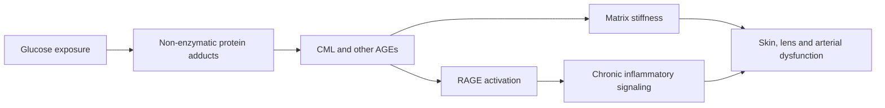

# Advanced glycation end products

Advanced glycation end products (AGEs) are chemically modified proteins and lipids produced when reducing sugars react non-enzymatically with amino groups. Early adducts can rearrange into stable products; in long-lived extracellular proteins such as collagen, lens crystallins, and arterial matrix, slow turnover permits decades of accumulation. Hemoglobin A1c is a short-lived clinical example of glycation, but it turns over with red blood cells and therefore does not represent the persistence of extracellular-matrix damage. (@LongevityScienceNews (Longevity Science News) — "BREAKTHROUGH Skin Age Reversal: New Enzyme Removed 40 Years Of Damage", 2026-07-25, [link](https://www.youtube.com/watch?v=_Vf9pdoU3tU))

## Molecular consequences

N-carboxymethyllysine (CML) is one AGE found on extracellular-matrix proteins. It can alter a protein directly and can also engage the receptor RAGE, with downstream NF-κB inflammatory signaling. Because long-lived matrix surrounds nonsenescent as well as senescent cells, this supplies a plausible route from extracellular damage to a low-grade inflammatory tissue environment rather than restricting inflammation to damaged cells themselves. These routes make AGE burden a plausible contributor to skin aging, arterial stiffness, eye disease, arthritis, and diabetic complications, but a shared molecular association does not establish that removing one AGE will reverse each clinical disease. (@LongevityScienceNews (Longevity Science News) — "BREAKTHROUGH Skin Age Reversal: New Enzyme Removed 40 Years Of Damage", 2026-07-25, [link](https://www.youtube.com/watch?v=_Vf9pdoU3tU)) (@TheSheekeyScienceShow (The Sheekey Science Show) — "can this new enzyme reverse aging?", 2026-07-26, [link](https://www.youtube.com/watch?v=fGjWaC5ZnPI))

CML must not be conflated with glucosepane. Aubrey de Grey emphasizes that the engineered CML-clearing enzyme does not remove glucosepane, described in the transcript as the cross-link most responsible for tissue stiffening. Deglycating CML is therefore a narrow repair operation, not complete extracellular-matrix rejuvenation. (@LongevityScienceNews (Longevity Science News) — "BREAKTHROUGH Skin Age Reversal: New Enzyme Removed 40 Years Of Damage", 2026-07-25, [link](https://www.youtube.com/watch?v=_Vf9pdoU3tU))

## Evidence

The direct evidence discussed is ex vivo: an engineered enzyme removed 52–97% of CML from model proteins, more than 70% from an elderly donor artery sample, up to 78% from lens material, and more than 55% from aged skin, placing skin CML below the measured level in 31-year-old skin. A second account describes about a 55% reduction across epidermal and dermal layers in skin sections from donors aged 20–75. These are biochemical and staining endpoints in model proteins and thin human tissue samples outside a living body; they do not show reduced RAGE–NF-κB signaling in living cells, restored appearance or mechanics, improved disease outcomes, delivery, or safety. (@LongevityScienceNews (Longevity Science News) — "BREAKTHROUGH Skin Age Reversal: New Enzyme Removed 40 Years Of Damage", 2026-07-25, [link](https://www.youtube.com/watch?v=_Vf9pdoU3tU)) (@TheSheekeyScienceShow (The Sheekey Science Show) — "can this new enzyme reverse aging?", 2026-07-26, [link](https://www.youtube.com/watch?v=fGjWaC5ZnPI))

## Practical implications

Maintain ordinary glycemic risk control at the cadence appropriate to clinical care—diet quality and activity daily, and glucose or HbA1c monitoring when medically indicated. This is a moderate-confidence prevention strategy for excessive glycation, especially in diabetes, but it cannot be assumed to remove established matrix AGEs. Do not purchase purported deglycation injections: no human trial of the discussed enzyme was reported, so efficacy and safety evidence is absent. (@LongevityScienceNews (Longevity Science News) — "BREAKTHROUGH Skin Age Reversal: New Enzyme Removed 40 Years Of Damage", 2026-07-25, [link](https://www.youtube.com/watch?v=_Vf9pdoU3tU))

## Gaps & open questions

- Does selective CML removal improve tissue mechanics or clinical outcomes in living animals and humans?
- Can an enzyme reach dense extracellular matrix at a therapeutic concentration without provoking immunity?
- What fraction of stiffness and inflammation is caused by CML versus glucosepane and other damage?
- Does the enzyme remove the biologically important, receptor-accessible CML pool or mainly exposed sites that are easiest to reach?

## Related

[[enzymatic-deglycation]] · [[biological-age-reversal]] · [[aging-model]]
