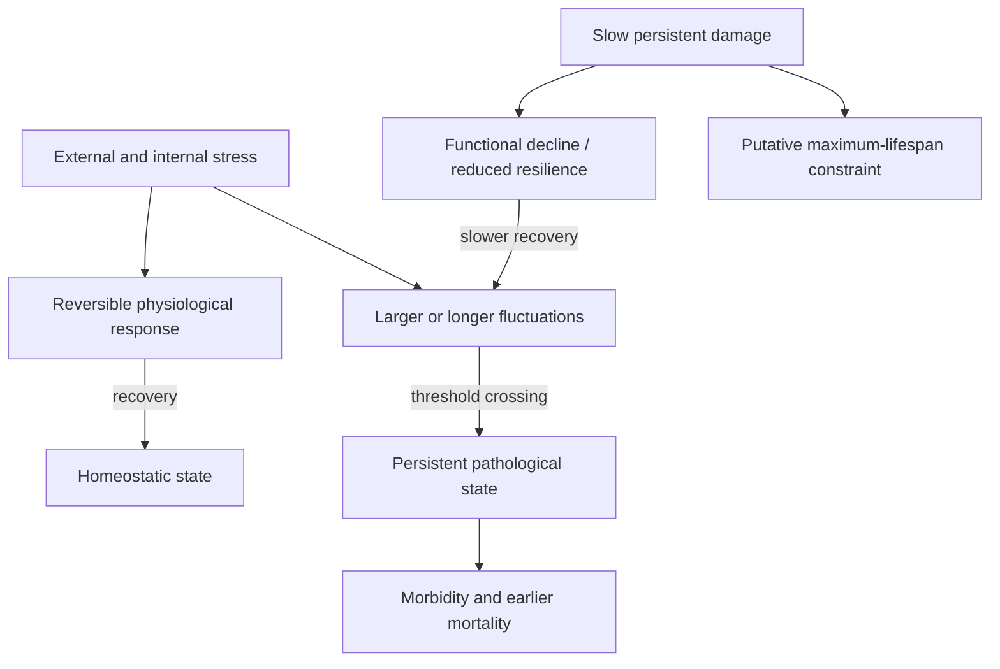
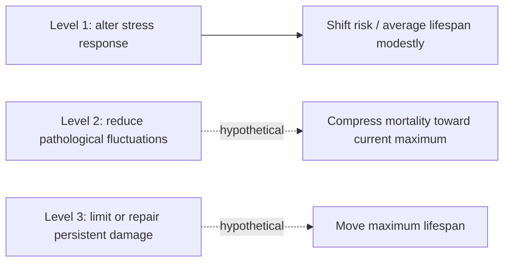

# Aging dynamics, resilience, and physiological noise

A dynamical-systems description of aging asks how an organism's state changes, fluctuates, and recovers across time rather than cataloguing every molecular difference between young and old samples. It separates three quantities: a slowly accumulating, directionally persistent component called **damage**; reversible displacement caused by **stress responses**; and **noise**, the time-varying fluctuations that can push physiology toward pathological states. This is a coarse-grained model proposed by Peter Fedichev and colleagues, not an established three-cause consensus or proof that familiar molecular mechanisms are unimportant. (@TheSheekeyScienceShow (The Sheekey Science Show) — "How We Should Target Aging | Peter Fedichev", 2026-04-10, [link](https://www.youtube.com/watch?v=buEPyBiKrXw))

## The three variables and their empirical anchors

The three quantities are not equally well defined, and each has a different kind of supporting evidence.

**Cumulative entropic damage** is proposed to be linear in time because each damage event is independent of the others, like repeated coin flips: the longer an organism is alive, the more opportunities have passed for random irreversible loss of information. The strongest evidence offered is the structure of DNA-methylation data. In both humans and mice, the principal-component axis carrying the most variation is linear with age, and the methylation sites contributing to that linear signature are described in the source paper as exhibiting uniformly low mutual information, implying statistical independence of damage events. The interpretation is that no individual site matters — one site switching does not make the next more likely to switch — and only the accumulated count carries the signal. Protein cross-linking in the extracellular matrix and somatic mutation are given as further examples of the same accumulation class. (@TheSheekeyScienceShow (The Sheekey Science Show) — "the 3 levels of aging therapeutics", 2026-02-08, [link](https://www.youtube.com/watch?v=c-_Pdp5IIvw)) [[extracellular-matrix-aging]] [[genomic-instability-and-dna-repair]]

**The dynamic stress response** is the hardest to define and the hardest to measure, corresponding roughly to the genetic programs that run under stress — heat-shock protein induction, oxidative-response pathways, senescence entry — which are difficult to quantify individually. The clearest illustration is infection response: a young immune system spikes and returns to baseline within weeks, while in aging that recovery stretches to weeks or months. The proposed measurement is the **temporal autocorrelation function**, which asks how similar an organism is today to how it was yesterday. In young people it decays quickly, indicating fast return to baseline; in older people it decays slowly or not at all, so a perturbation leaves a lasting displacement. This is the signature of *critical slowing down*, the recognized hallmark of systems approaching collapse. Extrapolating the progressive slowing in humans gives zero recovery capacity at approximately 120 years, which the model interprets as the maximum human lifespan: at zero, any small perturbation is unrecoverable. (@TheSheekeyScienceShow (The Sheekey Science Show) — "the 3 levels of aging therapeutics", 2026-02-08, [link](https://www.youtube.com/watch?v=c-_Pdp5IIvw))

**Noise** is the amplitude of stochastic fluctuation in the system — mathematically the amplitude of white noise, biologically the random unpredictable stresses that can push a stable system into failure. Its empirical support comes from stochastic epigenetic clocks: clocks built purely on random dispersion can account for roughly 70 to 80% of the prediction achieved by conventional clocks. That is a striking result with a double edge. It supports treating randomness as a first-class variable, and it simultaneously undercuts the interpretation of epigenetic clocks generally, since a measure that can be largely reproduced by accumulated randomness is telling us less about regulated biology than its name suggests. [[biological-age-biomarkers]] (@TheSheekeyScienceShow (The Sheekey Science Show) — "the 3 levels of aging therapeutics", 2026-02-08, [link](https://www.youtube.com/watch?v=c-_Pdp5IIvw))

## State, perturbation, and recovery

A cross-sectional age difference mixes several phenomena. Some features drift progressively; others make a person appear physiologically older during illness or fatigue and recede after recovery. Resilience is the restoring tendency toward a stable state after perturbation. Noise is the observed variation around that state. Its magnitude depends jointly on how often and strongly stress arrives and how rapidly the system recovers, so large fluctuations cannot be interpreted as a pure measure of either exposure or resilience. Fedichev relates these quantities through a statistical-mechanics analogy in which an **effective temperature** represents a shared driver of fluctuations across interacting physiological pathways; it is not body temperature. (@TheSheekeyScienceShow (The Sheekey Science Show) — "How We Should Target Aging | Peter Fedichev", 2026-04-10, [link](https://www.youtube.com/watch?v=buEPyBiKrXw))

The model assigns intervention levels by the variable changed. Level 1 changes stress-response programs, including the territory occupied by exercise, caloric restriction, and proposed mimetics; it is predicted mainly to shift average lifespan within the existing human range. Level 2 would reduce effective noise and thereby delay transitions into disease, hypothetically moving average lifespan toward the current maximum. Level 3 would slow, remove, or accommodate persistent damage and is proposed as necessary to move the maximum itself. The claimed magnitudes—roughly a ten-year ceiling for level 1 and a roughly forty-year opportunity for level 2—are attributed theoretical projections, not trial estimates. (@TheSheekeyScienceShow (The Sheekey Science Show) — "How We Should Target Aging | Peter Fedichev", 2026-04-10, [link](https://www.youtube.com/watch?v=buEPyBiKrXw))

A later exposition of the same model makes the membership of each level explicit, which is what gives the hierarchy teeth. Level 1 is stated to include senolytics, caloric restriction, NAD boosters, and cellular reprogramming — a grouping that puts the field's flagship rejuvenation technology in the same bounded category as a supplement. Level 2 is characterized concretely as keeping things stable: stable routines, consistent sleep, steady blood sugar, with a modeled 30-to-40-year opportunity for moving an individual closer to the maximum without raising it. Level 3 covers molecular repair technologies, clearance of irreversibly damaged cells or macromolecules, genome editing, and large-scale cell and organ replacement. Two structural difficulties in level 3 are acknowledged from within the framework: reversing trillions of cell-specific mutations with editing machinery is implausible at scale, and because entropic damage accumulates linearly, repair does not stop the clock — new damage simply resumes accruing after any intervention. Whether the level-1 ceiling is real is the subject of [[healthspan-versus-maximum-lifespan]]. (@TheSheekeyScienceShow (The Sheekey Science Show) — "the 3 levels of aging therapeutics", 2026-02-08, [link](https://www.youtube.com/watch?v=c-_Pdp5IIvw))

The classification of an intervention is an empirical claim about which variable it moves, and the model applies it to specific cases. Cellular reprogramming is placed in level 1 on the grounds that the DNA-methylation marks it resets appear to be the reversible dynamic ones rather than the entropic ones, and that reprogramming does nothing about somatic mutations accruing linearly with age. Heterochronic parabiosis receives the same reading: connecting old mice to young mice improved stress markers while entropy markers were unchanged. These are consequential classifications resting on interpretation of which methylation components move, not on direct measurement of entropic damage before and after treatment. [[epigenetic-alterations-and-reprogramming]] (@TheSheekeyScienceShow (The Sheekey Science Show) — "the 3 levels of aging therapeutics", 2026-02-08, [link](https://www.youtube.com/watch?v=c-_Pdp5IIvw))

## Long-lived and short-lived animal models

The framework proposes that short-lived species such as mice can be dynamically unstable: a temporary perturbation can leave a persistent separation between treated and untreated trajectories. Longer-lived mammals are proposed to be stable over ordinary ranges, returning toward their prior trajectory after an intervention stops. Fedichev cites a longitudinal dog study in which DNA-methylation-age differences returned toward control levels after treatment withdrawal and contrasts this with persistent intervention memory in mice. This is an important translational hypothesis, but a biomarker rebound is not yet a general demonstration that all long-lived mammals share one stability regime or that mouse lifespan studies are irrelevant. (@TheSheekeyScienceShow (The Sheekey Science Show) — "How We Should Target Aging | Peter Fedichev", 2026-04-10, [link](https://www.youtube.com/watch?v=buEPyBiKrXw))

The quantitative version of this claim rests on the shape of the recovery curve in each species. Longitudinal blood data from the mouse phenome database are reported to give a temporal autocorrelation function that is essentially flat across the whole of life: no decay, and therefore no restoring force pulling a perturbed mouse back toward baseline, with biomarkers diverging exponentially instead. The methylation data carry the same two-component signature — a linear entropic component in both species, plus a second component that is exponential in mice and *hyperbolic* in humans, the hyperbolic form accelerating until the dynamic stress response reaches zero at the maximum lifespan. Mice are accordingly termed unstable species and humans stable ones. (@TheSheekeyScienceShow (The Sheekey Science Show) — "the 3 levels of aging therapeutics", 2026-02-08, [link](https://www.youtube.com/watch?v=c-_Pdp5IIvw))

If correct, this has an uncomfortable implication for preclinical screening: stabilizing an animal that had no stabilization to begin with should look dramatic, while the same intervention in an already-stable organism should look modest. It is proposed as the explanation for why rapamycin extends mouse lifespan substantially and appears far more modest in humans, and — because most cellular-reprogramming work has been done in mice — as a reason to discount reprogramming's apparent magnitude when projecting to people. This is a specific, plausible, and unreplicated argument that would retire a large body of evidence if accepted; it should be held as a live hypothesis rather than a conclusion, and it is contested in [[healthspan-versus-maximum-lifespan]]. [[mtor-and-rapamycin]] (@TheSheekeyScienceShow (The Sheekey Science Show) — "the 3 levels of aging therapeutics", 2026-02-08, [link](https://www.youtube.com/watch?v=c-_Pdp5IIvw))

The practical consequence for animal research is to match the measurement to the proposed mechanism. A mouse can still test target engagement, stress response, fluctuation, toxicity, and molecular repair, but a persistent mouse lifespan effect may not predict durable human trajectory change. This complements the endpoint hierarchy in [[biological-age-biomarkers]] and [[biological-age-reversal]]: neither a clock movement nor a temporary physiological displacement establishes changed function, disease, survival, or maximum lifespan.

## Measuring fluctuations

Noise is inherently longitudinal. Repeated measurements from the same organism are needed to estimate its mean, variance, autocorrelation, and recovery time; a large cross-sectional cohort measured once cannot distinguish within-person fluctuation from between-person heterogeneity. The discussed dog analysis required at least six measurements across life, and the proposed human recovery time of about four weeks implies that multiple measurements spread across a year might begin to estimate an individual fluctuation parameter. These sampling claims are method proposals and require validation against measurement error, seasonality, medication changes, and clinical outcomes. (@TheSheekeyScienceShow (The Sheekey Science Show) — "How We Should Target Aging | Peter Fedichev", 2026-04-10, [link](https://www.youtube.com/watch?v=buEPyBiKrXw))

## Evidence and competing interpretations

Evidence is **emerging** that repeated physiological measurements contain information about recovery and mortality vulnerability beyond static levels. Evidence is **weak and model-dependent** for one universal effective-temperature factor, the level hierarchy's effect sizes, and the claim that reducing noise will extend human lifespan. Fluctuation can be cause, consequence, compensation, measurement artifact, or a mixture; an intervention can improve the average while worsening variability, or improve resilience while exposure frequency rises. The framework therefore supplies testable variables rather than a validated anti-aging protocol.

The framework's most defensible contribution may be conceptual rather than empirical. It dissolves several standing controversies by refusing their premises: whether aging is programmed, random, or damage accumulation is answered as all three, with each corresponding to a different variable. On this reading the model largely supplies vocabulary for distinctions the field already sensed but could not state precisely — a real service, but one that should not be mistaken for new evidence. The measurement problem is the binding constraint and is openly acknowledged from within: whether the temporal autocorrelation variable can be measured reliably, and how one would measure system noise at all, are unanswered. A framework whose three variables cannot yet be measured in an individual cannot yet classify that individual's interventions. (@TheSheekeyScienceShow (The Sheekey Science Show) — "the 3 levels of aging therapeutics", 2026-02-08, [link](https://www.youtube.com/watch?v=c-_Pdp5IIvw)) [[hallmarks-of-aging]]

Sheekey's independent skepticism runs specifically against level 2, the tier with the largest projected payoff: she regards the evidence that stabilizing routines could add decades as lacking, notwithstanding the model's prediction. This matters because level 2 is the only tier translating directly into everyday behavior, and it is the tier where a theoretical projection is most likely to be mistaken for a validated recommendation. The underlying behaviors — regular sleep, stable glycemia — are worth doing on the strength of their own conventional evidence base, not on the strength of this projection. [[sleep-quality-and-circadian-alignment]] (@TheSheekeyScienceShow (The Sheekey Science Show) — "the 3 levels of aging therapeutics", 2026-02-08, [link](https://www.youtube.com/watch?v=c-_Pdp5IIvw))

Fedichev's distinctive position is that much longevity research optimizes short-timescale molecular responses whose effects can average away, and that projects should estimate plausible effect size and ask whether they can outperform established lifestyle interventions before consuming years of work. His related social-status-mimetic framing proposes that lower chronic stress and physiological fluctuation may explain why social advantage delays disease without clearly moving maximum lifespan. This is a hypothesis-generating analogy; socioeconomic gradients also incorporate material resources, healthcare, environment, selection, and measurement confounding. (@TheSheekeyScienceShow (The Sheekey Science Show) — "How We Should Target Aging | Peter Fedichev", 2026-04-10, [link](https://www.youtube.com/watch?v=buEPyBiKrXw))

## Practical implications

For personal health, do not attempt to minimize normal biomarker variability or buy an intervention marketed as a noise reducer; there is **no validated clinical protocol**. Use ordinary continuous or repeated measurements only for established clinical indications and interpret them with level, symptoms, context, and device error. For research, sample the same organism repeatedly at intervals informed by recovery time, distinguish variance from restoring rate, and require an intervention to improve functional or disease outcomes rather than merely smooth a signal. Reassess mechanism, effect size, and persistence after treatment withdrawal at each experimental stage.

## Gaps & open questions

- Is physiological noise a cause of state transitions into chronic disease, an early consequence, or both?
- Can stress intensity, measurement error, and recovery rate be identified separately from feasible longitudinal data?
- Does one shared latent fluctuation factor govern otherwise distinct metabolic, immune, and neurological systems?
- Which interventions durably change resilience or noise after treatment stops, and do they improve clinical outcomes?
- Where, if anywhere, is the stability transition across species, tissues, and timescales?
- Can damage, stress response, and noise be mapped onto specific molecular mechanisms without losing the model's coarse-grained value?
- Can the temporal autocorrelation function and noise amplitude be estimated in an individual human, and with what sampling frequency and precision?
- Is the flat mouse autocorrelation a genuine absence of resilience or an artifact of sampling interval and measurement error in the source database?
- Does the extrapolation of human resilience to zero near 120 years identify a hard limit, or a property of the particular biomarkers measured?
- If stochastic dispersion alone reproduces 70–80% of epigenetic-clock prediction, what additional information do conventional clocks carry?

## Related

[[aging-model]] · [[hallmarks-of-aging]] · [[healthspan-versus-maximum-lifespan]] · [[biological-age-biomarkers]] · [[biological-age-reversal]] · [[epigenetic-alterations-and-reprogramming]] · [[extracellular-matrix-aging]] · [[therapeutic-plasma-exchange]] · [[caloric-restriction-and-meal-timing]] · [[ai-guided-therapeutic-design]]
