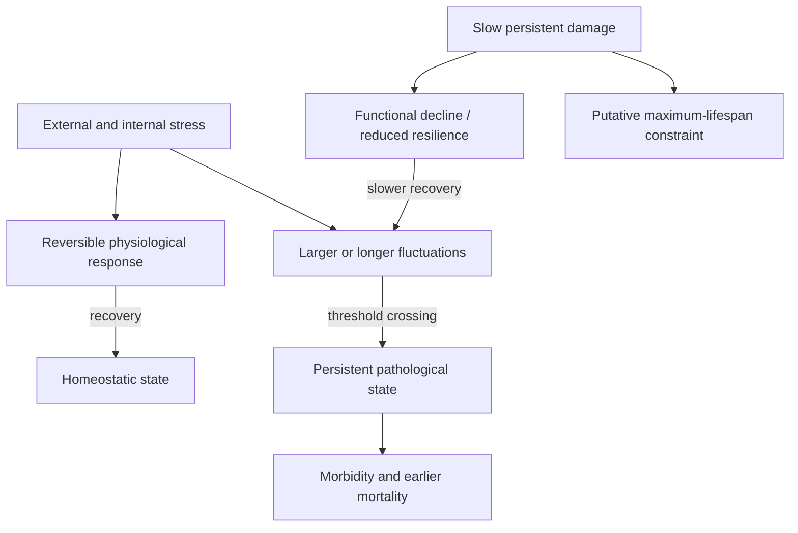
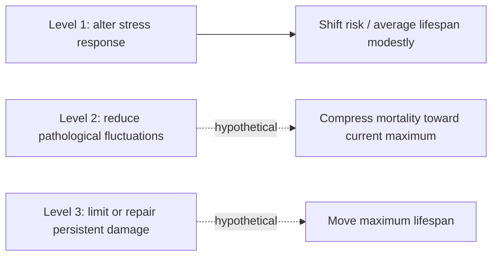

# Aging dynamics, resilience, and physiological noise

A dynamical-systems description of aging asks how an organism's state changes, fluctuates, and recovers across time rather than cataloguing every molecular difference between young and old samples. It separates three quantities: a slowly accumulating, directionally persistent component called **damage**; reversible displacement caused by **stress responses**; and **noise**, the time-varying fluctuations that can push physiology toward pathological states. This is a coarse-grained model proposed by Peter Fedichev and colleagues, not an established three-cause consensus or proof that familiar molecular mechanisms are unimportant. (@TheSheekeyScienceShow (The Sheekey Science Show) — "How We Should Target Aging | Peter Fedichev", 2026-04-10, [link](https://www.youtube.com/watch?v=buEPyBiKrXw))

## State, perturbation, and recovery

A cross-sectional age difference mixes several phenomena. Some features drift progressively; others make a person appear physiologically older during illness or fatigue and recede after recovery. Resilience is the restoring tendency toward a stable state after perturbation. Noise is the observed variation around that state. Its magnitude depends jointly on how often and strongly stress arrives and how rapidly the system recovers, so large fluctuations cannot be interpreted as a pure measure of either exposure or resilience. Fedichev relates these quantities through a statistical-mechanics analogy in which an **effective temperature** represents a shared driver of fluctuations across interacting physiological pathways; it is not body temperature. (@TheSheekeyScienceShow (The Sheekey Science Show) — "How We Should Target Aging | Peter Fedichev", 2026-04-10, [link](https://www.youtube.com/watch?v=buEPyBiKrXw))

The model assigns intervention levels by the variable changed. Level 1 changes stress-response programs, including the territory occupied by exercise, caloric restriction, and proposed mimetics; it is predicted mainly to shift average lifespan within the existing human range. Level 2 would reduce effective noise and thereby delay transitions into disease, hypothetically moving average lifespan toward the current maximum. Level 3 would slow, remove, or accommodate persistent damage and is proposed as necessary to move the maximum itself. The claimed magnitudes—roughly a ten-year ceiling for level 1 and a roughly forty-year opportunity for level 2—are attributed theoretical projections, not trial estimates. (@TheSheekeyScienceShow (The Sheekey Science Show) — "How We Should Target Aging | Peter Fedichev", 2026-04-10, [link](https://www.youtube.com/watch?v=buEPyBiKrXw))

## Long-lived and short-lived animal models

The framework proposes that short-lived species such as mice can be dynamically unstable: a temporary perturbation can leave a persistent separation between treated and untreated trajectories. Longer-lived mammals are proposed to be stable over ordinary ranges, returning toward their prior trajectory after an intervention stops. Fedichev cites a longitudinal dog study in which DNA-methylation-age differences returned toward control levels after treatment withdrawal and contrasts this with persistent intervention memory in mice. This is an important translational hypothesis, but a biomarker rebound is not yet a general demonstration that all long-lived mammals share one stability regime or that mouse lifespan studies are irrelevant. (@TheSheekeyScienceShow (The Sheekey Science Show) — "How We Should Target Aging | Peter Fedichev", 2026-04-10, [link](https://www.youtube.com/watch?v=buEPyBiKrXw))

The practical consequence for animal research is to match the measurement to the proposed mechanism. A mouse can still test target engagement, stress response, fluctuation, toxicity, and molecular repair, but a persistent mouse lifespan effect may not predict durable human trajectory change. This complements the endpoint hierarchy in [[biological-age-biomarkers]] and [[biological-age-reversal]]: neither a clock movement nor a temporary physiological displacement establishes changed function, disease, survival, or maximum lifespan.

## Measuring fluctuations

Noise is inherently longitudinal. Repeated measurements from the same organism are needed to estimate its mean, variance, autocorrelation, and recovery time; a large cross-sectional cohort measured once cannot distinguish within-person fluctuation from between-person heterogeneity. The discussed dog analysis required at least six measurements across life, and the proposed human recovery time of about four weeks implies that multiple measurements spread across a year might begin to estimate an individual fluctuation parameter. These sampling claims are method proposals and require validation against measurement error, seasonality, medication changes, and clinical outcomes. (@TheSheekeyScienceShow (The Sheekey Science Show) — "How We Should Target Aging | Peter Fedichev", 2026-04-10, [link](https://www.youtube.com/watch?v=buEPyBiKrXw))

## Evidence and competing interpretations

Evidence is **emerging** that repeated physiological measurements contain information about recovery and mortality vulnerability beyond static levels. Evidence is **weak and model-dependent** for one universal effective-temperature factor, the level hierarchy's effect sizes, and the claim that reducing noise will extend human lifespan. Fluctuation can be cause, consequence, compensation, measurement artifact, or a mixture; an intervention can improve the average while worsening variability, or improve resilience while exposure frequency rises. The framework therefore supplies testable variables rather than a validated anti-aging protocol.

Fedichev's distinctive position is that much longevity research optimizes short-timescale molecular responses whose effects can average away, and that projects should estimate plausible effect size and ask whether they can outperform established lifestyle interventions before consuming years of work. His related social-status-mimetic framing proposes that lower chronic stress and physiological fluctuation may explain why social advantage delays disease without clearly moving maximum lifespan. This is a hypothesis-generating analogy; socioeconomic gradients also incorporate material resources, healthcare, environment, selection, and measurement confounding. (@TheSheekeyScienceShow (The Sheekey Science Show) — "How We Should Target Aging | Peter Fedichev", 2026-04-10, [link](https://www.youtube.com/watch?v=buEPyBiKrXw))

## Practical implications

For personal health, do not attempt to minimize normal biomarker variability or buy an intervention marketed as a noise reducer; there is **no validated clinical protocol**. Use ordinary continuous or repeated measurements only for established clinical indications and interpret them with level, symptoms, context, and device error. For research, sample the same organism repeatedly at intervals informed by recovery time, distinguish variance from restoring rate, and require an intervention to improve functional or disease outcomes rather than merely smooth a signal. Reassess mechanism, effect size, and persistence after treatment withdrawal at each experimental stage.

## Gaps & open questions

- Is physiological noise a cause of state transitions into chronic disease, an early consequence, or both?
- Can stress intensity, measurement error, and recovery rate be identified separately from feasible longitudinal data?
- Does one shared latent fluctuation factor govern otherwise distinct metabolic, immune, and neurological systems?
- Which interventions durably change resilience or noise after treatment stops, and do they improve clinical outcomes?
- Where, if anywhere, is the stability transition across species, tissues, and timescales?
- Can damage, stress response, and noise be mapped onto specific molecular mechanisms without losing the model's coarse-grained value?

## Related

[[aging-model]] · [[biological-age-biomarkers]] · [[biological-age-reversal]] · [[caloric-restriction-and-meal-timing]] · [[ai-guided-therapeutic-design]]
