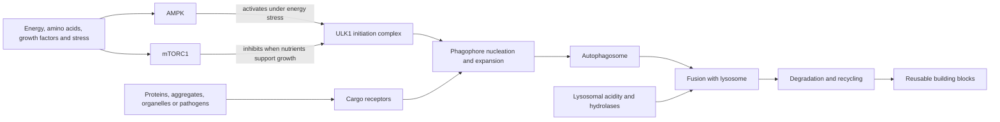

# Autophagy and lysosomal quality control

Autophagy is a family of intracellular delivery systems that sends cytoplasmic material to lysosomes for degradation and recycling. Lysosomes are acidic organelles whose hydrolases break macromolecules into reusable amino acids, lipids, sugars, and nucleotides. This is quality control as well as fuel management: cells must remove damaged proteins and organelles without destroying useful structures. Failure can permit toxic material to accumulate; excessive or mistimed degradation can also be harmful.[^klionsky-2021]

Macroautophagy encloses cargo in a double-membrane autophagosome, which fuses with a lysosome. Microautophagy imports material through the lysosomal membrane, and chaperone-mediated autophagy translocates selected proteins bearing recognition motifs. Mitophagy is selective autophagic removal of mitochondria; it is a cargo choice, not a wholly separate disposal system.[^klionsky-2021]

## From initiation to recycling

When energy is scarce, AMP-activated protein kinase (AMPK) can promote catabolic programs and phosphorylate ULK1. When amino acids and growth-factor signals are abundant, mTOR complex 1 (mTORC1) favors growth and inhibits the ULK initiation complex. Cell experiments established direct AMPK and mTOR phosphorylation of ULK1 as one control point, but the network is tissue- and time-dependent rather than a binary fasting switch.[^kim-2011] This pathway links autophagy to [[caloric-restriction-and-meal-timing]] and the queued mTOR chapter.

The ULK complex helps nucleate an isolation membrane, ATG proteins expand and lipidate LC3-family proteins on it, and cargo receptors connect selected material to that membrane. Closure forms an autophagosome. Useful clearance requires trafficking, fusion with a competent lysosome, acidification, enzymatic degradation, and export of breakdown products. Defects at any downstream step can cause autophagosomes to accumulate despite worse, not better, clearance.[^klionsky-2021]

Mitophagy illustrates selective quality control. Damaged mitochondria can lose membrane potential and recruit pathways including PINK1–Parkin, while receptor-mediated routes operate in other contexts. Fragmentation can separate a damaged portion for disposal; mitochondrial biogenesis can then replenish the network. A change in mitochondrial abundance, membrane proteins, or “mitophagy genes” is not direct proof that complete mitochondrial flux increased.[^klionsky-2021]

## Flux is a rate, not a snapshot

Autophagic flux is the rate at which material passes through the whole pathway to lysosomal degradation. LC3-II or autophagosome counts at one time point measure pool size. That pool can rise because formation accelerated or because fusion and degradation stalled. p62/SQSTM1 is cargo as well as a regulated protein, so its abundance is also ambiguous. The field guideline recommends multiple assays and, where possible, comparison with lysosomal inhibition or dynamic reporters to distinguish production from clearance.[^klionsky-2021]

Human measurement is harder because a biopsy is a small, tissue-specific snapshot and lysosomal inhibitors cannot routinely be applied throughout a living person. Blood markers cannot stand in for brain, liver, or muscle flux. This limits confident claims that a meal, supplement, or wearable-derived fasting interval has “activated whole-body autophagy.”

## Aging and disease: mechanism versus outcome

Autophagy and lysosomal competence commonly decline or become dysregulated with age in experimental systems, providing plausible routes to protein aggregation, mitochondrial dysfunction, impaired immune defense, and altered [[cellular-senescence]]. Genetic disruption causes disease in animals and rare human disorders can identify indispensable components, but neither fact quantifies how much ordinary human aging is caused by an autophagy deficit. In cancer, autophagy can suppress early damage yet help an established tumor survive metabolic stress, so generic activation is not universally beneficial.

Neurodegeneration makes the endpoint distinction especially important. Aggregated proteins and damaged organelles are plausible autophagic cargo, but changing LC3, p62, or a disease protein in cells or mice is not evidence of preserved cognition in humans. Lysosomal storage diseases establish that severe disposal failure can cause human disease; they do not show that boosting the pathway above normal slows aging.

## Intervention evidence

Exercise and fasting alter nutrient sensing and autophagy-related proteins, but direct human flux data are limited. In a mechanistic study of 11 trained and 11 untrained young men, 36 hours of fasting changed skeletal-muscle LC3 and p62 abundance differently by training status. The uncontrolled nutritional challenge and snapshot protein measures support state-dependent signaling, not a clinically optimal fasting duration or demonstrated health benefit from autophagy.[^moller-2019]

Urolithin A is a microbiome-derived metabolite marketed as a mitophagy activator. In a double-blind RCT of 66 adults aged 65–90, 1,000 mg/day for four months did not significantly improve the co-primary outcomes of six-minute walk distance or maximal hand-muscle ATP production versus placebo. Some muscle-endurance measures and plasma acylcarnitines improved, but these secondary findings do not demonstrate whole-body mitophagic flux, disease prevention, or longevity.[^liu-2022] A separate industry-funded RCT in middle-aged adults reported some gains in muscle strength and mitochondrial or mitophagy-related biomarkers after four months, while several performance outcomes were not different from placebo; replication independent of the manufacturer and clinical endpoints remain necessary.[^singh-2022]

Rapamycin, caloric restriction, and time-restricted eating are often described as autophagy interventions, but each has effects far beyond this pathway. Animal longevity after an intervention cannot be assigned wholly to autophagy without causal mediation experiments, and human biomarker changes cannot establish longer life. Those intervention-specific benefits, risks, and dosing questions belong in their own chapters.

## Practical implications

- **Use exercise and nutritionally adequate eating patterns for established cardiometabolic and functional benefits — strong outcome evidence, uncertain autophagy mediation.** No validated consumer test can identify a personal autophagy target or ideal fasting hour.
- **Do not extend fasts or use rapamycin or supplements solely to maximize presumed autophagy — no established human anti-aging benefit.** Longer deprivation can conflict with protein intake, medication safety, glycemic control, pregnancy, eating-disorder recovery, and maintenance of [[skeletal-muscle-hypertrophy]].
- **Interpret pathway claims by demanding dynamic evidence — strong methodological guidance.** Ask whether the study measured formation, blocked degradation, directly tracked cargo to lysosomes, and then demonstrated function or a clinical outcome.

## Gaps & open questions

- How does autophagic flux change longitudinally across specific human tissues with healthy aging?
- Which lysosomal defect is rate-limiting in common neurodegenerative, metabolic, and fibrotic disease?
- Can noninvasive reporters measure tissue-specific flux safely in humans?
- Do interventions that demonstrably restore flux reduce disability or disease independently of weight loss, exercise adaptation, or other mTOR effects?

## References

[^klionsky-2021]: Klionsky DJ, Abdel-Aziz AK, Abdelfatah S, et al. “Guidelines for the use and interpretation of assays for monitoring autophagy (4th edition).” *Autophagy* (2021). [scientific consensus guideline]. [DOI](https://doi.org/10.1080/15548627.2020.1797280)
[^kim-2011]: Kim J, Kundu M, Viollet B, Guan KL. “AMPK and mTOR regulate autophagy through direct phosphorylation of Ulk1.” *Nature Cell Biology* (2011). [mechanistic cell and animal study]. [PubMed](https://pubmed.ncbi.nlm.nih.gov/21258367/) · [DOI](https://doi.org/10.1038/ncb2152)
[^moller-2019]: Møller AB, Vendelbo MH, Christensen B, et al. “Training state and skeletal muscle autophagy in response to 36 h of fasting.” *Journal of Applied Physiology* (2019). [mechanistic human study]. [PubMed](https://pubmed.ncbi.nlm.nih.gov/30161009/) · [DOI](https://doi.org/10.1152/japplphysiol.01146.2017)
[^liu-2022]: Liu S, D'Amico D, Shankland E, et al. “Effect of Urolithin A Supplementation on Muscle Endurance and Mitochondrial Health in Older Adults: A Randomized Clinical Trial.” *JAMA Network Open* (2022). [RCT]. [PubMed](https://pubmed.ncbi.nlm.nih.gov/35050355/) · [DOI](https://doi.org/10.1001/jamanetworkopen.2021.44279)
[^singh-2022]: Singh A, D'Amico D, Andreux PA, et al. “Urolithin A improves muscle strength, exercise performance, and biomarkers of mitochondrial health in a randomized trial in middle-aged adults.” *Cell Reports Medicine* (2022). [RCT]. [PubMed](https://pubmed.ncbi.nlm.nih.gov/35584623/) · [DOI](https://doi.org/10.1016/j.xcrm.2022.100633)

## Related

[[aging-model]] · [[cellular-senescence]] · [[caloric-restriction-and-meal-timing]] · [[skeletal-muscle-hypertrophy]] · [[supplement-evidence-and-safety]] · [[brain-cholesterol-homeostasis]] · [[biological-age-reversal]]
