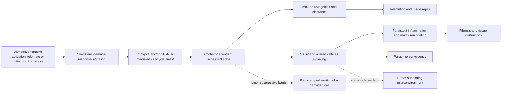

# Cellular senescence

Cellular senescence is a stress-responsive cell state characterized by a durable withdrawal from the cell cycle together with extensive changes in metabolism, chromatin, organelles, and communication with surrounding tissue. It is not simply cellular old age, quiescence, terminal differentiation, or apoptosis. DNA damage, telomere dysfunction, oncogene activation, mitochondrial stress, and some cancer treatments can all initiate it. Because no feature is universal or exclusive, current expert guidelines require a context-appropriate combination of evidence for stable cell-cycle arrest, structural or biochemical changes, and secretory activity rather than calling a cell senescent from one stain or gene.[^ogrodnik-2024]

## Arrest, survival, and the SASP

The p53–p21 and p16–retinoblastoma pathways can impose arrest by restraining cyclin-dependent kinases, but different senescent cells use these programs to different degrees. Survival pathways allow a damaged, nondividing cell to persist rather than undergo apoptosis. The senescence-associated secretory phenotype (SASP) is a variable output that can include cytokines, chemokines, growth factors, proteases, lipids, and extracellular vesicles. There is no single SASP: its composition depends on cell lineage, initiating stress, tissue, and time.[^ogrodnik-2024]

These outputs explain why a small population can influence a much larger tissue. SASP signals can recruit immune cells and stimulate neighboring progenitors during repair, but persistent signaling can also remodel extracellular matrix, maintain low-grade inflammation, impair stem-cell niches, and induce senescence in nearby cells. This connects senescence to [[inflammaging-and-il-6]], [[immune-aging-and-rejuvenation]], and future chapters on stem-cell exhaustion and loss of proteostasis. It remains wrong to infer that every elevated inflammatory protein came from senescent cells.

## Beneficial and pathological roles

Senescence is partly protective. Arrest can prevent a damaged or oncogene-activated cell from continuing to divide, while transient senescence and immune clearance can help coordinate wound healing and tissue remodeling. The biological problem is therefore not “senescence exists,” but that senescent cells can accumulate, resist clearance, or produce maladaptive signals. Removing all such cells indiscriminately could disrupt repair or eliminate useful cell states.[^ogrodnik-2024]

The cancer relationship is bidirectional. Cell-autonomous arrest is a tumor-suppressive barrier; persistent SASP signaling can, in some contexts, support inflammation, angiogenesis, invasion, or therapy resistance in neighboring cells.[^ogrodnik-2024] Fibrosis has a similar timing problem: transient senescence may limit proliferation after injury, whereas persistent senescent epithelial or stromal populations can sustain a profibrotic environment. In a bleomycin lung-injury model, genetic or drug-mediated removal of senescent cells improved physical and pulmonary function in mice even though visible fibrosis was not reversed, separating functional improvement from scar removal.[^schafer-2017]

## What animal experiments establish

Mouse experiments support causality within engineered models. In INK-ATTAC transgenic mice, activating a suicide mechanism in p16Ink4a-expressing cells from midlife delayed several age-associated pathologies and extended median lifespan in both sexes, without extending maximum lifespan.[^baker-2016] This is an animal intervention on a selected p16-expressing population, not proof that p16 identifies every senescent cell, that the same clearance can be achieved safely in humans, or that human lifespan will increase.

## Measuring senescence in humans

Common measurements include p16 or p21 expression, loss of proliferation markers, persistent DNA-damage foci, senescence-associated beta-galactosidase activity, lipofuscin, enlarged lysosomal content, morphology, and panels of secreted factors. Each can occur outside senescence. The 2024 minimum-information guideline therefore recommends multiple markers from distinct categories, appropriate negative and positive controls, identification of the cell type, and spatial information when possible.[^ogrodnik-2024]

Attempts to build a better reagent illustrate how hard the specificity problem is. An unbiased SELEX screen — iterative rounds of negative selection against normal cells and positive selection on senescent cells, at rising stringency — produced DNA aptamers that preferentially bind senescent cells; mass spectrometry identified their target as a form of fibronectin reported to be upregulated in senescence, and biotin-modified aptamers stained mouse lung sections with signal that fell when senescent cells were genetically cleared. The reagent nevertheless attracts the objection that a fibronectin binder is more naturally read as a marker of aged tissue matrix than of senescent cells, and that residual signal after clearance was high for a cell-specific probe — a limitation the authors acknowledge. A useful aged-tissue reagent is a real contribution; it is not the senescence marker the field has been missing. [[extracellular-matrix-aging]] (@TheSheekeyScienceShow (The Sheekey Science Show) — "This years biggest breakthroughs in longevity! (2025)", 2025-12-21, [link](https://www.youtube.com/watch?v=X-Hzyzo1Jpk))

Blood SASP panels are especially indirect: a circulating cytokine can arise from infection, adipose tissue, immune activation, cancer, or many other sources. A pre/post fall is not proof of cell killing. Tissue biopsy can strengthen inference, but sampling one site cannot establish whole-body burden, and apparent change may reflect cell composition or assay variability.

## Senolytics and senomorphics

Senolytics aim to preferentially kill senescent cells by disabling survival dependencies; senomorphics aim to suppress harmful outputs or alter the state without killing the cell. Neither label guarantees selectivity. Dasatinib is a prescription kinase inhibitor with clinically important toxicities, and quercetin supplements do not reproduce a trial regimen or establish safety.

Two additional strategies bracket the cost and specificity range. **Engineered cell therapy** applies the recognition logic of CAR-T to senescence: T cells directed against urokinase plasminogen activator receptor (uPAR), a protein on the senescent-cell membrane, were first shown in 2020 to clear senescent cells in lung-cancer and liver-fibrosis models. A 2025 extension asked the aging question directly, delivering anti-uPAR CAR-T cells to 24-month-old mice. The largest effect was in the gut, rationalized by gut senescent cells carrying the highest uPAR levels; reported benefits were improved nutrient absorption, decreased inflammation, and better regeneration after injury, with effects lasting at least a year from a single treatment. Durability from one dose is the notable feature given CAR-T's cost, but this is naturally aged mice, tissue-restricted by target expression, and untested for the tumor-surveillance and repair tradeoffs described above. (@TheSheekeyScienceShow (The Sheekey Science Show) — "This years biggest breakthroughs in longevity! (2025)", 2025-12-21, [link](https://www.youtube.com/watch?v=X-Hzyzo1Jpk))

**Low-frequency ultrasound** sits at the opposite extreme of cost and mechanistic clarity, and proposes rejuvenating senescent cells rather than killing them. Mice treated in a water bath for roughly 30-minute sessions across varying durations lived modestly longer, with the proposed mechanism being mechanical disruption — possibly of actin filaments — that induces non-proliferating senescent cells to resume proliferation. Two cautions are warranted and one is rarely stated: pushing arrested cells back into the cycle runs directly against the tumor-suppressive function of arrest, so "rejuvenation" here may carry a cancer cost that a lifespan curve in mice is underpowered to reveal. The appeal is nevertheless real — a drug-free, gene-therapy-free, plausibly cheap modality is worth understanding even at an early stage. (@TheSheekeyScienceShow (The Sheekey Science Show) — "This years biggest breakthroughs in longevity! (2025)", 2025-12-21, [link](https://www.youtube.com/watch?v=X-Hzyzo1Jpk))

A framework-level caution applies to this whole class. On the minimal-model account, senolytics act on the reversible dynamic component of aging rather than on cumulative entropic damage, which would confine even a perfectly selective senolytic to restoring function and delaying disease rather than raising maximum lifespan. That partition is itself contested; see [[healthspan-versus-maximum-lifespan]]. (@TheSheekeyScienceShow (The Sheekey Science Show) — "the 3 levels of aging therapeutics", 2026-02-08, [link](https://www.youtube.com/watch?v=c-_Pdp5IIvw))

Human evidence remains preliminary. In nine people with diabetic kidney disease, an uncontrolled before–after study reported fewer p16/p21-positive adipose cells and lower senescence-associated beta-galactosidase activity 11 days after a three-day dasatinib-plus-quercetin course; the sample was small, had no placebo group, and was designed for tissue target engagement rather than clinical benefit.[^hickson-2019] A later phase-I pilot randomized 12 people with idiopathic pulmonary fibrosis to the same drug concept or placebo for three intermittent weeks. It established feasibility in that small setting but was not powered for efficacy, and exploratory physical or pulmonary outcomes did not show a clear treatment advantage.[^justice-2023] No completed trial establishes that a senolytic extends human lifespan or healthspan.

## Practical implications

- **Do not self-prescribe dasatinib, high-dose quercetin, fisetin, or other products as anti-aging senolytics — strong safety conclusion, absent efficacy evidence.** Candidate selectivity is tissue- and state-dependent, and the best human trials are small and early-phase.[^justice-2023]
- **Treat exercise, sleep, vaccination, smoking cessation, and cardiometabolic care for their established outcomes — strong clinical evidence, indirect for senescence.** Plausible effects on inflammatory or cellular-stress pathways should not be promoted as proven senescent-cell clearance.
- **When reading a senescence study, ask four questions — strong methodological guidance:** which cell type was measured, which independent markers established the state, whether the intervention changed tissue function or only biomarkers, and whether the design was cells, animals, uncontrolled humans, or an RCT.

## Gaps & open questions

- Which senescent cell states are harmful, beneficial, or neutral in each human tissue and disease stage?
- Can a treatment reach the relevant cells while preserving tumor suppression, wound repair, and immune defense?
- Which validated tissue or circulating panel can quantify treatment-responsive human senescence burden?
- Does target engagement lead to fewer fractures, less disability, delayed disease, or longer survival in adequately powered trials?
- Can any reagent distinguish senescent cells from aged extracellular matrix, given that senescent secretions remodel that matrix?
- Does uPAR-directed cell therapy generalize beyond the gut, and what are its tumor-surveillance and wound-repair costs?
- If low-frequency ultrasound returns arrested cells to proliferation, does that raise cancer incidence over a full lifespan in a larger cohort?
- Is senescent-cell clearance confined to restoring function, or can it alter the accumulation of irreversible damage?

## References

[^ogrodnik-2024]: Ogrodnik M, Carlos Acosta J, Adams PD, et al. “Guidelines for minimal information on cellular senescence experimentation in vivo.” *Cell* (2024). [scientific consensus guideline]. [PubMed](https://pubmed.ncbi.nlm.nih.gov/39121846/) · [DOI](https://doi.org/10.1016/j.cell.2024.05.059)
[^schafer-2017]: Schafer MJ, White TA, Iijima K, et al. “Cellular senescence mediates fibrotic pulmonary disease.” *Nature Communications* (2017). [animal study with human tissue observations]. [PubMed](https://pubmed.ncbi.nlm.nih.gov/28230051/) · [DOI](https://doi.org/10.1038/ncomms14532)
[^baker-2016]: Baker DJ, Childs BG, Durik M, et al. “Naturally occurring p16Ink4a-positive cells shorten healthy lifespan.” *Nature* (2016). [animal study]. [DOI](https://doi.org/10.1038/nature16932)
[^hickson-2019]: Hickson LJ, Langhi Prata LGP, Bobart SA, et al. “Senolytics decrease senescent cells in humans: Preliminary report from a clinical trial of dasatinib plus quercetin in individuals with diabetic kidney disease.” *EBioMedicine* (2019). [uncontrolled human pilot study]. [PubMed](https://pubmed.ncbi.nlm.nih.gov/31542391/) · [DOI](https://doi.org/10.1016/j.ebiom.2019.08.069)
[^justice-2023]: Justice JN, Nambiar AM, Tchkonia T, et al. “Senolytics dasatinib and quercetin in idiopathic pulmonary fibrosis: results of a phase I, single-blind, single-center, randomized, placebo-controlled pilot trial on feasibility and tolerability.” *EBioMedicine* (2023). [phase-I pilot RCT]. [PubMed](https://pubmed.ncbi.nlm.nih.gov/36857968/) · [DOI](https://doi.org/10.1016/j.ebiom.2023.104481)

## Related

[[aging-model]] · [[inflammaging-and-il-6]] · [[immune-aging-and-rejuvenation]] · [[advanced-glycation-end-products]] · [[extracellular-matrix-aging]] · [[hallmarks-of-aging]] · [[healthspan-versus-maximum-lifespan]] · [[autophagy-and-lysosomal-quality-control]] · [[biological-age-biomarkers]] · [[biological-age-reversal]]
