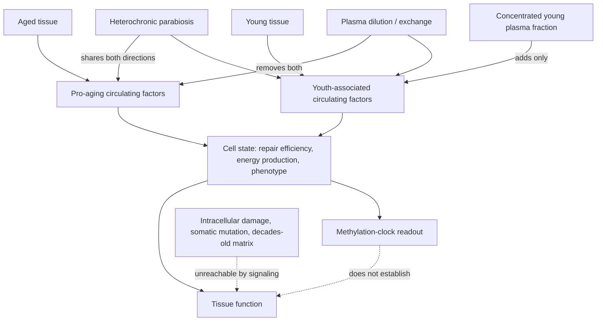

# Circulating rejuvenation signaling

Every cell in a body sits in a shared soluble environment and reads it continuously. The hypothesis organizing this chapter is that part of what makes an old cell behave like an old cell is not damage inside that cell but the information reaching it from outside — that blood carries signals reporting, in effect, how old the organism is, and that changing those signals can change the phenotype without repairing anything. If true, aging would be partly a **regulated state** rather than only an accumulated injury, and the therapeutic target would be a message rather than a lesion. This is the shared premise beneath heterochronic parabiosis, plasma dilution, therapeutic plasma exchange, and the plasma-fraction experiments described in [[plasma-derived-extracellular-particles]]. (@TheSheekeyScienceShow (The Sheekey Science Show) — "Reproducing Rejuvenation: Inside the Pig Plasma Longevity Experiments", 2025-08-22, [link](https://www.youtube.com/watch?v=Q-lS1UMHG1o))

The diagram makes the design logic visible. Parabiosis moves signals in both directions at once and cannot separate the removal of bad factors from the addition of good ones. Dilution and exchange remove both classes indiscriminately, so benefit could come from either. Adding a concentrated fraction from a young donor is the one design that tests the addition hypothesis alone — which is the methodological reason the fraction experiments exist, independent of whether their headline results hold.

## The experimental lineage

Heterochronic parabiosis surgically joins the circulatory systems of a young and an old animal. The observation that motivates the whole field is asymmetric transfer in both directions: the old animal shows features of a younger phenotype while the young animal ages faster than expected. Early readouts were coarse — less yellowing of tissues at autopsy in the treated old animal — and the paradigm has since accumulated a wide range of biological markers over roughly a century of use. What parabiosis establishes is that something transmissible in blood modifies age-associated phenotype. What it cannot establish is which direction of transfer carries the effect, or whether the effect reflects rejuvenation of the old animal, harm to the young one, or the shared physiology of two surgically joined organisms. (@TheSheekeyScienceShow (The Sheekey Science Show) — "Reproducing Rejuvenation: Inside the Pig Plasma Longevity Experiments", 2025-08-22, [link](https://www.youtube.com/watch?v=Q-lS1UMHG1o))

The plasma-dilution work of Irina and Michael Conboy pushes on the subtraction side of the ledger: that blood carries pro-aging factors, and that diluting them alone produces benefit. This is the branch that leads to [[therapeutic-plasma-exchange]] in humans, and it makes a specific prediction that distinguishes it from the addition hypothesis — that removal without replacement should suffice. (@TheSheekeyScienceShow (The Sheekey Science Show) — "Reproducing Rejuvenation: Inside the Pig Plasma Longevity Experiments", 2025-08-22, [link](https://www.youtube.com/watch?v=Q-lS1UMHG1o))

The addition branch arose partly from a practical constraint. Harold Katcher's original intention was a heterochronic plasma exchange between a young and an old rat, which was not feasible for lack of suitable apparatus; the alternative was to isolate the putative youth-promoting material from blood and concentrate it. Taking it from a larger species — pigs — allowed a dose high enough to matter in a small recipient. The cross-species design carries a theoretical payload as well as a practical one: if signals from a pig act on a rat, the signaling mechanism must be conserved across mammalian lineages, which is what one would expect of a very ancient control system and not of a species-specific factor. (@TheSheekeyScienceShow (The Sheekey Science Show) — "Reproducing Rejuvenation: Inside the Pig Plasma Longevity Experiments", 2025-08-22, [link](https://www.youtube.com/watch?v=Q-lS1UMHG1o))

Supporting work exists outside this line. Small vesicles derived from human plasma, injected into old rats, are reported to have reduced fibrosis in the heart and several other organs — an independent group, a different source species, and a functional rather than purely epigenetic readout. Convergence from an unrelated laboratory is a genuine strengthening of the general hypothesis even where the headline magnitude of any single experiment is disputed. (@TheSheekeyScienceShow (The Sheekey Science Show) — "Reproducing Rejuvenation: Inside the Pig Plasma Longevity Experiments", 2025-08-22, [link](https://www.youtube.com/watch?v=Q-lS1UMHG1o))

## Aging by signaling as a theory

The strongest form of the position is a full theory of aging rather than a mechanism for one experiment, and it is worth reconstructing because it makes predictions that the usual damage-accumulation frameworks do not. On this account, developed in Harold Katcher's book and summarized by his collaborators, aging originates with sexual reproduction: asexually reproducing bacteria produce offspring identical to the parent and in that sense do not age, while sexual reproduction introduces a rejuvenation event — a rebirth — separating the germline from a soma that is permitted to decline. Unicellular organisms are argued to show a limited number of asexual divisions before requiring sexual reproduction, presented as parallel to the replicative limit of human somatic cells ([[telomere-biology]]). From this the theory posits an ancient regulatory mechanism controlling lifespan, clocked by circadian rhythm, which sets the declining efficiency of repair and of energy production — the two processes proposed to determine the rate of aging. Its central and most falsifiable proposition is compressed into a single formulation: "It's genetically programmed and epigenetically implemented." Because the epigenetic layer is modifiable — partial reprogramming already demonstrates this in cells ([[epigenetic-alterations-and-reprogramming]]) — the rate of aging would be modifiable in principle. (@TheSheekeyScienceShow (The Sheekey Science Show) — "Reproducing Rejuvenation: Inside the Pig Plasma Longevity Experiments", 2025-08-22, [link](https://www.youtube.com/watch?v=Q-lS1UMHG1o))

Nicolás of the Rejuvenation Science Institute labels this an aging-by-signaling theory: cells receive information that sets whether they express an old or a young phenotype, so with the correct signaling the phenotype could be controlled. The strategic implication drawn from it is more interesting than the theory itself — if the signal can be decoded, the eventual therapy is a synthesized message, not donated blood. This matters because the resource arithmetic of blood-derived therapy is prohibitive on its own terms: there is not enough animal or human plasma for a population-scale treatment, and the group states plainly that they do not think humanity would be rejuvenated using pig or cattle blood. The animal experiment is framed as a demonstration that the control system exists, with the deciphering of it as the real objective. (@TheSheekeyScienceShow (The Sheekey Science Show) — "Reproducing Rejuvenation: Inside the Pig Plasma Longevity Experiments", 2025-08-22, [link](https://www.youtube.com/watch?v=Q-lS1UMHG1o))

Two critical observations belong beside this. First, the theory's supporting arguments are analogical — from protozoan division limits to human cellular senescence, from the evolution of sex to the existence of a programmed lifespan clock — and analogy of this kind motivates hypotheses without testing them; programmed-aging theories have a long history and remain a minority position against the evolutionary account in which aging reflects declining force of selection rather than an executed programme. Second, the theory is not needed for the experiments to be worth doing. A concentrated plasma fraction either changes measured outcomes in old rats or it does not, regardless of why anyone thought it might.

## What signaling cannot reach

The reach of any circulating-factor intervention is bounded by what circulates, and the boundary is the same one drawn in [[therapeutic-plasma-exchange]]. Changing the soluble environment cannot repair intracellular damage, cannot reverse somatic mutations, and cannot rebuild extracellular matrix that has been in place for decades ([[extracellular-matrix-aging]]). The framework in [[aging-dynamics-and-resilience]] classifies interventions of this class as acting on the reversible dynamic component rather than on cumulative entropic damage, and heterochronic parabiosis is the specific precedent cited for that classification: stress markers improved while entropy markers did not. If that is right, signaling interventions predict benefit that fades on withdrawal and a ceiling on what repetition can achieve — which sits directly against the strongest reading of the plasma-fraction results, under which sufficiently rejuvenated animals might live indefinitely. That tension is a real one, and it is developed in [[healthspan-versus-maximum-lifespan]] and [[pig-plasma-fraction-rejuvenation]].

A further constraint applies to the epigenetic readouts used in this field. A large reported reduction in methylation age is a biomarker result; [[biological-age-biomarkers]] explains why intervention-induced clock movement is not a validated surrogate for function, disease, or survival, and this holds whether the mover is plasma exchange, a plasma fraction, or a reprogramming factor. It is the reason the reproduction effort described in [[plasma-derived-extracellular-particles]] adds grip strength, memory testing, standard blood chemistry, and survival to the epigenetic endpoint rather than relying on the clock alone.

## Practical implications

- **Treat circulating-factor rejuvenation as an active research hypothesis with no validated human application — strong.** Parabiosis, dilution, exchange, and fraction infusion share a premise that is plausible and partly supported in animals; none has demonstrated improved function, disease prevention, or survival in humans.
- **When assessing any such result, ask which of the three designs produced it — strong as a reasoning discipline.** Removal, addition, and bidirectional exchange are different hypotheses, and only the addition design isolates a youth factor.
- **Do not accept a young-plasma or exosome infusion as a consumer service — strong.** Commercial offerings of this kind precede the evidence by a wide margin; the relevant regulatory and evidentiary gap is covered in [[longevity-clinics-and-evidence]] and [[experimental-peptides]].
- **Expect any benefit from this class, if real, to require repetition — moderate, model-derived.** If these interventions act on a reversible dynamic component, effects should decay after withdrawal, which makes durability the endpoint to ask about first.

## Gaps & open questions

- Does benefit in parabiosis come from adding youth factors, removing pro-aging factors, or from shared organ function between joined animals?
- What are the actual molecular species carrying the signal — vesicle cargo, soluble proteins, lipids, nucleic acids — and are they the same across the parabiosis, dilution, and fraction experiments?
- Is the cross-species activity of pig-derived fractions in rats real, and does it genuinely indicate an evolutionarily conserved control system?
- Does any circulating-factor intervention change an entropic marker such as somatic mutation burden, or only reversible components?
- How long does any induced change persist after treatment stops?
- Is the programmed-aging premise required by the data, or would ordinary damage-and-repair biology explain the same observations?
- Could an identified signal be synthesized and delivered, removing the donor-supply constraint that makes blood-derived therapy unscalable?

## Related

[[plasma-derived-extracellular-particles]] · [[pig-plasma-fraction-rejuvenation]] · [[therapeutic-plasma-exchange]] · [[aging-dynamics-and-resilience]] · [[healthspan-versus-maximum-lifespan]] · [[biological-age-biomarkers]] · [[epigenetic-alterations-and-reprogramming]] · [[extracellular-matrix-aging]] · [[stem-cell-exhaustion]] · [[telomere-biology]] · [[hallmarks-of-aging]] · [[replication-and-research-incentives]] · [[aging-model]]
