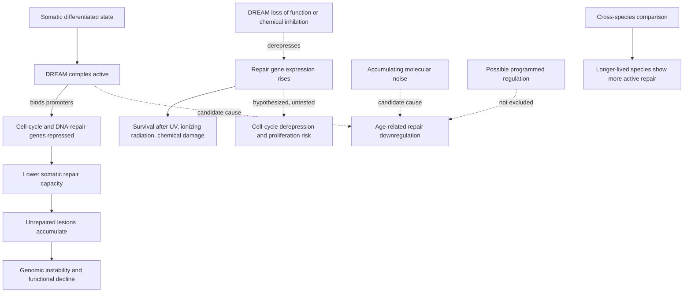

# The DREAM complex and somatic repair capacity

DREAM is a multiprotein transcriptional repressor that binds the promoters of cell-cycle and DNA-repair genes and holds them down. Its significance for aging biology is that repair capacity is not fixed by the genome a cell carries: a cell can possess a complete set of repair genes and still repair poorly because those genes are being actively repressed. DREAM makes repair capacity a regulated, and therefore in principle a modifiable, quantity. (@TheSheekeyScienceShow (The Sheekey Science Show) — "How Randomness Drives Aging - DNA Repair, Clocks & Rejuvenation (David Meyer)", 2025-07-04, [link](https://www.youtube.com/watch?v=Buj07nWt7o0))

## What the complex does

DREAM assembles on the promoters of genes governing cell-cycle progression and DNA repair and represses their transcription. Somatic cells carry more active DREAM than germline or pluripotent cells and correspondingly repress these programs more strongly — a pattern consistent with the general observation that differentiated somatic tissue trades proliferative and repair capacity for stable specialized function. The complex is conserved across species, which is what makes worm results a plausible guide to mammalian biology rather than an idiosyncrasy of one organism. (@TheSheekeyScienceShow (The Sheekey Science Show) — "How Randomness Drives Aging - DNA Repair, Clocks & Rejuvenation (David Meyer)", 2025-07-04, [link](https://www.youtube.com/watch?v=Buj07nWt7o0))

## Removing the brake raises damage resistance

The experimental logic is subtractive: if DREAM is what holds repair genes down, removing DREAM should let them up, and the cell should then survive damage better. In *C. elegans*, mutants with reduced or absent DREAM activity show increased DNA-repair gene expression and increased repair capacity, and survive markedly better across a range of insults — ultraviolet radiation, ionizing radiation, and chemical genotoxic treatments. The same derepression and improved repair is reported in human cells, and chemical DREAM inhibitors exist and have seen some use in other disease contexts such as Down syndrome, where the complex appears to play a role for reasons unrelated to repair. That existing chemical matter is what makes a future human study conceivable at all; it is not evidence that such a study would show benefit. (@TheSheekeyScienceShow (The Sheekey Science Show) — "How Randomness Drives Aging - DNA Repair, Clocks & Rejuvenation (David Meyer)", 2025-07-04, [link](https://www.youtube.com/watch?v=Buj07nWt7o0))

Breadth across insult types is the informative feature. A manipulation that improved survival after ultraviolet exposure alone might be doing something specific to nucleotide-excision repair or to the ultraviolet response; improved survival across ultraviolet, ionizing, and chemical damage is what one expects from raising general repair capacity rather than one pathway. This complements the pathway-matched picture in [[genomic-instability-and-dna-repair]], where each lesion class has its own dedicated machinery: DREAM sits above that structure as a shared regulator of how much of it gets expressed.

## Repair capacity as a lifespan correlate across species

Longer-lived species generally show more active DNA repair, cope better with damage, and live longer — an association that recurs often enough in cross-species comparison that repair is among the pathways most reliably implicated in the evolution of long lifespan. Mutations in, or increased expression of, repair genes in longer-lived species is the specific pattern reported, though such comparative studies remain rare. (@TheSheekeyScienceShow (The Sheekey Science Show) — "How Randomness Drives Aging - DNA Repair, Clocks & Rejuvenation (David Meyer)", 2025-07-04, [link](https://www.youtube.com/watch?v=Buj07nWt7o0))

This is a correlation across species, and it inherits the standard limitation of comparative biology: species differ in many correlated ways at once, and a trait that co-varies with lifespan across a phylogeny has not been shown to determine lifespan within a species. It nonetheless converges with the independent finding recorded in [[genomic-instability-and-dna-repair]] that somatic mutation rate per year is inversely associated with species lifespan. Two different measurements — the rate of accumulating mutations and the expressed capacity to prevent them — point at the same axis, which strengthens the case that repair capacity is a real determinant of species lifespan without establishing it as a manipulable determinant of an individual's.

## The unresolved causal question

DNA-repair genes are downregulated with age. Why is not settled, and the candidate explanations sit on opposite sides of a live dispute.

The repression hypothesis is that DREAM is doing it: the complex represses these genes, and with age the repression tightens or its consequences compound, so measured repair capacity falls. On this reading DREAM would be a master regulator of both damage accumulation and, through it, lifespan.

The noise hypothesis is that no regulator is doing it in particular. If genes that are supposed to be active drift toward silence as maintenance of their regulatory state decays — the general mechanism described in [[stochastic-aging-and-molecular-noise]] — then repair genes are simply among the genes so affected, and their downregulation needs no dedicated cause. This possibility carries a self-reinforcing implication: noise landing on the maintenance machinery degrades the system that corrects noise.

A programmed explanation is not excluded, and it is worth stating that it cannot be excluded in principle. The position taken in the source is that the weight of current evidence favors accumulation of damage and epimutations over a program, while explicitly declining to rule the program out. (@TheSheekeyScienceShow (The Sheekey Science Show) — "How Randomness Drives Aging - DNA Repair, Clocks & Rejuvenation (David Meyer)", 2025-07-04, [link](https://www.youtube.com/watch?v=Buj07nWt7o0)) The broader dispute this belongs to is [[programmed-versus-stochastic-aging]].

The distinction is not academic, because it changes what a DREAM inhibitor would be doing. If DREAM repression is the cause of the age-related decline, inhibiting it restores a capacity that was actively suppressed. If the decline is drift, inhibiting DREAM raises repair expression above whatever the drift left, which may still be useful but is compensation rather than correction — and a compensation may need to be sustained indefinitely, with whatever that implies for the cell-cycle genes DREAM also represses.

## The unexamined side of the intervention

DREAM represses cell-cycle genes as well as repair genes, and every published demonstration above concerns damage resistance rather than proliferation control. Chronically derepressing the cell cycle in somatic tissue is the mechanism by which a great deal of cancer biology operates, and the source does not report cancer or proliferation endpoints. That absence should be read as an untested question rather than a reassuring result: the general tension recorded in [[genomic-instability-and-dna-repair]] — that more repair activity is not automatically better, and that permissive checkpoints allow cancerous clones — applies with particular force to a manipulation that lifts a brake on both repair and division simultaneously. Improved survival of irradiated worms is an early and encouraging finding, not a safety profile.

## Practical implications

- **No personal action follows — this is preclinical mechanism with no human evidence of benefit.** DREAM inhibition has not been tested for aging in humans, and the compounds that exist were developed for other indications.
- **Do not extrapolate to consumer DNA-repair products — no established benefit, and the mechanism argues against a shortcut.** Repair capacity being transcriptionally regulated does not mean it is raised by a supplement; the demonstrated route is loss of function in a specific repressor. See the corresponding caution in [[genomic-instability-and-dna-repair]].
- **Read repair capacity as a candidate upstream lever rather than a downstream marker — moderate mechanistic support, no human outcome data.** If accumulated damage is upstream of much of aging, improving maintenance addresses the cause where anti-inflammatory approaches address the response; that ordering is an argument about where to invest research effort, not a recommendation to act. (@TheSheekeyScienceShow (The Sheekey Science Show) — "How Randomness Drives Aging - DNA Repair, Clocks & Rejuvenation (David Meyer)", 2025-07-04, [link](https://www.youtube.com/watch?v=Buj07nWt7o0))
- **Established mutagen avoidance remains the only actionable form of protecting the genome — strong clinical evidence.** Tobacco avoidance, [[photoprotection]], and occupational exposure control reduce defined risks now.

## Gaps & open questions

- Does DREAM repression cause the age-related decline in repair gene expression, or is the decline drift that DREAM merely bounds?
- Does DREAM inhibition increase cancer incidence, given that the complex represses cell-cycle genes alongside repair genes?
- Does raised repair capacity extend lifespan, or only damage resistance? Surviving an acute insult and aging more slowly are different endpoints.
- Does DREAM loss of function in mammals reproduce the worm and cultured-cell results in vivo, and in which tissues?
- Would a repair-raising intervention need to be continuous, and what is the cost of sustained derepression in post-mitotic tissue?
- Is the cross-species repair–lifespan correlation causal, and does it identify DREAM specifically or general maintenance investment?
- Could repair capacity be raised selectively in tissues where proliferative risk is low?

## Related

[[genomic-instability-and-dna-repair]] · [[stochastic-aging-and-molecular-noise]] · [[programmed-versus-stochastic-aging]] · [[hallmarks-of-aging]] · [[cellular-senescence]] · [[epigenetic-alterations-and-reprogramming]] · [[biological-age-biomarkers]] · [[photoprotection]] · [[aging-model]]
