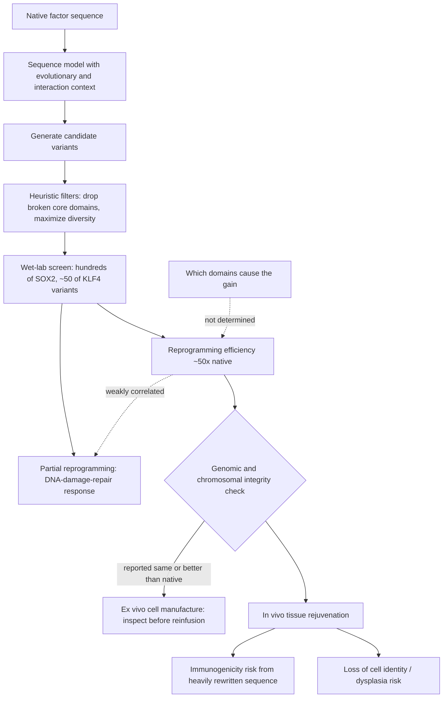

# Engineered reprogramming factors

The Yamanaka factors — OCT4, SOX2, KLF4, and MYC — are the transcription factors that convert a differentiated cell toward pluripotency. They are natural proteins, and nothing about evolution optimized them for the job humans want them to do: they were selected to run early development inside an embryo, not to reset an adult cell efficiently, quickly, and safely in a therapeutic setting. Engineering them means altering their amino-acid sequences to widen the **therapeutic window** — the gap between the exposure that produces a useful effect and the exposure that produces harm — by making the effect stronger per unit of exposure, or by moving the harmful and useful properties apart. The activity being engineered is described in [[epigenetic-alterations-and-reprogramming]]; this page covers the design problem and what its results do and do not establish. (@TheSheekeyScienceShow (The Sheekey Science Show) — "OpenAI Meets Longevity: Inside the Retro Biosciences Partnership That Beat Evolution", 2025-09-12, [link](https://www.youtube.com/watch?v=dwWjpKzBNnY))

## Why the design space cannot be searched by hand

Protein engineering alters a sequence or structure to achieve a function, and the obstacle is combinatorial. Varying only three amino-acid positions across all twenty residues already yields thousands of sequences, and a real redesign varies far more than three. DNA synthesis and screening have scaled, but not to exhaustiveness — and assays grow noisier as they grow larger, so testing more is not free. The conventional response is expert judgment: a skilled protein scientist reads sequence and structure, identifies the domains whose manipulation might yield the desired function, and proposes a small number of variants. The alternative is to let a model that has absorbed the broad space of mammalian protein sequences propose them instead. (@TheSheekeyScienceShow (The Sheekey Science Show) — "OpenAI Meets Longevity: Inside the Retro Biosciences Partnership That Beat Evolution", 2025-09-12, [link](https://www.youtube.com/watch?v=dwWjpKzBNnY))

Reprogramming factors are an unusually hard instance. Much of the Yamanaka factor sequence — reported as roughly 70 to 80% — is intrinsically disordered, lacking a stable tertiary structure and acquiring conformation only on binding partner proteins. Structure-based design methods, which have driven most recent progress in protein engineering, therefore had little to work with, and structural information contributed little in this case. Disordered proteins are conventionally treated as intractable for design. The counter-hypothesis motivating the attempt is that a sequence-level code relating disordered sequence to function exists and can be learned even where no structural representation is available — which, if the results hold, is the more general scientific claim buried inside a reprogramming result. (@TheSheekeyScienceShow (The Sheekey Science Show) — "OpenAI Meets Longevity: Inside the Retro Biosciences Partnership That Beat Evolution", 2025-09-12, [link](https://www.youtube.com/watch?v=dwWjpKzBNnY))

What the model could use instead was context of three other kinds: which of the four factors were being designed and thus what they interact with, the deep evolutionary conservation of these factors across species down to very distant lineages, and text from the underlying general model. Conservation is doing specific work here — it marks which domains tolerate change and which are load-bearing enough that altering them is likely to destroy function, so it functions as a learned prior over where in the sequence to be adventurous. The architecture and its general-purpose framing are covered in [[ai-guided-therapeutic-design]]. (@TheSheekeyScienceShow (The Sheekey Science Show) — "OpenAI Meets Longevity: Inside the Retro Biosciences Partnership That Beat Evolution", 2025-09-12, [link](https://www.youtube.com/watch?v=dwWjpKzBNnY))

## The result and its shape

Two factors were redesigned, SOX2 and KLF4. The choice was not arbitrary: prior published work had established that engineering a SOX protein for better interaction with its partner during reprogramming improves overall efficiency, giving a literature precedent to build against and a human-designed benchmark to compare with. Human-designed variants produced in the same effort did not match the published superSOX results; the model-designed SOX2 and KLF4 sequences together produced roughly a 50-fold improvement in reprogramming efficiency. MYC was deliberately left aside because in vivo reprogramming work generally removes it as an oncogene, making a more potent MYC undesirable rather than useful. (@TheSheekeyScienceShow (The Sheekey Science Show) — "OpenAI Meets Longevity: Inside the Retro Biosciences Partnership That Beat Evolution", 2025-09-12, [link](https://www.youtube.com/watch?v=dwWjpKzBNnY))

The scale of the experiment is worth stating precisely, because it constrains how the result should be read. Generation is effectively instantaneous; heuristic filters removed sequences that had broken domains the designers wanted preserved, and candidates were selected for diversity so that a spread of hypotheses could be tested at once. Roughly a few hundred SOX2 variants and about fifty KLF4 variants went to the bench, and a single screening round produced the reported winners — no iterative design-test-redesign cycle was needed. One round means the hit rate was high enough not to require refinement; it also means the result has not been through the loop that usually exposes overfitting to a particular assay. (@TheSheekeyScienceShow (The Sheekey Science Show) — "OpenAI Meets Longevity: Inside the Retro Biosciences Partnership That Beat Evolution", 2025-09-12, [link](https://www.youtube.com/watch?v=dwWjpKzBNnY))

## Large rewrites, and the mechanism that was not determined

The designed sequences differ from the originals extensively rather than by the conservative point substitutions a human designer would typically propose. The offered explanation is a difference in priors rather than in insight: experimentalists become conservative because most things in biology do not work, and a model carrying no such prior will propose radical hypotheses and let them fail cheaply. If a radical variant does work, it can afterwards be walked back toward the native sequence to recover properties like lower immunogenicity — a strategy that treats the extreme design as a search result rather than as the final molecule. (@TheSheekeyScienceShow (The Sheekey Science Show) — "OpenAI Meets Longevity: Inside the Retro Biosciences Partnership That Beat Evolution", 2025-09-12, [link](https://www.youtube.com/watch?v=dwWjpKzBNnY))

Why the sequences work is unresolved, and openly so: "we don't know why these sequences work so well." Internal predictions exist about which domains are responsible, but establishing them would require domain-by-domain wet-lab dissection across many variants — a large screening programme deliberately deferred in favor of advancing candidates toward clinical use. This is a defensible commercial priority and a real scientific gap, and it has a specific consequence: without knowing which changes carry the effect, there is no principled way to predict which changes carry the risks, and the eventual immunogenicity walk-back has to proceed empirically. (@TheSheekeyScienceShow (The Sheekey Science Show) — "OpenAI Meets Longevity: Inside the Retro Biosciences Partnership That Beat Evolution", 2025-09-12, [link](https://www.youtube.com/watch?v=dwWjpKzBNnY))

## Efficiency is not the same variable as rejuvenation

The most consequential finding is not the 50-fold number. Reprogramming was also run in partial mode — factors expressed for about four days rather than the roughly two weeks required to reach pluripotency, so that cells acquire some early markers but remain recognizably fibroblasts. The readout was resilience rather than identity: cells were stressed with a chemotherapeutic agent, and the factors increased the DNA-damage repair response, with the engineered portfolio increasing it further than the native factors. Crucially, the variants best at DNA-damage repair were not generally the most efficient reprogrammers, which is read as evidence that reprogramming capacity and rejuvenation capacity can be decoupled at the sequence level. (@TheSheekeyScienceShow (The Sheekey Science Show) — "OpenAI Meets Longevity: Inside the Retro Biosciences Partnership That Beat Evolution", 2025-09-12, [link](https://www.youtube.com/watch?v=dwWjpKzBNnY))

If that decoupling holds, it addresses the central safety problem of the field rather than merely its potency problem. The hazard in partial reprogramming is that the thing producing rejuvenation is the same process that erodes cell identity, so dose is a knife-edge; a sequence-level separation would mean a factor could in principle be selected for the rejuvenating property while being *less* effective at driving cells toward pluripotency. Three cautions apply. DNA-damage repair after a chemotherapeutic insult is a proxy for rejuvenation, not rejuvenation itself, and its relationship to tissue function or aging is assumed rather than shown. The overlap between the two variant sets was partial rather than absent. And the finding is a correlation across a screened variant library in cultured cells, which is a hypothesis about the design landscape, not a demonstrated dissociation in an animal.

## Safety, and why the route of administration decides the risk

Faster and more efficient reprogramming raises an immediate concern that was tested directly: cells forced hard toward pluripotency can acquire mutations or chromosomal abnormalities under the stress of the process — you're basically dropping like these OSKM bombs on them. The reported result is that the engineered factors were the same or better than the canonical factors on genomic and chromosomal integrity. That is the right experiment, and it is a screening result on the specific lines tested rather than a general safety property; every clinical line would require its own check. (@TheSheekeyScienceShow (The Sheekey Science Show) — "OpenAI Meets Longevity: Inside the Retro Biosciences Partnership That Beat Evolution", 2025-09-12, [link](https://www.youtube.com/watch?v=dwWjpKzBNnY))

The risk profile then splits sharply by route. Used **ex vivo** — reprogramming a patient's own cells outside the body to manufacture a cell therapy — the process interposes an inspection step: cell health and genomic integrity can be assessed before anything is returned to the patient, and exposure to the factors is transient and contained. Used **in vivo**, to rejuvenate tissue in a living person, both protections disappear, and a heavily rewritten protein sequence acquires a risk that a native one does not have: immune recognition of the engineered factor itself. This is why the immunogenicity walk-back matters, and why an efficiency gain measured in a dish does not transfer automatically to the in vivo application that would matter most for aging. (@TheSheekeyScienceShow (The Sheekey Science Show) — "OpenAI Meets Longevity: Inside the Retro Biosciences Partnership That Beat Evolution", 2025-09-12, [link](https://www.youtube.com/watch?v=dwWjpKzBNnY))

## Where this sits in a development portfolio

Engineered factors are one component of a two-pillar strategy that is worth understanding structurally, because it shows what reprogramming is actually being used for in the near term. The **replacement** pillar makes cells to put into patients: induced-pluripotent-stem-cell-derived haematopoietic stem cells, and iPSC-derived microglia for neurodegenerative conditions. The **rejuvenation** pillar acts on tissue in place: a small-molecule autophagy booster in development for Alzheimer's disease ([[autophagy-and-lysosomal-quality-control]]), and in vivo tissue rejuvenation using transcription factors, which remains at the research stage. The engineered factors' first application is the ex vivo one — improving manufacture of autologous cell therapies — with in vivo rejuvenation as the longer objective. The stated timeline to human trials for this work is a year or two, with the standard caveat that a projected timeline from a company is an intention, not evidence. (@TheSheekeyScienceShow (The Sheekey Science Show) — "OpenAI Meets Longevity: Inside the Retro Biosciences Partnership That Beat Evolution", 2025-09-12, [link](https://www.youtube.com/watch?v=dwWjpKzBNnY))

The longer-range framing places this on a path toward synthetic transcription factors: designed proteins that drive a chosen gene programme to move a cell from one state to another, with the Yamanaka redesign as a step rather than the destination. That is a research direction, not a result. (@TheSheekeyScienceShow (The Sheekey Science Show) — "OpenAI Meets Longevity: Inside the Retro Biosciences Partnership That Beat Evolution", 2025-09-12, [link](https://www.youtube.com/watch?v=dwWjpKzBNnY))

## Practical implications

- **For researchers, report the efficiency and the rejuvenation readouts as separate variables — moderate, and newly supported.** The screened variants dissociate them, so a factor's fold-improvement in reprogramming efficiency should not be used as a proxy for its rejuvenating or its safety properties.
- **Match the safety programme to the route — strong.** Ex vivo use permits pre-infusion inspection of genomic integrity; in vivo use requires immunogenicity assessment of the engineered sequence itself, which is a risk category the native factors do not carry.
- **Treat undissected mechanism as a live liability, not merely an academic loose end — moderate.** Where the responsible domains are unknown, sequence-level de-risking (reducing immunogenicity, tuning potency) can only proceed by empirical screening.
- **For individuals, nothing here is actionable — strong.** No reprogramming factor, engineered or native, is an available or self-administrable intervention; the plausible harms include loss of tissue identity and cancer. See [[epigenetic-alterations-and-reprogramming]].

## Gaps & open questions

- Which sequence changes are responsible for the efficiency gain, and are they the same ones responsible for any change in risk?
- Does the sequence-level decoupling of reprogramming efficiency from DNA-damage repair survive in vivo, or is it specific to cultured fibroblasts and a chemotherapeutic stressor?
- Is enhanced DNA-damage repair after an acute insult a valid proxy for rejuvenation, or does it measure a stress response with no relation to aging trajectory?
- How immunogenic are extensively rewritten factors in vivo, and how much potency is lost when sequences are walked back toward native for that reason?
- Would designing all four factors jointly — which was possible but not done — outperform optimizing two independently?
- Does a single screening round without iteration hide overfitting to the particular reprogramming assay used?
- Do the genomic-integrity results hold across cell lines, donor ages, and longer exposures, or only in the lines screened?
- Can the disordered-sequence code the model apparently exploited be characterized well enough to generalize to other intrinsically disordered targets?

## Related

[[epigenetic-alterations-and-reprogramming]] · [[ai-guided-therapeutic-design]] · [[stem-cell-exhaustion]] · [[genomic-instability-and-dna-repair]] · [[autophagy-and-lysosomal-quality-control]] · [[healthspan-versus-maximum-lifespan]] · [[biological-age-reversal]] · [[longevity-intervention-prioritization]] · [[hallmarks-of-aging]] · [[aging-model]]
