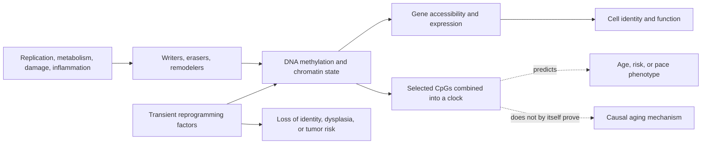

# Epigenetic alterations and reprogramming

The epigenome is the layer of molecular information that helps a cell use the same DNA sequence differently according to cell type, developmental history, and current conditions. It includes DNA methylation, histone modifications, nucleosome positioning, chromatin accessibility, and three-dimensional genome organization. With age, these systems change unevenly: some regions gain methylation while others lose it, heterochromatin can become less stable, and transcription becomes more variable. “Epigenetic alteration” therefore describes a family of changes, not one master lesion or a uniform loss of methylation.[^lopez-otin-2023]

## Clocks are measurements, not mechanisms

DNA-methylation clocks are statistical algorithms. Horvath's original multi-tissue clock selected 353 CpG sites from roughly 8,000 samples and predicted chronological age across many human tissues; it did not experimentally show that changing those 353 sites changes aging.[^horvath-2013] Later clocks were trained on mortality-related phenotypes or longitudinal physiological decline. DunedinPACE, for example, compresses decline in 19 organ-system indicators measured repeatedly in one 1972–1973 birth cohort into a blood-methylation score and was then tested in other datasets.[^belsky-2022] These clocks can be useful risk or response biomarkers, but they answer different questions.

That distinction matters because eleven telomere, methylation, and clinical-composite measures showed low agreement in 964 middle-aged Dunedin participants, with only modest associations with functional and cognitive outcomes.[^belsky-2018] A lower clock value after an intervention is therefore a biomarker result, not proof of restored tissue function, fewer diseases, or longer life. Cell mixture, tissue, assay platform, training population, and regression to the mean can also change an estimate.

## How epigenetic change could impair tissue

Chromatin controls which regulatory elements a transcription factor can reach. Age-related drift can weaken stable cell identity, alter stress responses, derepress repetitive elements, and interact with [[genomic-instability-and-dna-repair]], [[loss-of-proteostasis]], inflammation, and [[stem-cell-exhaustion]]. The causal direction is rarely one-way: DNA damage and metabolic state alter chromatin enzymes, while altered chromatin can change repair and metabolism. The expanded hallmarks framework classifies epigenetic alterations as a hallmark because they appear with age and can be manipulated in experimental systems, but much of the intervention evidence remains cellular or animal.[^lopez-otin-2023]

## Reprogramming and what experiments establish

Full reprogramming uses factors such as OCT4, SOX2, KLF4, and MYC (OSKM) to drive a differentiated cell toward pluripotency. It can reset several age-associated molecular features, but it also erases the identity needed for an adult cell to perform its job. Partial reprogramming attempts to stop earlier: change age-associated state while retaining identity.

In transgenic mice, cyclic OSKM expression improved molecular and physiological markers and extended lifespan in a progeroid model; in older wild-type mice it improved recovery after muscle injury and a metabolic insult.[^ocampo-2016] This was an engineered mouse experiment, not a human treatment trial, and the progeroid survival result cannot be generalized to normal human aging. A later mouse study found that one transient OSKM cycle reversed some methylation, transcriptional, and metabolite changes in several naturally aged tissues.[^chondronasiou-2022] Those multi-omic shifts did not establish longer survival or broad clinical benefit.

Safety is inseparable from mechanism. Reprogramming deliberately relaxes stable cell fate; excessive or poorly targeted exposure can produce dedifferentiation, dysplasia, or teratomas, while MYC is oncogenic. Reviews of the field emphasize that there is still no universally accepted definition of partial reprogramming or proven way to uncouple rejuvenation reliably from loss of identity.[^gill-2023] Delivery, dose, tissue specificity, reversibility, immune effects, and long cancer surveillance all remain unresolved. No partial-reprogramming regimen is established as an anti-aging treatment in humans.

## Practical implications

- Do not treat a commercial “epigenetic age” as a diagnosis or a direct measure of years added or removed. Repeated testing is most interpretable when specimen, assay, laboratory, and pre-analytic conditions are held constant; even then, ordinary clinical risk factors and function remain more actionable.
- Prefer interventions supported by human health outcomes—such as exercise, smoking avoidance, blood-pressure control, vaccination, and appropriate screening—over products sold only on clock movement. See [[practice-playbook]].
- Reprogramming-factor or gene-delivery products belong in regulated research, not self-experimentation. The present evidence is preclinical and the plausible harms include cancer and loss of tissue identity.

## Gaps & open questions

- Which age-associated chromatin changes are drivers, compensations, or records of other damage?
- Can a clock be validated as a surrogate endpoint by showing that intervention-induced change predicts later clinical benefit?
- Can reprogramming reset harmful state without erasing identity, expanding damaged clones, or creating delayed cancer?
- How do effects differ by cell type, sex, age, disease, delivery vector, and duration?

## Related

- [[biological-age-biomarkers]]
- [[biological-age-reversal]]
- [[genomic-instability-and-dna-repair]]
- [[stem-cell-exhaustion]]
- [[aging-model]]

## References

[^lopez-otin-2023]: López-Otín C, Blasco MA, Partridge L, Serrano M, Kroemer G. “Hallmarks of Aging: An Expanding Universe.” *Cell*, 2023. [expert narrative review and framework]. [PubMed](https://pubmed.ncbi.nlm.nih.gov/36599349/)
[^horvath-2013]: Horvath S. “DNA methylation age of human tissues and cell types.” *Genome Biology*, 2013. [human biomarker development study]. [DOI](https://doi.org/10.1186/gb-2013-14-10-r115)
[^belsky-2022]: Belsky DW, Caspi A, Corcoran DL, et al. “DunedinPACE, a DNA methylation biomarker of the pace of aging.” *eLife*, 2022. [longitudinal human biomarker development and validation study]. [PubMed](https://pubmed.ncbi.nlm.nih.gov/35029144/)
[^belsky-2018]: Belsky DW, Moffitt TE, Cohen AA, et al. “Eleven Telomere, Epigenetic Clock, and Biomarker-Composite Quantifications of Biological Aging: Do They Measure the Same Thing?” *American Journal of Epidemiology*, 2018. [prospective cohort biomarker comparison]. [DOI](https://doi.org/10.1093/aje/kwx346)
[^ocampo-2016]: Ocampo A, Reddy P, Martinez-Redondo P, et al. “In Vivo Amelioration of Age-Associated Hallmarks by Partial Reprogramming.” *Cell*, 2016. [transgenic mouse experiment]. [DOI](https://doi.org/10.1016/j.cell.2016.11.052)
[^chondronasiou-2022]: Chondronasiou D, Gill D, Mosteiro L, et al. “Multi-omic rejuvenation of naturally aged tissues by a single cycle of transient reprogramming.” *Aging Cell*, 2022. [transgenic mouse experiment]. [PubMed](https://pubmed.ncbi.nlm.nih.gov/35235716/)
[^gill-2023]: Gill D, Parry A, Santos F. “Epigenetic rejuvenation by partial reprogramming.” *Aging Cell*, 2023. [narrative review]. [PubMed](https://pubmed.ncbi.nlm.nih.gov/36871150/)
