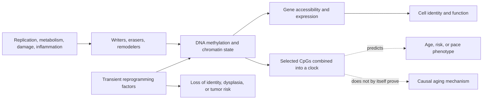
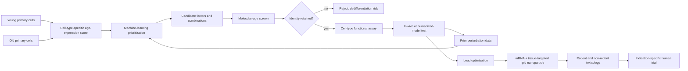

# Epigenetic alterations and reprogramming

The epigenome is the layer of molecular information that helps a cell use the same DNA sequence differently according to cell type, developmental history, and current conditions. It includes DNA methylation, histone modifications, nucleosome positioning, chromatin accessibility, and three-dimensional genome organization. With age, these systems change unevenly: some regions gain methylation while others lose it, heterochromatin can become less stable, and transcription becomes more variable. “Epigenetic alteration” therefore describes a family of changes, not one master lesion or a uniform loss of methylation.[^lopez-otin-2023]

## Clocks are measurements, not mechanisms

DNA-methylation clocks are statistical algorithms. Horvath's original multi-tissue clock selected 353 CpG sites from roughly 8,000 samples and predicted chronological age across many human tissues; it did not experimentally show that changing those 353 sites changes aging.[^horvath-2013] Later clocks were trained on mortality-related phenotypes or longitudinal physiological decline. DunedinPACE, for example, compresses decline in 19 organ-system indicators measured repeatedly in one 1972–1973 birth cohort into a blood-methylation score and was then tested in other datasets.[^belsky-2022] These clocks can be useful risk or response biomarkers, but they answer different questions.

That distinction matters because eleven telomere, methylation, and clinical-composite measures showed low agreement in 964 middle-aged Dunedin participants, with only modest associations with functional and cognitive outcomes.[^belsky-2018] A lower clock value after an intervention is therefore a biomarker result, not proof of restored tissue function, fewer diseases, or longer life. Cell mixture, tissue, assay platform, training population, and regression to the mean can also change an estimate.

## How epigenetic change could impair tissue

Chromatin controls which regulatory elements a transcription factor can reach. Age-related drift can weaken stable cell identity, alter stress responses, derepress repetitive elements, and interact with [[genomic-instability-and-dna-repair]], [[loss-of-proteostasis]], inflammation, and [[stem-cell-exhaustion]]. The causal direction is rarely one-way: DNA damage and metabolic state alter chromatin enzymes, while altered chromatin can change repair and metabolism. The expanded hallmarks framework classifies epigenetic alterations as a hallmark because they appear with age and can be manipulated in experimental systems, but much of the intervention evidence remains cellular or animal.[^lopez-otin-2023]

## Reprogramming and what experiments establish

Full reprogramming uses factors such as OCT4, SOX2, KLF4, and MYC (OSKM) to drive a differentiated cell toward pluripotency. It can reset several age-associated molecular features, but it also erases the identity needed for an adult cell to perform its job. Partial reprogramming attempts to stop earlier: change age-associated state while retaining identity.

This goal can be stated as a two-axis control problem. Cell **type** is the stable gene-regulatory programme that makes a hepatocyte metabolize compounds or a T cell execute immune functions; cell **age** is the age-associated state superimposed on that identity. Full reprogramming moves both axes, while direct conversion experiments show that type can be changed without first making a cell young. Partial rejuvenation seeks the remaining quadrant: move an old cell toward a young molecular and functional state while keeping its type fixed. That separation is a design objective, not yet a generally demonstrated therapeutic capability. (@TheSheekeyScienceShow (The Sheekey Science Show) — "How NewLimit Is Reprogramming Human Cells to Reverse Aging | Cathy O’Hare Interview", 2025-06-20, [link](https://www.youtube.com/watch?v=RC9OrSqLi6A))

In transgenic mice, cyclic OSKM expression improved molecular and physiological markers and extended lifespan in a progeroid model; in older wild-type mice it improved recovery after muscle injury and a metabolic insult.[^ocampo-2016] This was an engineered mouse experiment, not a human treatment trial, and the progeroid survival result cannot be generalized to normal human aging. A later mouse study found that one transient OSKM cycle reversed some methylation, transcriptional, and metabolite changes in several naturally aged tissues.[^chondronasiou-2022] Those multi-omic shifts did not establish longer survival or broad clinical benefit.

Asking *how* reprogramming rejuvenates separates three mechanisms that are usually collapsed together, and the separation matters because they are not equally available in every tissue. The first is **selective cell loss**: cells too damaged to survive the reprogramming process die, so the surviving population is biologically younger without any individual cell having been improved. The second is **dilution by division**: protein, RNA, and some DNA damage is distributed across daughter cells at each replication, lowering per-cell burden. The third is a genuine **epigenetic factory reset**, in which the cell's epigenetic makeup is returned toward its starting configuration. Only the third is rejuvenation of a cell as opposed to rejuvenation of a population, and only the third is available in tissue that does not divide. (@TheSheekeyScienceShow (The Sheekey Science Show) — "How Randomness Drives Aging - DNA Repair, Clocks & Rejuvenation (David Meyer)", 2025-07-04, [link](https://www.youtube.com/watch?v=Buj07nWt7o0))

The reset mechanism has a natural precedent. Embryogenesis begins with two old cells — an egg and a sperm — which on fusion give rise to an organism without inherited age, with the acknowledged exception of mutations, which are not repairable. That existence proof is the strongest general argument that epigenetic information is the carrier of the reversible part of aging and that resetting it is sufficient to restore a young state. It also delimits the claim: whatever reprogramming achieves, it does not address accumulated sequence change, so mutations remain outside the reach of this route. (@TheSheekeyScienceShow (The Sheekey Science Show) — "How Randomness Drives Aging - DNA Repair, Clocks & Rejuvenation (David Meyer)", 2025-07-04, [link](https://www.youtube.com/watch?v=Buj07nWt7o0))

A recurring objection holds that accumulated cellular entropy cannot be removed, citing the second law of thermodynamics. The rebuttal is that the second law constrains *closed* systems, while a body is an open system that consumes energy and exports waste continuously — which is how it holds disorder below what an unmaintained system would show. Reprogramming, on this reading, is not an exception to thermodynamics but an intensification of what cells do routinely. The argument is sound as far as it goes and settles rather little: it establishes that noise removal is not forbidden in principle, not that any particular protocol achieves it or that the removal is complete. Whether the marks reprogramming resets are the reversible ones or include irreversible damage is a separate and contested question, developed in [[healthspan-versus-maximum-lifespan]]. (@TheSheekeyScienceShow (The Sheekey Science Show) — "How Randomness Drives Aging - DNA Repair, Clocks & Rejuvenation (David Meyer)", 2025-07-04, [link](https://www.youtube.com/watch?v=Buj07nWt7o0)) [[stochastic-aging-and-molecular-noise]]

The three-mechanism decomposition creates an obvious problem for post-mitotic tissue: neurons neither divide nor can be selectively culled without losing the tissue, so two of the three routes are unavailable and any rejuvenation there must be cell-intrinsic. Diapause exit in *C. elegans* is the clearest evidence that such a route exists — worms age during the state and rejuvenate transcriptionally on exit, in cells that cannot dilute or apoptose — and it is comparatively unstudied. If reprogramming-like benefit is to reach the brain, this is the mechanism that would have to carry it. (@TheSheekeyScienceShow (The Sheekey Science Show) — "How Randomness Drives Aging - DNA Repair, Clocks & Rejuvenation (David Meyer)", 2025-07-04, [link](https://www.youtube.com/watch?v=Buj07nWt7o0))

Recent work has begun to define what partial reprogramming actually reverses. One proposal is **mesenchymal drift**: a signature of genes rising with age across human tissues and tissue types, associated with a mesenchymal phenotype and interpreted as cells losing their identity by expressing genes they would not normally express. Partial reprogramming is reported to reduce this drift and thereby keep cells functioning as their proper type. If it holds, this reframes rejuvenation as identity restoration rather than clock-turning — a more mechanistically tractable claim, and one that predicts a functional readout rather than only a methylation readout. The signature is defined from cross-sectional human tissue and the reversal demonstrated in experimental systems, so drift's causal contribution to tissue dysfunction is not established. (@TheSheekeyScienceShow (The Sheekey Science Show) — "This years biggest breakthroughs in longevity! (2025)", 2025-12-21, [link](https://www.youtube.com/watch?v=X-Hzyzo1Jpk))

Three routes are being pursued to make the intervention safer or more deliverable, each attacking a different part of the OSKM problem. Reducing factor count addresses combinatorial risk: a single gene factor has been reported to achieve in fibroblasts what OSKM achieves, with the identity of the gene undisclosed at the time of reporting — commercially understandable, scientifically unevaluable. Improving the factors themselves addresses potency: a custom protein-design model optimized for aging targets was used to redesign SOX2 and KLF4, reported as nearly 50-fold better than the original factors, which connects this chapter to [[ai-guided-therapeutic-design]]. Replacing genetic delivery entirely addresses the vector problem: chemical reprogramming with two compounds produced a 42% median lifespan increase in *C. elegans*, described as among the first demonstrations that non-genetic reprogramming extends lifespan in a living organism rather than in cell lines. The obvious limitation of the last is delivery — worms can simply be flooded with compound on a plate, which is not a route available in a human. (@TheSheekeyScienceShow (The Sheekey Science Show) — "This years biggest breakthroughs in longevity! (2025)", 2025-12-21, [link](https://www.youtube.com/watch?v=X-Hzyzo1Jpk))

The undisclosed single-factor result is more informative when its assay chain is made explicit. A proprietary transcriptomic clock was trained on single-cell RNA profiles from primary human dermal fibroblasts from more than 100 donors aged 1–87, then used to rank roughly 1,500 overexpressed genes after two weeks of lentiviral expression. The lead labelled SB000 reportedly shifted transcriptomic age, moved 11 of 20 selected aging-hallmark programmes in favorable directions, reduced methylation age after six weeks in fibroblasts and keratinocytes, retained fibroblast markers and morphology, and did not induce the colony formation used as a warning for pluripotency. These are convergent molecular and identity-preservation readouts in cultured cells, not evidence of organismal rejuvenation: the factor is undisclosed, the expression level and mechanism are unknown, independent replication is impossible, and sustained integrating-vector expression is not a clinically validated delivery strategy. (@TheSheekeyScienceShow (The Sheekey Science Show) — "one gene for cell rejuvenation?", 2025-06-16, [link](https://www.youtube.com/watch?v=cH_Igeb5b_g))

The broader discovery strategy treats factor selection as a closed learning loop rather than a one-pass literature search. Old and young primary cells define an age-associated expression score; computational models use accumulated perturbation data to prioritize factors and combinations; wet-lab screens test those predictions; and functional assays ask whether molecularly younger cells also perform age-sensitive cell-type functions. One programme reports screening about 14,000 factor conditions and applies the funnel separately to hepatocytes and T cells. In hepatocytes, a pooled screen uses aged primary human cells engrafted into humanized mouse livers and asks which perturbations restore competitive engraftment, adding an in-vivo functional filter before candidate selection. These details establish a rational discovery architecture, but the hit identities and quantitative results were not disclosed, so they do not establish efficacy. (@TheSheekeyScienceShow (The Sheekey Science Show) — "How NewLimit Is Reprogramming Human Cells to Reverse Aging | Cathy O’Hare Interview", 2025-06-20, [link](https://www.youtube.com/watch?v=RC9OrSqLi6A))

Delivery determines whether a promising factor can become a controllable intervention. Transient mRNA in lipid nanoparticles avoids genomic integration and permits expression to decay; one programme reports molecular and functional effects appearing within days and persisting for at least a week after expression was stopped. Durability beyond that interval, required dose, off-target exposure, and repeated-dose safety remain unknown. Existing lipid nanoparticles preferentially reach liver, making hepatocytes a tractable first target, while delivery to T cells, endothelium, brain, and other tissues remains a separate engineering problem. A familiar delivery material reduces one category of uncertainty but does not establish the safety of its transcription-factor cargo or of reprogramming the target tissue. (@TheSheekeyScienceShow (The Sheekey Science Show) — "How NewLimit Is Reprogramming Human Cells to Reverse Aging | Cathy O’Hare Interview", 2025-06-20, [link](https://www.youtube.com/watch?v=RC9OrSqLi6A))

Because aging itself is not an established clinical indication, development proceeds through diseases with measurable unmet need. Starting from healthy old-versus-young cells and then choosing a liver or immune indication preserves aging as the discovery target while making an efficacy trial possible. It does not prove that success in one disease will generalize to aging, to other organs, or to healthy people; organ-specific factors, delivery vehicles, endpoints, and risk tolerance may all differ. The proposal that several organ-directed drugs could cumulatively extend healthspan is plausible portfolio logic, not clinical evidence for systemic rejuvenation. (@TheSheekeyScienceShow (The Sheekey Science Show) — "How NewLimit Is Reprogramming Human Cells to Reverse Aging | Cathy O’Hare Interview", 2025-06-20, [link](https://www.youtube.com/watch?v=RC9OrSqLi6A))

The factor-improvement route has since been described in detail by its originators, and the detail changes what the 50-fold figure means. The gain came from a single wet-lab screening round of a few hundred model-designed SOX2 variants and about fifty KLF4 variants, with MYC deliberately excluded because in vivo work removes it as an oncogene; the designed sequences differ extensively from the originals rather than by conservative substitution, and the domains responsible for the gain have not been identified. Two findings matter more for this chapter than potency. Genomic and chromosomal integrity after the faster, harder reprogramming process was reported as the same or better than with canonical factors — the correct check, since forcing cells through reprogramming more efficiently is exactly the condition under which abnormalities would be expected. And in partial mode, with factors expressed for about four days rather than the fortnight needed to reach pluripotency, the variants that best enhanced the DNA-damage repair response to a chemotherapeutic insult were not generally the most efficient reprogrammers, which is interpreted as evidence that reprogramming and rejuvenation can be decoupled at the sequence level. If that dissociation holds in vivo, it addresses the field's central safety problem rather than only its potency problem, because it implies a factor could be selected for the rejuvenating property while being *less* able to erode cell identity. It remains a correlation across a variant library in cultured fibroblasts, with damage repair standing as an assumed proxy for rejuvenation. [[engineered-reprogramming-factors]] (@TheSheekeyScienceShow (The Sheekey Science Show) — "OpenAI Meets Longevity: Inside the Retro Biosciences Partnership That Beat Evolution", 2025-09-12, [link](https://www.youtube.com/watch?v=dwWjpKzBNnY))

The near-term application of engineered factors is also not the one this chapter's framing would suggest. Their first use is **ex vivo** — manufacturing induced-pluripotent-stem-cell-derived haematopoietic stem cells and microglia for autologous cell therapy — where the reprogramming happens outside the patient and cell health can be inspected before anything is returned. In vivo tissue rejuvenation, the application that would bear on aging directly, remains at the research stage and carries a risk the native factors do not: immune recognition of an extensively rewritten protein sequence. This route-dependence is why an efficiency gain measured in a dish does not transfer automatically to systemic use. (@TheSheekeyScienceShow (The Sheekey Science Show) — "OpenAI Meets Longevity: Inside the Retro Biosciences Partnership That Beat Evolution", 2025-09-12, [link](https://www.youtube.com/watch?v=dwWjpKzBNnY))

Human translation has begun at the regulatory rather than the evidentiary level. A partial-reprogramming company has received an FDA-cleared path toward first human trials of OSKM partial reprogramming in Alzheimer's disease, and a separate ocular reprogramming programme has announced entry into human clinical trials. A cleared trial path is permission to test, not evidence of efficacy or safety, and both target tissues were presumably chosen because they are locally accessible and partly immune-privileged — which is exactly why success in them would not generalize to systemic administration. (@TheSheekeyScienceShow (The Sheekey Science Show) — "This years biggest breakthroughs in longevity! (2025)", 2025-12-21, [link](https://www.youtube.com/watch?v=X-Hzyzo1Jpk)) (@TheSheekeyScienceShow (The Sheekey Science Show) — "the 3 levels of aging therapeutics", 2026-02-08, [link](https://www.youtube.com/watch?v=c-_Pdp5IIvw))

A dissenting reading holds that reprogramming is structurally limited whatever its delivery improves. On the minimal-model account, the methylation marks reprogramming resets are those driven by the reversible dynamic component, not the entropic component, and reprogramming does nothing about somatic mutations accumulating linearly with age — so it belongs to the same intervention class as senolytics and caloric restriction, capable of restoring function and preventing disease but not of raising maximum lifespan. The specific prediction for the ocular programme is that it may restore function while the eye continues to age, with replacement eventually outperforming reprogramming. The counter-possibility, acknowledged within the same account but currently unevidenced, is that rejuvenated cells might clear damage in their surroundings, which would move reprogramming out of that bounded class. This disagreement is developed in [[healthspan-versus-maximum-lifespan]]. (@TheSheekeyScienceShow (The Sheekey Science Show) — "the 3 levels of aging therapeutics", 2026-02-08, [link](https://www.youtube.com/watch?v=c-_Pdp5IIvw))

Safety is inseparable from mechanism. Reprogramming deliberately relaxes stable cell fate; excessive or poorly targeted exposure can produce dedifferentiation, dysplasia, or teratomas, while MYC is oncogenic. Reviews of the field emphasize that there is still no universally accepted definition of partial reprogramming or proven way to uncouple rejuvenation reliably from loss of identity.[^gill-2023] Delivery, dose, tissue specificity, reversibility, immune effects, and long cancer surveillance all remain unresolved. No partial-reprogramming regimen is established as an anti-aging treatment in humans.

## Practical implications

- Do not treat a commercial “epigenetic age” as a diagnosis or a direct measure of years added or removed. Repeated testing is most interpretable when specimen, assay, laboratory, and pre-analytic conditions are held constant; even then, ordinary clinical risk factors and function remain more actionable.
- Prefer interventions supported by human health outcomes—such as exercise, smoking avoidance, blood-pressure control, vaccination, and appropriate screening—over products sold only on clock movement. See [[practice-playbook]].
- Reprogramming-factor or gene-delivery products belong in regulated research, not self-experimentation. The present evidence is preclinical and the plausible harms include cancer and loss of tissue identity.
- Treat transient mRNA delivery as a risk-control hypothesis, not a safety certificate. Non-integration removes insertional risk, but tissue targeting, dose, repeat exposure, cargo toxicity, and delayed dysplasia still require formal preclinical and clinical testing. (@TheSheekeyScienceShow (The Sheekey Science Show) — "How NewLimit Is Reprogramming Human Cells to Reverse Aging | Cathy O’Hare Interview", 2025-06-20, [link](https://www.youtube.com/watch?v=RC9OrSqLi6A))

## Gaps & open questions

- Which age-associated chromatin changes are drivers, compensations, or records of other damage?
- Can a clock be validated as a surrogate endpoint by showing that intervention-induced change predicts later clinical benefit?
- Can reprogramming reset harmful state without erasing identity, expanding damaged clones, or creating delayed cancer?
- How do effects differ by cell type, sex, age, disease, delivery vector, and duration?
- Is mesenchymal drift a cause of tissue dysfunction, a consequence of it, or a descriptive signature — and does reducing it improve function?
- Does a single-factor approach reproduce OSKM's rejuvenation with a genuinely better safety profile, and what is the factor?
- Can SB000 be independently identified and replicated, what exposure produced the reported effects, and can a short non-integrating pulse reproduce results obtained after weeks of lentiviral overexpression?
- Do transcriptomic and methylation-age shifts after factor expression predict durable improvement in cell-type function, tissue function, disease outcomes, or survival?
- Are rejuvenating factors universal across cell types, or must factor combinations and delivery vehicles be designed organ by organ?
- How long do transient mRNA-induced state changes persist in vivo, and what cadence would balance durability against repeat-dose immune and dysplasia risk?
- Do AI-optimized reprogramming factors retain their potency advantage in vivo, and does higher potency raise or lower dedifferentiation risk?
- Does the reported sequence-level decoupling of reprogramming efficiency from DNA-damage repair survive outside cultured fibroblasts, and is damage repair after an acute insult a valid proxy for rejuvenation at all?
- Can chemical reprogramming be delivered to a specific tissue in a mammal at an effective dose, given that worm results depend on immersion?
- Does reprogramming alter any marker of entropic damage — somatic mutation, cross-linking — or only the reversible component?
- Do locally delivered trials in eye and brain predict anything about systemic administration?
- How much of observed rejuvenation is selective loss of damaged cells and divisional dilution rather than an epigenetic reset of surviving cells, and can the three be measured separately?
- What cell-intrinsic mechanism rejuvenates post-mitotic cells on diapause exit, and can it be induced in mammalian neurons?
- Given that mutations are not reset, what ceiling does accumulated somatic mutation place on repeated reprogramming?

## Related

- [[biological-age-biomarkers]]
- [[biological-age-reversal]]
- [[healthspan-versus-maximum-lifespan]]
- [[aging-dynamics-and-resilience]]
- [[hallmarks-of-aging]]
- [[genomic-instability-and-dna-repair]]
- [[stem-cell-exhaustion]]
- [[cellular-senescence]]
- [[ai-guided-therapeutic-design]]
- [[engineered-reprogramming-factors]]
- [[circulating-rejuvenation-signaling]]
- [[stochastic-aging-and-molecular-noise]]
- [[programmed-versus-stochastic-aging]]
- [[aging-model]]

## References

[^lopez-otin-2023]: López-Otín C, Blasco MA, Partridge L, Serrano M, Kroemer G. “Hallmarks of Aging: An Expanding Universe.” *Cell*, 2023. [expert narrative review and framework]. [PubMed](https://pubmed.ncbi.nlm.nih.gov/36599349/)
[^horvath-2013]: Horvath S. “DNA methylation age of human tissues and cell types.” *Genome Biology*, 2013. [human biomarker development study]. [DOI](https://doi.org/10.1186/gb-2013-14-10-r115)
[^belsky-2022]: Belsky DW, Caspi A, Corcoran DL, et al. “DunedinPACE, a DNA methylation biomarker of the pace of aging.” *eLife*, 2022. [longitudinal human biomarker development and validation study]. [PubMed](https://pubmed.ncbi.nlm.nih.gov/35029144/)
[^belsky-2018]: Belsky DW, Moffitt TE, Cohen AA, et al. “Eleven Telomere, Epigenetic Clock, and Biomarker-Composite Quantifications of Biological Aging: Do They Measure the Same Thing?” *American Journal of Epidemiology*, 2018. [prospective cohort biomarker comparison]. [DOI](https://doi.org/10.1093/aje/kwx346)
[^ocampo-2016]: Ocampo A, Reddy P, Martinez-Redondo P, et al. “In Vivo Amelioration of Age-Associated Hallmarks by Partial Reprogramming.” *Cell*, 2016. [transgenic mouse experiment]. [DOI](https://doi.org/10.1016/j.cell.2016.11.052)
[^chondronasiou-2022]: Chondronasiou D, Gill D, Mosteiro L, et al. “Multi-omic rejuvenation of naturally aged tissues by a single cycle of transient reprogramming.” *Aging Cell*, 2022. [transgenic mouse experiment]. [PubMed](https://pubmed.ncbi.nlm.nih.gov/35235716/)
[^gill-2023]: Gill D, Parry A, Santos F. “Epigenetic rejuvenation by partial reprogramming.” *Aging Cell*, 2023. [narrative review]. [PubMed](https://pubmed.ncbi.nlm.nih.gov/36871150/)
