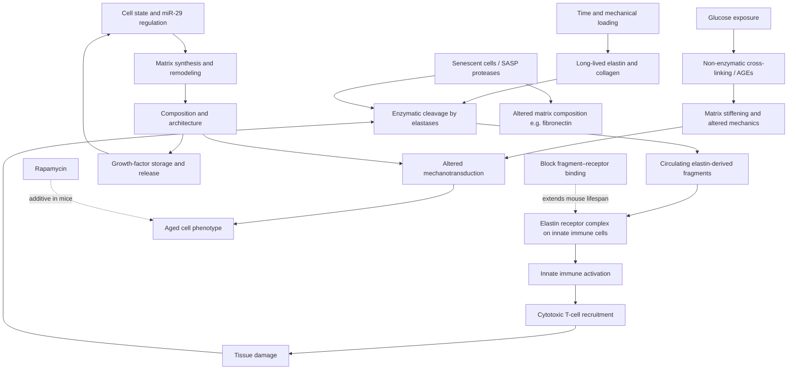

# Extracellular-matrix aging

The extracellular matrix is the structured protein and polysaccharide network that cells build, inhabit, and continuously remodel. It is not passive packing material: matrix composition and stiffness are read by cells through adhesion receptors and mechanotransduction, and matrix fragments can act as signaling molecules in their own right. Two properties make it distinctive among aging processes. First, its principal structural proteins turn over extremely slowly — elastin laid down in early life is largely the elastin a person has at seventy — so damage to them accumulates without the option of replacement. Second, because it is shared infrastructure, a change in the matrix alters the behavior of every cell embedded in it simultaneously. Matrix change was added to the hallmarks framework in its 2025 update. (@TheSheekeyScienceShow (The Sheekey Science Show) — "This years biggest breakthroughs in longevity! (2025)", 2025-12-21, [link](https://www.youtube.com/watch?v=X-Hzyzo1Jpk))

Matrix is organized in two broad architectures. **Interstitial matrix** fills and mechanically couples the spaces between cells and commonly contains fibrillar collagens such as type I. **Basement membrane** is a thin sheet beneath epithelia and around some other cell types; type IV collagen helps form its network and the sheet both anchors cells and separates tissue compartments. Cells synthesize and secrete these proteins, assemble them outside the membrane, and remodel them with proteases. The matrix in turn regulates proliferation, migration, differentiation, immune activity, and survival through adhesion, mechanics, and stored signals, creating **dynamic reciprocity**: cells construct their environment while that environment constrains cell state. (@TheSheekeyScienceShow (The Sheekey Science Show) — "the extracellular matrix (& aging)", 2025-04-29, [link](https://www.youtube.com/watch?v=GtOCmedLZ5E))

The matrix is also a biochemical reservoir. Growth factors including TGF-beta can be bound in an inactive or spatially restricted form and released or activated during remodeling. A matrix change can therefore alter a cell without changing the abundance of a signal in circulation: it can change how much signal is locally available, the force transmitted to receptors, or whether an immune cell can enter a compartment. Culture experiments illustrate the principle but not its in-vivo magnitude: cells proliferating on rigid plastic can stop proliferating when embedded in collagen, and matrix context can restrain natural-killer-cell activity. (@TheSheekeyScienceShow (The Sheekey Science Show) — "the extracellular matrix (& aging)", 2025-04-29, [link](https://www.youtube.com/watch?v=GtOCmedLZ5E))

## A self-reinforcing damage-to-immunity loop

The best-characterized causal route from matrix aging to systemic consequence runs through elastin. Elastin gives tissue its recoil under repeated stretch, and it can be cleaved by elastases released during injury, inflammation, and normal remodeling. The resulting fragments are recognized by an elastin receptor complex expressed on innate immune cells. Ligation activates those cells, which in turn recruit the adaptive arm — particularly cytotoxic T cells — and that activation produces tissue damage, which liberates further fragments. The structure is a positive feedback loop in which a structural protein's breakdown products act as a persistent inflammatory signal. (@TheSheekeyScienceShow (The Sheekey Science Show) — "This years biggest breakthroughs in longevity! (2025)", 2025-12-21, [link](https://www.youtube.com/watch?v=X-Hzyzo1Jpk))

Three observations raise this above mechanistic plausibility. Elastin fragments rise with age in plasma in both mice and humans, so the proposed driver is present in the right species and increases in the right direction. Blocking fragment binding to the receptor extended lifespan in mice. And combining that blockade with rapamycin extended lifespan further than either alone — the additivity being the informative result, since it argues that this route is at least partly independent of nutrient-sensing pathways rather than a redundant entry into the same mechanism. This is animal lifespan evidence for a distinct pathway, and the loop-breaking design is unusually clean; it is not human evidence, and the human plasma correlation establishes only that the substrate exists. (@TheSheekeyScienceShow (The Sheekey Science Show) — "This years biggest breakthroughs in longevity! (2025)", 2025-12-21, [link](https://www.youtube.com/watch?v=X-Hzyzo1Jpk))

This is also where matrix aging connects to two adjacent chapters. [[advanced-glycation-end-products]] supplies the other major matrix-damage route — non-enzymatic cross-linking of long-lived proteins by glucose-derived adducts, producing stiffening rather than fragmentation — and shares the same fundamental problem of slow turnover making damage effectively permanent. [[inflammaging-and-il-6]] and [[immune-aging-and-rejuvenation]] describe the receiving end: the elastin-fragment loop is a concrete candidate source for the persistent innate-immune activation those chapters treat as a system-level state, and one that does not require senescent cells to explain it.

Age can enter the reciprocal loop from either direction. Cells can change how much matrix they produce and which components they remodel; microRNA-29 has been implicated in age-related phenotypes and regulates multiple matrix genes, while longevity interventions in *C. elegans* have been reported to alter matrix production and mechanotransduction. Existing collagen can also accumulate cross-links and become stiffer, changing the mechanical signals returned to cells. These observations connect cellular regulation, matrix composition, and cell behavior, but the cited intervention work is preclinical and does not establish that matrix change mediates lifespan effects in humans. (@TheSheekeyScienceShow (The Sheekey Science Show) — "the extracellular matrix (& aging)", 2025-04-29, [link](https://www.youtube.com/watch?v=GtOCmedLZ5E))

## The environment can be as old as the cell

If matrix is instructive rather than inert, then cellular age should be partly imposed by surroundings. A cardiac decellularization experiment tests this directly: thin heart slices from young and old mice are stripped of cells, leaving matrix scaffolds of two ages, and then repopulated crosswise — old cells onto young scaffold, young cells onto old scaffold. The result runs in both directions. Young cells on old matrix acquire somewhat older characteristics; old cells on young matrix acquire somewhat younger ones. The effects are described as partial in both directions, which is the scientifically important detail: the matrix contributes to the aged phenotype without determining it, and neither cell nor environment is the sole locus of aging. (@TheSheekeyScienceShow (The Sheekey Science Show) — "This years biggest breakthroughs in longevity! (2025)", 2025-12-21, [link](https://www.youtube.com/watch?v=X-Hzyzo1Jpk))

This is the local-environment counterpart to the systemic-milieu experiments discussed in [[stem-cell-exhaustion]] and [[therapeutic-plasma-exchange]], and it sharpens their interpretation. Heterochronic parabiosis and plasma exchange manipulate circulating factors; decellularized-scaffold swaps manipulate fixed local structure. A cell sits in both environments at once, and an intervention that changes only the soluble one leaves the structural one intact. That distinction constrains what any circulating-factor therapy can be expected to achieve in a tissue whose matrix is decades old.

## Measurement is the current bottleneck

Matrix change also confounds the measurement of other aging processes, which is a practical hazard rather than an abstraction. An unbiased SELEX screen — iterative positive selection on senescent cells and negative selection on normal cells across increasingly stringent rounds — yielded DNA aptamers that preferentially bind senescent cells, and mass spectrometry identified their target as a form of fibronectin reported to be upregulated in senescence. Staining of mouse lung sections showed aptamer signal declining when senescent cells were genetically eliminated. Sheekey's reading, which the paper's own discussion acknowledges, is that a fibronectin-binding reagent is most naturally interpreted as a marker of aged tissue matrix rather than of senescent cells specifically, and that the residual signal in the cleared condition was too high for a cell-specific probe. The reagent may still be useful; what it is useful *for* is the unresolved question. (@TheSheekeyScienceShow (The Sheekey Science Show) — "This years biggest breakthroughs in longevity! (2025)", 2025-12-21, [link](https://www.youtube.com/watch?v=X-Hzyzo1Jpk))

The general lesson generalizes past this one reagent: because senescent cells alter matrix composition through their secretory phenotype, and because matrix is abundant and long-lived, a marker sitting downstream of both processes cannot cleanly attribute a signal to either. This is the same identification problem [[cellular-senescence]] documents for beta-galactosidase and circulating SASP panels.

## Practical implications

- **There is no matrix-directed intervention to take — evidence is animal and preclinical only.** Elastin-receptor blockade extended mouse lifespan; nothing here is an available or tested human therapy, and no supplement is known to reverse established cross-linking or elastin loss. (@TheSheekeyScienceShow (The Sheekey Science Show) — "This years biggest breakthroughs in longevity! (2025)", 2025-12-21, [link](https://www.youtube.com/watch?v=X-Hzyzo1Jpk))
- **Prevention has more leverage than repair here — moderate, by mechanism.** Because elastin and collagen turn over over decades, the actionable levers are the ones that limit new damage: glycemic control limiting cross-link formation ([[advanced-glycation-end-products]]), photoprotection limiting dermal elastin damage ([[photoprotection]]), and smoking avoidance limiting elastase burden. These are recommended on their own established evidence, with matrix mediation unproven.
- **When reading a senescence or aging-biomarker study, ask whether the signal could be matrix rather than cell — strong as a methodological rule.** Abundant, slowly turning-over matrix proteins can dominate a tissue-level measurement.
- **Treat the aged environment as a constraint on rejuvenation claims — strong as an evidentiary rule.** A therapy acting only on cells, or only on circulating factors, leaves a decades-old scaffold in place.
- **Do not infer that a collagen supplement, stretching routine, or other consumer intervention rejuvenates tissue matrix from these mechanisms — strong as an evidentiary boundary.** The transcript supports matrix biology and preclinical associations, not a human protocol or dosing cadence. (@TheSheekeyScienceShow (The Sheekey Science Show) — "the extracellular matrix (& aging)", 2025-04-29, [link](https://www.youtube.com/watch?v=GtOCmedLZ5E))

## Gaps & open questions

- Does the elastin-fragment loop operate at the same magnitude in humans, and do plasma fragment levels predict human outcomes independently of the diseases that generate them?
- Is elevated fragment concentration a driver, a readout of ongoing tissue injury, or both — and would blockade in humans impair normal remodeling and wound healing?
- Given that fragment blockade and rapamycin were additive in mice, are these genuinely independent pathways, and what else is additive with them?
- Can established cross-links and lost elastin be repaired at all in a living organism, or is matrix damage functionally permanent once formed?
- How much of the cross-scaffold cardiac result is mechanical stiffness versus retained biochemical signals, and does it replicate in other organs and in human tissue?
- Which matrix measurements — stiffness, fragment panels, composition — would be interpretable enough to serve as human trial endpoints?
- How should senescence assays be designed so that matrix composition cannot masquerade as cell burden?
- How much of age-related matrix change is driven by altered synthesis, reduced turnover, enzymatic remodeling, non-enzymatic cross-linking, or changes in mechanical load in each tissue?
- Does miR-29 causally coordinate matrix aging across mammalian tissues, and do the lifespan effects of worm longevity interventions depend on their matrix changes?
- How do age-related changes in matrix-bound TGF-beta and other stored signals alter local regeneration, fibrosis, and immune surveillance?

## Related

[[advanced-glycation-end-products]] · [[cellular-senescence]] · [[hallmarks-of-aging]] · [[inflammaging-and-il-6]] · [[immune-aging-and-rejuvenation]] · [[stem-cell-exhaustion]] · [[therapeutic-plasma-exchange]] · [[mtor-and-rapamycin]] · [[tendon-adaptation-and-rehabilitation]] · [[aging-model]]
