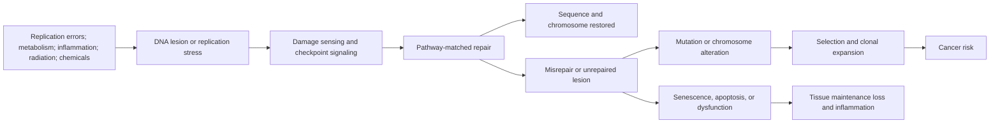

# Genomic instability and DNA repair

Genomic instability is a rising tendency for a cell's genetic information to acquire or retain alterations. The initiating event, **DNA damage**, is a chemical or physical lesion such as an oxidized base, ultraviolet photoproduct, crosslink, or strand break. A **mutation** is a sequence change left after inaccurate repair or replication; chromosomal rearrangements and gains or losses are larger-scale changes. These terms are not interchangeable: a lesion can be repaired without mutation, trigger cell death or [[cellular-senescence]], obstruct transcription without changing sequence, or be fixed as a mutation when DNA is copied.[^schumacher-2021]

## Why genomes are continually damaged

DNA is chemically reactive and must also be opened, copied, and transcribed. Endogenous sources include hydrolysis, reactive metabolic products, and replication errors; exogenous sources include ultraviolet and ionizing radiation, tobacco smoke, and some therapies. Nuclear and mitochondrial genomes face different environments and maintenance systems. Damage burden is therefore a balance among lesion formation, repair fidelity, replication, cell turnover, and selection—not a single count that rises uniformly in every tissue.[^schumacher-2021]

Cells match repair to lesion type. Base-excision repair replaces many small base lesions; nucleotide-excision repair removes bulky helix-distorting lesions; mismatch repair corrects replication mismatches; homologous recombination and non-homologous end joining address double-strand breaks with different template and fidelity constraints; crosslink repair coordinates several pathways. Checkpoints mediated by proteins including ATM, ATR, and p53 pause the cell cycle or direct senescence or apoptosis when repair is incomplete. These defenses prevent propagation of damaged genomes, but persistent arrest or cell loss can impair tissue maintenance—the same response can suppress cancer locally while contributing to aging phenotypes at tissue scale.[^schumacher-2021]

Repair capacity is itself a regulated quantity, not a fixed property of the genome a cell carries. The DREAM complex represses cell-cycle and DNA-repair genes in somatic cells; reducing its activity raises repair gene expression and improves survival after ultraviolet, ionizing, and chemical damage in *C. elegans* and raises repair capacity in human cells. Repair genes are commonly downregulated with age, and DREAM-mediated repression is a candidate cause — though the alternative, that repair genes drift toward silence along with everything else as regulatory maintenance decays, is not excluded, and the two are not currently distinguishable. Since noise landing on maintenance machinery degrades the system that corrects noise, either account implies a self-reinforcing loop. [[dream-complex-and-repair-capacity]] [[stochastic-aging-and-molecular-noise]] (@TheSheekeyScienceShow (The Sheekey Science Show) — "How Randomness Drives Aging - DNA Repair, Clocks & Rejuvenation (David Meyer)", 2025-07-04, [link](https://www.youtube.com/watch?v=Buj07nWt7o0))

## Damage is quasi-random, not uniformly distributed

Damage arrives from stochastic events, but where it lands is strongly structured by genome architecture — which is why the distribution of age-related change across the genome can look patterned without any program directing it. Transcribed and non-transcribed regions are served by different repair pathways and therefore accumulate lesions at different rates; heterochromatic and euchromatic regions differ in vulnerability to particular damage classes; and long genes present larger targets, so they are more likely to be hit and are preferentially downregulated with age for a geometric rather than a regulatory reason. Randomness at the level of the individual event is thus compatible with reproducible, non-uniform patterns at the level of the genome. (@TheSheekeyScienceShow (The Sheekey Science Show) — "How Randomness Drives Aging - DNA Repair, Clocks & Rejuvenation (David Meyer)", 2025-07-04, [link](https://www.youtube.com/watch?v=Buj07nWt7o0)) The interpretive consequences of this for aging data are developed in [[programmed-versus-stochastic-aging]].

## Somatic mutation is not inherited variation

Germline variants are inherited and usually shared across a person's cells. Somatic mutations arise after conception, producing genetic mosaics whose clones differ by tissue and time. Whole-genome sequencing of 208 individual intestinal crypts from 56 individuals across 16 mammalian species found largely linear accumulation of somatic substitutions with age and a strong inverse association between mutation rate per year and species lifespan. This comparative observational study is consistent with evolutionary constraint on somatic mutation, but one tissue across species cannot show that mutation rate determines an individual human's lifespan.[^cagan-2022] A second comparative observation points at the same axis from the opposite side: longer-lived species generally show more active DNA repair and cope better with damage, with repair pathways recurring among the genes implicated in the evolution of long lifespan more often than any other category, though such cross-species studies remain rare. The rate at which mutations accumulate and the expressed capacity to prevent them are different measurements converging on the same relationship — which strengthens the case that repair capacity constrains species lifespan without showing that raising it within a species would extend an individual's. (@TheSheekeyScienceShow (The Sheekey Science Show) — "How Randomness Drives Aging - DNA Repair, Clocks & Rejuvenation (David Meyer)", 2025-07-04, [link](https://www.youtube.com/watch?v=Buj07nWt7o0))

Selection matters as much as mutation count. A mutation that gives one stem cell a growth advantage can expand into a measurable clone. In pooled human cohorts, age-related clonal hematopoiesis was associated with hematologic cancer (hazard ratio 11.1), all-cause mortality (1.4), incident coronary heart disease (2.0), and ischemic stroke (2.6). These are relative hazards from observational data, not absolute predictions for an individual and not proof that every clone causes each outcome; clone size, gene, blood counts, competing risks, and clinical context matter.[^jaiswal-2014] This connects genome change to [[immune-aging-and-rejuvenation]], [[inflammaging-and-il-6]], and atherosclerotic disease.

## What supports a causal role in aging

Human nucleotide-excision-repair disorders and related genome-maintenance syndromes demonstrate that severe defects can produce cancer susceptibility, neurodegeneration, growth failure, or segmental premature-aging features. Different mutations produce different spectra, however, so these rare syndromes are not compressed versions of ordinary aging.[^niedernhofer-2011] In repair-deficient *Ercc1* mice, organs respond differently to similar repair stress: liver showed marked accelerated pathology while intestine compensated through proliferation despite stem-cell loss. This animal study supports causal tissue dysfunction from deficient repair and shows why a whole organism cannot be described by one universal “DNA age.”[^youmans-2022]

Together these findings satisfy more than association: experimentally weakening repair accelerates selected aging-like phenotypes in animals, and severe inherited human defects establish biological necessity. They do not establish what fraction of normal human aging is driven by accumulated sequence mutations versus transcription-blocking lesions, checkpoint activation, epigenetic disruption, or clonal selection. The hallmark framework is a scientific synthesis, not a clinical diagnosis.[^lopez-otin-2023]

## Measurement and interpretation

Assays answer different questions. Comet assays and phosphorylated H2AX can indicate strand-break responses but are not mutation counts. Bulk sequencing averages cells and misses small clones; single-cell or clonal sequencing resolves mosaicism but can introduce amplification artifacts and samples only a tiny fraction of a tissue. Blood sequencing is especially not a whole-body genome-integrity test. A lower damage biomarker after an intervention does not by itself demonstrate fewer fixed mutations, restored organ function, or longer life.

Commercial “DNA repair” scores and supplements also face a mediation problem. Antioxidant activity in a test tube, altered expression of a repair gene, or fewer induced lesions in cultured cells does not establish safer repair in living humans. More checkpoint activity is not automatically better: excessive arrest can deplete regenerative capacity, while permissive checkpoints can allow cancerous clones.

## Practical implications

- **Reduce established mutagenic exposures—strong clinical prevention evidence, not an anti-aging repair therapy.** Avoid tobacco, use [[photoprotection]], follow occupational radiation and chemical controls, and use indicated cancer vaccination and screening. These actions reduce defined cancer risks even though no trial shows that they slow organism-wide genomic aging.
- **Do not use unvalidated “DNA repair” supplements or consumer damage panels to guide treatment—no established clinical benefit.** No intervention has been shown to globally improve repair fidelity and extend human lifespan, and pathway activation in cells is not a health outcome.
- **Treat an incidental blood mutation as a clinical finding, not a longevity score—context-dependent evidence.** Interpretation belongs with a clinician familiar with blood counts, clone characteristics, exposure history, and hematologic referral thresholds; observational hazard ratios are not personal destiny.

## Gaps & open questions

- Which lesion classes and somatic mutations are rate-limiting for functional aging in each human tissue?
- How much harm comes from altered sequence versus blocked transcription, checkpoint signaling, cell loss, or clone-driven inflammation?
- Can longitudinal, low-artifact measurements distinguish causal mutation burden from a record of exposure and cell division?
- Can repair be improved in the relevant cell type without increasing mutagenic survival, stem-cell competition, or cancer?
- Is the age-related fall in repair gene expression caused by DREAM-mediated repression, by general regulatory drift, or by both, and can the two be distinguished experimentally?
- Does the cross-species repair–lifespan association identify a manipulable lever within a species, or only an evolutionary constraint between them?
- How much of the apparent pattern in age-related genomic change reduces to gene length, chromatin state, and transcription status rather than to biological selectivity?

## References

[^schumacher-2021]: Schumacher B, Pothof J, Vijg J, Hoeijmakers JHJ. “The central role of DNA damage in the ageing process.” *Nature* (2021). [scientific review]. [PubMed](https://pubmed.ncbi.nlm.nih.gov/33911272/) · [DOI](https://doi.org/10.1038/s41586-021-03307-7)
[^cagan-2022]: Cagan A, Baez-Ortega A, Brzozowska N, et al. “Somatic mutation rates scale with lifespan across mammals.” *Nature* (2022). [comparative observational study]. [PubMed](https://pubmed.ncbi.nlm.nih.gov/35418684/) · [DOI](https://doi.org/10.1038/s41586-022-04618-z)
[^jaiswal-2014]: Jaiswal S, Fontanillas P, Flannick J, et al. “Age-related clonal hematopoiesis associated with adverse outcomes.” *New England Journal of Medicine* (2014). [observational cohort study]. [PubMed](https://pubmed.ncbi.nlm.nih.gov/25426837/) · [DOI](https://doi.org/10.1056/NEJMoa1408617)
[^niedernhofer-2011]: Diderich K, Alanazi M, Hoeijmakers JHJ. “Premature aging and cancer in nucleotide excision repair-disorders.” *DNA Repair* (2011). [scientific review of human genetic disorders and animal models]. [PubMed](https://pubmed.ncbi.nlm.nih.gov/21680258/) · [DOI](https://doi.org/10.1016/j.dnarep.2011.04.025)
[^youmans-2022]: Vougioukalaki M, Demmers J, Vermeij WP, et al. “Different responses to DNA damage determine ageing differences between organs.” *Aging Cell* (2022). [animal study]. [PubMed](https://pubmed.ncbi.nlm.nih.gov/35246937/) · [DOI](https://doi.org/10.1111/acel.13562)
[^lopez-otin-2023]: López-Otín C, Blasco MA, Partridge L, Serrano M, Kroemer G. “Hallmarks of aging: An expanding universe.” *Cell* (2023). [scientific consensus framework]. [PubMed](https://pubmed.ncbi.nlm.nih.gov/36599349/) · [DOI](https://doi.org/10.1016/j.cell.2022.11.001)

## Related

[[aging-model]] · [[cellular-senescence]] · [[immune-aging-and-rejuvenation]] · [[inflammaging-and-il-6]] · [[mitochondrial-dysfunction]] · [[biological-age-biomarkers]] · [[dream-complex-and-repair-capacity]] · [[stochastic-aging-and-molecular-noise]] · [[programmed-versus-stochastic-aging]] · [[photoprotection]]
