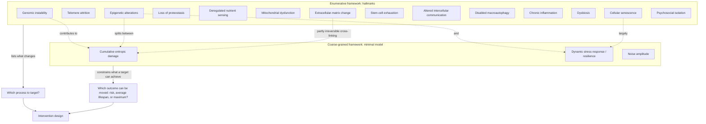

# Hallmarks of aging and competing frameworks

A framework of aging is a claim about how to organize the enormous number of things that differ between young and old organisms. The dominant framework, the hallmarks of aging, enumerates processes that satisfy three criteria: the process appears with normal aging, experimentally accelerating it accelerates aging phenotypes, and attenuating it slows them. The original 2013 list named nine; the 2023 revision expanded it to twelve; a further update expands it to fourteen by adding extracellular-matrix changes and psychosocial isolation. Its value is pedagogical and organizational — it gives a newcomer a map of which processes are being studied and why — and it remains the most useful entry point to the field for that purpose. (@TheSheekeyScienceShow (The Sheekey Science Show) — "This years biggest breakthroughs in longevity! (2025)", 2025-12-21, [link](https://www.youtube.com/watch?v=X-Hzyzo1Jpk))

Its structural weakness is equally important: an enumerated list has no internal causal architecture. It states that a process is involved without specifying which processes are upstream, which are downstream, which are parallel consequences of a common cause, and which are rate-limiting in a human. Eleanor Sheekey's characterization is that understanding of aging still resembles a shopping list, and that the fourteen-item version drew online criticism on expansion grounds while remaining useful for awareness. The addition of psychosocial isolation makes the ambiguity explicit: social support is a real determinant of health and behavior, but placing a social condition alongside genomic instability in a single list mixes levels of explanation without saying how they connect. (@TheSheekeyScienceShow (The Sheekey Science Show) — "This years biggest breakthroughs in longevity! (2025)", 2025-12-21, [link](https://www.youtube.com/watch?v=X-Hzyzo1Jpk))

## Enumerative versus coarse-grained frameworks

An alternative strategy is to give up on cataloguing mechanisms and ask instead how few variables are needed to reproduce the observed dynamics of aging. This is the reasoning behind the minimal model developed by Peter Fedichev and Jan Gruber, which proposes that three macroscopic variables — cumulative entropic damage, a dynamic stress response, and noise — govern aging trajectories, with the underlying molecular detail collapsing onto them. The physical justification offered is **universality**: in systems approaching a critical point, microscopic details stop determining behavior, which is why boiling water is described by a few macroscopic laws regardless of the particular molecules. Applied to aging, this predicts that the species-specific mechanistic detail — extrachromosomal rDNA circles in yeast, loss of proteostasis in worms, a mixed picture in humans — need not be tracked individually so long as it collapses onto the emergent variables. (@TheSheekeyScienceShow (The Sheekey Science Show) — "the 3 levels of aging therapeutics", 2026-02-08, [link](https://www.youtube.com/watch?v=c-_Pdp5IIvw))

The two frameworks answer different questions and are not straightforwardly rivals. The hallmarks answer what changes and what could be targeted; the minimal model answers what class of outcome moving a given target could produce. A framework that says senolytics, caloric restriction, NAD precursors, and cellular reprogramming all act on the same underlying variable makes a prediction the hallmarks cannot: that these apparently distinct interventions should share a ceiling. That prediction is the substantive content of [[healthspan-versus-maximum-lifespan]], and it is currently unvalidated — the coarse-graining rests on curve-fitting to biomarker dynamics, not on demonstrated equivalence of intervention classes. Sheekey's own summary is that the model mostly supplies vocabulary for things the field already suspected rather than new empirical facts. (@TheSheekeyScienceShow (The Sheekey Science Show) — "the 3 levels of aging therapeutics", 2026-02-08, [link](https://www.youtube.com/watch?v=c-_Pdp5IIvw))

The proliferation of frameworks is itself a datum. Roughly three hundred theories of aging exist, which both motivates simplification and warns against accepting any one scheme too readily; the field has repeatedly produced frameworks that organized attention without resolving causation. A useful discipline is to ask of any framework what it forbids. The hallmarks forbid very little, which is why they rarely turn out to be wrong and also why they rarely settle an argument. The minimal model forbids more — it predicts a ceiling on what a whole class of interventions can achieve — and is correspondingly more falsifiable and more likely to be wrong. (@TheSheekeyScienceShow (The Sheekey Science Show) — "the 3 levels of aging therapeutics", 2026-02-08, [link](https://www.youtube.com/watch?v=c-_Pdp5IIvw))

## Reading a hallmark as a causal claim

Membership in the hallmark list is not evidence of causal primacy, and the individual chapters in this section deliberately keep the two separate. [[genomic-instability-and-dna-repair]], [[telomere-biology]], [[epigenetic-alterations-and-reprogramming]], [[loss-of-proteostasis]], [[mitochondrial-dysfunction]], [[cellular-senescence]], [[stem-cell-exhaustion]], and [[autophagy-and-lysosomal-quality-control]] each document the same recurring gap: robust demonstrations that manipulating the process changes phenotypes in engineered animal models, alongside weak or absent evidence that the process is rate-limiting in ordinary human aging. [[extracellular-matrix-aging]] is the newest entry and illustrates why the list keeps growing — the matrix was long treated as inert scaffolding and turns out to carry both an irreversible damage component and an active immune-signaling role.

The practical consequence is that a hallmark is best used as a search heading, not as a justification. Saying that an intervention targets a hallmark of aging is a statement about which literature it belongs to, and carries no information about effect size, human relevance, or the outcome class it could move. [[longevity-intervention-prioritization]] handles the ranking problem the frameworks leave open.

## Practical implications

- **Use the hallmarks to navigate the literature, not to select interventions — strong as an educational framework, absent as a decision rule.** A hallmark label tells you what a study is about; it does not tell you the process is causal in humans or that changing it helps. (@TheSheekeyScienceShow (The Sheekey Science Show) — "This years biggest breakthroughs in longevity! (2025)", 2025-12-21, [link](https://www.youtube.com/watch?v=X-Hzyzo1Jpk))
- **When you meet an aging framework, ask what it forbids — strong as a reasoning discipline.** A framework compatible with every result cannot adjudicate between interventions; one that predicts a ceiling or an ordering can be tested and can be wrong.
- **Ask which outcome class an intervention could move before asking whether it works — moderate, following from the minimal model's structure.** Disease risk, average lifespan, and maximum lifespan are different targets with different evidentiary requirements; see [[healthspan-versus-maximum-lifespan]]. (@TheSheekeyScienceShow (The Sheekey Science Show) — "the 3 levels of aging therapeutics", 2026-02-08, [link](https://www.youtube.com/watch?v=c-_Pdp5IIvw))
- **No personal action follows from framework choice.** Neither list nor model changes what an individual should do this week; that remains the content of [[practice-playbook]].

## Gaps & open questions

- Which hallmarks are causal rate-limiters in humans, which are downstream consequences, and which are parallel readouts of a shared upstream process?
- Does the proposed collapse of molecular detail onto three macroscopic variables hold, or does it hide biologically distinct processes that respond differently to intervention?
- What experiment would falsify the hallmark framework as a whole rather than any single hallmark?
- On what principle should a hallmark list admit a social condition such as psychosocial isolation alongside molecular processes, and how are the levels meant to connect?
- Can the two frameworks be reconciled by assigning each hallmark a share of entropic, dynamic, and stochastic contribution, and is that assignment measurable?

## Related

[[aging-dynamics-and-resilience]] · [[healthspan-versus-maximum-lifespan]] · [[extracellular-matrix-aging]] · [[cellular-senescence]] · [[epigenetic-alterations-and-reprogramming]] · [[genomic-instability-and-dna-repair]] · [[loss-of-proteostasis]] · [[mitochondrial-dysfunction]] · [[stem-cell-exhaustion]] · [[telomere-biology]] · [[longevity-intervention-prioritization]] · [[biological-age-biomarkers]] · [[aging-model]]
