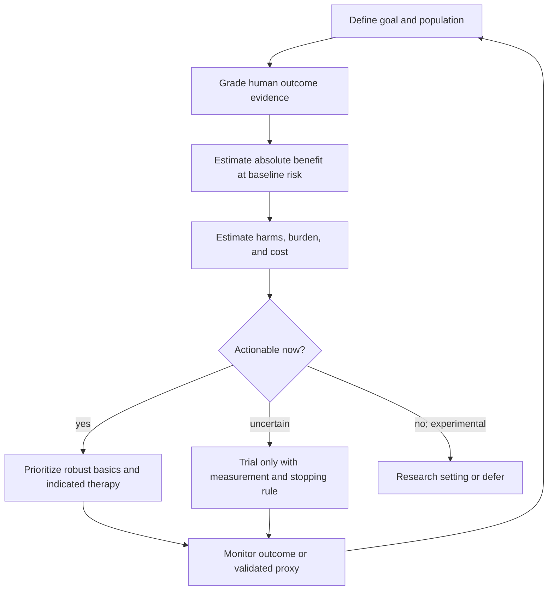

# Longevity intervention prioritization

Longevity intervention prioritization is the allocation of limited time, money, attention, and risk tolerance among actions that may extend life or healthspan. A sound ranking is not a popularity contest and cannot collapse all evidence into one score: it separates demonstrated human outcomes, validated intermediate outcomes, mechanistic plausibility, animal lifespan evidence, safety, applicability, and opportunity cost. (@matt.kaeberlein (Healthspan Medicine) — "Dr. Kaeberlein Reacts to Round 1 of Longevity March Madness (Live Results Reveal)", 2026-03-25, [link](https://www.youtube.com/watch?v=ER_gwIehySQ))

## Evidence classes cannot be substituted for one another

Human disease-outcome evidence is most directly decision-relevant. Risk-factor change can be useful when the factor is causally validated, while observational associations remain vulnerable to confounding and reverse causation. Animal lifespan extension establishes biological activity, not human benefit. Mechanistic promise defines what to test; it does not establish net clinical value. A March Madness audience bracket placed lifestyle, medicines, geroscience candidates, and experimental biohacks head-to-head, but its vote totals measure community preference rather than efficacy. (@matt.kaeberlein (Healthspan Medicine) — "Dr. Kaeberlein Reacts to Round 1 of Longevity March Madness (Live Results Reveal)", 2026-03-25, [link](https://www.youtube.com/watch?v=ER_gwIehySQ))

The bracket's seeding framework made the hierarchy explicit: general-population human all-cause mortality was weighted highest; combined disease-specific human mortality and mammalian lifespan or aging-biology evidence followed; mammalian lifespan or aging-biology evidence alone came next; disease-specific human mortality without evidence for broader aging was ranked lower; human healthspan or major-risk-factor trials received additional consideration; and non-mammalian lifespan, mechanism, and anecdote received the least weight. This is a transparent expert prioritization framework, not a validated scoring instrument: it still leaves applicability, absolute effect, safety, certainty, and time horizon to judgment. (@matt.kaeberlein (Healthspan Medicine) — "Introducing the 2026 Optispan Longevity Tournament: What to Know and How to Play", 2026-03-16, [link](https://www.youtube.com/watch?v=nkKNh-UbaUo))

The tournament mechanics further weaken any inference from its eventual winners: the committee selected the field, one organizer seeded it, users predicted head-to-head winners, live polls determined advancement, and repeat voting was explicitly permitted. The format was designed to generate participation and debate, so it can reveal audience salience but cannot estimate comparative effectiveness, certainty, or optimal portfolios. (@matt.kaeberlein (Healthspan Medicine) — "The Ultimate Longevity Tournament Is Here: Longevity Madness Bracket", 2026-03-12, [link](https://www.youtube.com/watch?v=gLq4fl7p8mI))

The bracket exposes a recurring error: expected future potential can outrank current evidence. Kaeberlein characterized epigenetic reprogramming as having a higher ceiling than spermidine despite more current evidence for spermidine, and described GLP-1 agonist enthusiasm in generally healthy people as driven more by expectations than direct longevity data. Conversely, he emphasized mixed small-trial and reproducibility evidence for NAD precursors, human-data limitations for PCSK9 inhibition in healthy populations, and essentially nematode-only longevity evidence for the dual PI3K/mTOR inhibitor GSK2126458. These are evidence-status judgments, not proof that the interventions fail. (@matt.kaeberlein (Healthspan Medicine) — "Dr. Kaeberlein Reacts to Round 1 of Longevity March Madness (Live Results Reveal)", 2026-03-25, [link](https://www.youtube.com/watch?v=ER_gwIehySQ))

The Interventions Testing Program supplies the most disciplined available test of the animal-lifespan evidence class, and its recent output shows what that class looks like when the discipline is applied. The programme tests compounds for lifespan extension in genetically heterogeneous wild-type mice at three independent sites, precisely so that a result cannot be an artifact of one strain or one facility. A recent round reported possible lifespan benefits for dichloroacetate, epicatechin, forskolin, halofuginone, and mitoglitazone — but the survival increases were small, and the effects appeared in male mice with no real benefit in females. Sex-specific results in a rigorously replicated design are a genuine finding about the compounds rather than noise to be averaged away, and they should lower rather than raise confidence in extrapolating any of these compounds to humans of either sex. That an entire year's output of the field's most reliable screen amounts to several small male-only effects is itself calibrating information about the base rate of success. (@TheSheekeyScienceShow (The Sheekey Science Show) — "This years biggest breakthroughs in longevity! (2025)", 2025-12-21, [link](https://www.youtube.com/watch?v=X-Hzyzo1Jpk))

A further prioritization criterion follows from the intervention-level framework in [[healthspan-versus-maximum-lifespan]]: an intervention's *outcome class* can be assessed before its efficacy. If senolytics, caloric restriction, NAD precursors, and reprogramming all act on the same reversible component of aging, they are candidates for reducing disease and restoring function but not for extending maximum lifespan — which means a portfolio built entirely from that class has a ceiling no amount of stacking will breach. This is a theoretical constraint from a contested model, not a validated ranking rule, but it suggests a question worth asking of any longevity purchase: which outcome could this move even in principle? (@TheSheekeyScienceShow (The Sheekey Science Show) — "the 3 levels of aging therapeutics", 2026-02-08, [link](https://www.youtube.com/watch?v=c-_Pdp5IIvw))

## Prefer portfolios over false pairwise choices

Many apparent matchups are not substitutes. Resistance and aerobic training produce overlapping but distinct adaptations; sleep, smoking avoidance, blood-pressure control, vaccination, nutrition quality, social connection, and oral health act on different causal nodes. The correct decision is usually to fund a low-burden portfolio of complementary basics before choosing marginal additions. [[aging-model]] maps those nodes, while [[practice-playbook]] converts them into cadence. (@matt.kaeberlein (Healthspan Medicine) — "Dr. Kaeberlein Reacts to Round 1 of Longevity March Madness (Live Results Reveal)", 2026-03-25, [link](https://www.youtube.com/watch?v=ER_gwIehySQ))

Overengineering can make a portfolio worse when it adds interactions, monitoring noise, adherence burden, or displacement of higher-value actions. Kaeberlein's contrarian criticism of comprehensive branded longevity protocols is that adding more components can degrade rather than optimize the system; that position is plausible but was not tested by the audience bracket. (@matt.kaeberlein (Healthspan Medicine) — "Dr. Kaeberlein Reacts to Round 1 of Longevity March Madness (Live Results Reveal)", 2026-03-25, [link](https://www.youtube.com/watch?v=ER_gwIehySQ))

## Practical implications

- **Yearly and after major health changes, rank actions by absolute human benefit, safety, feasibility, and fit—strong as a decision principle.** Start with smoking avoidance, blood-pressure and metabolic risk management, vaccination, movement, sleep, and nutritious dietary patterns before speculative additions. (@matt.kaeberlein (Healthspan Medicine) — "Dr. Kaeberlein Reacts to Round 1 of Longevity March Madness (Live Results Reveal)", 2026-03-25, [link](https://www.youtube.com/watch?v=ER_gwIehySQ))
- **For every supplement or off-label longevity drug, document the evidence class, intended endpoint, review date, adverse effects, and stopping rule—moderate-to-strong.** Do not translate animal lifespan, mechanism, or community enthusiasm into a human longevity claim. (@matt.kaeberlein (Healthspan Medicine) — "Dr. Kaeberlein Reacts to Round 1 of Longevity March Madness (Live Results Reveal)", 2026-03-25, [link](https://www.youtube.com/watch?v=ER_gwIehySQ))
- **Reassess the portfolio quarterly for burden and duplication—moderate.** Remove low-value complexity when it displaces exercise, sleep, preventive care, or adherence to indicated treatment. The quarterly cadence is a pragmatic wiki recommendation rather than a tested interval; the source supports the concern about overengineering. (@matt.kaeberlein (Healthspan Medicine) — "Dr. Kaeberlein Reacts to Round 1 of Longevity March Madness (Live Results Reveal)", 2026-03-25, [link](https://www.youtube.com/watch?v=ER_gwIehySQ))

## Gaps & open questions

- How should disparate outcomes—mortality, function, disease incidence, quality of life, cost, and burden—be combined without hiding value judgments?
- Which biomarkers are valid enough to shorten feedback cycles for interventions whose clinical outcomes take decades?
- When does a multi-component protocol create synergy, and when does complexity reduce net benefit?
- How well do stated preferences in longevity communities predict sustained behavior or informed risk tolerance?
- How should a hierarchy distinguish an intervention that prevents one major disease with strong human outcome evidence from a putative geroprotector with broad animal effects but no human longevity outcome?
- How should sex-specific animal lifespan results be weighted when extrapolating to humans of the non-benefiting sex?
- Should outcome class — disease risk, average lifespan, maximum lifespan — be a formal seeding criterion alongside evidence strength?

## Related

[[aging-model]] · [[practice-playbook]] · [[supplement-evidence-and-safety]] · [[healthspan-versus-maximum-lifespan]] · [[hallmarks-of-aging]] · [[longevity-clinics-and-evidence]] · [[proactive-health-monitoring]] · [[resistance-training]] · [[cardiorespiratory-fitness]] · [[nad-supplementation]] · [[pcsk9-inhibition]] · [[glp-1-receptor-agonists]] · [[therapeutic-plasma-exchange]]
