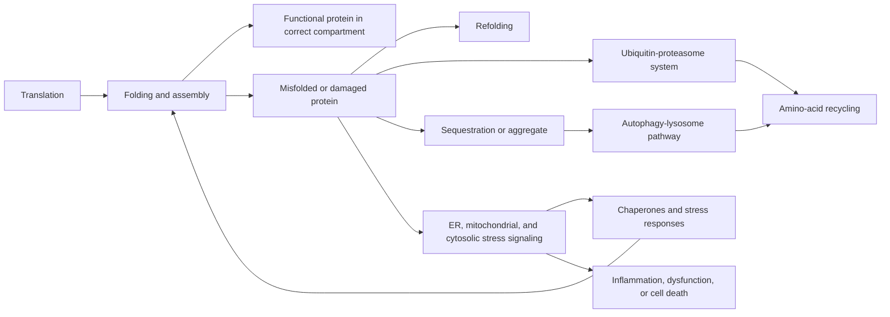

# Loss of proteostasis

Proteostasis—protein homeostasis—is the distributed system that makes proteins in the right amount, helps them fold and assemble, moves them to the right compartment, and repairs or removes them when they are damaged. Loss of proteostasis means that protein production, folding, trafficking, sequestration, and degradation no longer keep the functional proteome within a safe range. It is broader than “protein aggregation”: a soluble misfolded protein can be toxic, an aggregate can be inert or protective, and a normally folded protein at the wrong abundance or location can still disrupt function.[^lopez-otin-2023]

## Folding is a managed process

A protein's amino-acid sequence constrains its three-dimensional structure, but the crowded cell makes folding and assembly hazardous. Molecular chaperones bind exposed hydrophobic regions, prevent inappropriate interactions, assist refolding, and sometimes route persistently abnormal clients to degradation. Cytosolic heat-shock responses and organelle-specific unfolded-protein responses adjust chaperones, translation, and disposal when demand rises. These are adaptive control systems, not evidence that thermal stress or a supplement has “cleared” a person's proteins.[^rai-2022]

Quality control spans compartments. Endoplasmic-reticulum surveillance handles many secreted and membrane proteins; mitochondria have their own proteases and stress responses; extracellular chaperones and clearance systems protect secreted proteins. The ubiquitin-proteasome system usually tags and unfolds individual short-lived or damaged proteins for proteolysis. Larger assemblies, aggregates, and portions of organelles may require [[autophagy-and-lysosomal-quality-control]]. These routes overlap but are not interchangeable.

## From misfolding to dysfunction

Oxidation, glycation, mistranslation, mutation, abnormal cleavage, and disturbed stoichiometry can expose normally buried surfaces. Misfolded molecules may be refolded, degraded, or partitioned into condensates and aggregates. Aggregation is nucleation-dependent: once a compatible seed forms, it can recruit more protein. Yet visible inclusions do not directly measure toxic species; in some models, sequestration lowers the concentration of smaller reactive intermediates. Location, conformation, turnover, and interaction partners determine harm.

Proteostasis networks also compete for finite capacity. A growing load of unstable proteins can occupy chaperones and degradation machinery, destabilizing other marginal proteins and creating feedback. In *C. elegans*, folding sensors lost function early in adulthood as heat-shock and unfolded-protein responses weakened; increasing HSF-1 or DAF-16 activity suppressed reporter misfolding. This is a mechanistic animal experiment showing that stress-response capacity can control proteome stability in worms, not evidence for a human anti-aging treatment.[^ben-zvi-2009]

## Aging evidence and its limits

Loss of proteostasis qualifies as a hallmark because it appears with age, experimental worsening can shorten health or lifespan in model organisms, and genetic enhancement of selected quality-control programs can delay phenotypes in those models.[^lopez-otin-2023] Causality is still protein-, tissue-, and organism-specific. A short-lived worm with engineered folding reporters cannot quantify the contribution of proteostasis to a human's aging trajectory.

Human evidence is strongest for specific proteinopathies, not a single body-wide collapse. Postmortem proteomics of cortical tissue from 8 people with Alzheimer disease and 8 matched controls, plus 10 with mild cognitive impairment and 10 matched controls, found a stage-related increase in diverse detergent-insoluble proteins. The cross-sectional tissue study links altered solubility with disease state but cannot determine whether the proteins initiated disease, accumulated downstream, or were altered by terminal illness and postmortem handling.[^kepchia-2020] Disease-associated amyloid-beta, tau, alpha-synuclein, TDP-43, and other conformers differ in anatomy and biology; “aggregate” is not one therapeutic target.

Proteostasis also connects outward. Failed disposal can activate [[inflammaging-and-il-6]] and [[cellular-senescence]]; damaged mitochondria increase folding and degradation demand; impaired lysosomes obstruct both aggregate and organelle clearance; and glycation can create difficult-to-remove crosslinks ([[advanced-glycation-end-products]]). Conversely, reduced translation can lower folding load but can also impair muscle remodeling, immunity, and repair. This is why maximizing either protein synthesis or degradation is not a coherent whole-body goal.

## Measuring the system

Transcript or protein abundance of a chaperone shows a response, not folding success. Proteasome activity in a lysate does not establish substrate clearance in an intact organ. Detergent insolubility depends on extraction conditions and does not uniquely identify amyloid or toxicity. Like autophagy flux, proteostasis is dynamic: synthesis, refolding, sequestration, and degradation rates must be distinguished from the size of a protein pool at one time.

Functional outcomes sit above these biomarkers. A treatment can reduce an aggregate on imaging without restoring neurons already lost; it can improve a stress marker without improving cognition, strength, disability, or survival. Conversely, clinical benefit need not prove that proteostasis was the mediator. Human intervention claims therefore require randomized clinical outcomes plus separate evidence of target engagement.

## Intervention evidence

No general proteostasis-enhancing drug or supplement has been shown to slow aging or extend life in humans. Disease-specific therapies may alter one protein species, but their benefits, harms, and eligibility cannot be generalized to “clearing damaged proteins.” [[anti-amyloid-immunotherapy]], for example, targets brain amyloid in selected patients and has treatment-specific risks; it is not whole-body rejuvenation.

Exercise, adequate nutrition, and sleep support health and tissue remodeling through many pathways. Their established clinical value does not prove that they work by globally restoring chaperones or proteasomes. Claims for heat exposure, fasting, spermidine, urolithin A, or other products must identify the organism, tissue, assay, and outcome rather than treating a stress-response biomarker as clinical efficacy.

## Practical implications

- **Use disease-specific evaluation for neurologic symptoms—strong clinical principle.** Progressive memory, movement, behavior, or motor changes require diagnosis; a generic “protein detox” frame can delay appropriate care. See [[alzheimers-spectrum-and-diagnosis]] and [[lewy-body-disease-and-synucleinopathies]].
- **Support protein turnover through established health behaviors—strong outcome evidence, uncertain proteostasis mediation.** Regular exercise and adequate protein and energy intake preserve function, while tobacco avoidance and cardiometabolic care reduce disease risk; none is a validated way to measure or maximize whole-body protein clearance.
- **Do not buy supplements from cell or animal aggregation claims alone—no established human anti-aging benefit.** Demand a defined molecule, tissue target, human randomized comparison, clinical endpoint, and safety data.

## Gaps & open questions

- Which soluble species, condensates, deposits, or loss-of-function events drive toxicity in each human proteinopathy?
- How does proteostasis capacity change longitudinally in healthy human brain, muscle, liver, and immune cells?
- Can tissue-specific folding and degradation flux be measured safely rather than inferred from static abundance?
- Can one quality-control arm be strengthened without degrading needed proteins, feeding tumor survival, or suppressing adaptive stress signaling?

## References

[^lopez-otin-2023]: López-Otín C, Blasco MA, Partridge L, Serrano M, Kroemer G. “Hallmarks of aging: An expanding universe.” *Cell* (2023). [scientific consensus framework]. [PubMed](https://pubmed.ncbi.nlm.nih.gov/36599349/) · [DOI](https://doi.org/10.1016/j.cell.2022.11.001)
[^rai-2022]: Rai M, Curley M, Coleman Z, Demontis F. “Contribution of proteases to the hallmarks of aging and to age-related neurodegeneration.” *Aging Cell* (2022). [scientific review]. [PubMed](https://pubmed.ncbi.nlm.nih.gov/35349763/) · [DOI](https://doi.org/10.1111/acel.13603)
[^ben-zvi-2009]: Ben-Zvi A, Miller EA, Morimoto RI. “Collapse of proteostasis represents an early molecular event in *Caenorhabditis elegans* aging.” *Proceedings of the National Academy of Sciences of the United States of America* (2009). [animal mechanistic study]. [PubMed](https://pubmed.ncbi.nlm.nih.gov/19706382/) · [DOI](https://doi.org/10.1073/pnas.0902882106)
[^kepchia-2020]: Kepchia D, Huang L, Dargusch R, et al. “Diverse proteins aggregate in mild cognitive impairment and Alzheimer's disease brain.” *Alzheimer's Research & Therapy* (2020). [cross-sectional human postmortem study]. [PubMed](https://pubmed.ncbi.nlm.nih.gov/32560738/) · [DOI](https://doi.org/10.1186/s13195-020-00641-2)

## Related

[[aging-model]] · [[autophagy-and-lysosomal-quality-control]] · [[cellular-senescence]] · [[mitochondrial-dysfunction]] · [[advanced-glycation-end-products]] · [[alzheimers-spectrum-and-diagnosis]] · [[lewy-body-disease-and-synucleinopathies]] · [[skeletal-muscle-hypertrophy]]
