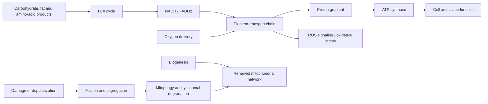

# Mitochondrial dysfunction

Mitochondria are dynamic organelles that convert energy from fuels into an electrochemical proton gradient and then ATP. They also regulate calcium, synthesize metabolites, produce and respond to reactive oxygen species (ROS), and participate in innate immunity and cell death. “Mitochondrial dysfunction” is therefore not one lesion. It can mean too few mitochondria, low respiratory capacity, inefficient coupling, damaged mitochondrial DNA, altered morphology, impaired substrate use, excessive or misplaced ROS, or failure to remove defective organelles. A valid claim must say which function, in which tissue, under what demand, and how it was measured.[^picard-2016]

## Energetics from first principles

Glycolysis supplies pyruvate; fatty acids and amino acids can also feed acetyl-CoA or other intermediates into the tricarboxylic-acid cycle. NADH and FADH2 donate electrons to the respiratory chain in the inner mitochondrial membrane. Electron transfer pumps protons into the intermembrane space, and ATP synthase uses their return to phosphorylate ADP. Oxygen is the terminal electron acceptor. Capacity is the maximum the system can deliver; flux is what it actually delivers at a given workload. A cell may have lower maximal capacity yet meet resting demand, or high capacity that is unused because oxygen delivery, neural activation, or movement is limiting.[^kent-2016]

Small, localized ROS pulses are signals that help drive exercise adaptation and antioxidant defenses. ROS become damaging when production, location, or duration overwhelms detoxification and repair. This is why the simple “mitochondria leak radicals, radicals damage mitochondria, aging follows” story is inadequate. Oxidized biomarkers do not identify the source, prove a self-amplifying cycle, or show that suppressing ROS improves human outcomes.[^sanz-2016]

## A network maintained by turnover

Mitochondria continually fuse and divide. Fusion can mix contents and support a connected energy network; fission can distribute organelles and segregate damaged regions, but neither morphology is universally good or bad. New mitochondrial components are coordinated by nuclear programs including PGC-1α and imported into the organelle. Damaged parts may be handled by proteases, the mitochondrial unfolded-protein response, mitochondrial-derived vesicles, or whole-organelle mitophagy. PINK1–Parkin is one experimentally prominent mitophagy route, not the only route in human tissues.[^romanello-2016]

Mitophagy ends in lysosomal degradation, so it links directly to [[autophagy-and-lysosomal-quality-control]]. More PINK1, Parkin, LC3, or mitochondrial fragments at one time point does not establish greater clearance. Dynamic flux, organelle function, and ultimately tissue or clinical outcomes are separate evidence levels.

## What changes with human aging?

Human skeletal-muscle studies often report less mitochondrial content, respiratory capacity, or coupling with older age, but results depend on normalization, muscle sampled, activity, adiposity, disease, and whether capacity is measured in vivo or in isolated fibers. A biopsy study of 24 younger and 31 older adults found lower ATP-linked and maximal respiration in older muscle.[^porter-2015] Yet another study of 23 young and 52 healthy older adults found lower peak oxygen consumption without an age difference in muscle mitochondrial capacity after accounting for sex and activity, pointing to oxygen delivery and other system-level limits.[^distefano-2021] These cross-sectional designs demonstrate group differences or their absence; they do not prove that mitochondrial change caused aging.

A broader human comparison found that age was associated with lower mitochondrial capacity, exercise efficiency, insulin sensitivity, gait stability, and muscle function even among people with similar habitual activity, while exercise-trained older adults largely attenuated these differences.[^hinderling-2021] This supports both an age association and substantial plasticity, but selection into lifelong exercise can confound causal interpretation.

Mitochondrial DNA mutations and deletions accumulate in some tissues, and clonal expansion can leave individual cells or fiber segments respiratory-deficient. Rare inherited mitochondrial diseases prove that severe defects can cause human disease. They do not quantify how much ordinary multimorbid aging is driven by typical acquired mitochondrial changes, nor show that raising a generic “mitochondrial” biomarker reverses aging.[^picard-2016]

## Intervention evidence

Exercise is the best-supported practical intervention, because it improves aerobic capacity, metabolic health, and function regardless of how much benefit is mediated by mitochondria. In a randomized training study of younger and older adults, high-intensity interval training produced large gains in mitochondrial respiratory capacity and mitochondrial protein synthesis, while resistance training most strongly increased strength and muscle mass; the molecular findings are mechanistic outcomes nested within a clinical exercise experiment.[^robinson-2017] Programming should therefore follow desired functions rather than pursuit of a single mitochondrial marker; see [[cardiorespiratory-fitness]], [[resistance-training]], and [[time-efficient-concurrent-training]].

Candidate “mitochondrial” supplements remain endpoint-limited. In a double-blind RCT of 66 adults aged 65–90, 1,000 mg/day urolithin A for four months did not significantly improve the co-primary outcomes of six-minute walk distance or maximal hand-muscle ATP production versus placebo. Some secondary muscle-endurance and plasma biomarker outcomes improved; the trial was small, all participants were White, and investigators included employees of the manufacturer.[^liu-2022-mito] This does not establish prevention of disability or longer life. Antioxidant logic is also not automatically beneficial: indiscriminate suppression can interfere with redox signaling, and supplement effects are compound-, dose-, population-, and endpoint-specific.

## Practical implications

- **Train both aerobic capacity and strength — strong human outcome evidence, with supportive mechanistic mitochondrial evidence.** Regular aerobic work plus some higher-intensity exposure increases oxidative demand; resistance work preserves force and lean tissue. Scale these to health and recovery rather than chasing soreness or exhaustion.
- **Treat oxygen delivery and metabolic disease, not just the organelle.** Smoking, anemia, vascular disease, inactivity, diabetes, sleep disruption, and medications can constrain energy production or function at different points. Fatigue is nonspecific and should not be self-diagnosed as mitochondrial dysfunction.
- **Treat supplements as hypotheses.** Demand randomized functional outcomes beyond metabolite or gene-expression shifts, and assess interactions, cost, and manufacturer involvement through [[supplement-evidence-and-safety]].

## Gaps & open questions

- Which longitudinal mitochondrial changes independently predict disability after accounting for activity, disease, and body composition?
- Which quality-control defect—biogenesis, proteostasis, dynamics, mitophagy, or lysosomal completion—is rate-limiting in each human tissue?
- Can noninvasive measures distinguish mitochondrial capacity, real-world flux, and oxygen-delivery constraints?
- Does correcting a measured mitochondrial defect prevent clinical disease, or merely normalize a biomarker?

## References

[^picard-2016]: Picard M, Wallace DC, Burelle Y. “The rise of mitochondria in medicine.” *Mitochondrion* (2016). [mechanistic and clinical review]. [PubMed](https://pubmed.ncbi.nlm.nih.gov/27423788/) · [DOI](https://doi.org/10.1016/j.mito.2016.07.003)
[^kent-2016]: Kent JA, Fitzgerald LF. “In vivo mitochondrial function in aging skeletal muscle: capacity, flux, and patterns of use.” *Journal of Applied Physiology* (2016). [human mechanistic review]. [PubMed](https://pubmed.ncbi.nlm.nih.gov/27539499/) · [DOI](https://doi.org/10.1152/japplphysiol.00583.2016)
[^sanz-2016]: Sanz A. “Mitochondrial reactive oxygen species: Do they extend or shorten animal lifespan?” *Biochimica et Biophysica Acta - Bioenergetics* (2016). [mechanistic review of animal evidence]. [PubMed](https://pubmed.ncbi.nlm.nih.gov/26997500/) · [DOI](https://doi.org/10.1016/j.bbabio.2016.03.018)
[^romanello-2016]: Romanello V, Sandri M. “Mitochondrial Quality Control and Muscle Mass Maintenance.” *Frontiers in Physiology* (2016). [mechanistic review]. [PubMed](https://pubmed.ncbi.nlm.nih.gov/26793123/) · [DOI](https://doi.org/10.3389/fphys.2015.00422)
[^porter-2015]: Porter C, Hurren NM, Cotter MV, et al. “Mitochondrial respiratory capacity and coupling control decline with age in human skeletal muscle.” *American Journal of Physiology-Endocrinology and Metabolism* (2015). [cross-sectional mechanistic human study]. [PubMed](https://pubmed.ncbi.nlm.nih.gov/26037248/) · [DOI](https://doi.org/10.1152/ajpendo.00125.2015)
[^distefano-2021]: Distefano G, Standley RA, Dubé JJ, et al. “Preserved skeletal muscle oxidative capacity in older adults despite decreased cardiorespiratory fitness with ageing.” *The Journal of Physiology* (2021). [cross-sectional mechanistic human study]. [PubMed](https://pubmed.ncbi.nlm.nih.gov/34032280/) · [DOI](https://doi.org/10.1113/JP281289)
[^hinderling-2021]: Hinderling VB, Jörgensen JA, Moonen-Kornips E, et al. “Impact of aging and exercise on skeletal muscle mitochondrial capacity, energy metabolism, and physical function.” *Nature Communications* (2021). [cross-sectional mechanistic human study]. [PubMed](https://pubmed.ncbi.nlm.nih.gov/34362885/) · [DOI](https://doi.org/10.1038/s41467-021-24956-2)
[^robinson-2017]: Robinson MM, Dasari S, Konopka AR, et al. “Enhanced Protein Translation Underlies Improved Metabolic and Physical Adaptations to Different Exercise Training Modes in Young and Old Humans.” *Cell Metabolism* (2017). [randomized exercise trial with mechanistic human outcomes]. [PubMed](https://pubmed.ncbi.nlm.nih.gov/28273480/) · [DOI](https://doi.org/10.1016/j.cmet.2017.02.009)
[^liu-2022-mito]: Liu S, D'Amico D, Shankland E, et al. “Effect of Urolithin A Supplementation on Muscle Endurance and Mitochondrial Health in Older Adults: A Randomized Clinical Trial.” *JAMA Network Open* (2022). [RCT]. [PubMed](https://pubmed.ncbi.nlm.nih.gov/35050355/) · [DOI](https://doi.org/10.1001/jamanetworkopen.2021.44279)

## Related

[[aging-model]] · [[autophagy-and-lysosomal-quality-control]] · [[cardiorespiratory-fitness]] · [[resistance-training]] · [[time-efficient-concurrent-training]] · [[skeletal-muscle-hypertrophy]] · [[supplement-evidence-and-safety]]
