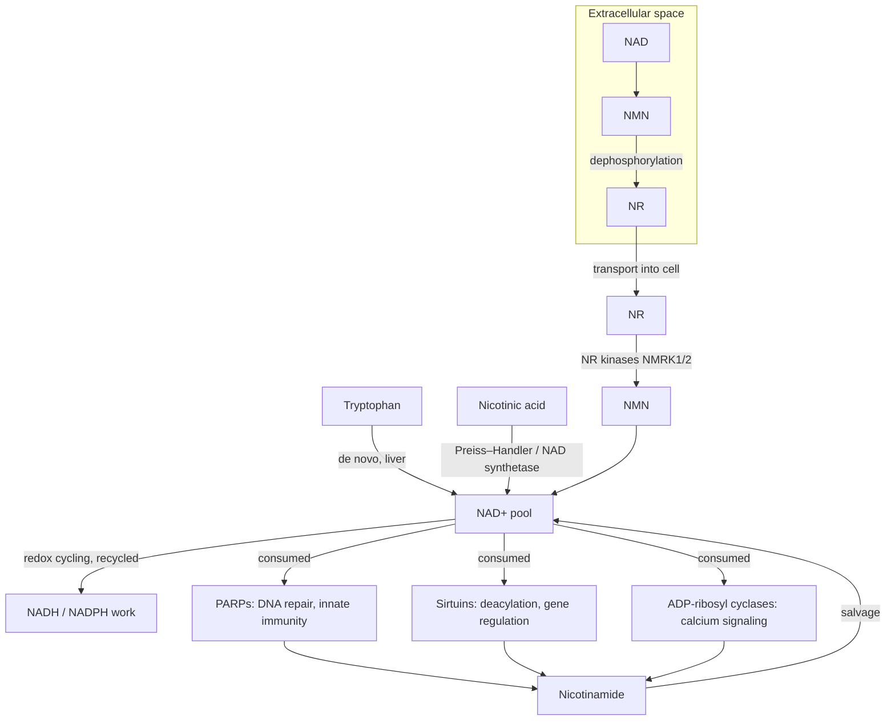
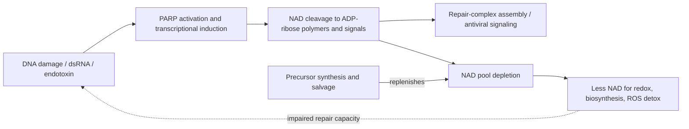

# NAD metabolism

Nicotinamide adenine dinucleotide (NAD) is the central electron-carrying coenzyme of metabolism. The oxidized form NAD+ accepts high-energy electrons stripped from dietary protein, fat, and carbohydrate, becoming NADH; NADH donates those electrons down carriers such as the electron transport chain, where each step to a lower-energy carrier releases usable work — pumping protons across the mitochondrial membrane whose return drives ATP synthesis. A phosphorylated pair, NADP+/NADPH, carries electrons for anabolism: building carbon–carbon bonds, converting ribonucleotides to deoxyribonucleotides for DNA synthesis, making lipids for membranes, and detoxifying reactive oxygen species. The coenzymes' jobs fall into three buckets — converting fuel into ATP, biosynthesis, and repair — which is why NAD availability touches essentially every cellular process. (FoundMyFitness — "How To Boost NAD Levels To Fight Inflammation, Improve Recovery, and Slow Aging", 2026-02-10, [link](https://www.youtube.com/watch?v=ELcVYRJJdK4))

In redox reactions the coenzyme is recycled, not used up: NAD+ becomes NADH and back again. NAD is consumed — cleaved and depleted — by a separate class of enzymes. Poly(ADP-ribose) polymerases (PARPs) cut NAD to build ADP-ribose polymers and protein modifications that organize DNA-repair and innate-immune signaling; sirtuins spend NAD to remove acyl modifications from protein lysines in enzyme and gene regulation; ADP-ribosyl cyclases (such as CD38-family enzymes) cleave NAD to make calcium-mobilizing second messengers. Consumption must be balanced by synthesis, which is the connection between NAD status and disease states. (FoundMyFitness — "How To Boost NAD Levels To Fight Inflammation, Improve Recovery, and Slow Aging", 2026-02-10, [link](https://www.youtube.com/watch?v=ELcVYRJJdK4))

## Synthesis, salvage, and consumption

Cells build NAD from several precursors: tryptophan (de novo pathway), nicotinic acid (the 1938 niacin pathway, via nicotinic acid adenine dinucleotide and glutamine-dependent NAD synthetase), nicotinamide (salvage), and nicotinamide riboside (NR, via the NR kinase pathway identified by Charles Brenner's group in the 2000s). A structural rule governs what can enter a cell: phosphorylated compounds do not cross membranes, so NAD itself and nicotinamide mononucleotide (NMN) must be broken down extracellularly — NAD toward NMN and then NR — before the dephosphorylated pieces (NR, nicotinamide, nicotinic acid) are transported in and rebuilt into NAD. (FoundMyFitness — "How To Boost NAD Levels To Fight Inflammation, Improve Recovery, and Slow Aging", 2026-02-10, [link](https://www.youtube.com/watch?v=ELcVYRJJdK4))

Tissues differ in which pathways they express, and this creates a triage structure. The liver can make NAD from any precursor, is comparatively robust, and exports precursors for other organs. Neurons generally lack the tryptophan and nicotinic acid routes, so a neuron with high bioenergetic demand that loses expression of a remaining synthesis pathway is disproportionately vulnerable — a proposed reason NAD shortages matter most in the brain, though the full systems-level allocation of NAD among tissues is not established. (FoundMyFitness — "How To Boost NAD Levels To Fight Inflammation, Improve Recovery, and Slow Aging", 2026-02-10, [link](https://www.youtube.com/watch?v=ELcVYRJJdK4))

The NR kinase pathway is stress-inducible: NR kinase genes (NMRK1/NMRK2) are upregulated in metabolically stressed tissue such as the failing heart and damaged neurons. In mouse heart-failure models this is why NR can raise cardiac NAD where nicotinamide cannot — the stressed tissue is expressing the enzyme that captures the riboside. This is mechanistic animal evidence, not demonstrated human cardiac benefit. (FoundMyFitness — "How To Boost NAD Levels To Fight Inflammation, Improve Recovery, and Slow Aging", 2026-02-10, [link](https://www.youtube.com/watch?v=ELcVYRJJdK4))

## The PARP consumption loop

PARP1 is a major NAD consumer that activates on DNA damage: it polymerizes ADP-ribose from NAD at the damage site, a signal that assembles repair enzymes; when repair is impossible, related signaling can route the cell to death, which in a large organism is often preferable to repairing everything. Innate immunity uses the same machinery: double-stranded RNA (a viral signature the body does not normally make) and endotoxin trigger immediate-early responses that include transcription of PARP-superfamily members. A 2020 study from Brenner's group with coronavirologist Stanley Perlman reported five PARP-superfamily genes transcriptionally induced by coronavirus infection in mouse liver and human lung samples — a mechanism by which infection and inflammatory stress place the NAD system under attack. Beyond PARP1, another 15–16 superfamily members mostly mono-ADP-ribosylate proteins for signaling. (FoundMyFitness — "How To Boost NAD Levels To Fight Inflammation, Improve Recovery, and Slow Aging", 2026-02-10, [link](https://www.youtube.com/watch?v=ELcVYRJJdK4))

## Disease states, not age per se, disturb the NAD system

A widely repeated claim is that NAD declines with age in humans. The human blood data do not support a general decline: in the account of the NR pathway's discoverer (who advises an NAD testing company and the leading NR manufacturer — a material conflict of interest), blood NAD metabolomes sort into three groups — normal adults of either sex around 20 micromolar NAD+, supplement users at roughly twice that, and people with mitochondrial disease below normal — and clinical-trial populations of merely older adults show largely normal blood NAD. What is better supported is that specific tissue NAD pools are disturbed by disease states and conditions that accumulate with age: alcoholic liver disease, heart failure, central and peripheral neurodegeneration, over-nutrition and insulin resistance, infection, sun-exposed skin, and circadian disruption. In overfed mice pushed into type 2 diabetes, the liver NAD system was disturbed with NADPH at the center, degrading reactive-oxygen-species detoxification. This distinction — condition-driven tissue disturbance versus universal age-driven decline — matters because it changes who could plausibly benefit from repletion. (FoundMyFitness — "How To Boost NAD Levels To Fight Inflammation, Improve Recovery, and Slow Aging", 2026-02-10, [link](https://www.youtube.com/watch?v=ELcVYRJJdK4)) This converges with the independent assessment that age-related decline appears tissue-specific rather than global ([[nad-supplementation]]).

Circadian biology feeds the same system: NAD synthesis and NAD-dependent metabolic processes take time-of-day cues, and in mice, aged animals losing circadian synchrony show a disturbed NAD system. Direct human data on sleep loss or shift work and NAD are lacking; the connection is mechanistically plausible but unmeasured. (FoundMyFitness — "How To Boost NAD Levels To Fight Inflammation, Improve Recovery, and Slow Aging", 2026-02-10, [link](https://www.youtube.com/watch?v=ELcVYRJJdK4))

## Measurement limits

Blood NAD is a poor window on tissue NAD. Tissue pools (brain, liver, muscle) cannot be sampled in healthy volunteers; imaging studies indicate oral precursors can raise brain NAD, but most tissue claims rest on animal data. Measurement itself is artifact-prone: drawing blood lyses a fraction of blood cells, releasing enzymes that degrade NR, so NR is nearly invisible in blood even when its downstream effects appear in tissues. Dietary intake also moves the measured blood metabolome — precursor doses above roughly 300 mg visibly shift it, and the foods richest in NAD precursors are mitochondria-rich foods such as liver and (chloroplast-rich) spinach — so a normal or high blood value can reflect recent intake rather than tissue sufficiency. Consumer NAD testing has no established use case; even the adviser to an NAD-testing company places its value in clinical trials, not individual health monitoring. (FoundMyFitness — "How To Boost NAD Levels To Fight Inflammation, Improve Recovery, and Slow Aging", 2026-02-10, [link](https://www.youtube.com/watch?v=ELcVYRJJdK4)) See [[blood-marker-variability-and-reference-change]] for the general problem of interpreting single blood values.

## Practical implications

- **No blood NAD testing for self-monitoring — the marker does not reflect tissue pools, is confounded by recent intake, and has no validated decision use.** This is one of the few points on which the field's principal commercial advocate and its principal skeptic agree. (FoundMyFitness — "How To Boost NAD Levels To Fight Inflammation, Improve Recovery, and Slow Aging", 2026-02-10, [link](https://www.youtube.com/watch?v=ELcVYRJJdK4))
- **Treat the drivers, not the cofactor: the conditions that disturb tissue NAD — obesity, insulin resistance, alcohol excess, inactivity, circadian disruption — are independently treatable with better-evidenced interventions** (weight management including [[glp-1-receptor-agonists]] where indicated, [[resistance-training]] and aerobic exercise, sleep regularity). Exercise increases expression of NAD biosynthetic enzymes in human muscle, a repletion route that needs no product. (FoundMyFitness — "How To Boost NAD Levels To Fight Inflammation, Improve Recovery, and Slow Aging", 2026-02-10, [link](https://www.youtube.com/watch?v=ELcVYRJJdK4))
- Whether supplementing precursors improves human outcomes is treated at [[nad-supplementation]]; whether any of this justifies routine use in healthy people is the live disagreement in [[nad-precursors-and-healthy-aging]].

## Gaps & open questions

- Which human tissues actually lose NAD with age or disease, by how much, and with what functional consequence? Adipose is surgically accessible and bariatric-surgery liver banks exist, but the measurements have not been made.
- Does acute or chronic human sleep loss measurably deplete tissue NAD, and is repletion protective in shift workers?
- How is NAD allocated among competing consumers (PARPs, sirtuins, cyclases) when supply is limiting, and which functions are triaged first?
- Does infection-induced PARP expression meaningfully deplete NAD in human tissues, and does repletion change infection outcomes?
- How much of measured blood NAD variation is diet and supplement artifact versus physiological state?

## Related

[[nad-supplementation]] · [[nad-precursors-and-healthy-aging]] · [[charles-brenner]] · [[genomic-instability-and-dna-repair]] · [[mitochondrial-dysfunction]] · [[inflammaging-and-il-6]] · [[sleep-quality-and-circadian-alignment]] · [[metabolic-liver-disease]] · [[blood-marker-variability-and-reference-change]] · [[aging-model]]
