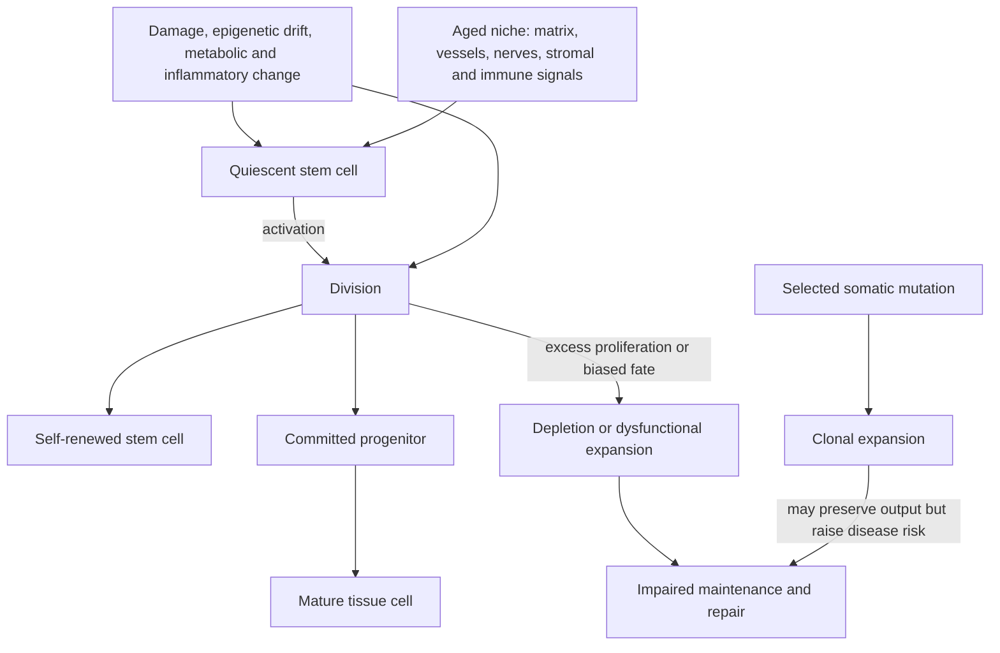

# Stem-cell exhaustion

Adult stem cells maintain or repair tissues by balancing quiescence, self-renewal, and production of differentiated descendants. Stem-cell exhaustion is the age-associated loss of that regenerative capacity. It does not always mean fewer cells: an aged compartment can contain more phenotypically identified stem cells yet produce less balanced or durable regeneration. The defect may be intrinsic to the cells, extrinsic to their niche, or both.[^lopez-otin-2023]

## A tissue-specific systems problem

Stem cells receive signals from neighboring stromal and immune cells, extracellular matrix, vessels, nerves, oxygen, and nutrients. Quiescence protects them from replicative stress; activation supplies repair. Too little activation leaves injury unrepaired, while chronic activation can consume self-renewal or select abnormal clones. Aging processes covered elsewhere—[[genomic-instability-and-dna-repair]], [[epigenetic-alterations-and-reprogramming]], [[mitochondrial-dysfunction]], [[cellular-senescence]], and [[inflammaging-and-il-6]]—can affect both the stem cell and this niche.

There is no single assay for organism-wide exhaustion. Muscle satellite-cell engraftment, hematopoietic transplantation, intestinal organoid formation, lineage tracing, and marker counts measure different capacities. Surface phenotype can misclassify altered old cells, and an injury model tests reserve under stress rather than ordinary tissue maintenance.

## Muscle: intrinsic defects and an aged niche

Mouse experiments show both sides of the system. In aged muscle, niche-derived FGF2 drove some satellite cells out of quiescence; manipulating FGF signaling or its inhibitor Spry1 altered depletion and regeneration.[^chakkalakal-2012] Separately, about two-thirds of satellite cells isolated from aged mice were defective in transplantation assays. Transient p38 inhibition combined with a soft hydrogel expanded the residual functional cells, improved serial transplantation, and strengthened injured muscles after transplantation.[^cosgrove-2014] These are mechanistic mouse studies involving isolated cells, injury, and transplantation—not evidence that a p38 inhibitor restores strength or lifespan in older people.

## Blood: more stem-like cells can mean worse output

Aged hematopoiesis illustrates why cell count is insufficient. Hematopoietic stem and progenitor populations can expand while their output becomes myeloid-biased, immune diversity falls, and clones bearing selected somatic variants grow. In human sequencing cohorts, age-related clonal hematopoiesis was associated with hematologic cancer (hazard ratio 11.1), all-cause mortality (1.4), coronary disease (2.0), and ischemic stroke (2.6).[^jaiswal-2014] This prospective observational evidence links a stem-cell compartment to outcomes but does not show that every clone causes disease or that eradicating clones improves outcomes.

The cancer tradeoff is fundamental. Mechanisms that preserve quiescence, arrest damaged cells, or limit proliferation can restrain malignancy but reduce repair. Conversely, forcing self-renewal or proliferation may transiently increase output while expanding cells with mutations. A rejuvenation strategy must restore function without relaxing tumor suppression or narrowing the pool to a dangerous clone.

## Intervention evidence

Exercise and adequate nutrition support tissue function and can improve the environment in which regeneration occurs, but human benefits should not be described as proof that a stem-cell pool was rejuvenated. Hematopoietic-cell transplantation is established for selected diseases, not for normal aging, and carries substantial morbidity. Experimental niche factors, pathway inhibitors, young plasma, stem-cell infusions, and reprogramming approaches have not established net anti-aging benefit in humans.

Commercial “stem-cell” products create an additional inference gap: the identity, viability, destination, integration, and long-term tumor risk of delivered cells must all be demonstrated. A secreted biomarker or short-term symptom change cannot establish durable engraftment and tissue rebuilding.

## Practical implications

- Preserve the conditions for regeneration: regular resistance and aerobic exercise, adequate energy and protein, sleep, smoking avoidance, vaccination, and disease control. These have human outcome or functional evidence even when their stem-cell mediation is uncertain; see [[practice-playbook]].
- Investigate persistent cytopenias, recurrent infections, poor wound healing, or unusual loss of function clinically rather than attributing them to generic “stem-cell aging.”
- Avoid unapproved stem-cell infusions or pathway inhibitors marketed for rejuvenation. Current rejuvenation findings are largely animal, ex-vivo, or transplantation experiments.

## Gaps & open questions

- Which human tissues fail because of stem-cell intrinsic change, niche change, progenitor dysfunction, or mature-cell loss?
- Which assays predict meaningful repair and clinical outcomes in people?
- Can a dysfunctional aged pool be restored without clonal selection, fibrosis, immune rejection, or cancer?
- How durable are apparent rejuvenation effects after the experimental signal is removed?

## Related

- [[cellular-senescence]]
- [[immune-aging-and-rejuvenation]]
- [[skeletal-muscle-hypertrophy]]
- [[epigenetic-alterations-and-reprogramming]]
- [[aging-model]]

## References

[^lopez-otin-2023]: López-Otín C, Blasco MA, Partridge L, Serrano M, Kroemer G. “Hallmarks of Aging: An Expanding Universe.” *Cell*, 2023. [expert narrative review and framework]. [PubMed](https://pubmed.ncbi.nlm.nih.gov/36599349/)
[^chakkalakal-2012]: Chakkalakal JV, Jones KM, Basson MA, Brack AS. “The aged niche disrupts muscle stem cell quiescence.” *Nature*, 2012. [mouse mechanistic study]. [DOI](https://doi.org/10.1038/nature11438)
[^cosgrove-2014]: Cosgrove BD, Gilbert PM, Porpiglia E, et al. “Rejuvenation of the muscle stem cell population restores strength to injured aged muscles.” *Nature Medicine*, 2014. [mouse cell-culture and transplantation experiment]. [PubMed](https://pubmed.ncbi.nlm.nih.gov/24531378/)
[^jaiswal-2014]: Jaiswal S, Fontanillas P, Flannick J, et al. “Age-Related Clonal Hematopoiesis Associated with Adverse Outcomes.” *New England Journal of Medicine*, 2014. [human cohort sequencing study]. [DOI](https://doi.org/10.1056/NEJMoa1408617)
