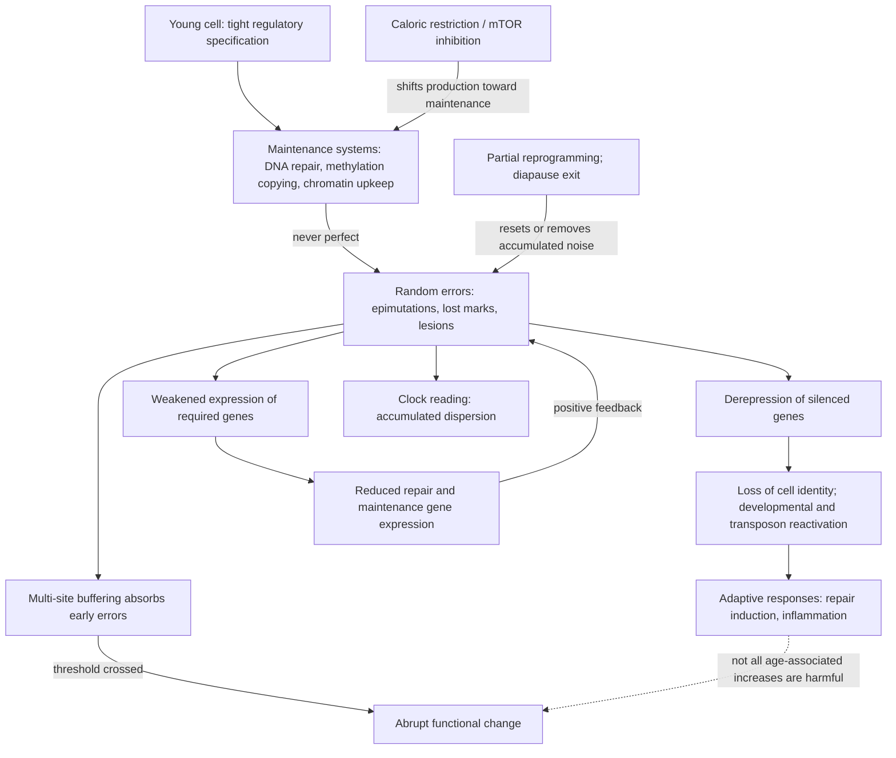

# Stochastic aging and molecular noise

Molecular noise is the progressive loss of precision in a cell's regulatory state: genes that should be silent drifting toward expression, genes that should be expressed drifting toward silence, and the whole configuration becoming less like the tightly specified pattern a young cell maintains. The stochastic account of aging proposes that this accumulating dispersion — not the continued running of a developmental program — is the substance of what aging clocks measure and much of what aging is. The claim is empirical rather than philosophical: it says that a large share of the molecular difference between a young and an old cell can be reproduced by adding undirected randomness to the young cell's data, without specifying any pathway. (@TheSheekeyScienceShow (The Sheekey Science Show) — "How Randomness Drives Aging - DNA Repair, Clocks & Rejuvenation (David Meyer)", 2025-07-04, [link](https://www.youtube.com/watch?v=Buj07nWt7o0))

## Where the noise comes from

Maintenance is a copying problem, and copying is never perfect. DNA methylation marks that hold a gene repressed must be re-established after every replication and defended against chemical loss between replications; each mark is an independent opportunity for failure. Over decades, marks are randomly removed or not copied, and the cumulative effect trickles down into transcription: genes that were completely repressed are slowly derepressed, and genes that should be active lose expression. The result is not a directed change in any particular pathway but a widening of the distance between the cell's actual regulatory state and its specified one. (@TheSheekeyScienceShow (The Sheekey Science Show) — "How Randomness Drives Aging - DNA Repair, Clocks & Rejuvenation (David Meyer)", 2025-07-04, [link](https://www.youtube.com/watch?v=Buj07nWt7o0))

This framing inverts the usual reading of a pathway signature. A skin cell holds liver and neuronal programs off; as repression decays, those programs leak back on, which is measured as loss of cell identity. The same argument applies to transposable elements, whose repression weakens with age and whose expression consequently rises — an increase that reads as a regulated derepression program but follows from the failure of a repressive system rather than the activation of an expressive one. (@TheSheekeyScienceShow (The Sheekey Science Show) — "How Randomness Drives Aging - DNA Repair, Clocks & Rejuvenation (David Meyer)", 2025-07-04, [link](https://www.youtube.com/watch?v=Buj07nWt7o0))

## Quasi-random, not uniformly random

Randomness at the level of individual events is compatible with strong structure in where events land, and the stochastic account explicitly claims the weaker, quasi-random version rather than uniform randomness. Transcribed and non-transcribed regions are served by different repair pathways and therefore accumulate damage at different rates; heterochromatic and euchromatic regions differ in their susceptibility to particular lesion classes; and long genes present a larger target, so they are more likely to be hit and are correspondingly downregulated with age for a purely geometric reason rather than a regulatory one. Genome architecture thus shapes the distribution of damage without making any individual event non-random. (@TheSheekeyScienceShow (The Sheekey Science Show) — "How Randomness Drives Aging - DNA Repair, Clocks & Rejuvenation (David Meyer)", 2025-07-04, [link](https://www.youtube.com/watch?v=Buj07nWt7o0)) [[genomic-instability-and-dna-repair]]

The same reasoning explains species differences without requiring a program. Species do not differ in whether their molecules are subject to random damage; they differ in the maintenance and repair systems evolved to cope with it. On this account damage is the default and maintenance is the evolved layer, so long-lived species are those in which the layer is thicker. (@TheSheekeyScienceShow (The Sheekey Science Show) — "How Randomness Drives Aging - DNA Repair, Clocks & Rejuvenation (David Meyer)", 2025-07-04, [link](https://www.youtube.com/watch?v=Buj07nWt7o0)) The debate over this ordering is developed in [[programmed-versus-stochastic-aging]].

## What noise clocks measure

The decisive experiment for this account is a simulation rather than an intervention. Taking a young sample in which regulation is still intact and artificially adding random numbers to the data — once, then repeatedly up to a hundred times — makes the sample progressively less like its original self. Conventional aging clocks applied to those synthetically noised samples return ages that increase approximately linearly with the amount of noise added. A clock reading is therefore, to a large extent, a measure of how far a sample has dispersed from a regulated reference, not a report on which pathways have changed. Developmental-pathway enrichment among clock CpG sites follows from the same fact: fully repressed genes have the most room to drift upward, so they show the largest effect size and dominate the feature selection, while partly repressed genes show the same phenomenon more weakly. (@TheSheekeyScienceShow (The Sheekey Science Show) — "How Randomness Drives Aging - DNA Repair, Clocks & Rejuvenation (David Meyer)", 2025-07-04, [link](https://www.youtube.com/watch?v=Buj07nWt7o0)) [[biological-age-biomarkers]]

The result generalizes beyond methylation, though not equally well. Transcriptomic clocks also correlate essentially linearly with added noise, but the signal is less clean than in methylation data and noise clocks are correspondingly harder to build from transcriptomes; they nonetheless still track chronological age and still separate long-lived from short-lived species in the expected direction. Across the clock types tested so far, all appear to track accumulated dispersion to some degree. (@TheSheekeyScienceShow (The Sheekey Science Show) — "How Randomness Drives Aging - DNA Repair, Clocks & Rejuvenation (David Meyer)", 2025-07-04, [link](https://www.youtube.com/watch?v=Buj07nWt7o0))

An independent line of work reaches a compatible but quantitatively weaker conclusion: clocks built purely from random dispersion recover roughly 70 to 80% of the prediction achieved by conventional clocks. Both accounts agree that dispersion is the dominant signal; they differ in whether the residual is treated as an interesting regulated remainder or as measurement limitation. [[aging-dynamics-and-resilience]] (@TheSheekeyScienceShow (The Sheekey Science Show) — "the 3 levels of aging therapeutics", 2026-02-08, [link](https://www.youtube.com/watch?v=c-_Pdp5IIvw))

## Buffering, thresholds, and why aging need not be linear

A purely stochastic process with a constant per-unit error rate would produce linear accumulation, which sits awkwardly with reports of discrete periods of accelerated aging in human molecular data. The stochastic account supplies two mechanisms that break linearity without invoking a program.

The first is feedback through maintenance itself. Noise is distributed randomly across the genome, so some of it necessarily lands on the genes encoding repair and maintenance machinery. Damaging the maintenance system reduces the rate at which subsequent errors are corrected, which accelerates further accumulation. Accumulation should therefore be self-reinforcing and superlinear rather than constant. (@TheSheekeyScienceShow (The Sheekey Science Show) — "How Randomness Drives Aging - DNA Repair, Clocks & Rejuvenation (David Meyer)", 2025-07-04, [link](https://www.youtube.com/watch?v=Buj07nWt7o0))

The second is buffering at individual loci. A gene repressed by several methylated CpG sites is not switched by the loss of one mark; with four of five sites still methylated it remains substantially repressed. Each locus therefore absorbs a quota of error before its state changes at all, and then changes comparatively abruptly once the quota is exhausted. Because the number of buffering sites differs between genes and between species, the thresholds hypothesized in the geroscience literature could emerge from this locus-level structure rather than from any scheduled event. Averaged over many genes with many different thresholds, the population-level trajectory can still look approximately linear, which is why clocks work at all. Reported change points also have candidate non-stochastic contributors — menopause, for instance, imposes a large hormonally regulated shift in biology that could plausibly alter the rate of aging on either side of it — and the underlying change-point findings warrant independent replication in a separate dataset before being explained. (@TheSheekeyScienceShow (The Sheekey Science Show) — "How Randomness Drives Aging - DNA Repair, Clocks & Rejuvenation (David Meyer)", 2025-07-04, [link](https://www.youtube.com/watch?v=Buj07nWt7o0))

## Not everything that rises with age is noise, and not everything that rises is bad

The account is explicitly not that all age-associated change is undirected. Damage triggers genuine programs: DNA repair induction and inflammation are adaptive responses to prior stochastic insults, and they rise with age because the insults do. This has an immediate interpretive consequence and a safety consequence. Interpretively, a pathway that increases with age may be downstream of noise rather than an instance of it. Practically, suppressing such a response can remove a compensation that the cell needs, and could reduce survival rather than improve it — which is why an inflammatory or repair signature rising with age is not automatically a therapeutic target. (@TheSheekeyScienceShow (The Sheekey Science Show) — "How Randomness Drives Aging - DNA Repair, Clocks & Rejuvenation (David Meyer)", 2025-07-04, [link](https://www.youtube.com/watch?v=Buj07nWt7o0)) [[inflammaging-and-il-6]]

## Whether accumulated noise is modifiable

If noise were purely a passive count of elapsed error, nothing short of removing the errors could change it. Two classes of observation argue otherwise.

Interventions that shift cells from production toward maintenance appear to reduce it. Caloric-restricted mice show reduced predicted age not only on conventional clocks but on stochastic clocks built specifically to measure dispersion, which implies that the accumulated-noise quantity itself is modulable — either by lowering the rate at which errors are introduced, by raising the rate at which they are corrected, or both. Caloric restriction plausibly does both: slowing metabolism reduces endogenous damage sources, while the shift toward maintenance upregulates autophagy, lysosomal function, and repair capacity. mTOR inhibition is treated as acting through the same growth-versus-maintenance reallocation. (@TheSheekeyScienceShow (The Sheekey Science Show) — "How Randomness Drives Aging - DNA Repair, Clocks & Rejuvenation (David Meyer)", 2025-07-04, [link](https://www.youtube.com/watch?v=Buj07nWt7o0)) [[caloric-restriction-and-meal-timing]] [[mtor-and-rapamycin]] [[autophagy-and-lysosomal-quality-control]]

Reprogramming appears to remove it rather than slow it, and the mechanism is discussed in [[epigenetic-alterations-and-reprogramming]]. The objection that entropy cannot be reduced misapplies the second law: it constrains closed systems, whereas an organism consumes energy and exports waste continuously, and that is precisely how it holds accumulated disorder below what an unmaintained system would show. (@TheSheekeyScienceShow (The Sheekey Science Show) — "How Randomness Drives Aging - DNA Repair, Clocks & Rejuvenation (David Meyer)", 2025-07-04, [link](https://www.youtube.com/watch?v=Buj07nWt7o0))

The sharpest test of whether noise can be removed comes from systems where the usual explanations are unavailable. Reprogramming's rejuvenating effect in dividing tissue can be attributed to selective loss of the most damaged cells and to dilution of damage across divisions — neither of which is possible in a post-mitotic cell such as a neuron. *C. elegans* entering a dauer diapause state under sparse food or crowding survives for months, far beyond normal adult lifespan, and on exit resumes an essentially normal life with normal lifespan and normal progeny. Aging clocks applied through the diapause show that the animals do age while in it, and then rejuvenate transcriptionally on exit. Because the somatic cells at that stage are post-mitotic, neither apoptotic removal nor divisional dilution can explain the recovery, so something cell-intrinsic must be resetting accumulated state. Comparable behavior is reported in other diapause states, with aging during the state and rejuvenation on refeeding. This is the strongest available demonstration that accumulated noise is not simply a one-way ledger — and it is also the least studied. (@TheSheekeyScienceShow (The Sheekey Science Show) — "How Randomness Drives Aging - DNA Repair, Clocks & Rejuvenation (David Meyer)", 2025-07-04, [link](https://www.youtube.com/watch?v=Buj07nWt7o0))

Mutations are the acknowledged exception throughout. Epigenetic state can be reset; a changed base sequence cannot be, and reprogramming and diapause exit alike leave it untouched. Any account of rejuvenation grounded in noise removal is therefore an account of the reversible fraction only. (@TheSheekeyScienceShow (The Sheekey Science Show) — "How Randomness Drives Aging - DNA Repair, Clocks & Rejuvenation (David Meyer)", 2025-07-04, [link](https://www.youtube.com/watch?v=Buj07nWt7o0))

## Where noise fits in the causal map

Two consequences follow for intervention design. Reducing inflammation addresses a downstream response and is likely beneficial, but it does not touch the process that introduced the disorder in the first place; it treats the symptom of noise rather than noise itself. The upstream options are to improve maintenance — raising repair capacity, as in the [[dream-complex-and-repair-capacity]] work — or to remove disorder already present, as reprogramming and diapause exit appear to do. Which of these is tractable in a human is unresolved; both are currently preclinical. (@TheSheekeyScienceShow (The Sheekey Science Show) — "How Randomness Drives Aging - DNA Repair, Clocks & Rejuvenation (David Meyer)", 2025-07-04, [link](https://www.youtube.com/watch?v=Buj07nWt7o0))

## Practical implications

- **No personal action follows directly from this account — it is a framework for interpreting measurements, not a protocol.** Nothing here identifies a behavior, supplement, or test that a person should adopt, and no noise-reducing product has any validated clinical basis.
- **Discount an aging-clock reading as evidence about a specific pathway — moderate to strong, and directly demonstrated by the noise-simulation result.** If synthetically added randomness moves a clock approximately linearly, then a clock's pathway-level story (including developmental-gene enrichment) is largely a readout of dispersion, and a clock movement should not be read as engagement of the pathways its features happen to sit in. [[biological-age-biomarkers]]
- **Treat caloric restriction and mTOR inhibition as maintenance-reallocation interventions whose noise effect is animal-level evidence only — weak for humans.** The finding that caloric-restricted mice score younger on dispersion-based clocks is mechanistically interesting and does not change what a person should eat; the recommendations in [[caloric-restriction-and-meal-timing]] rest on their own clinical evidence.
- **Do not assume an age-associated increase should be suppressed — moderate, and a genuine safety point.** Repair induction and inflammatory signaling can be adaptive compensations, and blunting them could reduce cell survival rather than extend life.

## Gaps & open questions

- What fraction of functional aging, as opposed to clock signal, does accumulated noise actually account for?
- Does the residual signal that dispersion cannot reproduce contain a regulated component, and is that component the part an intervention could move?
- What is the mechanism of cell-intrinsic rejuvenation on diapause exit, and does anything analogous exist in mammalian post-mitotic cells?
- Can noise be measured in an individual human tissue prospectively, rather than inferred from cross-sectional cohort dispersion?
- Do the reported abrupt change points in human aging survive independent replication, and if so are they threshold crossings, hormonal transitions, or dataset artifacts?
- Which age-associated increases are adaptive compensations that must not be suppressed, and how would one tell in advance?
- Does the buffering model predict measurable differences in aging rate between genes and species according to the number of regulatory sites per locus?
- If mutations are irreversible, what ceiling does that place on any noise-removal therapy?

## Related

[[programmed-versus-stochastic-aging]] · [[dream-complex-and-repair-capacity]] · [[biological-age-biomarkers]] · [[epigenetic-alterations-and-reprogramming]] · [[genomic-instability-and-dna-repair]] · [[aging-dynamics-and-resilience]] · [[hallmarks-of-aging]] · [[healthspan-versus-maximum-lifespan]] · [[caloric-restriction-and-meal-timing]] · [[mtor-and-rapamycin]] · [[autophagy-and-lysosomal-quality-control]] · [[inflammaging-and-il-6]] · [[aging-model]]
