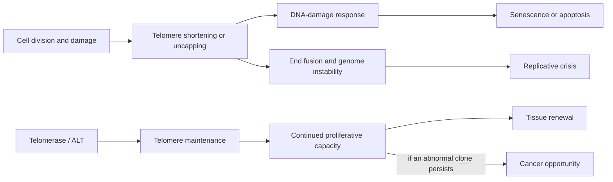

# Telomere biology

Telomeres are repetitive DNA–protein structures that distinguish natural chromosome ends from broken DNA. The shelterin protein complex folds and protects the end; telomerase can add repeats using its RNA template and catalytic reverse transcriptase, TERT. Because conventional DNA polymerases cannot fully copy every linear chromosome end, telomeres often shorten across divisions in somatic cells, but starting length, cell turnover, oxidative stress, telomerase, and measurement all modify the trajectory.[^shammas-2011]

## Replicative limits are protective and costly

When a critically short or unprotected telomere activates p53–p21 and related checkpoints, a cell may arrest or die. This protects against propagation of damaged genomes but can reduce renewal in high-turnover tissues. If checkpoints fail, chromosome ends can fuse and break during division, creating genomic instability. A rare clone that then activates telomerase or alternative lengthening can escape crisis and sustain malignant growth. Telomere attrition therefore connects [[cellular-senescence]], [[genomic-instability-and-dna-repair]], [[stem-cell-exhaustion]], and cancer; “longer is better” is biologically incomplete.[^maciejowski-2017]

## Short-telomere syndromes establish human causality

The strongest human evidence that impaired maintenance causes disease comes from inherited telomere biology disorders (TBDs), not population correlations. Pathogenic variants in telomere-maintenance genes can produce very short telomeres, bone-marrow failure, pulmonary fibrosis, liver disease, mucocutaneous findings, and elevated risks of myelodysplastic syndrome, leukemia, and selected solid tumors. GeneReviews recommends diagnosis from compatible findings plus appropriately performed flow-FISH telomere testing and/or a pathogenic variant; testing is age- and cell-type-dependent and specialist interpretation matters.[^savage-2023]

This is a rare disease spectrum with variable penetrance, not ordinary aging accelerated by a known number of years. Its management is complication-specific and surveillance-intensive. Hematopoietic-cell transplantation can cure severe marrow failure or leukemia but does not repair every affected organ and requires a center experienced with TBD-specific toxicity.[^savage-2023]

## Population length is an association, not a personal clock

In a meta-analysis of 25 cohorts comprising 121,749 people and 21,763 deaths, each standard-deviation decrement in leukocyte telomere length was associated with 9% higher all-cause mortality; the shortest versus longest quarter had a hazard ratio of 1.26, with heterogeneity by measurement and age.[^wang-2018] This is observational evidence. Leukocyte length is influenced by inherited starting length, immune-cell composition, exposures, and disease, and it may not represent telomeres in another organ.

Genetic-instrument studies sharpen the tradeoff rather than yielding a universal optimum. A systematic review and meta-analysis of Mendelian-randomization studies found robust associations of genetically longer leukocyte telomeres with higher risk of many neoplasms, but inverse associations with coronary disease, chronic kidney disease, and idiopathic pulmonary fibrosis among other outcomes.[^chen-2023] Mendelian randomization estimates lifelong genetic propensity under assumptions about the instruments; it does not predict the effect or safety of taking a telomerase activator later in life.

Assays also differ. Quantitative PCR gives a relative average across many cells; Southern blot and flow-FISH answer somewhat different questions; the shortest telomeres and cell-specific distributions may matter more than the mean. A single commercial blood result therefore cannot diagnose general “biological age,” locate a failing tissue, or justify treatment.

## Telomerase intervention evidence

In mice, systemic AAV delivery of mouse TERT at one or two years of age increased median lifespan by 24% and 13%, respectively, without a detected cancer increase in that experiment.[^bernardes-2012] This is an animal gene-therapy study with species-specific telomere biology, selected dosing, and finite follow-up. It does not establish safety or longevity benefit in humans. Because telomere maintenance can enable abnormal clones to keep dividing, any human intervention would require tissue targeting, durable cancer surveillance, and clinical outcomes—not merely longer blood telomeres.

## Practical implications

- Do not order telomere testing as routine longevity screening: no guideline supports using a commercial result to select an anti-aging therapy.
- Seek genetics/hematology or pulmonary expertise when personal or family history suggests unexplained marrow failure, premature pulmonary fibrosis, liver disease, early graying with other features, or characteristic cancers. That is a disease-evaluation pathway, not wellness testing.[^savage-2023]
- Avoid unapproved telomerase activators or gene therapies. Behaviors that reduce established disease risk remain appropriate, but their benefit should not be attributed specifically to telomere length without mediation evidence.

## Gaps & open questions

- Which telomere feature—mean length, shortest ends, uncapping, or shortening rate—best predicts failure in each tissue?
- Can a therapeutic window improve regeneration without enabling premalignant clones?
- How should cell composition, inherited starting length, and assay variation be handled in longitudinal human studies?
- Do treatment-induced telomere changes mediate clinical outcomes or merely accompany them?

## Related

- [[cellular-senescence]]
- [[genomic-instability-and-dna-repair]]
- [[stem-cell-exhaustion]]
- [[biological-age-biomarkers]]
- [[aging-model]]

## References

[^shammas-2011]: Shammas MA. “Telomeres, lifestyle, cancer, and aging.” *Current Opinion in Clinical Nutrition and Metabolic Care*, 2011. [narrative mechanistic review]. [PubMed](https://pubmed.ncbi.nlm.nih.gov/21102320/)
[^maciejowski-2017]: Maciejowski J, de Lange T. “Telomeres in cancer: tumour suppression and genome instability.” *Nature Reviews Molecular Cell Biology*, 2017. [narrative mechanistic review]. [DOI](https://doi.org/10.1038/nrm.2016.171)
[^savage-2023]: Savage SA, Niewisch MR. “Dyskeratosis Congenita and Related Telomere Biology Disorders.” *GeneReviews*, updated 2023. [expert consensus clinical guidance]. [NCBI Bookshelf](https://www.ncbi.nlm.nih.gov/books/NBK22301/)
[^wang-2018]: Wang Q, Zhan Y, Pedersen NL, Fang F, Hägg S. “Telomere Length and All-Cause Mortality: A Meta-analysis.” *Ageing Research Reviews*, 2018. [systematic review and meta-analysis of cohort studies]. [DOI](https://doi.org/10.1016/j.arr.2018.09.002)
[^chen-2023]: Chen B, Yan Y, Wang H, Xu J. “Association between genetically determined telomere length and health-related outcomes: A systematic review and meta-analysis of Mendelian randomization studies.” *Aging Cell*, 2023. [systematic review and meta-analysis of Mendelian-randomization studies]. [DOI](https://doi.org/10.1111/acel.13874)
[^bernardes-2012]: Bernardes de Jesus B, Vera E, Schneeberger K, et al. “Telomerase gene therapy in adult and old mice delays aging and increases longevity without increasing cancer.” *EMBO Molecular Medicine*, 2012. [mouse gene-therapy experiment]. [DOI](https://doi.org/10.1002/emmm.201200245)
