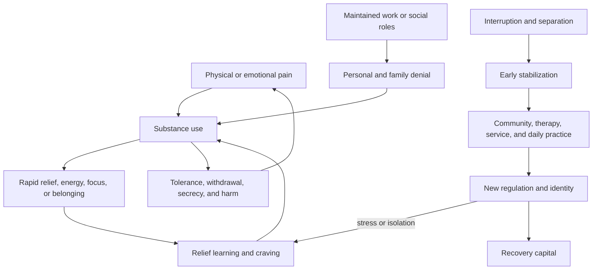
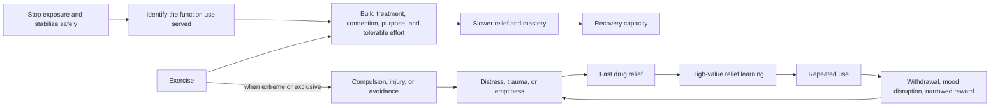

# Addiction recovery and emotional sobriety

Addiction recovery is the continuing process of reducing or stopping harmful substance use while rebuilding regulation, relationships, agency, health, and participation in ordinary life. Abstinence can be necessary without being sufficient: emotional sobriety refers to the capacity to face distress, take responsibility, seek connection, and act without returning to the avoidance and control strategies that substances served. Zac Clark’s account supports this distinction through lived and treatment-provider experience, but it is not a controlled comparison of treatment models. (@richroll (Rich Roll) — "Inside the Mind of an Addict | Zac Clark", 2026-08-06, [link](https://www.youtube.com/watch?v=sdJ1ku5nGcg))

## Why use begins and why it persists

Substances often persist because they initially solve something: opioids can rapidly suppress pain and, before sedation or severe dysfunction becomes visible, may be experienced as energizing or focusing. Relief is therefore learned as a high-value response; repeated use adds tolerance, craving, withdrawal avoidance, concealment, and accumulating harm. A person may continue meeting visible obligations, allowing both the user and family to treat employment, marriage, or athletic participation as evidence that no disorder exists. Clark’s progression from medically administered opioids after brain surgery to prescription seeking and heroin is one individual pathway; necessary medical analgesia does not by itself imply addiction, and risk must not be inferred from this story alone. (@richroll (Rich Roll) — "Inside the Mind of an Addict | Zac Clark", 2026-08-06, [link](https://www.youtube.com/watch?v=sdJ1ku5nGcg))

The transcript’s broad claim that addiction fundamentally arises from not being seen is a compassionate clinical framing, not an established universal cause. Clark reports no stereotypical catastrophic childhood and later found unmet emotional needs worth examining. Genetic liability, development, drug exposure, pain, psychiatric conditions, social environment, and learning can combine differently across people. Immediate stabilization should not be delayed until a single origin story is found. (@richroll (Rich Roll) — "Inside the Mind of an Addict | Zac Clark", 2026-08-06, [link](https://www.youtube.com/watch?v=sdJ1ku5nGcg))

## Stabilization, willingness, and continuing care

Early recovery may require physical separation from substances, medically appropriate withdrawal care, and enough time for reliable choices to become possible. Clark reports that 28 days did not establish recovery for him whereas a later four-and-a-half-month stay, followed by structured aftercare and daily peer community, did. He and Rich Roll regard willingness as difficult or impossible to manufacture, while Clark’s treatment practice has moved away from confrontational interventions toward listening and engagement. These positions challenge coercion but do not show that treatment should wait for a dramatic rock bottom; the exact influence of readiness, treatment duration, and family action remains unresolved in the source. (@richroll (Rich Roll) — "Inside the Mind of an Addict | Zac Clark", 2026-08-06, [link](https://www.youtube.com/watch?v=sdJ1ku5nGcg))

Long-term recovery in this account is layered: peer fellowship, service, prayer or meditation, therapy, movement, sleep, nutrition, hydration, purpose, and ordinary joy. Twelve-step action emphasizes acceptance, inventory, amends, humility, and helping others; therapy may explore developmental patterns that action-oriented fellowship does not address. Neither should be presented as universally sufficient. Clark’s strongest practical observation is that honest resistance may be more workable than polished compliance, because performance can conceal refusal to accept help. (@richroll (Rich Roll) — "Inside the Mind of an Addict | Zac Clark", 2026-08-06, [link](https://www.youtube.com/watch?v=sdJ1ku5nGcg))

## Relapse without erasure

Treating sobriety time as a moral score can turn a return to use into shame, concealment, and avoidance of care. Clark and Roll propose that relapse does not erase prior recovery work and should prompt renewed safety, contact, and examination of what became unstable. This reduces shame without minimizing overdose risk or other consequences. The transcript offers clinical experience rather than outcome data, so the best response and terminology remain open. (@richroll (Rich Roll) — "Inside the Mind of an Addict | Zac Clark", 2026-08-06, [link](https://www.youtube.com/watch?v=sdJ1ku5nGcg))

Families need their own support, boundaries, and communication. A boundary can combine care for the person with refusal to sustain dangerous behavior. For events such as a first sober holiday, asking the recovering person what environment would help is preferable to guessing; requested alcohol removal and discomfort with conspicuous accommodation are both possible. Privacy also belongs to the person in recovery, and family desire for details does not create entitlement to private disclosures or amends on demand. (@richroll (Rich Roll) — "Inside the Mind of an Addict | Zac Clark", 2026-08-06, [link](https://www.youtube.com/watch?v=sdJ1ku5nGcg))

## Exercise: support or substitution

Exercise can provide structure, mood regulation, mastery, identity, and community. It can also become another escape when training displaces relationships, work, recovery meetings, therapy, or medical care. The decision is functional rather than semantic: a hard activity may improve life overall, yet still become compulsive in its scheduling and identity role. Running should therefore supplement an addiction program, not be presumed to solve addiction by itself. (@richroll (Rich Roll) — "Inside the Mind of an Addict | Zac Clark", 2026-08-06, [link](https://www.youtube.com/watch?v=sdJ1ku5nGcg)) [[mental-strength-and-behavioral-skills]]

Ken Rideout describes endurance exercise as a replacement source of structure, difficult effort, and post-completion relief during opioid recovery. His model is that rapid drug reward temporarily masks distress while repeated use deepens withdrawal, mood disruption, and reduced responsiveness to ordinary rewards; running supplied a slower, earned transition from effort to relief without returning to opioids. This is a first-person recovery framework, not evidence that extreme endurance exercise repairs dopamine or serotonin systems, treats withdrawal safely, or generalizes to other people. His experience reinforces a sequence already present in recovery care: stop the escalating exposure, stabilize, investigate the functions substance use served, and build alternative regulation and purpose. (@drandygalpin (Andy Galpin) — "How to Find Peace Through Suffering | Ken Rideout & Dr. Andy Galpin", 2026-07-06, [link](https://www.youtube.com/watch?v=EfbtNG5P3gU))

Rideout's distinctive claim that discipline and chosen suffering can create peace should be read narrowly. Bounded effort can reduce unstructured time, create immediate behavioral evidence of persistence, and deliver a reliable completion signal. But suffering is not intrinsically therapeutic: depletion, injury, shame, and exercise dependence can reproduce avoidance or self-punishment. He explicitly presents his extreme training as personal survival practice rather than a general prescription. (@drandygalpin (Andy Galpin) — "How to Find Peace Through Suffering | Ken Rideout & Dr. Andy Galpin", 2026-07-06, [link](https://www.youtube.com/watch?v=EfbtNG5P3gU))

## Treatment quality and conflicts of interest

Price, luxury setting, and extensive testing do not establish effective continuing care. Clark and Roll describe weak regulation, predatory programs, and a failure to connect residential treatment with real-world community; these are serious provider observations, but the transcript supplies no audit, comparative outcomes, or jurisdiction-specific regulatory data. Their contrarian emphasis is that a free peer fellowship may supply durable community that an expensive clinical episode lacks, while good treatment should integrate medical, psychological, social, and physical-health needs rather than reduce recovery to either meetings or wellness. (@richroll (Rich Roll) — "Inside the Mind of an Addict | Zac Clark", 2026-08-06, [link](https://www.youtube.com/watch?v=sdJ1ku5nGcg))

## Practical implications

- **If overdose, severe withdrawal, intoxication, or immediate danger is possible: seek emergency or specialist help now — strong safety principle.** Do not use a transcript or peer story to design unsupervised detoxification. (@richroll (Rich Roll) — "Inside the Mind of an Addict | Zac Clark", 2026-08-06, [link](https://www.youtube.com/watch?v=sdJ1ku5nGcg))
- **Early recovery: prioritize separation from access, clinical assessment, and a continuing-care plan that reaches beyond discharge — moderate principle, individualized intensity.** Include rapid connection to peer and professional support where acceptable. (@richroll (Rich Roll) — "Inside the Mind of an Addict | Zac Clark", 2026-08-06, [link](https://www.youtube.com/watch?v=sdJ1ku5nGcg))
- **Daily or as specified by the recovery plan: maintain contact, honest inventory, and one outward act of service or accountability — limited-to-moderate, strongest as sustained lived practice.** Spiritual language can be adapted; it should not become a gatekeeping requirement. (@richroll (Rich Roll) — "Inside the Mind of an Addict | Zac Clark", 2026-08-06, [link](https://www.youtube.com/watch?v=sdJ1ku5nGcg))
- **After any return to use: restore safety and contact immediately, then review triggers and missing supports without treating prior gains as erased — moderate harm-reduction rationale.** Overdose tolerance may have changed, so risk can be acute. (@richroll (Rich Roll) — "Inside the Mind of an Addict | Zac Clark", 2026-08-06, [link](https://www.youtube.com/watch?v=sdJ1ku5nGcg))
- **Weekly: audit whether exercise and work support recovery or reproduce isolation, compulsion, and neglected values — limited.** Preserve rest, relationships, treatment, and community alongside movement. (@richroll (Rich Roll) — "Inside the Mind of an Addict | Zac Clark", 2026-08-06, [link](https://www.youtube.com/watch?v=sdJ1ku5nGcg))
- **When clinically stable, use a repeatable, tolerable exercise session as one recovery support and increase it gradually — limited for addiction-specific effects, strong for general health.** The target is reliable structure and completion, not maximal suffering; exercise does not replace withdrawal management, medication, psychotherapy, or peer support. (@drandygalpin (Andy Galpin) — "How to Find Peace Through Suffering | Ken Rideout & Dr. Andy Galpin", 2026-07-06, [link](https://www.youtube.com/watch?v=EfbtNG5P3gU))
- **Before purchasing treatment: verify licensing, clinical staffing, medication capability, outcome reporting, family support, discharge planning, and community linkage — moderate consumer-protection principle.** Amenities are not evidence of effectiveness. (@richroll (Rich Roll) — "Inside the Mind of an Addict | Zac Clark", 2026-08-06, [link](https://www.youtube.com/watch?v=sdJ1ku5nGcg))

## Gaps & open questions

- Which combinations and sequences of medication, psychotherapy, peer support, residential care, and recovery housing work best for particular substance-use disorders?
- How can readiness for change be increased without coercion, abandonment, or waiting for preventable harm?
- Which definitions of emotional sobriety predict function, quality of life, and sustained recovery?
- What treatment-duration effects remain after severity, resources, motivation, and selection are controlled?
- How often does exercise substitute for versus strengthen recovery, and which warning signs predict harm?
- Which exercise doses improve craving, mood, retention in treatment, and long-term function without increasing injury or compulsive substitution?
- Which public outcome metrics can distinguish effective treatment programs without encouraging selection of easier patients?

## Related

[[mental-strength-and-behavioral-skills]] · [[stress-threat-discrimination]] · [[durable-well-being-and-hedonic-adaptation]] · [[myth-moral-injury-and-homecoming]] · [[practice-playbook]]
