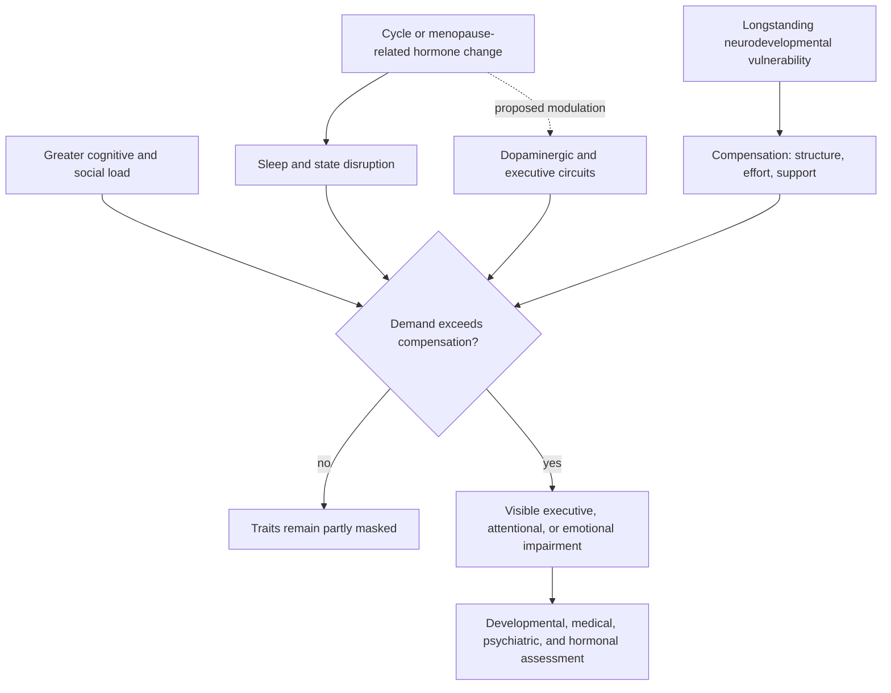
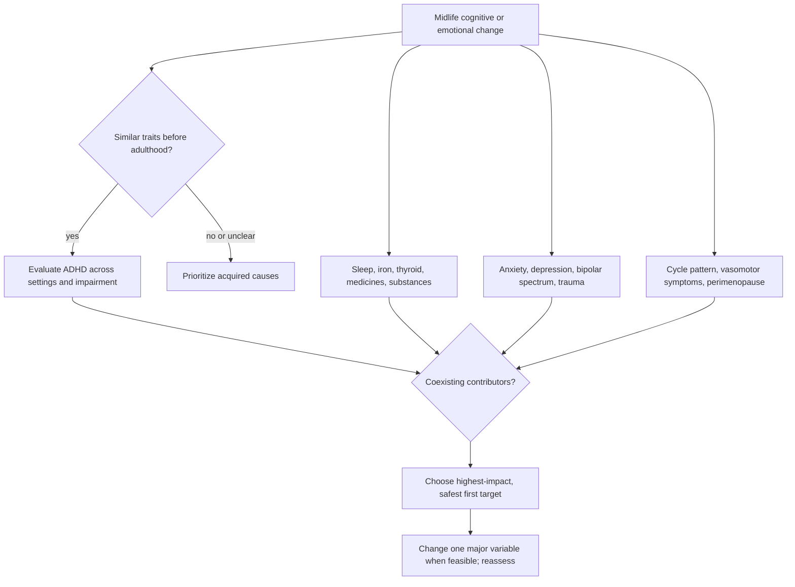

# ADHD and reproductive hormone transitions

Attention-deficit/hyperactivity disorder (ADHD) is a neurodevelopmental condition involving regulation of attention, inhibition, working memory, motivation, activity, and goal-directed behavior. A new loss of concentration in midlife is not by itself ADHD: diagnosis asks whether longstanding traits and impairment were previously contained by structure, ability, or support and have become harder to compensate for under a new biological or cognitive load. (@drmaryclaire (Dr. Mary Claire Haver, MD) — "Brain Fog, Rage, Overwhelm: The ADHD and Menopause Overlap with Dr. Sasha Hamdani", 2026-08-04, [link](https://www.youtube.com/watch?v=WeGj2lc6szc))

## Compensation, load, and symptom expression

Girls and women may be missed when ADHD is treated mainly as disruptive hyperactivity. Inattentive symptoms, internal restlessness, disorganization, and labor-intensive compensation can coexist with high achievement. Education, independent living, parenthood, grief, illness, or menopause-related changes can exceed that compensation, making an old vulnerability newly visible rather than creating a neurodevelopmental disorder. Sasha Hamdani's distinctive framing is therefore that perimenopause can unmask ADHD, not cause it. This is clinically coherent, but the transcripts provide no prospective estimate of how often it occurs or how much is hormonal rather than sleep-, mood-, or load-mediated. (@drmaryclaire (Dr. Mary Claire Haver, MD) — "Brain Fog, Rage, Overwhelm: The ADHD and Menopause Overlap with Dr. Sasha Hamdani", 2026-08-04, [link](https://www.youtube.com/watch?v=WeGj2lc6szc))

Estrogen receptors occur in brain systems relevant to cognition and affect, and reproductive hormone changes plausibly alter monoamine signaling. The interview proposes that falling estrogen reduces dopamine synthesis, signaling, and persistence at the synapse, thereby worsening executive and emotional control. This is a simplified model rather than a person-level diagnostic pathway: dopamine varies by circuit and time and cannot be inferred from symptoms; perimenopausal brain fog also has sleep, vasomotor, mood, medication, thyroid, iron, and other possible causes. (@drmaryclaire (Dr. Mary Claire Haver, MD) — "Brain Fog, Rage, Overwhelm: The ADHD and Menopause Overlap with Dr. Sasha Hamdani", 2026-08-04, [link](https://www.youtube.com/watch?v=WeGj2lc6szc)) [[neuromodulators-and-state-control]] [[perimenopause-assessment-and-testing]]

Symptoms and perceived medication effectiveness may vary across the menstrual cycle. Hamdani describes worse fog, mood regulation, and apparent medication benefit during the late luteal estrogen decline while progesterone rises. This pattern is plausible and trackable, but the transcript supplies neither controlled pharmacokinetic evidence nor a validated cycle-based dose-adjustment protocol. (@drmaryclaire (Dr. Mary Claire Haver, MD) — "An ADHD and Menopause Toolkit: What Actually Helps with Dr. Sasha Hamdani", 2026-08-07, [link](https://www.youtube.com/watch?v=tzXxiD9xJW8))

## Emotional regulation and rejection sensitivity

Emotional dysregulation means difficulty modulating the speed, intensity, or duration of an emotional response. It can accompany ADHD even though it is not a core diagnostic criterion in the framework discussed. Small triggers may produce rapid anger or panic-like distress before reflective control catches up; sleep debt, hormonal transitions, anxiety, trauma, and mood disorders can intensify the same pattern. Hamdani argues that omitting emotional regulation contributes to women being labeled only with anxiety or depression, a useful diagnostic warning but not evidence that those diagnoses are usually wrong. (@drmaryclaire (Dr. Mary Claire Haver, MD) — "An ADHD and Menopause Toolkit: What Actually Helps with Dr. Sasha Hamdani", 2026-08-07, [link](https://www.youtube.com/watch?v=tzXxiD9xJW8))

Rejection-sensitive dysphoria (RSD) is an informal label for unusually intense distress in response to perceived criticism, rejection, disapproval, or a change in social tone. It may lead to avoidance, quitting, reassurance seeking, or selecting only low-risk situations. The construct can describe a trigger-response pattern, but the transcripts do not establish it as a distinct disorder, a validated test, or a phenomenon unique to ADHD or women. Assessment must still consider social anxiety, depression, trauma-related threat learning, autism, personality structure, and ordinary sensitivity to consequential rejection. (@drmaryclaire (Dr. Mary Claire Haver, MD) — "An ADHD and Menopause Toolkit: What Actually Helps with Dr. Sasha Hamdani", 2026-08-07, [link](https://www.youtube.com/watch?v=tzXxiD9xJW8)) [[social-evaluative-threat-and-criticism]] [[stress-threat-discrimination]]

## Differential assessment and treatment layers

An adult ADHD evaluation reconstructs childhood traits, later development, impairment, compensatory systems, and symptoms across settings, while asking why help is being sought now. Cognitive complaints can reflect ADHD, perimenopause, sleep or circadian disruption, iron deficiency, thyroid disease, medicines, substances, anxiety, depression, bipolar disorder, or several processes together. Clinical history is primary; questionnaires and neuropsychological tests can add structure but do not replace longitudinal diagnosis. (@drmaryclaire (Dr. Mary Claire Haver, MD) — "Brain Fog, Rage, Overwhelm: The ADHD and Menopause Overlap with Dr. Sasha Hamdani", 2026-08-04, [link](https://www.youtube.com/watch?v=WeGj2lc6szc)) (@drmaryclaire (Dr. Mary Claire Haver, MD) — "An ADHD and Menopause Toolkit: What Actually Helps with Dr. Sasha Hamdani", 2026-08-07, [link](https://www.youtube.com/watch?v=tzXxiD9xJW8))

When ADHD and perimenopausal symptoms coexist, the proposed rule is to treat the largest tractable contributor first, then reassess before layering another intervention. Hormone therapy is not an ADHD treatment, and ADHD medication is not a general treatment for menopausal brain fog. Menopause hormone therapy may improve transition-related symptoms in an eligible patient, but claims that early transdermal estradiol outperforms a newly started SSRI for mental health or that receptor timing creates a cognitive treatment window lack study detail in the transcript and should not determine prescribing alone. (@drmaryclaire (Dr. Mary Claire Haver, MD) — "Brain Fog, Rage, Overwhelm: The ADHD and Menopause Overlap with Dr. Sasha Hamdani", 2026-08-04, [link](https://www.youtube.com/watch?v=WeGj2lc6szc))

Sleep is a high-leverage modifier because insufficient or mistimed sleep worsens attention, working memory, inhibition, and emotional control whether or not ADHD is present. The interviews describe delayed melatonin onset as one working explanation for later timing and emphasize morning light, reduced evening stimulation, and avoiding alcohol as a sleep aid. Delayed sleep phase, insomnia, apnea, restless legs, vasomotor symptoms, and medication timing nevertheless require different responses. (@drmaryclaire (Dr. Mary Claire Haver, MD) — "An ADHD and Menopause Toolkit: What Actually Helps with Dr. Sasha Hamdani", 2026-08-07, [link](https://www.youtube.com/watch?v=tzXxiD9xJW8))

Exercise can support mood and attention and contributes to cardiovascular, bone, and cognitive health. Hamdani prioritizes enjoyable repeatable activity over an ideal program that is abandoned; resistance and aerobic work can be developed after consistency exists. Regular meals can reduce the extra burden of long fasting intervals or unplanned grazing, but describing a single processed eating episode as a neuroinflammatory state is too strong. Mindfulness and cognitive-behavioral methods can train observation, planning, and response choice; mindfulness does not require an empty mind. (@drmaryclaire (Dr. Mary Claire Haver, MD) — "An ADHD and Menopause Toolkit: What Actually Helps with Dr. Sasha Hamdani", 2026-08-07, [link](https://www.youtube.com/watch?v=tzXxiD9xJW8)) [[daily-movement-mobility-and-pain]] [[nutrition-evidence-and-personalization]]

Medication options discussed include stimulants and nonstimulants such as atomoxetine and viloxazine; selection, timing, contraindications, and monitoring require an ADHD-qualified prescriber. The source presents GLP-1 receptor agonists as promising for intrusive food thoughts and binge eating, but provides no evidence for treating ADHD itself and does not justify prescribing them without an appropriate indication and assessment. Supplements marketed as ADHD cures likewise require product-specific evidence; magnesium or methylation claims do not erase a neurodevelopmental diagnosis. (@drmaryclaire (Dr. Mary Claire Haver, MD) — "An ADHD and Menopause Toolkit: What Actually Helps with Dr. Sasha Hamdani", 2026-08-07, [link](https://www.youtube.com/watch?v=tzXxiD9xJW8)) [[glp-1-receptor-agonists]] [[supplement-evidence-and-safety]]

## Practical implications

- **For several weeks before assessment: record sleep, cycle phase or bleeding, vasomotor symptoms, medication timing, attention, mood, and concrete functional failures — moderate as a diagnostic aid.** A pattern does not diagnose ADHD, hormone deficiency, or medication failure. (@drmaryclaire (Dr. Mary Claire Haver, MD) — "An ADHD and Menopause Toolkit: What Actually Helps with Dr. Sasha Hamdani", 2026-08-07, [link](https://www.youtube.com/watch?v=tzXxiD9xJW8))
- **When symptoms impair work, driving, finances, relationships, or self-care: seek comprehensive evaluation rather than assuming ADHD or menopause — strong diagnostic principle.** Bring childhood history when available and ask that sleep, thyroid, iron, mood, medicines, and reproductive stage be considered. (@drmaryclaire (Dr. Mary Claire Haver, MD) — "Brain Fog, Rage, Overwhelm: The ADHD and Menopause Overlap with Dr. Sasha Hamdani", 2026-08-04, [link](https://www.youtube.com/watch?v=WeGj2lc6szc))
- **Daily: protect regular sleep and wake timing, obtain early-day light, move enjoyably, and use regular adequate meals — moderate-to-strong for general support, indirect for ADHD control.** Persistent sleep symptoms need targeted assessment. (@drmaryclaire (Dr. Mary Claire Haver, MD) — "An ADHD and Menopause Toolkit: What Actually Helps with Dr. Sasha Hamdani", 2026-08-07, [link](https://www.youtube.com/watch?v=tzXxiD9xJW8))
- **After starting one major treatment: reassess function, target symptoms, adverse effects, sleep, appetite, and blood pressure at the prescriber's interval — strong safety principle.** Do not change psychiatric or hormone doses by cycle phase without clinician guidance. (@drmaryclaire (Dr. Mary Claire Haver, MD) — "An ADHD and Menopause Toolkit: What Actually Helps with Dr. Sasha Hamdani", 2026-08-07, [link](https://www.youtube.com/watch?v=tzXxiD9xJW8))

## Gaps & open questions

- How much do ADHD symptoms and medication response change across cycles, pregnancy, postpartum, perimenopause, and postmenopause?
- Which hormone changes causally alter executive or emotional domains independently of sleep and vasomotor symptoms?
- Does menopause hormone therapy improve ADHD-specific impairment in randomized trials, and in whom?
- Is RSD distinct from emotional dysregulation, social anxiety, trauma-related threat, or mood disorders?
- Which tools best detect compensated ADHD in older women without overdiagnosing acquired symptoms?
- Which sequencing strategy produces the best functional outcomes with the least harm?

## Related

[[perimenopause-assessment-and-testing]] · [[neuromodulators-and-state-control]] · [[social-evaluative-threat-and-criticism]] · [[stress-threat-discrimination]] · [[cognitive-reserve-and-brain-health]] · [[glp-1-receptor-agonists]] · [[supplement-evidence-and-safety]] · [[practice-playbook]] · [[aging-model]]
