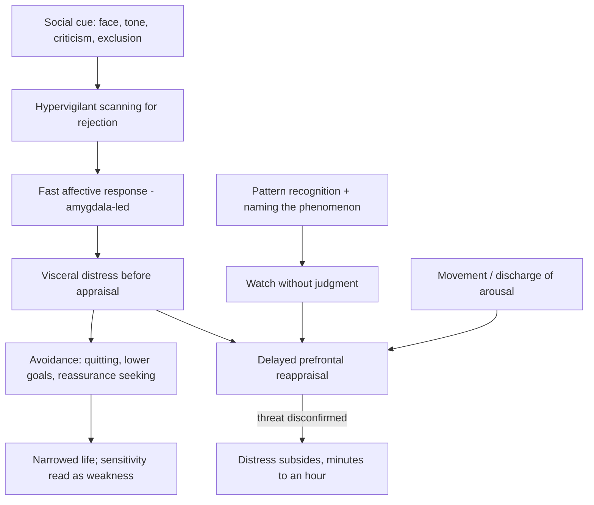
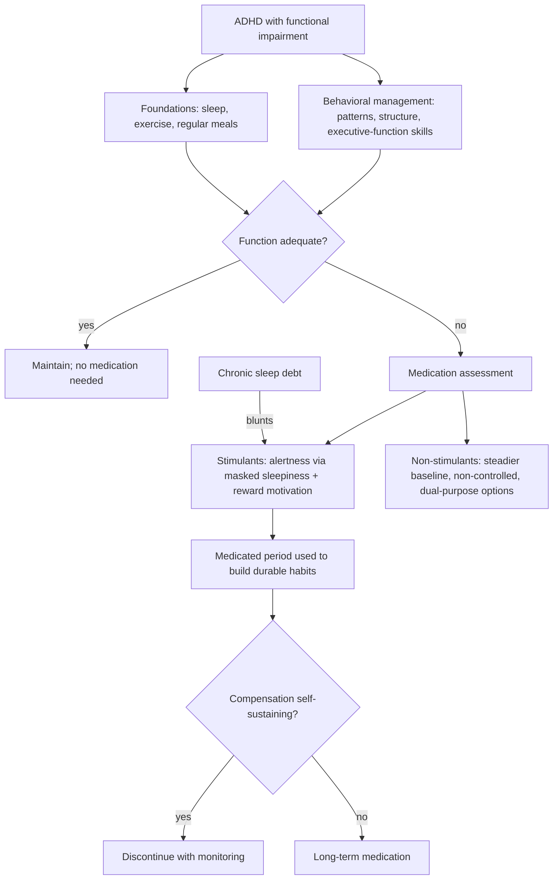

# ADHD dysregulation and rejection sensitivity

Attention-deficit/hyperactivity disorder (ADHD) is diagnosed on inattentive and hyperactive-impulsive symptom criteria, but the lived condition is broader than its name. A clinically useful working model treats ADHD as a regulation disorder: the same difficulty modulating the deployment of attention also shows up in modulating emotion, sleep timing, appetite, energy, and motivation. In the DSM-5 revision the older label ADD was folded into ADHD with three presentations — inattentive, hyperactive-impulsive, and combined — a renaming that psychiatrist Sasha Hamdani argues misleads both patients and physicians, because people who do not look hyperactive are less likely to be evaluated, and because the name centers attention when the condition is, in her phrasing, dysregulating not only attention but also emotions, sleep, appetite, energy, and motivation. Emotional dysregulation is not part of the formal diagnostic criteria, which she identifies as a substantive gap rather than a technicality: patients whose primary impairment is emotional volatility can be diagnosed with anxiety or depression alone and never assessed developmentally. (@maxlugavere (Max Lugavere) — "The ADHD Expert: The Best Natural Ways to Manage ADHD", 2026-08-26, [link](https://www.youtube.com/watch?v=1Q21PEDlNRk)) [[adhd-and-reproductive-hormone-transitions]] [[executive-function-under-social-stress]]

ADHD is predominantly genetic and heritable; Hamdani treats the associated emotional sensitivity as likely hardwired rather than learned, while acknowledging that a parent's observation of a child cannot separate nature from nurture. (@maxlugavere (Max Lugavere) — "The ADHD Expert: The Best Natural Ways to Manage ADHD", 2026-08-26, [link](https://www.youtube.com/watch?v=1Q21PEDlNRk))

## Rejection-sensitive dysphoria

Rejection-sensitive dysphoria (RSD) names "an intense emotional response to real or perceived rejection or criticism." It is not a diagnosis — it appears in no diagnostic manual and has no validated test — but it describes a recognizable trigger-response pattern: continuous scanning of faces, tone, and body language for signs of disapproval; a visceral, sometimes physical reaction (Hamdani describes feeling rejection like a punch to the gut) that arrives before appraisal; and only later, sometimes after tens of minutes, the frontal reappraisal that nothing threatening occurred. The proposed mechanism is a timing asymmetry: amygdala-driven emotional response fires before prefrontal judgment and decision-making catch up, so the person feels the event before they can evaluate it. This is a plausible simplification consistent with dual-process accounts of threat appraisal, not a demonstrated circuit-level finding. (@maxlugavere (Max Lugavere) — "The ADHD Expert: The Best Natural Ways to Manage ADHD", 2026-08-26, [link](https://www.youtube.com/watch?v=1Q21PEDlNRk)) [[social-evaluative-threat-and-criticism]] [[stress-threat-discrimination]] [[protective-threat-responses]]

Hamdani states that almost 100% of people with ADHD have some facet of RSD. Treat this as expert impression, not measured prevalence: without diagnostic criteria there is no instrument to count with, and the construct overlaps social anxiety, depression, trauma-related threat learning, and ordinary sensitivity to consequential rejection — a differential the same expert acknowledges on [[adhd-and-reproductive-hormone-transitions]]. The distinction she draws for clinical relevance is functional: everyone dislikes rejection; RSD is when the response is overwhelming, visceral, and limits what a person is willing to attempt. (@maxlugavere (Max Lugavere) — "The ADHD Expert: The Best Natural Ways to Manage ADHD", 2026-08-26, [link](https://www.youtube.com/watch?v=1Q21PEDlNRk))

Interruption strategies follow the mechanism: first, learn one's own triggers and the bodily signature of the response so episodes stop feeling cataclysmic; second, use the name itself to create observing distance and reduce shame; third, apply in-the-moment tools — present-moment acceptance drawn from dialectical behavior therapy, or physical movement to discharge arousal so that, in Hamdani's framing, the frontal lobe can come back online; fourth, when tools fail repeatedly and distress limits functioning, consider medication assessment. She reports that some non-stimulant ADHD medications are used specifically for RSD; no regulator recognizes RSD as an indication, so this is off-label practice reported by one clinician, and evaluation should also cover hormonal, anxiety, and depressive contributors. (@maxlugavere (Max Lugavere) — "The ADHD Expert: The Best Natural Ways to Manage ADHD", 2026-08-26, [link](https://www.youtube.com/watch?v=1Q21PEDlNRk)) [[emotion-regulation]]

## Novelty, urgency, and procrastination

Attention in ADHD is not uniformly deficient; it is unevenly recruitable. Interest, novelty, urgency, and deadline pressure can produce intense productive focus, while important-but-uninteresting tasks resist sustained effort at any level of willpower — the pattern of strong grades in compelling subjects and failing grades in easy ones. Hamdani describes her own nervous system as operating on novelty and urgency, and reframes much ADHD procrastination as emotional avoidance rather than laziness: fear of doing badly, of the task's size, or of feeling bad while doing it pushes the start until panic supplies the missing activation. This framing matters for intervention design, because it predicts that emotion-regulation tools and task restructuring (artificial deadlines, novelty, body-doubling, smaller entry points) address the actual bottleneck where exhortations to try harder do not. (@maxlugavere (Max Lugavere) — "The ADHD Expert: The Best Natural Ways to Manage ADHD", 2026-08-26, [link](https://www.youtube.com/watch?v=1Q21PEDlNRk))

The same trait distribution plausibly shapes selection into occupations: both discussants note an association between ADHD and entrepreneurship, where novelty, urgency, and self-directed structure fit the phenotype. Hamdani's counterpoint to build-a-life-around-your-brain arguments is distributional: bespoke education and entrepreneurial risk-taking require financial capital, so framing environmental restructuring as the alternative to medication is a privilege-dependent prescription unavailable to many patients. (@maxlugavere (Max Lugavere) — "The ADHD Expert: The Best Natural Ways to Manage ADHD", 2026-08-26, [link](https://www.youtube.com/watch?v=1Q21PEDlNRk))

## Treatment structure

Management is twofold: behavioral management and medication management. Behavioral management targets executive function — in Hamdani's definition, the set of skills that move the brain from point A to point B — through pattern recognition, external structure, and plugging the physiological holes: adequate sleep, regular exercise, and diet. Her clinical claim is that when those foundations are handled, much dysfunction becomes manageable without medication; but a subset of patients, herself included during medical training, cannot reach adequate function even with disciplined sleep, diet, and exercise, and need medication to reorganize. Medication need is not necessarily permanent: a period of medicated functioning can be used to build compensatory systems (she calls this collateral circuitry) that persist after discontinuation, though some patients need long-term treatment. This mirrors the time-limited-scaffold logic discussed for GLP-1 receptor agonists in weight management. (@maxlugavere (Max Lugavere) — "The ADHD Expert: The Best Natural Ways to Manage ADHD", 2026-08-26, [link](https://www.youtube.com/watch?v=1Q21PEDlNRk)) [[glp-1-receptor-agonists]]

On mechanism, Hamdani cites a Washington University study from December 2025: stimulants act through two channels, alertness and motivation-toward-reward. The alertness channel does not add energy; it masks sleepiness signals — which predicts, and she reports clinically, that stimulants feel less effective in chronically sleep-deprived patients. The study citation is unverified from the transcript; the sleep-interaction prediction is consistent with the known pharmacology of catecholaminergic wake promotion. Caffeine acts on the same axis but binds weakly and transiently, so a caffeine dose equivalent to a therapeutic stimulant would be intolerable before delivering the benefit — her argument against self-medicating ADHD with coffee. Non-stimulants are the under-considered option class: non-controlled, often 24-hour coverage, and some serve double duty as antidepressants or antihypertensives. (@maxlugavere (Max Lugavere) — "The ADHD Expert: The Best Natural Ways to Manage ADHD", 2026-08-26, [link](https://www.youtube.com/watch?v=1Q21PEDlNRk)) [[neuromodulators-and-state-control]]

## Sleep in ADHD

Sleep problems are near-universal in Hamdani's account, with two distinct mechanisms. First, delayed melatonin onset shifts the natural sleep-wake cycle later — sleepy at 1 a.m., happiest waking at 10 a.m. — which becomes impairment mainly by collision with early-start schedules. Second, a motivational one: bedtime is boring, and the removal of daytime stimulation releases a flood of ideas and energy precisely at lights-out. Her countermeasure for the second is cognitive offloading: a paper notepad at the bedside for dumping every idea, which removes the urgency of rehearsing them and, in her n-of-1 experience, moved sleep onset roughly two hours earlier. On exogenous melatonin she is unenthusiastic despite the mechanistic fit with delayed endogenous onset — she reports no clear before-after difference in her patients and does not use it first-line, reserving it mainly for shift transitions; Lugavere counters that low-dose melatonin (1–3 mg) is reasonably reliable for jet-lag-type circadian disruption. Both positions are consistent with melatonin's evidence being strongest for circadian phase problems rather than general insomnia. (@maxlugavere (Max Lugavere) — "The ADHD Expert: The Best Natural Ways to Manage ADHD", 2026-08-26, [link](https://www.youtube.com/watch?v=1Q21PEDlNRk)) [[pre-sleep-routines-and-stimulus-control]] [[sleep-quality-and-circadian-alignment]]

On THC as a sleep aid she is deliberately agnostic-leaning-cautious: patients keep returning to it because it does help appetite and sleep subjectively; a recent study she cites found it does not help anxiety; and the absence of long-term, well-controlled studies (which she attributes to federal illegality) means the cognitive cost of chronic use is unknown. She cites a nine-to-seventeen-fold increased schizophrenia risk from chronic adolescent use — the direction is supported by the psychosis literature, but that multiplier is at or above the high end of published estimates and should be treated as unverified. Lugavere reports a personal low-dose THC/CBD/CBN gummy protocol for sleep as anecdote, not evidence. (@maxlugavere (Max Lugavere) — "The ADHD Expert: The Best Natural Ways to Manage ADHD", 2026-08-26, [link](https://www.youtube.com/watch?v=1Q21PEDlNRk))

## Sensitivity as capacity

The book-level claim of the interview is that high emotional sensitivity — feeling things quickly, deeply, and for a long time — is a trait, probably wired, that becomes a liability only when regulation fails or when the environment (social-media negativity engineering, gendered toughen-up socialization of boys) punishes it. The goal of intervention is control, not desensitization. Hamdani connects emotional sensitivity to emotional intelligence and human connection; this is a values framing supported by clinical experience rather than outcome data, and it parallels the amplification-versus-suppression distinction on [[emotion-regulation]]. (@maxlugavere (Max Lugavere) — "The ADHD Expert: The Best Natural Ways to Manage ADHD", 2026-08-26, [link](https://www.youtube.com/watch?v=1Q21PEDlNRk)) [[interpersonal-regulation-and-emotional-capacity]]

## Practical implications

- **Ongoing, before and during any treatment: map personal triggers and the bodily signature of overwhelm episodes (what preceded it, what the body did, how long the wave lasted) — moderate as a self-management foundation; core of the source's approach.** Naming the pattern is itself an intervention against shame-driven avoidance. (@maxlugavere (Max Lugavere) — "The ADHD Expert: The Best Natural Ways to Manage ADHD", 2026-08-26, [link](https://www.youtube.com/watch?v=1Q21PEDlNRk))
- **In the moment of a rejection-triggered flood: present-moment acceptance without judgment, or physical movement to discharge arousal, before attempting decisions — investigational practice; DBT-derived components have trial support in other conditions, not for RSD specifically.** (@maxlugavere (Max Lugavere) — "The ADHD Expert: The Best Natural Ways to Manage ADHD", 2026-08-26, [link](https://www.youtube.com/watch?v=1Q21PEDlNRk))
- **Daily: protect sleep, exercise, and regular meals before and alongside any medication decision — strong as general support, expert-endorsed as ADHD-specific scaffolding.** If function remains impaired with foundations in place, seek prescriber assessment covering stimulants and non-stimulants rather than assuming stimulants. (@maxlugavere (Max Lugavere) — "The ADHD Expert: The Best Natural Ways to Manage ADHD", 2026-08-26, [link](https://www.youtube.com/watch?v=1Q21PEDlNRk))
- **Nightly if racing ideas delay sleep: keep a paper notepad at the bedside and dump thoughts before lights-out — investigational practice (single-clinician n-of-1), low cost and low risk.** (@maxlugavere (Max Lugavere) — "The ADHD Expert: The Best Natural Ways to Manage ADHD", 2026-08-26, [link](https://www.youtube.com/watch?v=1Q21PEDlNRk)) [[pre-sleep-routines-and-stimulus-control]]
- **Do not self-treat ADHD with escalating caffeine, and treat chronic THC-for-sleep as an unquantified cognitive and psychiatric risk, especially under age 25 — moderate caution; the adolescent psychosis association is established in direction if not in the cited magnitude.** (@maxlugavere (Max Lugavere) — "The ADHD Expert: The Best Natural Ways to Manage ADHD", 2026-08-26, [link](https://www.youtube.com/watch?v=1Q21PEDlNRk))

## Gaps & open questions

- Can RSD be operationalized and measured distinctly from social anxiety, depression, and trauma-related threat learning, and what is its real prevalence in ADHD?
- Does the amygdala-before-prefrontal timing account survive direct neuroimaging tests in rejection paradigms?
- Which non-stimulants actually help rejection-triggered dysregulation, at what effect size, in randomized comparison?
- Why does exogenous melatonin apparently underperform in ADHD despite delayed endogenous melatonin onset — dose, timing, or wrong mechanism?
- What are the long-term cognitive outcomes of chronic adult THC use for sleep, and does any cannabinoid formulation have a favorable risk-benefit for ADHD-related insomnia?
- What fraction of patients can durably discontinue medication after a scaffold period, and what predicts it?

## Related

[[adhd-and-reproductive-hormone-transitions]] · [[executive-function-under-social-stress]] · [[social-evaluative-threat-and-criticism]] · [[emotion-regulation]] · [[stress-threat-discrimination]] · [[pre-sleep-routines-and-stimulus-control]] · [[sleep-quality-and-circadian-alignment]] · [[neuromodulators-and-state-control]] · [[interpersonal-regulation-and-emotional-capacity]] · [[practice-playbook]] · [[aging-model]]
