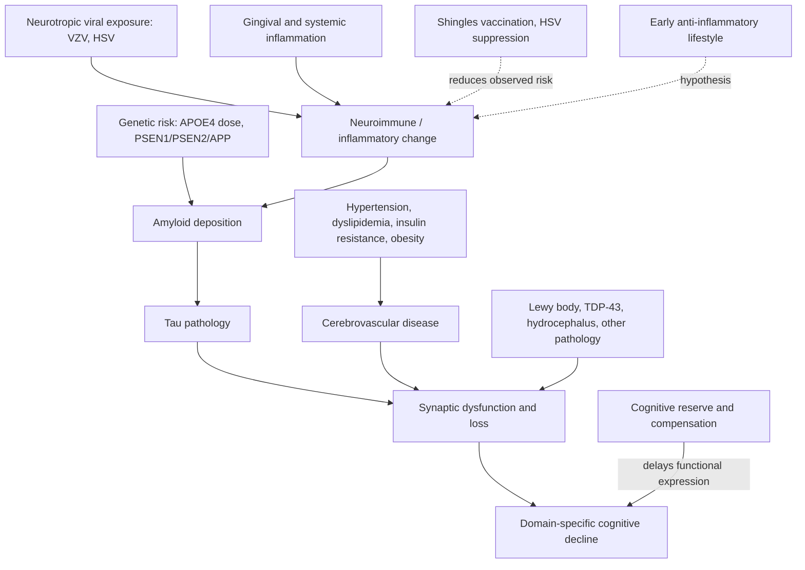

# Alzheimer's disease spectrum and diagnosis

Dementia is the umbrella term for progressive loss of connectivity between brain cells that produces loss of function; Alzheimer's disease is its most common cause. Alzheimer's is defined by progressive loss of synaptic connections driven by extraneuronal amyloid plaques, intracellular neurofibrillary tau tangles, and—increasingly recognized—inflammation in microglia and other glial cells that support neurons. It is not a binary condition: severity, affected domains, and trajectory span a spectrum from mild stable impairment to rapid deterioration, shaped by which brain regions carry the pathology and by comorbid conditions. (Peter Attia MD — "399 - The evolution of Alzheimer's disease and dementia care | Gayatri Devi, M.D.", 2026-07-13, [link](https://www.youtube.com/watch?v=x7NhqMOwdOM))

Pure Alzheimer's is rare. Autopsy series find that roughly 98–99% of Alzheimer's patients carry some concomitant primary brain pathology—most commonly cerebrovascular disease, plus Lewy body disease (about 40% of Alzheimer's patients eventually), TDP-43 pathology, argyrophilic grain disease, or hydrocephalus. Each admixture shifts presentation and trajectory, which is why a clinical picture is usually Alzheimer's plus something rather than one disease. Every Alzheimer's risk factor is also a stroke and cerebrovascular risk factor—a 2002 Circulation paper asked "Is Alzheimer's stroke?"—so hypertension, dyslipidemia, and insulin resistance are treated as causally relevant and treatable. (Peter Attia MD — "399 - The evolution of Alzheimer's disease and dementia care | Gayatri Devi, M.D.", 2026-07-13, [link](https://www.youtube.com/watch?v=x7NhqMOwdOM))

## Pathogenic sequence

The older model placed amyloid first, beginning two to three decades before clinical symptoms. Current thinking, as presented by neurologist Gayatri Devi, is that changes in inflammatory pathways may predate amyloid deposition by a substantial period: neuroimmune change, then amyloid, then tau, then synaptic dysfunction and cognitive decline, unfolding over decades. The prevention implication is that anti-inflammatory intervention as early as the 30s–40s might interrupt the cascade before it is triggered. Supporting observations include reduced dementia risk after shingles vaccination and suppressive HSV treatment (stronger data for varicella zoster), the gingival-health–dementia association, and Devi's anecdotal sibling pairs in which the aggressively immunotreated sibling—one an APOE4 homozygote—shows no amyloid while the other is severely affected; she labels the protective-immunomodulation explanation explicitly a hypothesis. (Peter Attia MD — "399 - The evolution of Alzheimer's disease and dementia care | Gayatri Devi, M.D.", 2026-07-13, [link](https://www.youtube.com/watch?v=x7NhqMOwdOM))

## Why diagnosis is hard: compensation and rigorous testing

High-reserve patients can perform well despite moderate or severe pathology. Screening instruments such as the Mini Mental Status Exam or MoCA can score 28–30 even 10–15 years into the condition in intelligent, high-functioning people, so a high index of suspicion and multi-hour neuropsychological testing are needed to uncover deficits. A single time point can still reveal decline through profile asymmetry: overall ability at the 99th percentile with language or visuospatial scores at the 10th percentile implies substantial loss being masked by compensation, and may justify more aggressive treatment. Domain matters prognostically—memory-predominant disease progresses more favorably than language-predominant disease. Devi is explicitly averse to global staging, preferring to stage each functional domain separately; a single overall stage she regards as reductionist and a disservice to patient and family. [[cognitive-reserve-and-brain-health]] (Peter Attia MD — "399 - The evolution of Alzheimer's disease and dementia care | Gayatri Devi, M.D.", 2026-07-13, [link](https://www.youtube.com/watch?v=x7NhqMOwdOM))

A comprehensive workup in her practice combines meticulous history (including immunological conditions and shingles exposure), multi-hour cognitive testing, EEG for early slowing, transcranial Doppler for regional blood flow, volumetric MRI of hippocampus and parietal regions, amyloid and tau PET where available, DAT scans when another process is suspected, and laboratory testing including ApoB, inflammatory markers, APOE genotype, and early-onset genetic screening when family history warrants; the full evaluation can be scheduled over two to three days. (Peter Attia MD — "399 - The evolution of Alzheimer's disease and dementia care | Gayatri Devi, M.D.", 2026-07-13, [link](https://www.youtube.com/watch?v=x7NhqMOwdOM))

## Biomarkers and their base-rate problem

Amyloid is common in cognitively normal older adults: roughly 25% of community-dwelling people in their 70s, over 30% in their 80s, and about 44% by 90 have brain amyloid without symptoms. Commercial blood assays (Lumipulse, PrecivityAD, Quest AD-Detect, C2N) are largely standardized against amyloid PET, so a positive result inherits amyloid's poor specificity for clinical disease; Devi argues they should be standardized against amyloid and tau, and recounts a patient diagnosed with Alzheimer's from an abnormal blood Aβ42 alone whose amyloid PET was negative. She therefore confirms with amyloid-plus-tau PET or lumbar puncture in anyone she is genuinely concerned about. CSF is cheaper and detects early tau changes that tau PET traditionally misses; antemortem CSF diagnosis has only existed since about 2007–2008, which is why she records unverified relatives as family history of dementia of unknown type—and why about 30% of participants in earlier Alzheimer's drug trials did not have Alzheimer's by pathology. Whether biomarkers alone suffice for diagnosis is an active institutional dispute: see [[alzheimers-diagnosis-biological-vs-clinical]]. (Peter Attia MD — "399 - The evolution of Alzheimer's disease and dementia care | Gayatri Devi, M.D.", 2026-07-13, [link](https://www.youtube.com/watch?v=x7NhqMOwdOM))

Genetic risk is tiered. PSEN1 mutations are described as 100% associated with (usually early-onset) Alzheimer's; APOE4 is a strong but non-deterministic modifier, with homozygosity framed by Devi as analogous to BRCA in breast cancer. Attia estimates lifetime incidence for APOE3/3 wild-type at roughly 6% for men and 10–12% for women, flagged as approximate. Identical twins can differ dramatically in risk and in onset—sometimes by 10–15 years—implicating inflammation, epigenetics, and individual brain differences beyond sequence identity. (Peter Attia MD — "399 - The evolution of Alzheimer's disease and dementia care | Gayatri Devi, M.D.", 2026-07-13, [link](https://www.youtube.com/watch?v=x7NhqMOwdOM))

## Sex differences

Women have higher Alzheimer's prevalence even after adjusting for their longer life expectancy. Candidate explanations discussed: decades of postmenopausal estrogen absence (estrogen receptors co-localize in memory-relevant regions such as the hippocampus, where estrogen drives synaptic sprouting—early work by Dominique Toran-Allerand; Barbara Sherwin documented Alzheimer's-like memory and executive deficits after surgical menopause); women surviving cardiovascular insults that kill men earlier, leaving more years at risk with vascular pathology; and sex-based immunological differences paralleling multiple sclerosis and lupus. Presentation differs even though biomarker patterns generally do not: women more often present with depression, withdrawal, and language difficulty; men more often with aggression and agitation. Women presenting with Alzheimer's tend to have had earlier menopause and no hormone replacement. [[menopause-related-cognitive-impairment]] (Peter Attia MD — "399 - The evolution of Alzheimer's disease and dementia care | Gayatri Devi, M.D.", 2026-07-13, [link](https://www.youtube.com/watch?v=x7NhqMOwdOM))

## Normal forgetting versus disease signal

Difficulty retrieving proper names is common and usually benign: names are arbitrary labels—Devi calls a name a neologism with little intrinsic meaning—stored more episodically, and brains are designed to forget most episodic detail; some speculate humans are built to hold on the order of 150 names. The more concerning pattern is progressive difficulty retrieving common nouns and category vocabulary (the ordinary words for objects, or shades of a color), because that fact-like semantic knowledge sits in different brain systems and its erosion tracks disease. Occasional slow name recall in a high-functioning person is expected physiology, not early Alzheimer's. (Peter Attia MD — "399 - The evolution of Alzheimer's disease and dementia care | Gayatri Devi, M.D.", 2026-07-13, [link](https://www.youtube.com/watch?v=x7NhqMOwdOM))

## Management architecture

Even before disease-modifying drugs, care followed an HIV-style cocktail model: cholinesterase inhibitors (donepezil, galantamine), memantine (an NMDA-receptor antagonist framed as improving neural signal-to-noise and possibly limiting apoptosis), antiviral suppression (valacyclovir) in selected patients, immune-modifying treatment when indicated, aggressive comorbidity control, ventriculoperitoneal shunting for hydrocephalus, and off-label neuronavigated transcranial magnetic stimulation (used since 2008; targets include dorsolateral prefrontal cortex, Broca's area, precuneus, and Wernicke's area) to maintain circuit function regardless of pathology source, with particular reported benefit for language. Anti-amyloid monoclonal antibodies now add a disease-modifying layer: see [[anti-amyloid-immunotherapy]]. Devi's own headline belief change after three decades in the field: "I never thought that patients with Alzheimer's could get better. Ever." — she now believes, on biomarker-confirmed cases, that they can. (Peter Attia MD — "399 - The evolution of Alzheimer's disease and dementia care | Gayatri Devi, M.D.", 2026-07-13, [link](https://www.youtube.com/watch?v=x7NhqMOwdOM))

## Practical implications

- **Ongoing, from midlife: treat hypertension, dyslipidemia, insulin resistance, and obesity as brain interventions — strong for vascular risk, moderate for Alzheimer's specifically.** Anything good for the heart is presented as good for the brain regardless of pathology. (Peter Attia MD — "399 - The evolution of Alzheimer's disease and dementia care | Gayatri Devi, M.D.", 2026-07-13, [link](https://www.youtube.com/watch?v=x7NhqMOwdOM))
- **Once, by ~50: shingles vaccination after prior varicella exposure; consider suppressive antiviral therapy for recurrent HSV — moderate (epidemiologic plus limited vaccine-trial data), mechanism inflammatory and unproven.** (Peter Attia MD — "399 - The evolution of Alzheimer's disease and dementia care | Gayatri Devi, M.D.", 2026-07-13, [link](https://www.youtube.com/watch?v=x7NhqMOwdOM))
- **When decline is suspected in a high-functioning person: insist on multi-hour neuropsychological testing with domain-level percentile comparison, not a MoCA/MMSE screen — strong clinical principle from this practice.** A 28–30 screening score excludes nothing in a high-reserve patient.
- **Before accepting an Alzheimer's diagnosis from a blood test alone: require confirmation with amyloid and tau imaging or CSF — strong practice position, contested institutionally.** [[alzheimers-diagnosis-biological-vs-clinical]]
- **Do not treat occasional proper-name retrieval failure as disease; escalate if common-noun word-finding, multitasking, or function progressively deteriorates — moderate.**

## Gaps & open questions

- Does neuroimmune change actually precede amyloid in most patients, and can early anti-inflammatory intervention measurably prevent the cascade?
- What explains discordance in APOE4-homozygous siblings and identical twins—protective immunophenotypes, epigenetics, or unmeasured exposure?
- Can blood biomarkers be re-standardized against combined amyloid-plus-tau-plus-symptoms endpoints to fix the asymptomatic-amyloid specificity problem?
- Which components of the multi-modality workup (EEG slowing, transcranial Doppler, domain profiles) independently improve prediction or treatment selection?
- Why do women's presentations differ while biomarker patterns do not, and how much female excess risk is hormonal versus immunological versus survivorship?

## Related

[[alzheimers-diagnosis-biological-vs-clinical]] · [[anti-amyloid-immunotherapy]] · [[lewy-body-disease-and-synucleinopathies]] · [[menopause-related-cognitive-impairment]] · [[cognitive-reserve-and-brain-health]] · [[gayatri-devi]] · [[inflammaging-and-il-6]] · [[proactive-health-monitoring]] · [[glp-1-receptor-agonists]] · [[aging-model]] · [[practice-playbook]]
