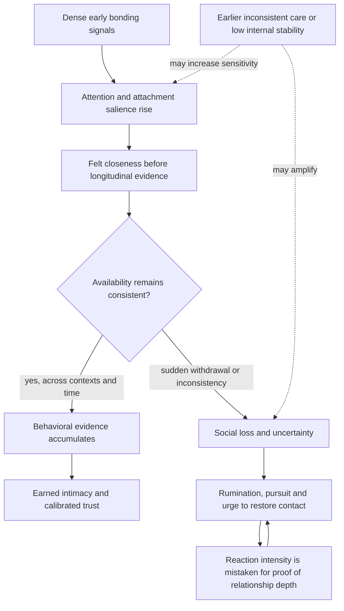
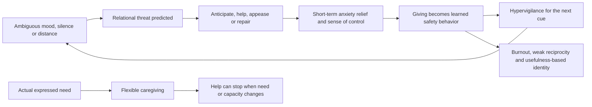
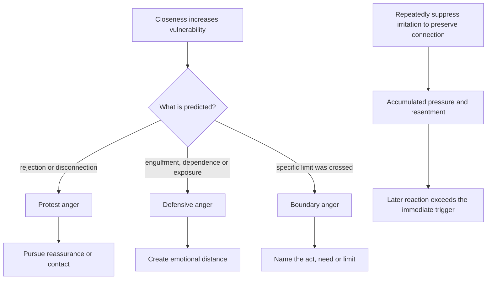

# Attachment threat and relational regulation

Attachment regulation is the process by which the nervous system uses closeness, responsiveness, and predictable availability to estimate interpersonal safety. Caregiving is related but functionally different: attachment behavior seeks safety for oneself, whereas caregiving responds to another person's need. Healthy intimacy lets both systems remain flexible. Difficulty arises when intense bonding signals, inconsistent availability, or prior learning recruit protection before enough behavioral evidence exists to establish trust. (@DrTraceyMarks (Dr. Tracey Marks) — "Overgiving Isn't Kindness—It's a Threat Response", 2026-05-06, [link](https://www.youtube.com/watch?v=u0z4SNSZfn0); @DrTraceyMarks (Dr. Tracey Marks) — "Why Love Bombing Hurts Like Physical Pain", 2026-05-13, [link](https://www.youtube.com/watch?v=XfnzES5x_FM))

## Intensity is not intimacy

Early attention, responsiveness, emotional availability, frequent contact, and strong supportive language are ordinary cues of affiliation. When delivered at unusually high intensity, they can make a new person salient before their consistency, emotional stability, trustworthiness, and capacity to sustain closeness have been observed across situations. Felt attachment can therefore be genuine while the inference that the relationship is dependable remains poorly evidenced. Time is not sufficient for intimacy, but it permits repeated observation; intensity compresses the feeling of closeness without supplying that longitudinal information. (@DrTraceyMarks (Dr. Tracey Marks) — "Why Love Bombing Hurts Like Physical Pain", 2026-05-13, [link](https://www.youtube.com/watch?v=XfnzES5x_FM))

Marks proposes oxytocin-assisted bonding and dopamine-assisted salience as contributors to early attachment, and overlap between social rejection and physical-pain processing as a contributor to withdrawal distress. These broad ideas are plausible, but the transcript does not establish a chemical signature of love bombing, show that the anterior cingulate uniquely causes the pain, or measure the proposed pathway in affected people. The stronger teaching point is behavioral: the intensity and frequency of bonding cues can outrun evidence, and a strong withdrawal reaction does not by itself show that the relationship was healthy, durable, or uniquely important. (@DrTraceyMarks (Dr. Tracey Marks) — "Why Love Bombing Hurts Like Physical Pain", 2026-05-13, [link](https://www.youtube.com/watch?v=XfnzES5x_FM))

Love bombing is best treated here as a relational pattern, not a diagnosis or proof of intent. Its destabilizing form couples accelerated closeness to later inconsistency or withdrawal. Some people may deploy that sequence manipulatively, but the transcript's mechanism cannot determine another person's motive. A person with earlier unpredictable care, current emotional deprivation, or a self-concept that reorganizes quickly around relationships may be more sensitive to the sequence; these are proposed vulnerability factors, not deterministic traits. (@DrTraceyMarks (Dr. Tracey Marks) — "Why Love Bombing Hurts Like Physical Pain", 2026-05-13, [link](https://www.youtube.com/watch?v=XfnzES5x_FM))

## When caregiving becomes threat regulation

Generosity is flexible, responsive to a real need, and can stop without making the relationship feel endangered. Overgiving is a proposed pattern in which anticipating needs, initiating contact, repairing moods, apologizing, or providing help becomes difficult to stop because the behavior regulates the giver's anxiety. The behavior may benefit the recipient and still serve a protective function. The discriminating question is therefore not how much was given, but whether the act was chosen and need-responsive or felt compulsory and necessary to prevent rejection, conflict, withdrawal, or abandonment. (@DrTraceyMarks (Dr. Tracey Marks) — "Overgiving Isn't Kindness—It's a Threat Response", 2026-05-06, [link](https://www.youtube.com/watch?v=u0z4SNSZfn0))

This loop overlaps with the fawn category in [[protective-threat-responses]]: usefulness and appeasement may reduce perceived relational danger when direct refusal, receiving, or calm feels unsafe. Repetition can make crisis management familiar and uneventful reciprocity uncomfortable. Marks further proposes that oxytocin-associated relief may reinforce giving itself, but this specific endocrine account was not directly tested or externally reviewed in the supplied material. The observable costs are more defensible than the hormonal explanation: continuous emotional monitoring is effortful, unilateral management reduces reciprocity, and tying worth to usefulness makes rest or receiving feel like identity loss. (@DrTraceyMarks (Dr. Tracey Marks) — "Overgiving Isn't Kindness—It's a Threat Response", 2026-05-06, [link](https://www.youtube.com/watch?v=u0z4SNSZfn0))

## Anger as distance, protest, or boundary information

Closeness increases both access to support and exposure to loss, rejection, dependence, and misunderstanding. Anger can then regulate interpersonal distance. Defensive anger creates space when vulnerability feels threatening; it may appear as disproportionate criticism, irritability, argument, coldness, or withdrawal after closeness. Protest anger instead attempts to restore uncertain connection, while boundary anger identifies a specific violation and supports a proportionate request or limit. The categories concern function rather than surface intensity, and they do not excuse aggression or establish that all relationship anger masks fear. (@DrTraceyMarks (Dr. Tracey Marks) — "Why You Pick Fights When You Feel Close", 2026-05-20, [link](https://www.youtube.com/watch?v=5Ow1rDBSKFc))

Suppression creates a second pathway: irritation or unmet needs are withheld to protect the bond, pressure accumulates, and a later minor event releases a response shaped by the entire backlog. This differs from a rapid defensive reaction to closeness, though both can produce a fight whose timing seems puzzling. A useful distinction is whether the anger clarifies a concrete present violation and settles after direct expression, or mainly produces vague conflict and relief through distance. This is a practical functional analysis, not a validated diagnostic test. (@DrTraceyMarks (Dr. Tracey Marks) — "Why You Pick Fights When You Feel Close", 2026-05-20, [link](https://www.youtube.com/watch?v=5Ow1rDBSKFc))

## Evidence and interpretation boundaries

The transcripts synthesize attachment theory, threat learning, social-pain research, two-factor theories of emotion, and accessible neurochemical explanations into a coherent educational model. They do not provide citations, systematic evidence review, effect sizes, or trials of the proposed self-tests. Evidence is therefore **emerging and indirect for the exact mechanisms and protocols**. The distinctions between behavioral intensity and demonstrated consistency, voluntary and compulsory giving, and defensive versus boundary functions are useful observational hypotheses. They should not be used to diagnose an attachment style, infer manipulation, reduce every conflict to childhood learning, or reinterpret credible abuse as a nervous-system misunderstanding. (@DrTraceyMarks (Dr. Tracey Marks) — "Overgiving Isn't Kindness—It's a Threat Response", 2026-05-06, [link](https://www.youtube.com/watch?v=u0z4SNSZfn0); @DrTraceyMarks (Dr. Tracey Marks) — "Why Love Bombing Hurts Like Physical Pain", 2026-05-13, [link](https://www.youtube.com/watch?v=XfnzES5x_FM); @DrTraceyMarks (Dr. Tracey Marks) — "Why You Pick Fights When You Feel Close", 2026-05-20, [link](https://www.youtube.com/watch?v=5Ow1rDBSKFc))

## Practical implications

- **During an unusually intense new relationship, compare feeling strength with behavioral knowledge — emerging/clinically plausible.** At least weekly during the early phase, ask how much repeated evidence exists for consistency, accountability, emotional stability, respect for limits, and sustained availability. Do not treat frequency of contact or withdrawal pain as proof of safety or depth. (@DrTraceyMarks (Dr. Tracey Marks) — "Why Love Bombing Hurts Like Physical Pain", 2026-05-13, [link](https://www.youtube.com/watch?v=XfnzES5x_FM))
- **When contact is withdrawn, label the state before acting — emerging.** Identify loss, uncertainty, pain, and restoration urges; delay interpreting their intensity as a mandate to reconnect, then assess the person's repeated behavior. Seek support when distress is severe or functioning is impaired. (@DrTraceyMarks (Dr. Tracey Marks) — "Why Love Bombing Hurts Like Physical Pain", 2026-05-13, [link](https://www.youtube.com/watch?v=XfnzES5x_FM))
- **For recurrent overgiving, run a small receiving test for about one week — unvalidated self-observation protocol.** Choose one nonessential behavior such as always initiating or fixing another adult's ordinary mood, reduce it without punitive withdrawal, and record anxiety, guilt, what actually happens, and whether reciprocity appears. Do not withhold agreed care, dependent care, urgent help, or safety-critical action. (@DrTraceyMarks (Dr. Tracey Marks) — "Overgiving Isn't Kindness—It's a Threat Response", 2026-05-06, [link](https://www.youtube.com/watch?v=u0z4SNSZfn0))
- **At each strong urge to give, compare past and present — emerging.** Ask whether help answers a current request or attempts to prevent a feared outcome, and whether the urgency fits present evidence or resembles an older pressure. The answer may be both; the aim is restored choice, not less care. (@DrTraceyMarks (Dr. Tracey Marks) — "Overgiving Isn't Kindness—It's a Threat Response", 2026-05-06, [link](https://www.youtube.com/watch?v=u0z4SNSZfn0))
- **When anger appears around closeness, inspect the moment immediately before it — emerging.** Distinguish a specific crossed boundary from fear of rejection, dependence, exposure, or misunderstanding. Express a real boundary directly; pause defensive escalation and return when regulated. Repeated coercion, intimidation, violence, or credible danger requires protection, not relational experimentation. (@DrTraceyMarks (Dr. Tracey Marks) — "Why You Pick Fights When You Feel Close", 2026-05-20, [link](https://www.youtube.com/watch?v=5Ow1rDBSKFc))

## Gaps & open questions

- Which prospective behavioral markers best distinguish accelerated but healthy courtship from destabilizing intensity-withdrawal patterns?
- How much do cue density, elapsed time, prior attachment learning, current loneliness, and digital communication independently affect early bonding and withdrawal distress?
- Are the proposed oxytocin, dopamine, anterior-cingulate, and attachment-versus-caregiving mechanisms measurable in people who report love bombing or overgiving, and do they predict outcomes beyond self-report?
- Can a receiving test reduce compulsive giving or improve reciprocity without producing strategic withdrawal, missed care, or greater conflict?
- How reliably can people distinguish defensive, protest, boundary, and accumulated anger in real time, and does doing so improve safety or relationship quality?
- How should these models be adapted where power imbalance, disability, caregiving duty, culture, or material dependence changes what reciprocity and free choice mean?

## Related

[[protective-threat-responses]] · [[interpersonal-regulation-and-emotional-capacity]] · [[trust-repair-and-safety-learning]] · [[stress-threat-discrimination]] · [[emotional-memory-reactivation-and-rumination]] · [[tracey-marks]] · [[practice-playbook]]
