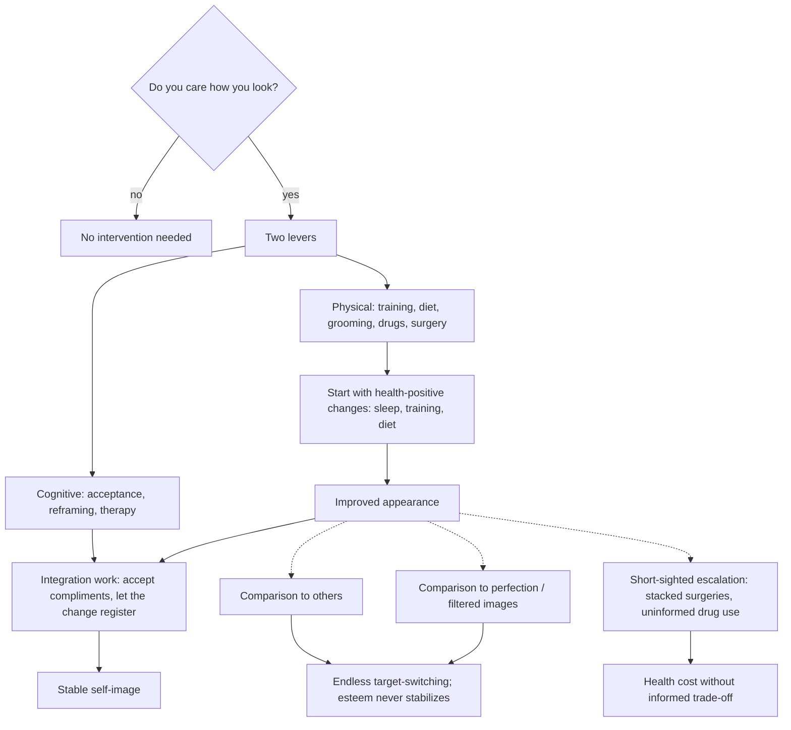

# Body image and appearance change

Body image is the evaluative representation a person holds of their own appearance. Two broad strategies exist for improving it: cognitive work (changing the appraisal — self-acceptance, reframing, therapy) and appearance change (changing the input — training, diet, grooming, pharmacology, surgery). Public discussion tends to treat only the first as legitimate. Exercise scientist Mike Israetel's framework, argued at book length, is that both are valid levers with different failure modes, and that for people who care about their appearance, changing the body and then doing the cognitive work — in that order — minimizes the discordance between what the mirror shows and what the person is trying to believe. The framework's empirical anchor is that attractiveness perception has large cross-cultural regularities (waist-to-hip ratio, skin quality, symmetry): the same evaluative machinery a person applies to others applies to their own reflection, which is why purely verbal reassurance often fails to move self-assessment. Cultural-universal regularities in attractiveness judgments are real in the psychology literature, though their strength and scope are debated; the stronger inference — that cognitive reframing therefore cannot work for people far from those standards — is Israetel's position rather than an established finding. (@maxlugavere (Max Lugavere) — "The Muscle Building Expert: The Dark Truth About Body Positivity - Dr. Mike Israetel", 2026-06-24, [link](https://www.youtube.com/watch?v=VD0j7rU-lx4))

## The three failure modes of vanity

Israetel's taxonomy separates the pursuit of looking better, which he defends, from three patterns that make it destructive. First, comparison to other people: the reference target simply advances each time it is surpassed, so the process cannot terminate in satisfaction. Second, comparison to perfection, made worse by social media, where filters and selective posting mean the standard is a composite that no one — including its poster — actually embodies. Third, short-sighted escalation: stacked cosmetic surgeries or uninformed drug use where the person does not know the long-term costs they are incurring. His prescribed alternative frame is self-referenced progress (present self versus past self) and deliberately registering improvement rather than attending only to the remaining deficit. He is explicit that informed trade-offs are a different category — he describes his own steroid use as knowingly trading lifespan for a look — which places the ethical line at informed consent rather than at any particular intervention. (@maxlugavere (Max Lugavere) — "The Muscle Building Expert: The Dark Truth About Body Positivity - Dr. Mike Israetel", 2026-06-24, [link](https://www.youtube.com/watch?v=VD0j7rU-lx4))

Algorithmic feeds intensify the comparison patterns mechanically rather than conspiratorially: recommendation systems optimize for continued engagement, so a user who clicks on appearance-comparison content is served more of it. The exit is behavioral (stop engaging with the toxic category) rather than platform-provided. (@maxlugavere (Max Lugavere) — "The Muscle Building Expert: The Dark Truth About Body Positivity - Dr. Mike Israetel", 2026-06-24, [link](https://www.youtube.com/watch?v=VD0j7rU-lx4))

## Body dysmorphia versus high standards

Body dysmorphic disorder is a psychiatric diagnosis, and its distinguishing test is the failure of objective self-appraisal: a contest-lean bodybuilder who genuinely believes he looks small (and hides in layered clothing), or the anorexia-pattern conviction of being overweight at emaciated body weight, cannot accurately place their body relative to the population. Wanting to look better than average, or better than one currently does, is not dysmorphia — the person can still appraise accurately ("I am far leaner than average and my midsection is a weak point" is an accurate composite, not a distorted one). The distinction matters clinically because dysmorphia predicts escalation that never satisfies, whereas accurate-appraisal vanity responds normally to achieved change. Prevalent-but-rare is Israetel's characterization of true dysmorphia; population prevalence estimates for BDD run in the low single-digit percent range. (@maxlugavere (Max Lugavere) — "The Muscle Building Expert: The Dark Truth About Body Positivity - Dr. Mike Israetel", 2026-06-24, [link](https://www.youtube.com/watch?v=VD0j7rU-lx4))

## The cost curve of leanness

Appearance and well-being diverge below a personal body-fat threshold. Israetel's heuristic — roughly 15–17% body fat for women and around 10% for men, with wide individual variation — marks where further leanness typically begins purchasing appearance with escalating costs: persistent food preoccupation, low energy, reduced or absent sex drive, anhedonia, and degraded sleep. His self-report of losing the capacity to enjoy anything except thoughts of food at contest leanness, despite maximal GLP-1-class pharmacology, illustrates that appetite drives reassert themselves against both willpower and drugs at sufficient energy deficit. The physiology is the same energy-availability conservation described in [[low-energy-availability-and-menstrual-function]]; the practical consequence is that the shredded-with-cheeseburgers imagery that circulates on social media depicts either momentary post-contest staging or unusual genetics, not an available steady state. The recommended approach is experimenting up from a very lean point to find the highest-appearance body fat at which sleep, libido, mood, and food indifference are intact — and doing cognitive work if the preferred look sits below the livable threshold. These thresholds are coach-experience heuristics, not measured population cutoffs. (@maxlugavere (Max Lugavere) — "The Muscle Building Expert: The Dark Truth About Body Positivity - Dr. Mike Israetel", 2026-06-24, [link](https://www.youtube.com/watch?v=VD0j7rU-lx4))

## Body positivity and the GLP-1 test

The body-positivity movement's claim that all bodies are beautiful functioned for many adherents as a coping strategy for weight that felt uncontrollable, and Israetel reads the mass adoption of GLP-1 receptor agonists as the revealed-preference test: when effective pharmacological appetite control arrived, large numbers of people who had professed acceptance chose weight loss. His long-standing position — that the number one reason people were overweight is because of hunger management, and that only drugs would end population-scale obesity because the modern food environment defeats willpower — is developed with the evolutionary-mismatch mechanism at [[evolutionary-mismatch-and-weight-regulation]] and [[glp-1-receptor-agonists]]. The sympathetic reading of body positivity (self-worth should not be contingent on appearance; coping is legitimate) and the critical reading (the literal claim was false and collapsed on contact with an alternative) are both represented in the conversation; this page records the tension rather than resolving it. (@maxlugavere (Max Lugavere) — "The Muscle Building Expert: The Dark Truth About Body Positivity - Dr. Mike Israetel", 2026-06-24, [link](https://www.youtube.com/watch?v=VD0j7rU-lx4))

## Practical implications

- **If appearance dissatisfaction is a live source of distress, sequence health-positive appearance changes first — sleep, resistance training, protein-adequate diet, grooming — before any intervention with health costs; give it years, not weeks — expert guidance consistent with strong evidence for the component behaviors' health effects.** (@maxlugavere (Max Lugavere) — "The Muscle Building Expert: The Dark Truth About Body Positivity - Dr. Mike Israetel", 2026-06-24, [link](https://www.youtube.com/watch?v=VD0j7rU-lx4))
- **Restrict comparison to your own past state; deliberately register progress and compliments rather than deflecting them — expert cognitive protocol, low formal evidence, negligible risk.** This is self-administered cognitive-behavioral practice: notice the comparison thought, decline it, substitute a self-referenced framing. (@maxlugavere (Max Lugavere) — "The Muscle Building Expert: The Dark Truth About Body Positivity - Dr. Mike Israetel", 2026-06-24, [link](https://www.youtube.com/watch?v=VD0j7rU-lx4))
- **When leaning out, predefine the end state and the trade-offs you accept; treat persistent food obsession, lost libido, flat mood, and broken sleep as signals you are below your livable body-fat range — moderate physiological rationale, heuristic thresholds.** (@maxlugavere (Max Lugavere) — "The Muscle Building Expert: The Dark Truth About Body Positivity - Dr. Mike Israetel", 2026-06-24, [link](https://www.youtube.com/watch?v=VD0j7rU-lx4))
- **Unfollow or stop engaging with appearance-comparison content; assume filtered and selected images overstate every reference body — mechanistic, consistent with how recommender systems work.** (@maxlugavere (Max Lugavere) — "The Muscle Building Expert: The Dark Truth About Body Positivity - Dr. Mike Israetel", 2026-06-24, [link](https://www.youtube.com/watch?v=VD0j7rU-lx4))
- **Seek clinical evaluation when self-appraisal fails the objectivity test (conviction of looking small/fat against objective evidence) or when escalating procedures never produce satisfaction — standard psychiatric guidance for body dysmorphic disorder.** (@maxlugavere (Max Lugavere) — "The Muscle Building Expert: The Dark Truth About Body Positivity - Dr. Mike Israetel", 2026-06-24, [link](https://www.youtube.com/watch?v=VD0j7rU-lx4))

## Gaps & open questions

- Does appearance change reliably improve stable self-esteem in prospective studies, and for whom does the improvement fail to "take"?
- How strong and how universal are cross-cultural attractiveness regularities once media exposure is controlled for?
- What are measured population distributions of the body-fat threshold below which mood, libido, and cognition degrade, by sex and training status?
- Did GLP-1 adoption measurably change body-image distress and eating-disorder incidence in either direction?
- Can algorithm-level or AI-assistant-level interventions reduce appearance-comparison harm, or does mitigation remain purely behavioral?

## Related

[[evolutionary-mismatch-and-weight-regulation]] · [[glp-1-receptor-agonists]] · [[low-energy-availability-and-menstrual-function]] · [[satiety-oriented-diet-design]] · [[energy-balance-and-calorie-counting]] · [[resistance-training]] · [[abdominal-definition-and-training]] · [[self-schema-updating-after-achievement]] · [[durable-well-being-and-hedonic-adaptation]] · [[mental-strength-and-behavioral-skills]] · [[mike-israetel]]
