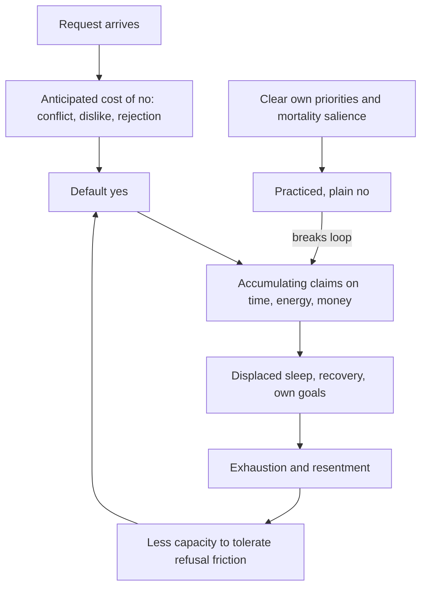

# Boundaries and overcommitment

A commitment is a claim on future time, energy, attention, or money. Overcommitment is the chronic state of holding more such claims than one's capacity, and it is usually built one small yes at a time: each acceptance is individually cheap, socially rewarded, and immediately relieving (it avoids the friction of refusal), while its cost lands later and diffusely — displaced sleep, displaced deep work, displaced recovery. Refusal has the mirrored structure: an immediate social cost (risk of disappointment, conflict, being disliked) purchasing a delayed, private benefit. This asymmetry is why default behavior drifts toward yes, and why boundary-setting must be treated as a deliberate skill rather than a personality trait. Occupational-health research links chronic overcommitment and effort–reward imbalance to burnout and stress-related illness; the framing and protocols on this page, however, come from lived-experience and practitioner sources and are graded accordingly. (@maxlugavere (Max Lugavere) — "He Lost 20 Years. Don’t Waste Yours - Wallo267", 2026-07-01, [link](https://www.youtube.com/watch?v=j91W_HRHT44))

## The yes/no asymmetry

Wallo267 — an entrepreneur and author who served 20 years in prison and built his framework from that lost time — teaches the asymmetry in blunt terms: yes downplays your needs to take care of somebody else, no takes care of you; people fear no because it is culturally wired to disappointment and rejection, so they buy acceptance with commitments they resent. His companion move is to disarm the standard counter-attack: calling someone selfish for declining is, in his framing, a manipulation word — a con to make choosing yourself feel wrong — evidenced by the fact that nearly everyone, forced to choose, chooses themselves. He attributes much burnout directly to the inability to refuse: the stress is not only the obligation itself but the anticipatory rumination over obligations one never wanted. These are lived-experience claims, congruent with the avoidance-relief loop in [[mental-strength-and-behavioral-skills]] and the social-evaluative fear mechanics in [[social-evaluative-threat-and-criticism]], but carried here by testimony rather than trials. (@maxlugavere (Max Lugavere) — "He Lost 20 Years. Don’t Waste Yours - Wallo267", 2026-07-01, [link](https://www.youtube.com/watch?v=j91W_HRHT44))

The tension worth keeping visible: social connection is among the strongest correlates of well-being and healthy aging ([[relationship-maintenance-and-friendship]]), and a boundary practice that hardens into reflexive isolation trades one failure mode for another. The defensible target is selective commitment — protecting capacity for the relationships and work one actually values — not minimized obligation. Wallo's own endpoint is consistent with this: his stated definition of a good life is rest, good food, and people who love him unconditionally. (@maxlugavere (Max Lugavere) — "He Lost 20 Years. Don’t Waste Yours - Wallo267", 2026-07-01, [link](https://www.youtube.com/watch?v=j91W_HRHT44))

## Concentrated effort and designed rest

Against always-on hustle culture, Wallo proposes a 3-and-9 structure: compress a year's core creative output into roughly 90 days of concentrated, batched work (his worked example: two hours a day for a month yields sixty podcast episodes — a year of weekly content), then defend the remaining months for rest, travel, and living. The load-bearing ideas generalize better than the ratio: batching similar work exploits setup costs; pre-structuring the calendar converts diffuse obligation into bounded commitment; and rest is treated as a scheduled product of design, not a residue. He pairs this with unapologetic sleep advocacy — rejecting sleep-when-you're-dead culture — and the observation that chronic overcommitment visibly ages people (people in their 30s looking 60, in his phrasing), which the wiki's sleep and recovery pages support in mechanism if not in his magnitude ([[sleep-quality-and-circadian-alignment]], [[exercise-recovery-and-readiness]]). The sprint/rest periodization itself is untested as a productivity intervention and will fit self-directed workers far better than employees. (@maxlugavere (Max Lugavere) — "He Lost 20 Years. Don’t Waste Yours - Wallo267", 2026-07-01, [link](https://www.youtube.com/watch?v=j91W_HRHT44))

Two further attributed perspectives complete his framework. Mortality salience as motivation: time is indifferent (time is not your friend or your family, in his words), most people act as if they have forever, and the corrective question is what one's legacy should be — a deliberate use of death awareness that parallels the urgency framing in [[durable-well-being-and-hedonic-adaptation]]'s satisfaction material and in [[meaning-boredom-and-technology]]. And discipline versus motivation: motivation is the cheering crowd on game day, discipline is the empty locker room and the rainy-night run nobody sees — the same motivation-is-transient principle recorded from Jocko Willink at [[mental-strength-and-behavioral-skills]], arrived at independently. His praise of naivety (not knowing the odds preserves imagination and initiative; prison, he says, insulated his imagination from daily erosion) is a genuinely contrarian minority view — most decision literature favors calibration — retained here as attributed perspective. (@maxlugavere (Max Lugavere) — "He Lost 20 Years. Don’t Waste Yours - Wallo267", 2026-07-01, [link](https://www.youtube.com/watch?v=j91W_HRHT44))

## Practical implications

- **Before answering any non-trivial request: pause and price the yes — what specific time, energy, money, and displaced priority it costs — rather than defaulting to acceptance — Investigational practice; mechanistically coherent with avoidance-relief learning, no trials.** A delayed answer (let me check and get back to you) buys the pricing time cheaply. (@maxlugavere (Max Lugavere) — "He Lost 20 Years. Don’t Waste Yours - Wallo267", 2026-07-01, [link](https://www.youtube.com/watch?v=j91W_HRHT44))
- **Practice plain, unexplained refusal for low-stakes requests — Investigational practice.** Treat discomfort at delivering a no as a graded-exposure target like any other in [[mental-strength-and-behavioral-skills]]; escalating justifications invite negotiation.
- **If chronically exhausted: audit the obligation ledger before auditing the sleep hygiene — limited; burnout's link to effort–reward imbalance is established at the population level, the audit protocol is not.** Cutting unwanted commitments addresses the load side that recovery technique cannot.
- **For self-directed work: batch similar output into concentrated blocks and schedule rest as a first-class calendar item — Investigational practice; setup-cost logic is sound, the 3-and-9 ratio is personal doctrine.** (@maxlugavere (Max Lugavere) — "He Lost 20 Years. Don’t Waste Yours - Wallo267", 2026-07-01, [link](https://www.youtube.com/watch?v=j91W_HRHT44))
- **Boundary-setting must not become isolation: preserve and invest in the small set of relationships that are unconditionally valued — strong, from the well-being literature summarized at [[relationship-maintenance-and-friendship]].**

## Gaps & open questions

- Does explicit refusal training reduce burnout or stress biomarkers in controlled designs, distinct from general assertiveness training?
- Does sprint-and-rest periodization of knowledge work outperform steady scheduling for output or well-being, and for which temperaments?
- When does mortality-salience framing motivate action versus trigger avoidance or anxiety (terror-management effects cut both ways)?
- How much of the overcommitment–burnout association is causal load versus trait negative affect or job structure?

## Related

[[mental-strength-and-behavioral-skills]] · [[social-evaluative-threat-and-criticism]] · [[interpersonal-regulation-and-emotional-capacity]] · [[relationship-maintenance-and-friendship]] · [[durable-well-being-and-hedonic-adaptation]] · [[meaning-boredom-and-technology]] · [[sleep-quality-and-circadian-alignment]] · [[emotion-regulation]] · [[practice-playbook]]
