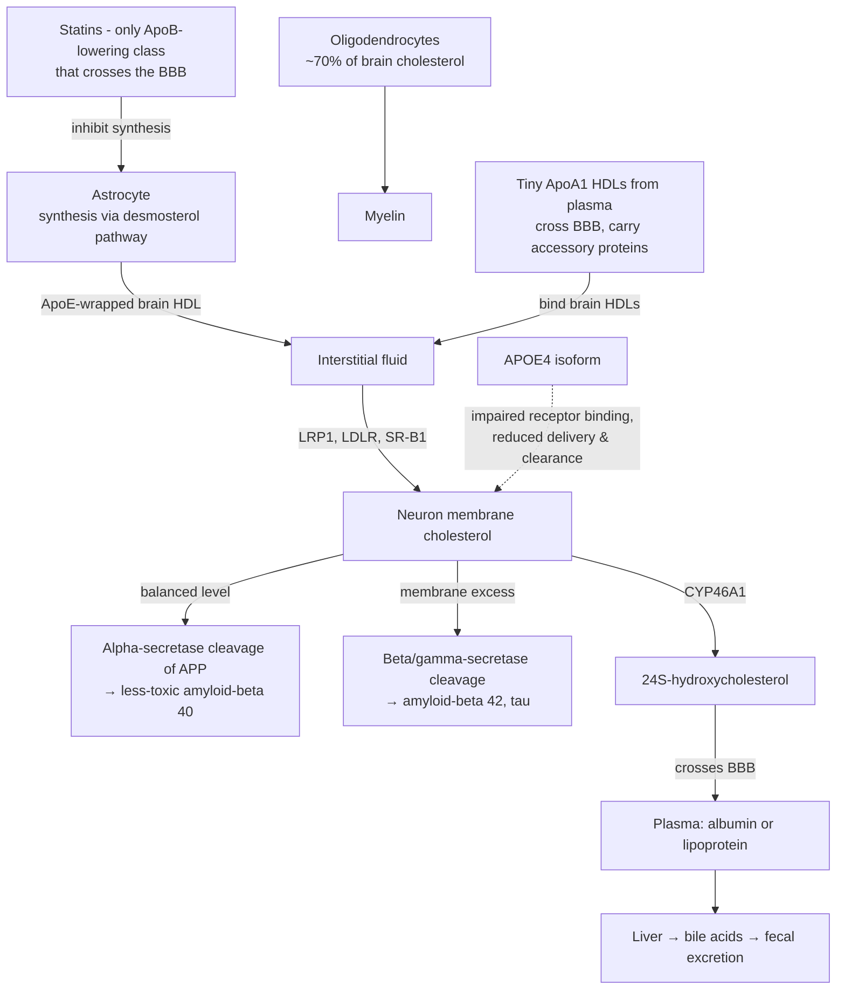

# Brain cholesterol homeostasis

The brain runs a cholesterol economy almost completely sealed off from the bloodstream. It is the most cholesterol-rich organ in the body — roughly 20–25 g of the body's ~140 g total, about 20 times the liver's 3–5 g — and it synthesizes essentially all of it locally, because ApoB-containing lipoproteins (VLDL, LDL) are far too large to cross the blood–brain barrier. Where the liver behaves as a high-flux transfer station, the brain hoards: the half-life of brain cholesterol is about five years versus days in the periphery. Most of the pool sits in membranes, above all in myelin. Plasma cholesterol levels therefore say nothing about brain cholesterol supply — toddlers with LDL cholesterol around 30 mg/dL build their brains to near-adult size by age 10 — which undercuts the common fear that aggressive lipid-lowering starves the brain. (@PeterAttiaMD (Peter Attia MD) — "395 – Brain lipidology: understanding APOE, cholesterol homeostasis, Alzheimer’s disease, & more", 2026-06-09, [link](https://www.youtube.com/watch?v=KWNgAyurXFY))

## Who makes it, who uses it

Every brain cell synthesizes cholesterol in utero and through childhood. Around age 10, when adult brain size is reached, neurons stop: cholesterol synthesis takes 37 enzymatic steps consuming over 30 ATP per molecule, and neurons — the brain's most energetically active cells — outsource production rather than divert ATP from firing. Oligodendrocytes continue producing about 70% of brain cholesterol (myelin), astrocytes supply neurons, and microglia (the resident immune cells) make little. Delivery uses lipoproteins built for the brain's interstitial space rather than blood: astrocytes wrap cholesterol in apolipoprotein E, producing particles with the size and density of plasma HDL — hence "brain HDLs" — but structured around two or three copies of ApoE instead of ApoA1. Neurons take these up through three receptors, all of which in the brain recognize ApoE: the LDL receptor, LRP1 (which does most of the clearance), and scavenger receptor B1. The episode's guest lipidologist argues the "LDL receptor" name misleads — in the brain there are no LDLs, and the receptor functions as an ApoB/ApoE receptor. (@PeterAttiaMD (Peter Attia MD) — "395 – Brain lipidology: understanding APOE, cholesterol homeostasis, Alzheimer’s disease, & more", 2026-06-09, [link](https://www.youtube.com/watch?v=KWNgAyurXFY))

## Excess cholesterol, APP processing, and the APOE4 connection

Excess cholesterol is as dangerous to a neuron as deficiency: it can crystallize in the cytosol and kill the cell, and autopsy studies of Alzheimer's brains show cholesterol-overloaded tissue, especially neurons. The link to amyloid runs through the membrane. Amyloid precursor protein sits in the neuronal membrane; with balanced membrane cholesterol, alpha-secretase processing predominates and yields more of the less-toxic amyloid-beta 40, while excess membrane cholesterol shifts cleavage toward beta- and gamma-secretase production of the more injurious amyloid-beta 42. Cholesterol dyshomeostasis is thus upstream of the amyloid biology covered in [[alzheimers-spectrum-and-diagnosis]] and targeted downstream by [[anti-amyloid-immunotherapy]]. (@PeterAttiaMD (Peter Attia MD) — "395 – Brain lipidology: understanding APOE, cholesterol homeostasis, Alzheimer’s disease, & more", 2026-06-09, [link](https://www.youtube.com/watch?v=KWNgAyurXFY))

APOE genotype modulates the whole system. The three alleles (E2, E3, E4) differ by single amino acids that change the protein's conformation and binding. About 55% of people are E3/E3, 20–25% E3/E4, and 1–2% E4/E4; E2/E2 is under half a percent. Alzheimer's risk relative to E3/E3 is roughly 2-fold (sometimes reported 3-fold) for one E4 copy and — in current series — about 8- to 12-fold for E4/E4, down from the 20–25-fold figures in older literature. Mechanistically, ApoE4-built brain HDLs bind neuronal receptors poorly: clearance of the particle falls, cholesterol delivery to the neuron's interior is disrupted even as cholesterol can transfer into the membrane on contact, and the resulting mishandling pushes APP processing toward amyloid-beta 42. This is one concrete route — not the only one — by which E4 raises Alzheimer's risk. (@PeterAttiaMD (Peter Attia MD) — "395 – Brain lipidology: understanding APOE, cholesterol homeostasis, Alzheimer’s disease, & more", 2026-06-09, [link](https://www.youtube.com/watch?v=KWNgAyurXFY))

## Disposal and the two measurable sterol biomarkers

Neurons are the one brain cell type able to export cholesterol. The enzyme CYP46A1 converts cholesterol to 24S-hydroxycholesterol, an oxysterol hydroxylated at both ends and water-soluble enough to slip through the blood–brain barrier, bind albumin or a passing lipoprotein, and travel to the liver, which converts oxysterols to bile acids for fecal excretion. Plasma 24S-hydroxycholesterol therefore reads out neuronal cholesterol efflux: elevated levels indicate a brain under cholesterol stress, which is why dementia-drug developers monitor it. It is not yet commercially measurable outside research. (@PeterAttiaMD (Peter Attia MD) — "395 – Brain lipidology: understanding APOE, cholesterol homeostasis, Alzheimer’s disease, & more", 2026-06-09, [link](https://www.youtube.com/watch?v=KWNgAyurXFY))

The second marker exploits pathway anatomy. Cholesterol synthesis bifurcates into a lathosterol-terminal branch (dominant in peripheral cells) and a desmosterol-terminal branch (dominant in astrocytes and steroidogenic tissue). Plasma desmosterol correlates strongly with CSF and brain desmosterol — a mass-spectrometry study about a decade old found the correlation and additionally that low desmosterol tracked with higher incidence of cognitive impairment and Alzheimer's — so plasma desmosterol, which is commercially measurable, serves as a window on brain cholesterol synthesis. Adult neurons no longer contribute lathosterol; plasma lathosterol instead reflects peripheral synthesis. (@PeterAttiaMD (Peter Attia MD) — "395 – Brain lipidology: understanding APOE, cholesterol homeostasis, Alzheimer’s disease, & more", 2026-06-09, [link](https://www.youtube.com/watch?v=KWNgAyurXFY))

## Pharmacology at the barrier

Of the ApoB-lowering drug classes, only statins cross the blood–brain barrier. Lipophilic statins enter cell membranes more readily, but at steady state hydrophilic statins (e.g. rosuvastatin) reach the brain too, so statin choice need not hinge on lipophilicity for brain reasons. Because Alzheimer's pathology involves neuronal cholesterol excess, modestly suppressing brain cholesterol synthesis may be neutral-to-beneficial: randomized statin trials examining cognition as a secondary outcome show neutrality or improvement, none showing harm. The reported statin brain fog that resolves on stopping is hypothesized — untested, and unlikely ever to be trialed directly — to be rapid oversuppression of brain cholesterol synthesis in susceptible people; plasma desmosterol could in principle be monitored during statin therapy to detect oversuppression and titrate dose, and statin treatment has been shown to lower elevated plasma 24S-hydroxycholesterol. This monitoring strategy is explicitly a hypothesis with supporting correlative data, not a validated protocol. (@PeterAttiaMD (Peter Attia MD) — "395 – Brain lipidology: understanding APOE, cholesterol homeostasis, Alzheimer’s disease, & more", 2026-06-09, [link](https://www.youtube.com/watch?v=KWNgAyurXFY))

Two further pharmacological threads, both early-stage. Ezetimibe itself cannot cross the barrier, but its glucuronide metabolite can in small amounts, and animal data suggest it reduces hexokinase-linked glycosylation of brain proteins and brain inflammation; neurologists working in dementia report anecdotal cognitive benefit (see [[ezetimibe]] for the disputed evidence tiers). CETP inhibition is the more developed story: genetic CETP loss-of-function associates with less Alzheimer's and cognitive impairment, and in the BROADWAY trial of obicetrapib, Alzheimer's-associated biomarkers (phosphorylated tau, amyloid 40/42 ratios) moved favorably. The proposed mechanism is that CETP inhibitors enlarge HDLs and raise ApoA1 production; free ApoA1 and the tiniest protein-laden HDL species are the one plasma lipoprotein class that can cross the blood–brain barrier, where they bind brain HDLs and may deliver anti-inflammatory and antioxidative accessory proteins — potentially rescuing dysfunctional E4 particles. On-paper story with moving biomarkers; cognitive-outcome trials are the missing step. (@PeterAttiaMD (Peter Attia MD) — "395 – Brain lipidology: understanding APOE, cholesterol homeostasis, Alzheimer’s disease, & more", 2026-06-09, [link](https://www.youtube.com/watch?v=KWNgAyurXFY))

The brain also imports what it cannot make: omega-3 fatty acids reach it as lysophospholipids carried by phospholipid transfer protein through a dedicated blood–brain-barrier receptor — covered in [[omega-3-fatty-acids]].

## Practical implications

- **Do not avoid indicated ApoB/LDL lowering out of fear of starving the brain — strong.** Brain cholesterol supply is locally synthesized and independent of plasma levels; statin RCT data on cognition show neutrality or benefit. (@PeterAttiaMD (Peter Attia MD) — "395 – Brain lipidology: understanding APOE, cholesterol homeostasis, Alzheimer’s disease, & more", 2026-06-09, [link](https://www.youtube.com/watch?v=KWNgAyurXFY))
- **If cognitive symptoms emerge on a statin: report them; dose change or switching lipid-lowering class (ezetimibe, PCSK9 inhibition, bempedoic acid) preserves cardiovascular benefit — moderate; the oversuppression mechanism is hypothesis-grade.** Non-statin classes do not enter the brain. (@PeterAttiaMD (Peter Attia MD) — "395 – Brain lipidology: understanding APOE, cholesterol homeostasis, Alzheimer’s disease, & more", 2026-06-09, [link](https://www.youtube.com/watch?v=KWNgAyurXFY))
- **For E4 carriers on lipid therapy: periodic plasma desmosterol monitoring is a rational, clinician-mediated option — weak-to-moderate; correlative evidence only, no outcome trial.** Low desmosterol would argue against aggressive brain-penetrant synthesis suppression; 24S-hydroxycholesterol is not yet clinically available. (@PeterAttiaMD (Peter Attia MD) — "395 – Brain lipidology: understanding APOE, cholesterol homeostasis, Alzheimer’s disease, & more", 2026-06-09, [link](https://www.youtube.com/watch?v=KWNgAyurXFY))
- **Know your APOE genotype when making long-horizon prevention decisions — moderate.** It stratifies Alzheimer's risk roughly 2-fold (E3/E4) to 8–12-fold (E4/E4) and may eventually guide drug selection (statin plus ezetimibe combinations, CETP inhibitors if approved). (@PeterAttiaMD (Peter Attia MD) — "395 – Brain lipidology: understanding APOE, cholesterol homeostasis, Alzheimer’s disease, & more", 2026-06-09, [link](https://www.youtube.com/watch?v=KWNgAyurXFY))

## Gaps & open questions

- No trial tests whether statin-induced brain cholesterol suppression can be harmful in a susceptible subgroup, or whether desmosterol-guided titration improves outcomes; both remain plausible-but-unproven.
- Does obicetrapib's favorable movement of tau and amyloid biomarkers translate into cognitive benefit, and in whom (E4 carriers, early pathology)? Patient selection and treatment window are the design risks.
- What do the tiny blood–brain-barrier-crossing ApoA1 HDLs actually carry and do in the brain? HDL functionality — in plasma or brain — still has no clinical assay.
- Can ezetimibe's cognitive signal survive a controlled test, e.g. banked-serum biomarker analysis from completed trials?
- Why does one synthesis branch (desmosterol) serve the brain and steroidogenic tissue while the periphery uses lathosterol — and does that partition have exploitable regulatory biology?

## Related

[[alzheimers-spectrum-and-diagnosis]] · [[anti-amyloid-immunotherapy]] · [[cognitive-reserve-and-brain-health]] · [[ezetimibe]] · [[pcsk9-inhibition]] · [[omega-3-fatty-acids]] · [[nmr-blood-analysis]] · [[peter-attia]] · [[aging-model]]
