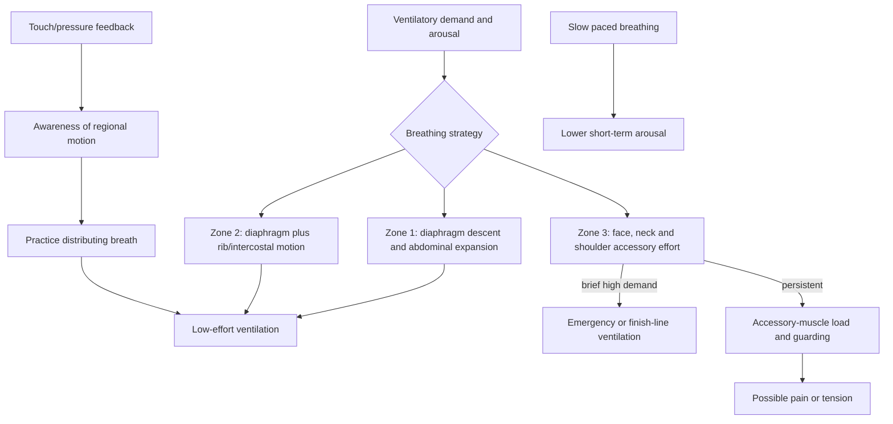
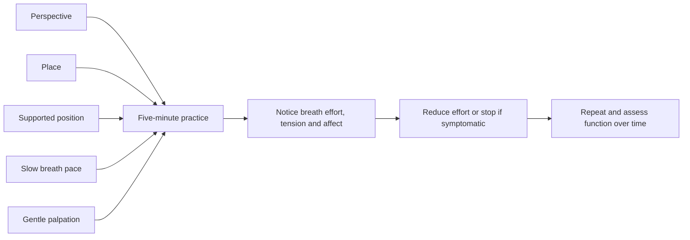
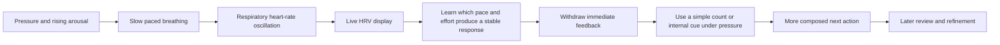

# Breathing mechanics and state regulation

Breathing is both gas exchange and a mechanically distributed movement of the diaphragm, rib cage, abdominal wall, and accessory muscles. Because respiratory pace and effort covary with arousal, deliberate breathing can also be used as a short-term state-regulation practice. The useful distinction is not whether the diaphragm works—it must contract to sustain ordinary life—but whether breathing demand is being met efficiently, without unnecessary persistent recruitment of the face, neck, and shoulder musculature. (@drandygalpin (Andy Galpin) — "3 Zones of Breathing: How to Improve Performance & Recovery | Dr. Andy Galpin & Jill Miller", 2026-07-29, [link](https://www.youtube.com/watch?v=I0muXgmTDBY))

## A three-zone mechanical model

Jill Miller's three-zone model is an instructional framework, not a validated diagnostic classification. Zone 1 emphasizes abdominal expansion as the diaphragm descends; zone 2 emphasizes rib motion produced by the diaphragm and intercostals; zone 3 emphasizes accessory recruitment in the face, neck, and shoulders. Zone 3 is appropriate during extreme exertion or acute alarm, but persistent reliance on it may accompany high respiratory effort, stress, or musculoskeletal guarding. Neck pain, jaw pain, headache, bruxism, and hand symptoms are nonspecific and cannot diagnose a breathing pattern or establish that breathing caused them. (@drandygalpin (Andy Galpin) — "3 Zones of Breathing: How to Improve Performance & Recovery | Dr. Andy Galpin & Jill Miller", 2026-07-29, [link](https://www.youtube.com/watch?v=I0muXgmTDBY))

The model's strongest use is attentional: touch or a soft ball can make rib movement perceptible and help a person explore expansion without elevating the shoulders. Claims that a particular pattern directly causes headache, sleep apnea, bruxism, connective-tissue thickening, or autonomic dysfunction are not established by these transcripts. Sleep apnea is potentially dangerous and requires clinical assessment, not self-treatment with breathing drills. (@drandygalpin (Andy Galpin) — "3 Zones of Breathing: How to Improve Performance & Recovery | Dr. Andy Galpin & Jill Miller", 2026-07-29, [link](https://www.youtube.com/watch?v=I0muXgmTDBY)) (@drandygalpin (Andy Galpin) — "5 Tools for Reducing Chronic Stress in Your Body | Dr. Andy Galpin & Jill Miller", 2026-07-24, [link](https://www.youtube.com/watch?v=70Gi-IE21oM))

## State regulation and the five-variable protocol

Miller organizes a relaxation session around five variables: perspective (an attentive, accepting orientation), place (a sufficiently safe and quiet context), position (usually supported or reclined), pace of breathing (slow rather than exclusively fast), and palpation (gentle touch or self-myofascial pressure as sensory feedback). This is a memorable implementation framework; only some components have independent empirical support, and their combined package has not been isolated in the transcript. (@drandygalpin (Andy Galpin) — "5 Tools for Reducing Chronic Stress in Your Body | Dr. Andy Galpin & Jill Miller", 2026-07-24, [link](https://www.youtube.com/watch?v=70Gi-IE21oM))

Slow breathing changes respiratory mechanics and can influence short-term autonomic and emotional state. The source cites a systematic review of breathing practices for anxiety as favoring about five minutes of daily slow, deep breathing and warns that fast breathing alone did not produce the same stress response; however, the transcript supplies neither review details nor effect sizes, so the evidence can support a low-burden trial but not guaranteed state change or treatment of an anxiety disorder. Extended exhalation is one option, not a requirement. (@drandygalpin (Andy Galpin) — "5 Tools for Reducing Chronic Stress in Your Body | Dr. Andy Galpin & Jill Miller", 2026-07-24, [link](https://www.youtube.com/watch?v=70Gi-IE21oM))

## A rib-feedback drill

The described drill uses side-lying support with a soft, yielding ball under the lateral ribs and a pillow or block under the head. The person inhales to expand the rib cage, briefly holds and gently contracts, then exhales without recruiting the face and shoulders; after an ordinary exhale, additional gentle exhalation can explore rib recoil. Both sides are practiced. This may provide sensory feedback and an acute mobility experience, but assertions about baroreceptor stimulation, a vagal surge, costovertebral mobility, spinal rotation, or lasting correction remain mechanistic hypotheses in the available source. (@drandygalpin (Andy Galpin) — "3 Zones of Breathing: How to Improve Performance & Recovery | Dr. Andy Galpin & Jill Miller", 2026-07-29, [link](https://www.youtube.com/watch?v=I0muXgmTDBY))

## HRV biofeedback and performance composure

Heart-rate variability (HRV) is variation in the intervals between successive heartbeats, not simply a low heart rate. During slow breathing, heart rate ordinarily rises during inhalation and falls during exhalation; pacing near an individual’s resonant frequency can produce a large, regular oscillation. Biofeedback displays this changing signal so the learner can connect a controllable action—breathing—with an otherwise hard-to-perceive physiological response. The performance target is composure and flexible control, not maximal relaxation or the highest possible score. (@drandygalpin (Andy Galpin) — "Heart Rate Variability (HRV): How to Stay Calm Under Pressure | Dr. Andy Galpin & Dr. Lenny Wiersma", 2026-07-13, [link](https://www.youtube.com/watch?v=BSdURZ4NVSc))

The transcript calls a smooth high-amplitude pattern HRV coherence and describes it as balance between sympathetic and parasympathetic activity. That description is a coaching simplification: a device-derived coherence score is a pattern metric, not a direct meter of two autonomic branches or proof of an optimal psychological state. Likewise, an immediate graph demonstrates physiological responsiveness but does not by itself prove improved competition outcomes. The strongest claim supported by the demonstration is learning: visible feedback can build confidence that a practiced breath changes the measured pattern, after which feedback is removed to test independent control. (@drandygalpin (Andy Galpin) — "Heart Rate Variability (HRV): How to Stay Calm Under Pressure | Dr. Andy Galpin & Dr. Lenny Wiersma", 2026-07-13, [link](https://www.youtube.com/watch?v=BSdURZ4NVSc))

Wiersma’s starting protocol is an approximately ten-second cycle—about four seconds inhaling and six seconds exhaling—then individualized pacing with software feedback. The longer exhale is intended to favor down-regulation, while the roughly six-breaths-per-minute cycle is treated as a starting point rather than universal resonance. Excessive effort can interfere with the target pattern, especially when a competitive user turns the score into another contest; training should therefore progress from guided feedback to a portable count or effortless internal cue. Commercial systems mentioned in the transcript include HeartMath and Inner Balance, but the speakers explicitly decline a current consumer-market comparison, so mention is not evidence of product superiority. (@drandygalpin (Andy Galpin) — "Heart Rate Variability (HRV): How to Stay Calm Under Pressure | Dr. Andy Galpin & Dr. Lenny Wiersma", 2026-07-13, [link](https://www.youtube.com/watch?v=BSdURZ4NVSc))

## Practical implications

- **Daily: trial five minutes of comfortable slow breathing in a quiet, supported position — moderate for short-term anxiety/stress reduction as characterized by the source; limited for durable clinical outcomes.** Keep the breath smooth, avoid straining or prolonged breath holds, and judge value by repeatable changes in arousal and function. (@drandygalpin (Andy Galpin) — "5 Tools for Reducing Chronic Stress in Your Body | Dr. Andy Galpin & Jill Miller", 2026-07-24, [link](https://www.youtube.com/watch?v=70Gi-IE21oM))
- **For regional awareness: practice the side-lying soft-ball rib drill for about two minutes per side once daily — emerging, instructor-derived protocol.** Use gentle pressure, stop for dizziness, pain, numbness, or air hunger, and do not treat an immediate range-of-motion change as proof of structural correction. (@drandygalpin (Andy Galpin) — "3 Zones of Breathing: How to Improve Performance & Recovery | Dr. Andy Galpin & Jill Miller", 2026-07-29, [link](https://www.youtube.com/watch?v=I0muXgmTDBY))
- **Before bed: a brief slow-breath practice can be part of a low-arousal routine — emerging for this exact package.** It is an adjunct, not treatment for sleep apnea, persistent bruxism, panic disorder, or unexplained headache. [[pre-sleep-routines-and-stimulus-control]]
- **During low-stakes practice: try a comfortable four-second inhale and six-second exhale for several minutes, then adjust if it causes strain or air hunger — moderate for slow-paced breathing, limited for this exact ratio and performance outcome.** Do not interpret a single HRV score as a diagnosis or global readiness measure. (@drandygalpin (Andy Galpin) — "Heart Rate Variability (HRV): How to Stay Calm Under Pressure | Dr. Andy Galpin & Dr. Lenny Wiersma", 2026-07-13, [link](https://www.youtube.com/watch?v=BSdURZ4NVSc))
- **If using biofeedback: learn with immediate display, then periodically hide the display and review it afterward — plausible skill-transfer protocol, limited outcome evidence.** The aim is portable self-regulation without dependence on a device; stop chasing the number if effort increases arousal. (@drandygalpin (Andy Galpin) — "Heart Rate Variability (HRV): How to Stay Calm Under Pressure | Dr. Andy Galpin & Dr. Lenny Wiersma", 2026-07-13, [link](https://www.youtube.com/watch?v=BSdURZ4NVSc))
- **Immediately before or during a predictable pressure event: use a few rehearsed cycles as a composure cue — limited-to-moderate.** Practice first in safe settings; dizziness, chest pain, fainting, or significant palpitations warrant stopping and appropriate assessment. (@drandygalpin (Andy Galpin) — "Heart Rate Variability (HRV): How to Stay Calm Under Pressure | Dr. Andy Galpin & Dr. Lenny Wiersma", 2026-07-13, [link](https://www.youtube.com/watch?v=BSdURZ4NVSc))

## Gaps & open questions

- Is the three-zone model reliable between observers, and does changing the observed pattern improve pain, performance, or recovery?
- Which element of the five-variable package adds benefit beyond slow breathing alone, expectancy, rest, and time in a quiet environment?
- What pace, inhale-to-exhale ratio, session length, and weekly dose produce durable benefit for different populations?
- Do palpation and supported slope positions measurably change autonomic function, and are those changes clinically meaningful?
- Can breathing training reduce bruxism or headache in controlled trials, and which symptoms instead indicate sleep, dental, neurological, or respiratory disease?
- Does HRV-biofeedback training improve real performance or anxiety outcomes beyond paced breathing, education, expectancy, and repeated exposure?
- How should resonance pace be estimated outside a laboratory, and do consumer coherence scores agree across devices?
- How durable is device-free transfer, and what amount of periodic refresher feedback is useful?

## Related

[[neuromodulators-and-state-control]] · [[stress-threat-discrimination]] · [[protective-threat-responses]] · [[mental-imagery-for-performance]] · [[daily-movement-mobility-and-pain]] · [[pre-sleep-routines-and-stimulus-control]] · [[sleep-quality-and-circadian-alignment]] · [[practice-playbook]]
