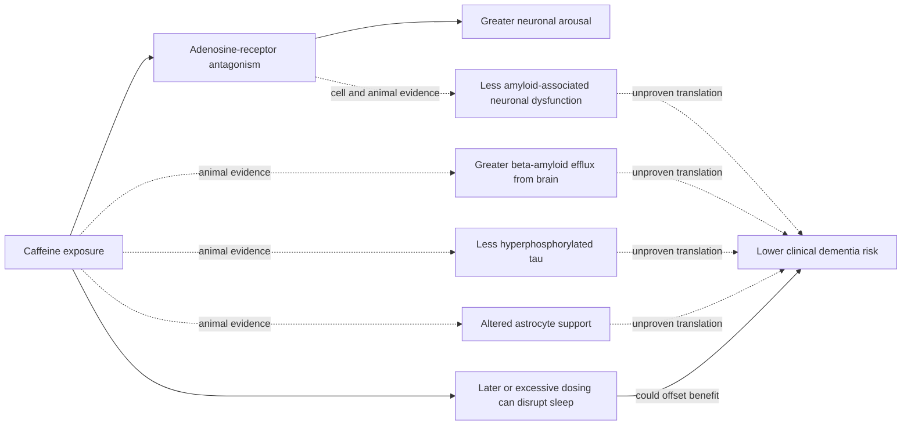

# Caffeinated coffee and cognitive aging

Coffee is a chemically complex exposure, while caffeine is a psychoactive adenosine-receptor antagonist. Long-running observational cohorts associate caffeinated coffee, but not decaffeinated coffee, with lower dementia incidence; the reported dose-response is greatest around two to three 240 mL cups per day and does not clearly improve above that range. Other cohorts and mechanistic studies attribute possible benefit to non-caffeine polyphenols, so the caffeinated-versus-decaf contrast is unresolved rather than a clean component experiment. This pattern makes caffeine a candidate mediator, but it does not prove that coffee prevents dementia: beverage choice covaries with sleep, smoking, health status, education, preparation, and other behaviors, and reverse causation can occur if preclinical illness changes caffeine tolerance or consumption. (@FoundMyFitness (FoundMyFitness) — "How To Use Coffee To Live Longer (Full Guide & Research)", 2025-06-16, [link](https://www.youtube.com/watch?v=vgrV9rjqQyA)) (@Physionic (Physionic) — "Only One Type of Coffee Protects against Dementia - Why?", 2026-08-20, [link](https://www.youtube.com/watch?v=gy0FW6xj21o)) [[coffee-preparation-and-health]] [[cognitive-reserve-and-brain-health]]

## Candidate mechanism

Adenosine accumulates during wakefulness and signals through neuronal receptors to reduce arousal. Caffeine occupies those receptors without reproducing adenosine's sleep-promoting signal. In Alzheimer-model cell and animal experiments, pharmacologic adenosine-receptor blockade reduced amyloid-associated loss of viable neurons; caffeine exposure also improved memory or behavior, increased movement of beta-amyloid from brain to blood, reduced hyperphosphorylated tau, and altered astrocyte responses. These experiments make several causal routes biologically plausible, but none establishes that ordinary coffee produces the same target exposure or prevents clinical dementia in humans. The source explicitly identifies the clearance and tau evidence as animal or basic mechanistic research. (@Physionic (Physionic) — "Only One Type of Coffee Protects against Dementia - Why?", 2026-08-20, [link](https://www.youtube.com/watch?v=gy0FW6xj21o))

The sleep branch matters because adenosine pressure is part of normal sleep regulation. Blocking it can improve alertness while delaying or degrading sleep in susceptible people; adequate sleep is itself connected to brain maintenance and cognitive function. A mechanism that looks favorable in an Alzheimer model can therefore coexist with a harmful route at an unsuitable dose or time. The transcript speculates that sleep-mediated adenosine reduction contributes to protection, but supplies no human experiment that isolates this pathway. (@Physionic (Physionic) — "Only One Type of Coffee Protects against Dementia - Why?", 2026-08-20, [link](https://www.youtube.com/watch?v=gy0FW6xj21o)) [[sleep-quality-and-circadian-alignment]]

## Evidence interpretation

The human evidence described is prospective association, useful for identifying a long-latency pattern but unable to assign the effect to caffeine. The decaffeinated comparison and plateau around two to three cups strengthen the caffeine hypothesis without excluding preparation, dose measurement, selection, or residual-confounding explanations. The mechanistic studies address amyloid, tau, cell viability, and behavior in experimental systems; they do not bridge the outcome hierarchy to human diagnosis, independence, quality of life, or survival. The combined evidence is therefore suggestive for an association, preclinical for the proposed mechanism, and insufficient for a dementia-prevention prescription. (@Physionic (Physionic) — "Only One Type of Coffee Protects against Dementia - Why?", 2026-08-20, [link](https://www.youtube.com/watch?v=gy0FW6xj21o))

## Practical implications

- **For an adult who already tolerates caffeinated coffee: continuing a moderate habitual intake is reasonable, but not as dementia treatment — limited observational evidence for cognitive aging.** The cohort pattern described centers on roughly two to three 240 mL cups daily; it is not a validated target, and more did not show additional association. (@Physionic (Physionic) — "Only One Type of Coffee Protects against Dementia - Why?", 2026-08-20, [link](https://www.youtube.com/watch?v=gy0FW6xj21o))
- **Daily: protect sleep timing and duration rather than chasing the observational dose — strong general principle, untested as the mediator of this coffee association.** Reduce, move earlier, or avoid caffeine if it impairs sleep, causes palpitations or anxiety, or conflicts with individualized clinical advice. [[sleep-quality-and-circadian-alignment]]
- **Do not start caffeine solely to prevent dementia — insufficient clinical-outcome evidence.** Prioritize blood-pressure and metabolic-risk control, exercise, sleep, sensory care, and social and cognitive engagement, which have broader human evidence. [[cognitive-reserve-and-brain-health]]

## Gaps & open questions

- Does randomized caffeinated-coffee or caffeine exposure reduce incident cognitive impairment or dementia without unacceptable sleep or cardiovascular harms?
- Is caffeine the causal component, or do caffeinated and decaffeinated drinkers differ in preparation, dose, health, or behavior?
- Do amyloid efflux, tau, and astrocyte changes occur at ordinary human exposures, and do they improve function rather than biomarkers alone?
- How do timing, metabolism, tolerance, sex, genotype, baseline sleep, and preparation modify net benefit?
- Does preclinical neurodegeneration reduce caffeine tolerance and create reverse causation in long cohorts?

## Related

[[coffee-preparation-and-health]] · [[cognitive-reserve-and-brain-health]] · [[alzheimers-spectrum-and-diagnosis]] · [[sleep-quality-and-circadian-alignment]] · [[neuromodulators-and-state-control]] · [[aging-model]] · [[practice-playbook]]
