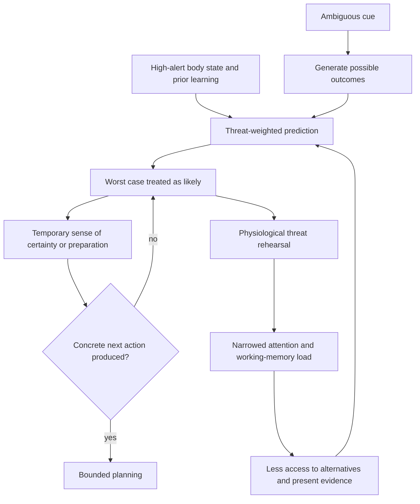
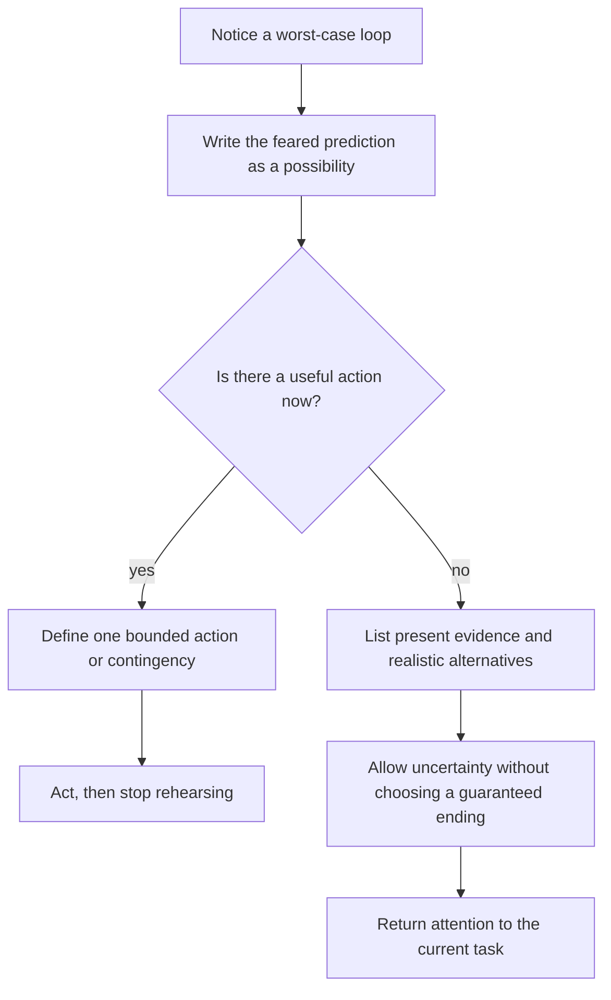

# Catastrophizing and uncertainty

Catastrophizing is a prediction pattern in which ambiguity is repeatedly completed with severe, hard-to-manage outcomes. It is not simply pessimism or deliberate dramatization. The mind normally forecasts from prior experience, context, bodily signals, memory, tone, and partial evidence; when the nervous system is already on alert, threat-consistent completions become more available and can feel more certain than the evidence warrants. (@DrTraceyMarks (Dr. Tracey Marks) — "How to Stop Catastrophizing Without Forced Positivity", 2026-07-15, [link](https://www.youtube.com/watch?v=23dazj4RIq8))

## Prediction, uncertainty, and false certainty

Predictive processing compares incoming information with expectations and updates when mismatch is clear. Ambiguity supplies fewer corrective signals and more possible outcomes, increasing the amount that must be inferred. Selecting the worst case can then reduce uncertainty subjectively: a bad answer has a shape around which attention and preparation can organize, whereas an unknown outcome stays open. This explains why catastrophizing may feel protective even while it worsens function. The account is a useful mechanistic framing from the transcript, not evidence that one neural circuit or computational rule explains every anxiety disorder. (@DrTraceyMarks (Dr. Tracey Marks) — "How to Stop Catastrophizing Without Forced Positivity", 2026-07-15, [link](https://www.youtube.com/watch?v=23dazj4RIq8))

The key functional distinction is between planning and threat rehearsal. Planning ends in a bounded action, contingency, request for information, or decision point. Threat rehearsal expands the danger across domains—one error becomes humiliation, rejection, incapacity, and future failure—without improving the action set. Because imagined danger can mobilize heart rate, muscle tension, and vigilance, repeated rehearsal consumes attention and working memory as though the threat were present. This can impair reading, conversation, decisions, and task completion, which in turn may appear to confirm the original fear. [[stress-threat-discrimination]] (@DrTraceyMarks (Dr. Tracey Marks) — "How to Stop Catastrophizing Without Forced Positivity", 2026-07-15, [link](https://www.youtube.com/watch?v=23dazj4RIq8))

## Replacing certainty with workable uncertainty

The intervention is not to replace a feared outcome with guaranteed success. Forced positivity preserves the same demand for certainty and is easily rejected when it feels implausible. Instead, classify the thought by function: does it identify a concrete action, or does it generate more threat? If action is available, specify it and stop the simulation at that boundary. If no further action is available, name the worst case as one possibility among several and generate realistic alternatives supported by the available facts. The objective is flexible prediction under uncertainty, not proof that nothing bad will happen. (@DrTraceyMarks (Dr. Tracey Marks) — "How to Stop Catastrophizing Without Forced Positivity", 2026-07-15, [link](https://www.youtube.com/watch?v=23dazj4RIq8))

This protocol belongs alongside graded prediction updating in [[stress-threat-discrimination]] and rumination interruption in [[mental-strength-and-behavioral-skills]]. It should not be used to dismiss credible danger, medical symptoms, abuse, financial risk, or a problem that genuinely requires contingency planning. Persistent worry that causes marked impairment, panic, compulsions, sleep loss, or avoidance warrants clinical assessment; a brief self-guided exercise is not a substitute for treatment.

## Practical implications

- **Per episode: ask whether the next thought produces an action or only more threat — emerging/clinically plausible.** If actionable, write one bounded step or contingency; if not, stop adding scenarios and return to present evidence. (@DrTraceyMarks (Dr. Tracey Marks) — "How to Stop Catastrophizing Without Forced Positivity", 2026-07-15, [link](https://www.youtube.com/watch?v=23dazj4RIq8))
- **Per episode: describe the worst case as one possibility and add two realistic alternatives — emerging/clinically plausible.** Alternatives need not be positive; they should be plausible and evidence-sensitive. (@DrTraceyMarks (Dr. Tracey Marks) — "How to Stop Catastrophizing Without Forced Positivity", 2026-07-15, [link](https://www.youtube.com/watch?v=23dazj4RIq8))
- **Weekly: review a small sample of predictions, actions, and outcomes — limited.** Use the record to distinguish useful preparation from repetitive rehearsal; the cadence is pragmatic and not validated by the source.
- **When worry is persistent or disabling: seek assessment rather than escalating self-monitoring — strong safety principle.** Urgent danger, self-harm risk, or inability to function requires timely professional or emergency support appropriate to the situation.

## Gaps & open questions

- Does the action-versus-more-threat question improve function beyond established cognitive restructuring, problem solving, worry postponement, or exposure methods?
- Which components—labeling uncertainty, generating alternatives, limiting rehearsal, or taking action—account for benefit, and at what dose?
- When does realistic contingency planning become a safety behavior that maintains anxiety?
- How do trauma, obsessive-compulsive symptoms, generalized anxiety, depression, sleep loss, and neurodivergence alter the mechanism and appropriate intervention?
- Can passive measures of working-memory load or physiological arousal distinguish productive planning from threat rehearsal in daily life?

## Related

[[stress-threat-discrimination]] · [[mental-strength-and-behavioral-skills]] · [[protective-threat-responses]] · [[social-evaluative-threat-and-criticism]] · [[emotional-memory-reactivation-and-rumination]] · [[neuromodulators-and-state-control]] · [[practice-playbook]]
