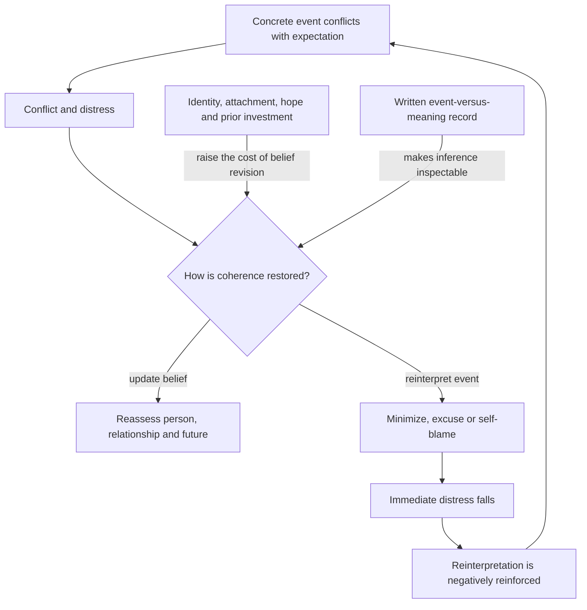

# Cognitive dissonance and narrative protection

Cognitive dissonance is the distress produced when beliefs, expectations, actions, or observations do not fit together. In an emotionally important relationship, the conflict may be between a global belief such as the relationship is safe and a concrete observation such as repeated harmful behavior. Conflict detection does not determine which representation is correct; it creates pressure to restore coherence, either by revising the prior belief or by minimizing, excusing, or reinterpreting the observation. The anterior cingulate cortex is presented as one contributor to detecting this mismatch, but the source does not establish that one region alone explains the process. (@DrTraceyMarks (Dr. Tracey Marks) — "The Red Flags You're Rewriting Without Realizing It", 2026-04-29, [link](https://www.youtube.com/watch?v=SIB8RHYGVAQ))

## The narrative-protection loop

Narrative protection becomes more likely when changing the belief would also threaten identity, judgment, attachment, hoped-for futures, or the meaning assigned to prior investment. An explanation can therefore feel measured and compassionate while still functioning primarily to reduce discomfort. Repeated relief after reinterpretation negatively reinforces the strategy: each successful reduction in distress makes the same response easier when the next mismatch appears. Marks distinguishes this coherence-preserving loop from reward-seeking under intermittent reinforcement; the two can coexist, but preserving a story is not identical to pursuing an unpredictable reward. (@DrTraceyMarks (Dr. Tracey Marks) — "The Red Flags You're Rewriting Without Realizing It", 2026-04-29, [link](https://www.youtube.com/watch?v=SIB8RHYGVAQ))

Romantic attachment may also alter evaluation. Marks cites functional-imaging work in broad terms to suggest that romantic love can coincide with reduced activity in some systems involved in critical social judgment. Because the transcript gives no studies, task definitions, effect sizes, or replication record, this should be treated as a mechanistic illustration rather than proof that love disables judgment or that neuroimaging can identify an unsafe relationship. (@DrTraceyMarks (Dr. Tracey Marks) — "The Red Flags You're Rewriting Without Realizing It", 2026-04-29, [link](https://www.youtube.com/watch?v=SIB8RHYGVAQ))

## Separating observation from interpretation

A narrative audit externalizes two layers that ordinary thought blends together: first record the observable event in plain, specific language, then separately record the meaning assigned to it. The aim is not to presume the interpretation false; it is to make it testable against repeated behavior, alternative explanations, and the judgment one would make without prior emotional investment. Useful questions are whether the explanation is supported by what occurred, whether it explains a pattern rather than only the latest incident, and whether it would remain persuasive to a less-invested observer. This is a self-monitoring protocol proposed by Marks, not a validated diagnostic instrument. (@DrTraceyMarks (Dr. Tracey Marks) — "The Red Flags You're Rewriting Without Realizing It", 2026-04-29, [link](https://www.youtube.com/watch?v=SIB8RHYGVAQ))

The method complements [[trust-repair-and-safety-learning]]: isolated explanations should not outweigh accumulated behavioral evidence, while credible accountability and durable change are themselves relevant evidence. It also connects to [[attachment-threat-and-relational-regulation]], because fear of losing closeness can increase the emotional price of revising a relationship narrative. (@DrTraceyMarks (Dr. Tracey Marks) — "The Red Flags You're Rewriting Without Realizing It", 2026-04-29, [link](https://www.youtube.com/watch?v=SIB8RHYGVAQ))

## Practical implications

- **After a concerning interaction: record event and meaning in separate columns — emerging, protocol-specific evidence untested.** Use neutral observable language, preserve uncertainty, and revisit the record for recurrence rather than deciding from one impression. (@DrTraceyMarks (Dr. Tracey Marks) — "The Red Flags You're Rewriting Without Realizing It", 2026-04-29, [link](https://www.youtube.com/watch?v=SIB8RHYGVAQ))
- **Periodically or when the same concern recurs: evaluate patterns and counterfactual judgment — emerging.** Ask whether the interpretation fits the behavioral record and whether it would seem equally convincing without existing attachment or investment. (@DrTraceyMarks (Dr. Tracey Marks) — "The Red Flags You're Rewriting Without Realizing It", 2026-04-29, [link](https://www.youtube.com/watch?v=SIB8RHYGVAQ))

## Gaps & open questions

- Does a narrative audit improve recognition of harmful patterns, decision quality, distress, or relationship safety compared with ordinary journaling?
- Which neural findings about romantic love and social judgment replicate across relationship stages, cultures, and experimental tasks?
- When does charitable reinterpretation support healthy repair, and when does it maintain exposure to recurring harm?
- How do attachment style, trauma history, dependency, coercive control, and material constraints change the loop?
- Can repeated event-versus-meaning records create hypervigilance or certainty from ambiguous observations?

## Related

[[attachment-threat-and-relational-regulation]] · [[trust-repair-and-safety-learning]] · [[catastrophizing-and-uncertainty]] · [[emotional-memory-reactivation-and-rumination]] · [[interpersonal-regulation-and-emotional-capacity]] · [[tracey-marks]] · [[practice-playbook]]
