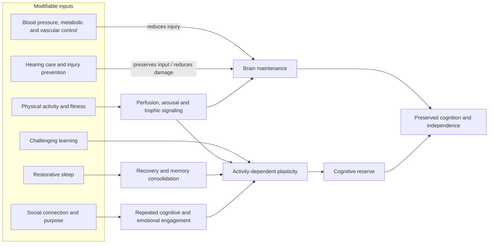

# Cognitive reserve and brain health

Brain health is the capacity to learn, regulate behavior, and preserve useful cognition despite aging, illness, or injury. It is not a single biomarker. A useful model separates **brain maintenance**—limiting vascular, metabolic, inflammatory, and traumatic injury—from **cognitive reserve**—building sufficiently rich and flexible networks that function can remain adequate despite pathology. Subjective cognitive decline can be clinically worth investigating, but it does not by itself establish neurodegenerative disease or predict that dementia is inevitable. Age-specific dementia incidence has fallen over recent decades, a population trend consistent with meaningful modifiability even though population aging can still increase the absolute number of cases. (@matt.kaeberlein (Healthspan Medicine) — "Neuroscientist Reveals What's Actually Working for Brain Longevity (with Dr. Tommy Wood)", 2026-04-05, [link](https://www.youtube.com/watch?v=XXmZtn4R0Ow))

## Mechanism and layers of protection

The same behavior can act through several routes. Exercise supports vascular and metabolic health, acutely raises arousal, and supplies a context favorable to plasticity; learning then directs plastic change toward the circuits being recruited. Sleep supports recovery and consolidation. Social activity is not merely pleasant exposure: conversation, coordination, perspective-taking, and shared goals repeatedly challenge cognitive systems. Hearing loss can reduce this input and increase cognitive load, so correcting it may preserve engagement as well as sensory function. These pathways are mechanistically credible, but their individual contribution to dementia prevention cannot be inferred from a single short-term cognition study. (@matt.kaeberlein (Healthspan Medicine) — "Neuroscientist Reveals What's Actually Working for Brain Longevity (with Dr. Tommy Wood)", 2026-04-05, [link](https://www.youtube.com/watch?v=XXmZtn4R0Ow))

## Evidence and interpretation

The evidence is strongest for treating conventional risks and maintaining an active life rather than for any isolated brain-longevity product. Physical activity, education or continued learning, social connection, adequate sleep, vascular-risk management, and avoiding smoking or repeated head injury form a convergent prevention portfolio. They should not be treated as interchangeable: blood-pressure control primarily reduces injury risk, whereas deliberate learning more directly trains capacity. The source frames this portfolio as modifiable and cumulative, but does not provide effect sizes or establish an optimal dose for each component. (@matt.kaeberlein (Healthspan Medicine) — "Neuroscientist Reveals What's Actually Working for Brain Longevity (with Dr. Tommy Wood)", 2026-04-05, [link](https://www.youtube.com/watch?v=XXmZtn4R0Ow))

The 2024 Lancet Commission framework estimates that about 45% of dementia cases worldwide are attributable to modifiable factors and newly includes untreated vision loss and high LDL cholesterol alongside risks such as midlife hypertension, hearing loss, diabetes, social isolation, smoking, excess alcohol, and obesity. Population-attributable fractions are not promises that 45% of cases in an individual can be prevented: risks overlap, causality and reversibility vary, and education or past exposure cannot always be changed. They do, however, organize prevention around cumulative vascular injury, preserved sensory input, and sustained cognitive and social engagement rather than genetic fatalism. (@NutritionMadeSimple (Nutrition Made Simple!) — "The REAL Dementia Risk Factors Doctors Won't Tell You", 2026-05-08, [link](https://www.youtube.com/watch?v=Tyy4UZO_MwI))

Sensory loss can reach cognition through at least two routes. Degraded hearing increases the processing effort required to decode speech and can reduce participation in conversation; hearing and vision loss can also restrict learning, navigation, and social contact, which removes repeated challenges that help maintain reserve. Social isolation then compounds risk through behavior—less activity, poorer diet, and less medical engagement—and possibly chronic stress biology. The causal size of each route and the extent to which sensory correction prevents dementia remain less certain than the benefit of restoring communication and function. (@NutritionMadeSimple (Nutrition Made Simple!) — "The REAL Dementia Risk Factors Doctors Won't Tell You", 2026-05-08, [link](https://www.youtube.com/watch?v=Tyy4UZO_MwI))

The Finnish Geriatric Intervention Study to Prevent Cognitive Impairment and Disability randomized more than 1,200 at-risk adults aged 60–77 to general advice or a two-year package of Mediterranean-like diet, aerobic and resistance exercise, cognitive training, social meetings, and vascular/metabolic monitoring. The intervention group improved more on the composite cognitive score, executive function, and processing speed; follow-up and adherence analyses suggested persistence beyond the intervention. This is randomized evidence that a feasible multidomain program can improve cognition, but it cannot identify the active component, its APOE4 subgroup trend was exploratory, and cognitive scores over two years are not equivalent to demonstrated long-term prevention of dementia. (@NutritionMadeSimple (Nutrition Made Simple!) — "The REAL Dementia Risk Factors Doctors Won't Tell You", 2026-05-08, [link](https://www.youtube.com/watch?v=Tyy4UZO_MwI))

Brain fog, burnout, depression, sleep loss, medication effects, post-infectious illness, endocrine disease, and early neurodegeneration can overlap phenomenologically. A report of worsening cognition is therefore a prompt for differential assessment, not a diagnosis and not a reason to begin an unvalidated supplement stack. (@matt.kaeberlein (Healthspan Medicine) — "Neuroscientist Reveals What's Actually Working for Brain Longevity (with Dr. Tommy Wood)", 2026-04-05, [link](https://www.youtube.com/watch?v=XXmZtn4R0Ow)) Estrogen deficiency belongs on that differential in women: unrecognized perimenopausal or iatrogenic estrogen loss can produce objective memory, executive, and word-finding deficits that look identical to early Alzheimer's disease yet can reverse with hormone replacement or targeted retraining. [[menopause-related-cognitive-impairment]] (Peter Attia MD — "399 - The evolution of Alzheimer's disease and dementia care | Gayatri Devi, M.D.", 2026-07-13, [link](https://www.youtube.com/watch?v=x7NhqMOwdOM))

Reserve has a diagnostic dark side: the same compensation that preserves function hides disease from brief instruments. High-reserve patients can score 28–30 on the MMSE or MoCA even 10–15 years into a dementing condition, so clinical detection in intelligent, high-functioning people requires multi-hour testing and comparison of domain scores against the person's own overall ability (for example, 99th-percentile general intelligence with 10th-percentile language is alarming despite normal-range absolute scores). Reserve here is defined as the brain's ability to maintain a large number of connections and remain resilient to disease such as Alzheimer's—it delays functional expression of pathology without removing the pathology. [[alzheimers-spectrum-and-diagnosis]] (Peter Attia MD — "399 - The evolution of Alzheimer's disease and dementia care | Gayatri Devi, M.D.", 2026-07-13, [link](https://www.youtube.com/watch?v=x7NhqMOwdOM))

An infectious-inflammatory pathway adds to the maintenance side of the model. Neuroimmune change may precede amyloid deposition in the Alzheimer's cascade, and observational data (with some vaccine-trial support) link shingles vaccination and suppressive HSV treatment to significantly lower dementia risk; gingival inflammation shows a parallel association. This motivates managing neurotropic viral and oral-health exposures as brain maintenance, while the causal chain—virus, inflammation, amyloid, cognition—remains incompletely proven. [[alzheimers-spectrum-and-diagnosis]] (Peter Attia MD — "399 - The evolution of Alzheimer's disease and dementia care | Gayatri Devi, M.D.", 2026-07-13, [link](https://www.youtube.com/watch?v=x7NhqMOwdOM))

Long-chain omega-3 fatty acids add a narrower nutritional pathway. DHA contributes to neuronal-membrane structure and EPA to the surrounding inflammatory and chemical environment; randomized-trial syntheses suggest at most modest cognitive benefits, with more plausible benefit in people who begin with low omega-3 status and less consistent benefit after established Alzheimer disease. This is adjunctive evidence, not a substitute for vascular, metabolic, sensory, social, sleep, and activity interventions. [[omega-3-fatty-acids]] (@NutritionMadeSimple (Nutrition Made Simple!) — "Watch This Before You Take Fish Oil (Protect Your Heart)", 2026-08-10, [link](https://www.youtube.com/watch?v=GpzX3NQzmio))

Childhood activity may begin building both maintenance and reserve decades before late-life risk becomes visible. Resistance training is reported to produce modest but meaningful gains in intelligence-related measures, while broader activity and sport variety are associated with executive function, academic achievement, and on-task behavior. Long follow-up also links childhood activity with lower adult diabetes and atherosclerosis, creating an indirect brain-maintenance route through cardiometabolic health. These data are convergent but do not isolate resistance training from other activity or eliminate all lifecourse confounding. [[youth-resistance-training]] (@drandygalpin (Andy Galpin) — "Health Benefits of Strength Training in Kids | Dr. Andy Galpin", 2026-08-02, [link](https://www.youtube.com/watch?v=Re2sad9Bd5s))

Several dietary associations illustrate the hierarchy from exposure to outcome. Long-term cohort evidence links caffeinated coffee—up to roughly three 240-mL cups/day—with about 20% lower all-cause dementia risk, while decaffeinated coffee did not show the same association; this implicates caffeine or correlated behavior but does not establish causality. Cohorts and limited cognitive trials do not show higher dementia risk from cheese, including higher-fat cheese, and some observational estimates favor intake above 50 g/day. That finding rebuts a simple inference from saturated-fat content, but it does not prove that adding cheese prevents dementia because substitution and residual confounding remain. (@Physionic (Physionic) — "I analyzed 1,000 Health Studies: Here are 10 Things I Learned", 2026-08-06, [link](https://www.youtube.com/watch?v=sx8MyamJf3g))

Olive-oil trials demonstrate why baseline function and endpoint choice matter: barrier and connectivity measures improved in one six-month study while MMSE results across three trials were null, yet a dementia-specific rating showed a small benefit in mild cognitive impairment. Observationally lower dementia-related mortality adds long-term support without proving causality. [[olive-oil-and-cognitive-aging]] (@Physionic (Physionic) — "Your Brain on Olive Oil - Many Studies Later", 2026-08-03, [link](https://www.youtube.com/watch?v=OW8gyDLTt1s))

## Practical implications

- **Most days: move, sleep on a stable schedule, and seek cognitively demanding engagement — moderate-to-strong evidence for function and risk reduction.** Choose learning that is challenging enough to require attention and correction rather than passive content consumption; pair it with [[exercise-enhanced-learning]] when useful.
- **Weekly: combine aerobic and resistance exercise and maintain substantive social contact — strong for general health, moderate for assigning a brain-specific effect.** Progress the challenge rather than repeating only well-mastered tasks.
- **At routine care: control blood pressure and metabolic and vascular risk; address hearing or vision loss and review medications when cognition changes — strong for established risk management.** Cadence should follow clinical risk rather than a commercial brain-age score.
- **At baseline and when function changes: obtain hearing and vision assessment and correct remediable loss — strong for sensory function, moderate/uncertain for dementia prevention.** Do not wait for obvious social withdrawal before testing. (@NutritionMadeSimple (Nutrition Made Simple!) — "The REAL Dementia Risk Factors Doctors Won't Tell You", 2026-05-08, [link](https://www.youtube.com/watch?v=Tyy4UZO_MwI))
- **Periodically according to clinical risk: measure blood pressure, glycemic status, and lipids; treat sustained abnormalities — strong for cardiovascular prevention and moderate-to-strong for reducing a major dementia-risk pathway.** Lp(a) is generally a one-time inherited-risk measurement, whereas repeat ApoB, glucose/A1C, and blood-pressure cadence should follow baseline risk and treatment. (@NutritionMadeSimple (Nutrition Made Simple!) — "The REAL Dementia Risk Factors Doctors Won't Tell You", 2026-05-08, [link](https://www.youtube.com/watch?v=Tyy4UZO_MwI))
- **Promptly after persistent or progressive change: seek clinical assessment — strong.** Sudden deficits, focal neurological signs, severe headache, or altered consciousness require urgent evaluation. In high-functioning people, ask for testing rigorous enough to defeat compensation rather than accepting a normal brief screen. (Peter Attia MD — "399 - The evolution of Alzheimer's disease and dementia care | Gayatri Devi, M.D.", 2026-07-13, [link](https://www.youtube.com/watch?v=x7NhqMOwdOM))
- **Once, around age 50: discuss shingles vaccination, and suppressive antiviral treatment for recurrent HSV, as plausible dementia-risk reduction — moderate (largely epidemiologic).** Maintain gum health for the same inflammatory rationale. (Peter Attia MD — "399 - The evolution of Alzheimer's disease and dementia care | Gayatri Devi, M.D.", 2026-07-13, [link](https://www.youtube.com/watch?v=x7NhqMOwdOM))

## Gaps & open questions

- How much cognitive reserve can be built late in life, and which learning properties transfer beyond the trained task?
- Which combinations of sleep, exercise, social engagement, and vascular treatment are additive rather than redundant?
- How should subjective decline be triaged so reversible causes are found without overdiagnosing neurodegeneration?
- What explains the falling age-specific incidence of dementia, and which components generalize across populations?
- Can correcting low EPA and DHA status prevent dementia, and which baseline measure identifies likely responders?
- Do cognitive gains from childhood resistance training persist, transfer across domains, or contribute measurably to late-life reserve?
- Is caffeinated coffee itself protective, and why does decaffeinated coffee lack the same association?
- Do neutral-to-favorable cheese associations persist under controlled substitutions and hard dementia outcomes?
- Do olive-oil-related barrier and connectivity changes predict later clinical function?
- How should high-reserve individuals be screened so that compensation does not delay diagnosis by a decade?
- Does preventing or suppressing neurotropic viral reactivation causally reduce dementia incidence, and through which inflammatory steps?
- Which components of multidomain prevention programs are necessary, additive, or redundant, and do cognitive-score gains translate into fewer dementia diagnoses?
- Does treating hearing or vision loss reduce dementia incidence beyond improving communication, independence, and social participation?
- How should APOE4 status change intervention intensity when subgroup evidence remains exploratory?

## Related

[[aging-model]] · [[alzheimers-spectrum-and-diagnosis]] · [[anti-amyloid-immunotherapy]] · [[menopause-related-cognitive-impairment]] · [[exercise-enhanced-learning]] · [[human-centered-ai-and-learning]] · [[neuromodulators-and-state-control]] · [[olive-oil-and-cognitive-aging]] · [[omega-3-fatty-acids]] · [[lipoprotein-retention-and-atherogenesis]] · [[protective-threat-responses]] · [[social-evaluative-threat-and-criticism]] · [[stress-threat-discrimination]] · [[youth-resistance-training]] · [[practice-playbook]] · [[supplement-evidence-and-safety]]
