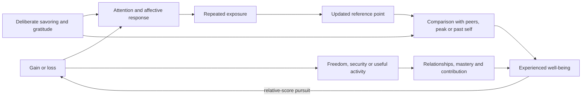

# Durable well-being and hedonic adaptation

Hedonic adaptation is the tendency for the emotional impact of a changed circumstance to diminish as it becomes familiar. It does not mean that every improvement is futile or that people return perfectly to one fixed level. Adaptation varies with the good, the person, attention, comparison standards, continuing experiences, and whether the change removes deprivation or creates an ongoing capability. (@MikeIsraetelMakingProgress (Mike Israetel) — "The Things That Actually Make You Happy | Episode #160", 2026-08-03, [link](https://www.youtube.com/watch?v=YIOGTdADktg))

## Different goods produce different desire dynamics

Relative goods derive part of their value from rank or comparison: status, fame, luxury signaling, and validation can reset the reference point as they accumulate. A gain may become ordinary while a fall from the new peak remains salient, creating loss anxiety and continued scorekeeping. Mike Israetel’s five-part framework distinguishes these goods from biological needs, mastery, relationships, and meaning; it is a useful taxonomy from the source, not a validated psychological scale. (@MikeIsraetelMakingProgress (Mike Israetel) — "The Things That Actually Make You Happy | Episode #160", 2026-08-03, [link](https://www.youtube.com/watch?v=YIOGTdADktg))

Biological needs such as food during hunger, water during thirst, sleep during fatigue, warmth during cold, and rest after exertion are ordinarily satiating: correcting the deficit reduces the immediate drive. More is not indefinitely better, and repeated luxury can turn an occasional reward into an expected baseline. (@MikeIsraetelMakingProgress (Mike Israetel) — "The Things That Actually Make You Happy | Episode #160", 2026-08-03, [link](https://www.youtube.com/watch?v=YIOGTdADktg))

Mastery can make satisfaction and further desire rise together because increasing skill reveals structure, expands usable capability, and creates intrinsically informative practice. It becomes less durable when recoded as proof of worth or rank. Relationships similarly yield much of their value through depth, trust, shared history, repair, and mutual knowledge rather than an ever-larger contact count. Meaning organizes goals around contribution, values, service, or legacy; it can make sacrifice coherent without making every moment pleasurable. These propositions are psychologically plausible but receive no cited comparative studies in the transcript. (@MikeIsraetelMakingProgress (Mike Israetel) — "The Things That Actually Make You Happy | Episode #160", 2026-08-03, [link](https://www.youtube.com/watch?v=YIOGTdADktg))

## Using achievement without making it an identity scoreboard

Money and status can have durable indirect value when converted into security, time, mobility, generosity, creative output, and shared experiences. The distinction is functional: the same money can be used as a relative score or as infrastructure for activities that continue to matter. Savoring a milestone before immediately raising the target may preserve a richer memory of achievement, while comparison with one’s past rather than another person’s peak can reduce reference-point creep. Israetel also proposes occasional voluntary simplicity to keep luxury from becoming invisible; the source offers this as a personal protocol, not outcome evidence. (@MikeIsraetelMakingProgress (Mike Israetel) — "The Things That Actually Make You Happy | Episode #160", 2026-08-03, [link](https://www.youtube.com/watch?v=YIOGTdADktg))

The companion transcript offers a more contrarian claim: Israetel predicts that pharmacology and eventually genetic engineering will be the only powerful solution to the evolved limits on happiness, analogizing future mood interventions to anti-obesity drugs. This extrapolation is unsupported in the source and conflicts with the behavioral emphasis above; present evidence in these transcripts cannot establish that ordinary well-being is pharmacologically fixed, that a safe general-purpose intervention will exist, or that social and behavioral routes are negligible. (@MikeIsraetelMakingProgress (Mike Israetel) — "The Future of Work According to Elon Musk | Unqualified Thoughts Ep. 3", 2026-08-10, [link](https://www.youtube.com/watch?v=SrGRiSoI6Vo))

## Practical implications

- **Daily or weekly: protect sleep, food, safety, and recovery deficits before seeking higher-order optimization — strong as a needs-first principle.** Persistent low mood or anxiety is not evidence of insufficient luxury and may warrant professional assessment.
- **At each meaningful milestone: pause once to celebrate, record what changed, and thank contributors before setting the next target — plausible, limited direct evidence in these sources.** Review progress against a prior personal baseline rather than only against peers or a transient peak.
- **Weekly: allocate time to one mastery practice, one undistracted close relationship, and one contribution aligned with chosen values — moderate in broad well-being literature, but only conceptual support in these transcripts.** Evaluate depth and continuity rather than counts or public recognition.
- **Occasionally: test a lower-luxury day or week if comfort has become an invisible requirement — limited.** Do not turn voluntary simplicity into deprivation, moral superiority, or a substitute for treating illness.
- **Do not use speculative mood-enhancement drugs or genetic interventions for ordinary dissatisfaction — no supporting evidence here.** Evidence-based mental-health care and clinician-guided treatment remain distinct from forecasts about future enhancement.

## Gaps & open questions

- How stable are the five proposed categories across cultures, ages, income levels, and clinical conditions?
- Which savoring, gratitude, or voluntary-simplicity protocols produce durable changes rather than short-lived expectancy effects?
- When does mastery remain intrinsically rewarding, and when does perfectionism convert it into contingent self-worth?
- How do relationship quality, quantity, conflict, and solitude interact for different temperaments?
- Can mood enhancement safely increase well-being without blunting threat detection, motivation, emotional range, or autonomy?

## Related

[[self-schema-updating-after-achievement]] · [[mental-strength-and-behavioral-skills]] · [[neuromodulators-and-state-control]] · [[social-evaluative-threat-and-criticism]] · [[practice-playbook]] · [[automation-employment-and-population]]
