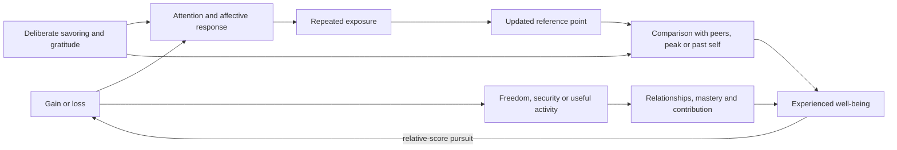
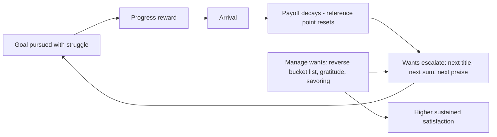

# Durable well-being and hedonic adaptation

Hedonic adaptation is the tendency for the emotional impact of a changed circumstance to diminish as it becomes familiar. It does not mean that every improvement is futile or that people return perfectly to one fixed level. Adaptation varies with the good, the person, attention, comparison standards, continuing experiences, and whether the change removes deprivation or creates an ongoing capability. (@MikeIsraetelMakingProgress (Mike Israetel) — "The Things That Actually Make You Happy | Episode #160", 2026-08-03, [link](https://www.youtube.com/watch?v=YIOGTdADktg))

```mermaid
flowchart LR
  G[Gain or loss] --> A[Attention and affective response]
  A --> R[Repeated exposure]
  R --> B[Updated reference point]
  B --> C[Comparison with peers, peak or past self]
  C --> W[Experienced well-being]
  W -->|relative-score pursuit| G
  G --> U[Freedom, security or useful activity]
  U --> X[Relationships, mastery and contribution]
  X --> W
  S[Deliberate savoring and gratitude] --> A
  S --> C
```

## Component models: enjoyment, satisfaction, and meaning

A second decomposition of well-being, taught by the Harvard social scientist Arthur Brooks, treats momentary feelings as evidence of happiness rather than happiness itself and divides the underlying construct into three components he calls macronutrients: enjoyment, satisfaction, and meaning, needed "in balance and abundance". This is a pedagogical framework from the positive-psychology literature as one expert organizes it, not a validated psychometric partition. (FoundMyFitness — "How To Build Lasting Happiness | Dr. Arthur Brooks", 2026-03-24, [link](https://www.youtube.com/watch?v=IVVVvbfRiDo))

Enjoyment is distinguished from pleasure. In Brooks's framing, pleasure is an automatic reward-circuit response, whereas enjoyment is pleasure elaborated by other people and memory into a consciously managed experience; repeatedly tapping raw pleasure alone is the pattern he identifies with addiction risk, summarized in his rule for potentially addictive rewards: "If you're doing it alone, you're probably doing it wrong." He exempts genuinely non-addictive solitary goods (walking in nature, prayer) and distinguishes solitude from isolation. The people-and-memory mechanism is expert interpretation built on standard reward neuroscience, not a tested intervention; the shared-consumption claim aligns with the social-connection evidence discussed below. (FoundMyFitness — "How To Build Lasting Happiness | Dr. Arthur Brooks", 2026-03-24, [link](https://www.youtube.com/watch?v=IVVVvbfRiDo))

Satisfaction is the reward of achievement that required struggle, and it is structurally transient: reward systems are tuned to progress toward goals rather than to arrival, so the emotional payoff of a reached goal decays and the reference point moves. Brooks calls the resulting trap the striver's curse — high achievers repeatedly discover that the anticipated durable payoff of the next milestone does not arrive, and respond by escalating the target. His attributed claim that most Olympic medalists experience clinical depression after winning is presented without a cited study and should be treated as an illustrative expert claim, though post-achievement mood decline is a described phenomenon in elite sport. The framework's arithmetic remedy is that "satisfaction that lasts is not about having more. It's about wanting less": satisfaction behaves like haves divided by wants, and the denominator is as manageable as the numerator. This converges with the reference-point model above and with the savoring and wants-management practices already on this page. (FoundMyFitness — "How To Build Lasting Happiness | Dr. Arthur Brooks", 2026-03-24, [link](https://www.youtube.com/watch?v=IVVVvbfRiDo))

The contemplative literature reaches the same structural diagnosis of satisfaction from a different direction. Sam Harris observes that nearly all of life is spent in process rather than arrival — the moment of a conquered goal "has a very short half-life", and "the moment you arrive at it, it begins to recede" as newer goals populate the horizon — and reframes what goal-seeking is actually for: people are "looking for good enough reasons to let our attention fully rest in the present". The supporting observation is that misery is fully compatible with having everything (wealth, fame, health, relationships), which falsifies the implicit premise that arranging circumstances well enough will make the present moment feel sufficient. His proposed inversion is attentional rather than arithmetic: contemplative training (and, less reliably, psychedelic experience) can relocate fulfillment into the present state itself, so that well-being is no longer predicated on the next good thing happening — reversing the assumed causality from circumstances→state to state→experienced circumstances. This converges with Brooks's wants-denominator remedy and the reference-point model above while targeting a different lever (attention rather than wants), and it is contemplative phenomenology plus expert interpretation, not trial evidence. The attentional mechanics are developed at [[meditation-and-contemplative-training]]. (@hubermanlab (Andrew Huberman) — "Essentials: Using Meditation to Focus, View Consciousness & Expand Your Mind | Dr. Sam Harris", 2026-07-23, [link](https://www.youtube.com/watch?v=LQI8tl8S2PE))

Meaning, the third component, is decomposed into coherence (why things happen), purpose (why I do what I do), and significance (why my life matters and to whom); it is treated in depth in [[meaning-boredom-and-technology]].

A third decomposition now sits alongside these: Richard Davidson's four trainable pillars of well-being — awareness, connection, insight, and purpose — each claimed to be instantiated in plastic neural circuitry and cultivable in minutes daily; his taxonomy overlaps Brooks's (purpose maps to meaning; connection to the social-love finding) while adding meta-awareness and narrative-relationship (insight) as explicit training targets. The framework and its randomized app-trial evidence are developed at [[meditation-and-contemplative-training]]. Two of his empirical claims extend this page directly: prosocial-spending experiments in which participants required to spend a cash windfall on others ended the day happier than those required to spend it on themselves (with the acknowledged caveat that resource-constrained people are a different case), and the cohort-level report that among people 70 and older a strong sense of purpose is probably the single strongest psychological predictor of longevity — purpose here meaning transcendent connection of ordinary tasks to something beyond the self, down to reframed household chores, not a grand mission. (FoundMyFitness — "Meditation Does Far More Than Reduce Stress | Dr. Richard Davidson", 2026-08-26, [link](https://www.youtube.com/watch?v=3NiQF9_Vxi8))

```mermaid
flowchart LR
  G2[Goal pursued with struggle] --> P2[Progress reward]
  P2 --> A2[Arrival]
  A2 --> H2[Payoff decays - reference point resets]
  H2 --> W2[Wants escalate: next title, next sum, next praise]
  W2 --> G2
  M2[Manage wants: reverse bucket list, gratitude, savoring] --> W2
  M2 --> S2[Higher sustained satisfaction]
```

## Wants management: idols, the reverse bucket list, and gratitude

Brooks organizes the objects of escalating wants into four recurring categories he calls idols, drawn from Aquinas: money, power, pleasure (including comfort and security), and honor or fame. The claim is descriptive — most strivers are disproportionately beguiled by one — and diagnostic: identifying the dominant idol (for example by asking which one you would relinquish first, and last) predicts where a person will cut corners on relationships and later feel regret. This is a taxonomy with survey-level support claimed but not cited in the source; treat it as an organizing heuristic, not a validated typology. (FoundMyFitness — "How To Build Lasting Happiness | Dr. Arthur Brooks", 2026-03-24, [link](https://www.youtube.com/watch?v=IVVVvbfRiDo))

Two wants-management practices follow. The reverse bucket list inverts goal-attachment: write down current ambitions and cravings, then deliberately cross them out — not renouncing action but detaching well-being from attainment, while reaffirming identity commitments (family roles, values) that do not depend on outcomes. An accountability partner who knows one's dominant idol is the second practice; Brooks warns it fails when the partner is codependent with the idol (for example a spouse whose approval tracks the striver's public success). Both are expert-designed exercises without outcome trials in the source. (FoundMyFitness — "How To Build Lasting Happiness | Dr. Arthur Brooks", 2026-03-24, [link](https://www.youtube.com/watch?v=IVVVvbfRiDo))

Gratitude is framed as working against an evolved default: negative emotions and acquisitive dissatisfaction were fitness-relevant, so the limbic system devotes more processing to threat than to appreciation, and deliberate gratitude is an override rather than a natural state. His protocol — write five gratitude items on Sunday, review them briefly each night before bed, update weekly — is accompanied by the claim that the average person is about 12% happier after ten weeks; the figure is uncited in the source and the gratitude-intervention literature shows positive but heterogeneous and often smaller effects, so treat the specific number as unverified. Modeling gratitude in front of children (rather than instructing them) is his transfer mechanism, by analogy to the behavior-modeling literature on religious transmission. (FoundMyFitness — "How To Build Lasting Happiness | Dr. Arthur Brooks", 2026-03-24, [link](https://www.youtube.com/watch?v=IVVVvbfRiDo))

## What long-lived happy people did

Brooks summarizes the Harvard Study of Adult Development (an 85-year cohort, initially unrepresentative and later broadened) as identifying seven behaviors of people who reached old age both happy and healthy: not smoking, moderation or abstinence with alcohol and other substances, a healthy diet, regular but non-compulsive exercise, continuing lifelong learning, a practiced personal method for coping with life's problems (therapy, prayer, meditation, journaling), and — weighted most heavily — love, meaning a strong marriage and/or close friendships: "Happiness is love, full stop." This is a prospective-cohort association read through one expert's synthesis; the cohort design cannot fully separate cause from selection, but the convergence with the broader social-connection and mortality literature is real. The exercise finding is described as curvilinear, with compulsive exercise sometimes representing transferred addiction ([[addiction-recovery-and-emotional-sobriety]]). Friendship and partnership maintenance are treated in [[relationship-maintenance-and-friendship]]. (FoundMyFitness — "How To Build Lasting Happiness | Dr. Arthur Brooks", 2026-03-24, [link](https://www.youtube.com/watch?v=IVVVvbfRiDo))

## Different goods produce different desire dynamics

Relative goods derive part of their value from rank or comparison: status, fame, luxury signaling, and validation can reset the reference point as they accumulate. A gain may become ordinary while a fall from the new peak remains salient, creating loss anxiety and continued scorekeeping. Mike Israetel’s five-part framework distinguishes these goods from biological needs, mastery, relationships, and meaning; it is a useful taxonomy from the source, not a validated psychological scale. (@MikeIsraetelMakingProgress (Mike Israetel) — "The Things That Actually Make You Happy | Episode #160", 2026-08-03, [link](https://www.youtube.com/watch?v=YIOGTdADktg))

Biological needs such as food during hunger, water during thirst, sleep during fatigue, warmth during cold, and rest after exertion are ordinarily satiating: correcting the deficit reduces the immediate drive. More is not indefinitely better, and repeated luxury can turn an occasional reward into an expected baseline. (@MikeIsraetelMakingProgress (Mike Israetel) — "The Things That Actually Make You Happy | Episode #160", 2026-08-03, [link](https://www.youtube.com/watch?v=YIOGTdADktg))

Mastery can make satisfaction and further desire rise together because increasing skill reveals structure, expands usable capability, and creates intrinsically informative practice. It becomes less durable when recoded as proof of worth or rank. Relationships similarly yield much of their value through depth, trust, shared history, repair, and mutual knowledge rather than an ever-larger contact count. Meaning organizes goals around contribution, values, service, or legacy; it can make sacrifice coherent without making every moment pleasurable. These propositions are psychologically plausible but receive no cited comparative studies in the transcript. (@MikeIsraetelMakingProgress (Mike Israetel) — "The Things That Actually Make You Happy | Episode #160", 2026-08-03, [link](https://www.youtube.com/watch?v=YIOGTdADktg))

## Using achievement without making it an identity scoreboard

Money and status can have durable indirect value when converted into security, time, mobility, generosity, creative output, and shared experiences. The distinction is functional: the same money can be used as a relative score or as infrastructure for activities that continue to matter. Savoring a milestone before immediately raising the target may preserve a richer memory of achievement, while comparison with one’s past rather than another person’s peak can reduce reference-point creep. Israetel also proposes occasional voluntary simplicity to keep luxury from becoming invisible; the source offers this as a personal protocol, not outcome evidence. (@MikeIsraetelMakingProgress (Mike Israetel) — "The Things That Actually Make You Happy | Episode #160", 2026-08-03, [link](https://www.youtube.com/watch?v=YIOGTdADktg))

The companion transcript offers a more contrarian claim: Israetel predicts that pharmacology and eventually genetic engineering will be the only powerful solution to the evolved limits on happiness, analogizing future mood interventions to anti-obesity drugs. This extrapolation is unsupported in the source and conflicts with the behavioral emphasis above; present evidence in these transcripts cannot establish that ordinary well-being is pharmacologically fixed, that a safe general-purpose intervention will exist, or that social and behavioral routes are negligible. (@MikeIsraetelMakingProgress (Mike Israetel) — "The Future of Work According to Elon Musk | Unqualified Thoughts Ep. 3", 2026-08-10, [link](https://www.youtube.com/watch?v=SrGRiSoI6Vo))

The corpus now contains a directly opposed attributed position. Arthur Brooks holds that happiness can be learned: baseline affect is substantially heritable (he cites twin-study heritability of roughly 40–80% for affective traits), but on top of that baseline, habits targeting enjoyment, satisfaction, and meaning reliably move well-being, and pharmacology's proper role is managing clinical unhappiness rather than manufacturing happiness — with self-management and psychotherapy multiplying drug effects rather than being replaced by them. Israetel's forecast (evolved limits make pharmacology or genetic engineering the only powerful lever) and Brooks's learnable-happiness model cannot both be right about the size of the behavioral lever; neither transcript supplies the comparative evidence to settle it, and the intervention literature (behavioral positive-psychology trials with modest effects; antidepressant trials targeting disorder, not wellness) currently supports neither extreme. (FoundMyFitness — "How To Build Lasting Happiness | Dr. Arthur Brooks", 2026-03-24, [link](https://www.youtube.com/watch?v=IVVVvbfRiDo)) Richard Davidson adds the strongest evidence yet entered on the trainable side: randomized trials of his group's five-minute-daily program moved well-being measures and biomarkers (IL-6, vaccine response, microbiome), and a mindset-instruction-only arm with zero practice still significantly beat untreated controls — though the key trials are investigator-affiliated, partly unpublished, and run in moderately depressed populations, so they narrow rather than close the disagreement. (FoundMyFitness — "Meditation Does Far More Than Reduce Stress | Dr. Richard Davidson", 2026-08-26, [link](https://www.youtube.com/watch?v=3NiQF9_Vxi8))

## Practical implications

- **Daily or weekly: protect sleep, food, safety, and recovery deficits before seeking higher-order optimization — strong as a needs-first principle.** Persistent low mood or anxiety is not evidence of insufficient luxury and may warrant professional assessment.
- **At each meaningful milestone: pause once to celebrate, record what changed, and thank contributors before setting the next target — plausible, limited direct evidence in these sources.** Review progress against a prior personal baseline rather than only against peers or a transient peak.
- **Weekly: allocate time to one mastery practice, one undistracted close relationship, and one contribution aligned with chosen values — moderate in broad well-being literature, but only conceptual support in these transcripts.** Evaluate depth and continuity rather than counts or public recognition.
- **Occasionally: test a lower-luxury day or week if comfort has become an invisible requirement — limited.** Do not turn voluntary simplicity into deprivation, moral superiority, or a substitute for treating illness.
- **Do not use speculative mood-enhancement drugs or genetic interventions for ordinary dissatisfaction — no supporting evidence here.** Evidence-based mental-health care and clinician-guided treatment remain distinct from forecasts about future enhancement.
- **Weekly gratitude listing (five items, brief nightly review, weekly update) — Investigational practice; gratitude interventions have supportive but heterogeneous trial literature, and the specific 12%-in-ten-weeks figure is unverified.** Low cost and low risk; discontinue if it becomes rote or self-critical. (FoundMyFitness — "How To Build Lasting Happiness | Dr. Arthur Brooks", 2026-03-24, [link](https://www.youtube.com/watch?v=IVVVvbfRiDo))
- **Annually or at goal-setting time: write current ambitions and practice detaching well-being from their attainment (reverse bucket list), and name your dominant want category to a trusted accountability partner — Investigational practice, expert-designed exercise without outcome trials.** Detachment applies to the emotional stake, not to effort or planning. (FoundMyFitness — "How To Build Lasting Happiness | Dr. Arthur Brooks", 2026-03-24, [link](https://www.youtube.com/watch?v=IVVVvbfRiDo))
- **Prefer shared consumption of potentially addictive rewards (food, drink, screens) and reserve solitary time for non-addictive goods — expert heuristic with mechanistic rationale, no direct trial.** (FoundMyFitness — "How To Build Lasting Happiness | Dr. Arthur Brooks", 2026-03-24, [link](https://www.youtube.com/watch?v=IVVVvbfRiDo))

## Gaps & open questions

- How stable are the five proposed categories across cultures, ages, income levels, and clinical conditions?
- Which savoring, gratitude, or voluntary-simplicity protocols produce durable changes rather than short-lived expectancy effects?
- When does mastery remain intrinsically rewarding, and when does perfectionism convert it into contingent self-worth?
- How do relationship quality, quantity, conflict, and solitude interact for different temperaments?
- Can mood enhancement safely increase well-being without blunting threat detection, motivation, emotional range, or autonomy?
- Do wants-reduction exercises (reverse bucket list, idol identification) produce measurable, durable satisfaction gains against active controls, or mainly momentary reframing?
- How well do the enjoyment/satisfaction/meaning and five-category taxonomies map onto each other, and does either predict intervention response?
- What fraction of the Harvard adult-development "happy-well" profile is causal behavior versus selection on health, temperament, and social class?

## Related

[[self-schema-updating-after-achievement]] · [[mental-strength-and-behavioral-skills]] · [[meaning-boredom-and-technology]] · [[relationship-maintenance-and-friendship]] · [[meditation-and-contemplative-training]] · [[arthur-brooks]] · [[neuromodulators-and-state-control]] · [[social-evaluative-threat-and-criticism]] · [[addiction-recovery-and-emotional-sobriety]] · [[practice-playbook]] · [[automation-employment-and-population]]
