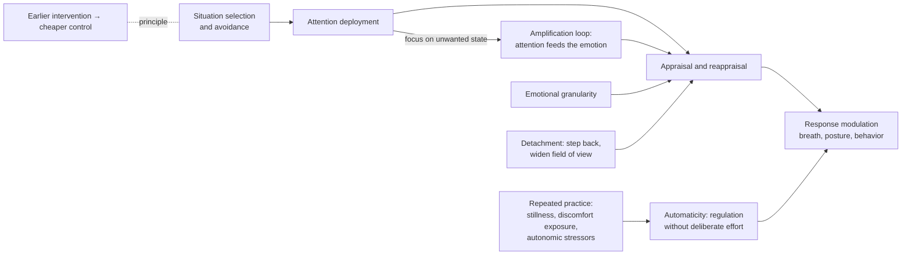

# Emotion regulation

Emotion regulation is the capacity to monitor one's own emotional state and to modulate its intensity, duration, and behavioral expression. It presupposes the emotion machinery described in [[emotions-as-functional-states]] and operates on it: humans can be conscious of an emotion while it grows, and that monitoring — likely a largely human capacity — is what makes modulation possible. The field James Gross founded in the 1990s has grown to the point that Ralph Adolphs, finishing a term as co-editor of the journal *Affective Science*, estimates a quarter to a third of submissions concern regulation; his summary claim is that most emotional pathology is not about the emotions themselves but about the ability or inability to regulate them. The clinical literatures behind cognitive reappraisal and related strategies are substantial; the specific protocols on this page are graded individually. (@hubermanlab (Andrew Huberman) — "Neuroscience of Emotions & Tools for Improving Emotion Regulation | Dr. Ralph Adolphs", 2026-08-17, [link](https://www.youtube.com/watch?v=P-h5WSQG1Sw))

## Granularity, then strategy

Regulation begins with **emotional granularity** (Lisa Feldman Barrett's construct): how finely a person can conceptualize and differentiate what they are feeling. A tangle of confusion-plus-frustration that cannot be differentiated is experienced as overwhelming and gives regulation nothing to grip. Granularity does not require words — concepts can be nonverbal, and emotion concepts translate across languages even where single words (Schadenfreude, the unbearably-cute feeling) do not — but some conceptual purchase on which state is present precedes evaluating it and choosing a response. Granularity and regulatory flexibility travel together: differentiating many states is what makes it possible to deploy many strategies. (@hubermanlab (Andrew Huberman) — "Neuroscience of Emotions & Tools for Improving Emotion Regulation | Dr. Ralph Adolphs", 2026-08-17, [link](https://www.youtube.com/watch?v=P-h5WSQG1Sw))

## Timing, amplification risk, and trainability

The strategy set runs along the emotion's timeline, and the single most effective lever is intervening early — in Adolphs's phrasing, "the earlier you can stop that process, the better." Situational avoidance (structuring the environment so the provoking situation never arises) precedes everything else; attentional and reappraisal strategies act later and cost more. Reappraisal is explicitly double-edged: attention amplifies, so effortful engagement with an emotion ("I really don't want to feel sad") can feed the state it targets, and some emotions — sadness, anxiety — are especially prone to this attractor-like deepening. This resolves the apparent contradiction between "suppressing feelings makes them grow" and "dwelling on feelings makes them grow": both are true, in different regimes, and which failure mode a person is prone to is idiosyncratic. Two components are trainable — the skill of a specific strategy (reappraising without rumination), and the strength and automaticity of control itself, the endpoint being regulation that runs smoothly without deliberate effort. (@hubermanlab (Andrew Huberman) — "Neuroscience of Emotions & Tools for Improving Emotion Regulation | Dr. Ralph Adolphs", 2026-08-17, [link](https://www.youtube.com/watch?v=P-h5WSQG1Sw)) The amplification loop is the same mechanism developed in [[emotional-memory-reactivation-and-rumination]]; the graded-action alternative lives in [[mental-strength-and-behavioral-skills]].

## Flexibility, not one strategy — and other people

The field's early focus was individual mechanisms (suppression, reappraisal, acceptance); its current organizing topics are **variability and flexibility** — having a repertoire of strategies and switching among them by context, on the analogy of heart-rate variability, where adaptiveness lies in range rather than in any fixed level. The same holds for emotional and social intelligence generally: no single sensitivity setting is optimal, and high attunement to everyone's states carries real costs (vigilance load, lability) just as low attunement does. The second modern emphasis is that regulation is **interpersonal and bidirectional**: people continuously read, influence, and regulate one another's emotions — obvious to any parent — so regulatory skill includes managing the emotional field between people, not only one's own state. (@hubermanlab (Andrew Huberman) — "Neuroscience of Emotions & Tools for Improving Emotion Regulation | Dr. Ralph Adolphs", 2026-08-17, [link](https://www.youtube.com/watch?v=P-h5WSQG1Sw)) The shared-load physiology and the leader/parent applications of interpersonal regulation are developed in [[interpersonal-regulation-and-emotional-capacity]].

## Feeling the feeling, and bottom-up safety signals

Psychiatrist David Rabin adds a response-side protocol that complements the timeline model: treat the emotion as a signal that wants to be felt, and give it undivided interoceptive attention — breathing into the bodily sensation without judging or story-making — for the brief window he claims full feeling requires, roughly 60 to 120 seconds, after which the signal has delivered its message (cry, move, create, act) and subsides. Suppression, on his account, just makes the signal knock louder. The time constant is a clinical teaching heuristic rather than a measured universal, and this page's amplification warning still applies: for people whose attention feeds a state, focused feeling can deepen it, so the protocol belongs in the flexibility repertoire, not above it. His deeper premise — that skipping the feeling step to jump straight to thinking and judging is the modern default failure — converges with the granularity requirement above: attention to the state is what identification and regulation both consume. (@maxlugavere (Max Lugavere) — "'You Are Not Your Thoughts!' How to Stop Negative Thoughts Instantly", 2026-07-08, [link](https://www.youtube.com/watch?v=vEY4oGH1x_0))

For acute state change, Rabin ranks three bottom-up safety signals as the fastest levers, each acting in about a minute: soothing touch from a trusted person (a hug, held hands), a personally meaningful favorite song, and slow voluntary breathing. The proposed common mechanism is that each is an evolved cue of safety that raises vagal activity and releases the fight-or-flight posture — the breathing arm's specific inference logic is developed at [[breathing-mechanics-and-state-regulation]]. Touch and music as rapid state shifters are mechanistically plausible and low-risk but rest here on expert interpretation, not comparative trials; Rabin's commercial extension of this idea into a vibro-tactile wearable is flagged at [[david-rabin]]. (@maxlugavere (Max Lugavere) — "'You Are Not Your Thoughts!' How to Stop Negative Thoughts Instantly", 2026-07-08, [link](https://www.youtube.com/watch?v=vEY4oGH1x_0))

## Detachment: regulating by widening attentional scope

A converging practitioner framework treats attentional scope as the regulatory handle. Jocko Willink — retired Navy SEAL officer, teaching from combat leadership rather than laboratory work — describes strong emotion and crisis as narrowing the field of view (a team staring down weapon sights each sees ~20 degrees; a depressed person sees only the storm around them, unable to compute assets an outside observer sees plainly), and detachment as the trainable counter-move: "detachment is a superpower". His mechanics are concrete and physical: literally step back (push the chair back from the table), take a slow breath before speaking, widen the visual field, lift the chin and lower the hands out of defensive posture, and stop talking in favor of listening. The oil-rig episode that taught him the skill is a clean illustration — the most junior operator, by stepping off the firing line and widening his view, saw the correct call that every senior man aiming down a scope could not. He reports the skill transfers from tactical settings to arguments, meetings, and marriages, and that it is trainable rather than a gift. (@hubermanlab (Andrew Huberman) — "Essentials: How to Become Resilient, Forge Your Identity & Lead Others | Jocko Willink", 2026-07-30, [link](https://www.youtube.com/watch?v=lxDf8uEypJU))

This is practitioner testimony, but it maps closely onto two evidence-bearing constructs: psychological distancing (the perspective-shift technique in [[mental-strength-and-behavioral-skills]]) and the metacognitive step-back Adolphs identifies as one of the two core regulatory abilities (fine-grained differentiation plus metacognitive oversight of the strategy repertoire). Physiologically, narrowed visual attention and sympathetic arousal travel together, which makes deliberate panoramic vision and slowed breathing mechanistically plausible levers ([[breathing-mechanics-and-state-regulation]]); direct outcome evidence for the full protocol is absent. (@hubermanlab (Andrew Huberman) — "Neuroscience of Emotions & Tools for Improving Emotion Regulation | Dr. Ralph Adolphs", 2026-08-17, [link](https://www.youtube.com/watch?v=P-h5WSQG1Sw))

## Training routes: stressors, stillness, and switching

**Autonomic stressor training.** Deliberate cold exposure produces a reliable, safe, bounded sympathetic surge, and repeated practice converts the response from aversive to controlled — Adolphs reports that after months of ice baths his heart rate and breathing now drop on entry, and offers a genuinely novel n-of-1 observation: the trained autonomic downregulation *generalized*, flattening his anger response to an unrelated psychological stressor (being honked at while parking). He labels this an experiment of one, not a published finding. Huberman adds that the catecholamine response is unusually reliable across people, that practiced users often show cortisol reductions, and that some evidence supports improved resilience to subsequent stressors. The transfer claim — cold training as general emotion-regulation training — is the interesting hypothesis, and it is unproven. (@hubermanlab (Andrew Huberman) — "Neuroscience of Emotions & Tools for Improving Emotion Regulation | Dr. Ralph Adolphs", 2026-08-17, [link](https://www.youtube.com/watch?v=P-h5WSQG1Sw)) Dose, physiology, and boundaries live on [[deliberate-cold-exposure]]; the same graded-stress logic underlies [[combat-sports-as-controlled-stress-training]] and Willink's resilience-as-repetitions claim ("you would develop your resiliency by doing repetitions of things that require you to be tougher") on [[mental-strength-and-behavioral-skills]]. (@hubermanlab (Andrew Huberman) — "Essentials: How to Become Resilient, Forge Your Identity & Lead Others | Jocko Willink", 2026-07-30, [link](https://www.youtube.com/watch?v=lxDf8uEypJU))

**Stillness and task switching.** Sitting quietly with one's own mind — meditation, solo running, phone-free work blocks — trains inhibition of behavior and comfort with internal states, and its initial difficulty (brief daily meditation transiently *increases* anxiety in new practitioners before benefits emerge; new students find imposed silence stressful) is part of the training signal, not a failure. A second, underappreciated target is **task switching**: switching carries a well-documented cost (residual activity and reconfiguration slow the next task's first trials), anticipating and executing switches is a skill, and deliberate transition rituals — Adolphs opens every lab meeting with three to five minutes of silence; a former special-operations guest rehearses his homecoming so he enters the house fully present — are practical machinery for pivoting brain state between contexts. Whether inserted stillness measurably reduces switching costs is an explicitly proposed, undone experiment. (@hubermanlab (Andrew Huberman) — "Neuroscience of Emotions & Tools for Improving Emotion Regulation | Dr. Ralph Adolphs", 2026-08-17, [link](https://www.youtube.com/watch?v=P-h5WSQG1Sw)) Formal contemplative training, doses, and its randomized biomarker evidence live on [[meditation-and-contemplative-training]].

**Long-timescale regulation.** Ultra-endurance events teach regulation over hours: the felt state is nonlinear (feeling wrecked at mile 50 reverses about half the time if one simply continues), so accumulated experience that terrible states pass becomes a cognitive resource against extrapolating from the current low — the practical mindset Adolphs describes as relentless optimism in the face of adversity. Deliberately surviving hard things plausibly builds a memory bank that supports leaning into later difficulty; Adolphs notes no good experiments test this. The same integration-over-time logic appears in Willink's action principle: adversity handled by immediate constructive action (mourn, then re-equip and go back to work; analyze the failed promotion, then close the qualification gap) rather than by dwelling, since time spent "with that adversity with the upper hand inside your head" worsens the state. (@hubermanlab (Andrew Huberman) — "Neuroscience of Emotions & Tools for Improving Emotion Regulation | Dr. Ralph Adolphs", 2026-08-17, [link](https://www.youtube.com/watch?v=P-h5WSQG1Sw); @hubermanlab (Andrew Huberman) — "Essentials: How to Become Resilient, Forge Your Identity & Lead Others | Jocko Willink", 2026-07-30, [link](https://www.youtube.com/watch?v=lxDf8uEypJU))

A final reframe from Willink belongs to regulation's foundations: motivation is itself an emotion — "an emotion that's going to come and go" — and therefore an unreliable driver of daily action; discipline (pre-committed action independent of felt state) removes the regulation problem for routine behavior entirely by not consulting the feeling. This is the practitioner statement of the cue-anchored pre-commitment principle in [[mental-strength-and-behavioral-skills]]. (@hubermanlab (Andrew Huberman) — "Essentials: How to Become Resilient, Forge Your Identity & Lead Others | Jocko Willink", 2026-07-30, [link](https://www.youtube.com/watch?v=lxDf8uEypJU))

## Practical implications

- **Prefer the earliest available intervention point: structure situations and environments so predictable provocations don't arise, before relying on in-the-moment reappraisal — moderate; strategy-timing effects are among the better-replicated findings in the regulation literature as summarized by a field editor.** (@hubermanlab (Andrew Huberman) — "Neuroscience of Emotions & Tools for Improving Emotion Regulation | Dr. Ralph Adolphs", 2026-08-17, [link](https://www.youtube.com/watch?v=P-h5WSQG1Sw))
- **When a strong feeling arrives in a safe context: pause and feel it in the body for one to two minutes before analyzing it — Investigational practice (clinician protocol; low-risk, mechanistically coherent, no trial of the 60–120-second window).** Switch strategies if focused attention reliably amplifies rather than resolves the state. (@maxlugavere (Max Lugavere) — "'You Are Not Your Thoughts!' How to Stop Negative Thoughts Instantly", 2026-07-08, [link](https://www.youtube.com/watch?v=vEY4oGH1x_0))
- **For rapid de-escalation: use a trusted hug or hand-hold, a favorite song, or a minute of slow voluntary breathing — limited (expert-ranked safety signals, no comparative evidence), essentially costless.** (@maxlugavere (Max Lugavere) — "'You Are Not Your Thoughts!' How to Stop Negative Thoughts Instantly", 2026-07-08, [link](https://www.youtube.com/watch?v=vEY4oGH1x_0))
- **When escalation is felt (argument, meeting, parking-lot confrontation): step physically back, slow one breath, widen the visual field, chin up, hands down, and listen instead of talking — Investigational practice (practitioner protocol; mechanistically consistent with distancing and breath evidence, no outcome trial).** (@hubermanlab (Andrew Huberman) — "Essentials: How to Become Resilient, Forge Your Identity & Lead Others | Jocko Willink", 2026-07-30, [link](https://www.youtube.com/watch?v=lxDf8uEypJU))
- **Build strategy variety rather than perfecting one tool; if focusing on a feeling reliably amplifies it, switch to acceptance, distraction, or action rather than deeper analysis — moderate as a framework (flexibility is the field's current organizing finding); individual matching is idiosyncratic.** (@hubermanlab (Andrew Huberman) — "Neuroscience of Emotions & Tools for Improving Emotion Regulation | Dr. Ralph Adolphs", 2026-08-17, [link](https://www.youtube.com/watch?v=P-h5WSQG1Sw))
- **Insert a deliberate transition (one to five minutes of silence, a walk, a rehearsed arrival routine) between contexts that demand different states — Investigational practice; switching costs are established, the countermeasure is untested.** (@hubermanlab (Andrew Huberman) — "Neuroscience of Emotions & Tools for Improving Emotion Regulation | Dr. Ralph Adolphs", 2026-08-17, [link](https://www.youtube.com/watch?v=P-h5WSQG1Sw))
- **If using cold exposure as regulation training, follow the dosing and safety boundaries on [[deliberate-cold-exposure]] — Investigational practice for the emotion-regulation transfer specifically (n-of-1 plus limited stress-buffering papers); moderate for the acute catecholamine state effect.** (@hubermanlab (Andrew Huberman) — "Neuroscience of Emotions & Tools for Improving Emotion Regulation | Dr. Ralph Adolphs", 2026-08-17, [link](https://www.youtube.com/watch?v=P-h5WSQG1Sw))
- **Under adversity, pair mourning or acknowledgment with one bounded constructive action rather than open-ended dwelling — Investigational practice as a protocol; converges with the behavioral-activation logic graded on [[mental-strength-and-behavioral-skills]].** Persistent depression, grief that does not move, or functional impairment warrants clinical care, not more discipline. (@hubermanlab (Andrew Huberman) — "Essentials: How to Become Resilient, Forge Your Identity & Lead Others | Jocko Willink", 2026-07-30, [link](https://www.youtube.com/watch?v=lxDf8uEypJU))

## Gaps & open questions

- Does inserting brief stillness before a task measurably reduce task-switching costs (the experiment Adolphs and Huberman sketch but have not run)?
- Does trained autonomic downregulation from repeated cold exposure transfer to psychological stressors in controlled designs, as the n-of-1 report suggests?
- Can emotion-regulation flexibility be measured and trained as such, rather than inferred from single-strategy studies?
- Which people amplify emotions under reappraisal (for whom attention feeds the state), and can that phenotype be identified before assigning strategies?
- Does deliberately completed adversity (endurance events, hard training) causally build resilience to unrelated stressors, or do resilient people select into it?
- What is lost when detachment becomes habitual — does chronic stepping-back erode engagement, empathy, or the information carried by full emotional immersion?

## Related

[[emotions-as-functional-states]] · [[mental-strength-and-behavioral-skills]] · [[emotional-memory-reactivation-and-rumination]] · [[interpersonal-regulation-and-emotional-capacity]] · [[meditation-and-contemplative-training]] · [[deliberate-cold-exposure]] · [[combat-sports-as-controlled-stress-training]] · [[breathing-mechanics-and-state-regulation]] · [[stress-threat-discrimination]] · [[catastrophizing-and-uncertainty]] · [[david-rabin]] · [[practice-playbook]]
