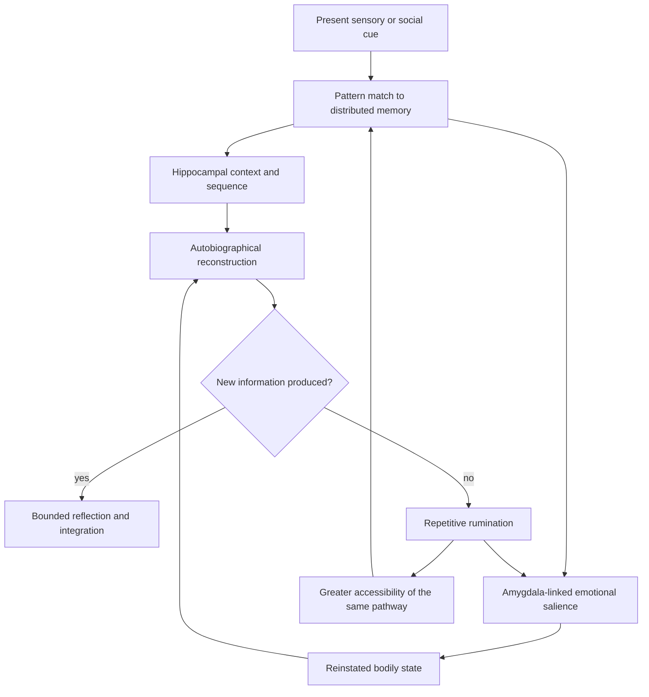
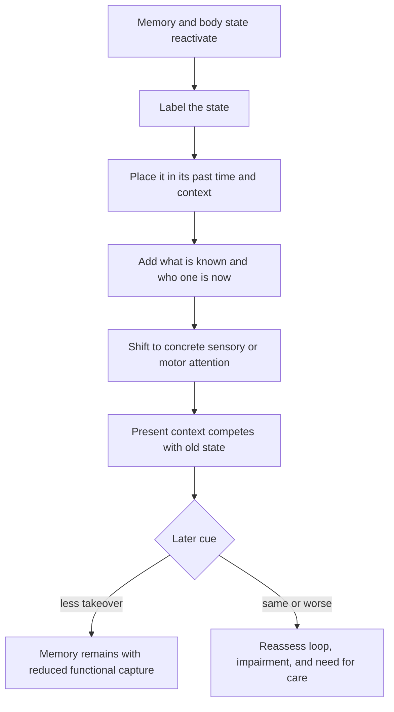

# Emotional memory reactivation and rumination

An emotional memory is a distributed reconstruction rather than a single stored record. A cue can recover sensory features, autobiographical context, bodily state, emotional salience, and the remembered self associated with an earlier relationship or life period. Consequently, an unexpected song, odor, place, or voice may reactivate a former state even when the person does not consciously want the relationship back. Reactivation shows that a learned network remains accessible; by itself it is not evidence that the memory is a message, that the relationship belongs in the present, or that recovery has failed. (@DrTraceyMarks (Dr. Tracey Marks) — "Why You Can't Stop Thinking About Someone (Even When You're Over Them)", 2026-06-24, [link](https://www.youtube.com/watch?v=LCrBsuAvD-A))

## How a cue reconstructs an emotional state

The source assigns complementary roles to several systems. Sensory processing detects a matching cue; the hippocampus contributes where, when, and autobiographical sequence; the amygdala tags emotional importance and helps recruit a familiar bodily state; and the default-mode network supports self-reference, mental time travel, and narrative meaning-making. This is a useful systems-level model, but the video does not cite experiments that isolate each component or establish that this exact sequence occurs in every episode. Its evidentiary status in this corpus is therefore **mechanistically plausible but unreviewed**. (@DrTraceyMarks (Dr. Tracey Marks) — "Why You Can't Stop Thinking About Someone (Even When You're Over Them)", 2026-06-24, [link](https://www.youtube.com/watch?v=LCrBsuAvD-A))

Emotionally intense events receive learning priority, while interrupted or unresolved stories may remain cognitively accessible. The source extends the Zeigarnik effect—the tendency for unfinished tasks to remain memorable—to ambiguous relationship endings, but does not establish how far findings about tasks generalize to intimate loss. Initial reflection may yield new understanding; rumination begins when the same questions and counterfactual endings recur without new evidence. Each replay can reactivate the associated state and rehearse the route into it, allowing the loop to become self-maintaining. This distinguishes productive meaning-making from repetition by informational yield rather than by whether thinking feels effortful. (@DrTraceyMarks (Dr. Tracey Marks) — "Why You Can't Stop Thinking About Someone (Even When You're Over Them)", 2026-06-24, [link](https://www.youtube.com/watch?v=LCrBsuAvD-A))

## Updating without suppression

Suppression can increase monitoring for the unwanted thought, so the proposed goal is neither erasure nor prolonged analysis. When a memory is reactivated, reconsolidation theory holds that it can become temporarily modifiable before restorage. Marks translates that mechanism into a sequence: label the returning state, locate it in its past context, add present knowledge and identity, and then shift to a concrete sensory or motor task. Labeling moves the person from immersion toward observation; temporal placement separates remembered danger or attachment from current conditions; new context supplies an update; and grounding interrupts further narrative rehearsal. (@DrTraceyMarks (Dr. Tracey Marks) — "Why You Can't Stop Thinking About Someone (Even When You're Over Them)", 2026-06-24, [link](https://www.youtube.com/watch?v=LCrBsuAvD-A))

Calling this memory updating does not establish that a brief self-guided exercise produces laboratory reconsolidation; reconsolidation depends on conditions that the source does not measure. The practical claim should therefore be graded **emerging/clinically plausible**, not treated as a validated treatment. Trauma-related intrusions, dissociation, severe depression, obsessive symptoms, or disabling grief are not simply stronger versions of ordinary recollection and may require professional assessment. (@DrTraceyMarks (Dr. Tracey Marks) — "Why You Can't Stop Thinking About Someone (Even When You're Over Them)", 2026-06-24, [link](https://www.youtube.com/watch?v=LCrBsuAvD-A))

## Practical implications

- **When an ordinary cue reactivates an old relational state: label, time-place, update, then ground — emerging/clinically plausible.** Use once per episode: identify the feeling or body state, state that it belongs to an earlier context, add relevant present knowledge, then do a bounded sensory task such as walking while counting or attending to water temperature. (@DrTraceyMarks (Dr. Tracey Marks) — "Why You Can't Stop Thinking About Someone (Even When You're Over Them)", 2026-06-24, [link](https://www.youtube.com/watch?v=LCrBsuAvD-A))
- **During reflection: stop when the loop ceases to produce new information — emerging.** Treat repeated counterfactual rehearsal as practice of the loop rather than proof that more analysis will create closure. (@DrTraceyMarks (Dr. Tracey Marks) — "Why You Can't Stop Thinking About Someone (Even When You're Over Them)", 2026-06-24, [link](https://www.youtube.com/watch?v=LCrBsuAvD-A))
- **Seek clinical help when memories are traumatic, disabling, escalating, or accompanied by safety risk — strong as a safety principle.** Self-guided grounding is not a substitute for assessment or evidence-based care; the source itself distinguishes ordinary reactivation from more intense trauma-related processes and states that its material is educational rather than individualized medical advice. (@DrTraceyMarks (Dr. Tracey Marks) — "Why You Can't Stop Thinking About Someone (Even When You're Over Them)", 2026-06-24, [link](https://www.youtube.com/watch?v=LCrBsuAvD-A))

## Gaps & open questions

- Does the four-step exercise change intrusion frequency, distress, behavior, or relationship functioning beyond ordinary grounding or passage of time?
- Under what retrieval and prediction-error conditions does autobiographical memory actually reconsolidate rather than merely become temporarily active?
- How well does the Zeigarnik analogy generalize from unfinished tasks to unresolved relationships?
- Which features distinguish ordinary cue-linked recall from prolonged grief, post-traumatic intrusion, obsessive rumination, or depression?
- Can reducing emotional capture preserve useful autobiographical learning without promoting avoidance?

## Related

[[stress-threat-discrimination]] · [[catastrophizing-and-uncertainty]] · [[trust-repair-and-safety-learning]] · [[self-schema-updating-after-achievement]] · [[tracey-marks]] · [[practice-playbook]]
