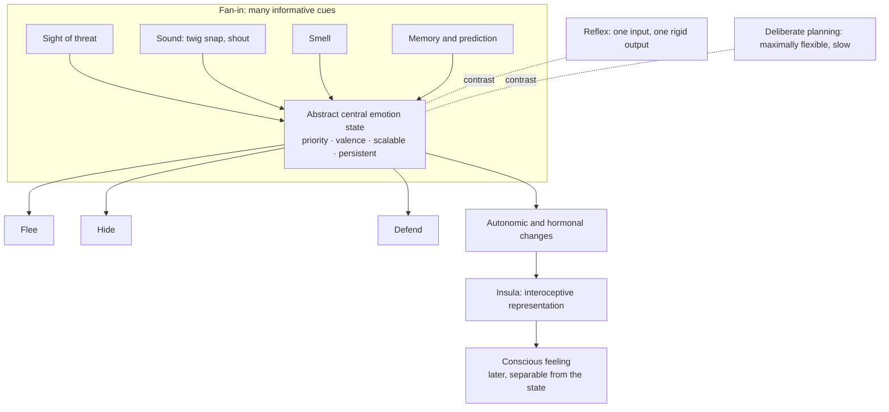

# Emotions as functional states

An emotion, in the framework this page follows, is a central brain state defined by what it does rather than by how it feels: a control layer for behavior that sits between reflexes (rigid, single-input, single-output, all-or-nothing) and deliberate goal-directed planning (maximally flexible but slow). The framework, developed by the Caltech neuroscientist Ralph Adolphs with David Anderson, identifies emotions by a shared set of operating characteristics: **priority** (they can interrupt and take over behavior, a property Herbert Simon described in the mid-20th century as an interrupt mechanism), **valence** (a similarity structure organized at its simplest along approach–avoid, Darwin's principle of antithesis), **scalability** (intensity grades continuously — threat imminence scales anxiety into fear into panic, where a reflex is binary), and **temporal persistence** (the internal state outlasts its trigger, because a bear may still be lurking after it leaves view). Priority appears necessary to the category; valence may admit near-neutral states; scalability and persistence are what most clearly separate emotions from reflexes. (@hubermanlab (Andrew Huberman) — "Neuroscience of Emotions & Tools for Improving Emotion Regulation | Dr. Ralph Adolphs", 2026-08-17, [link](https://www.youtube.com/watch?v=P-h5WSQG1Sw))

A further defining feature is **abstraction**. The state of fear can be reached from seeing, hearing, or smelling a threat, from a snapped twig, or from another person's shout — and it can issue in hiding, fleeing, or fighting depending on context. This fan-in/fan-out architecture is what makes an emotion economical: one central state serves an open-ended class of statistically recurring environmental challenges, where a reflex would need to be duplicated for every stimulus. (@hubermanlab (Andrew Huberman) — "Neuroscience of Emotions & Tools for Improving Emotion Regulation | Dr. Ralph Adolphs", 2026-08-17, [link](https://www.youtube.com/watch?v=P-h5WSQG1Sw))

## Separating the emotion from the feeling

Most psychological traditions — from William James's 1884 "What is an emotion?" to Joseph LeDoux — implicitly equate an emotion with its conscious experience. The functional framework deliberately does not: it treats the feeling as a downstream, separable representation (in humans, substantially carried by the insula's map of bodily state), while the emotion proper is the antecedent central state that triggers the bodily changes and behaviors in the first place. The methodological payoff is that emotion science can proceed the way vision or memory science does — studying the process across species without first solving consciousness. Under the functional criteria, many animal states qualify as emotions without any claim about what animals feel. This is a genuine live disagreement in the field, not a settled definition: equating emotion with feeling remains the default in much of psychology, and the functional camp's position is that doing so converts emotion research into consciousness research and stalls it. (@hubermanlab (Andrew Huberman) — "Neuroscience of Emotions & Tools for Improving Emotion Regulation | Dr. Ralph Adolphs", 2026-08-17, [link](https://www.youtube.com/watch?v=P-h5WSQG1Sw))

Direct evidence that the emotion state is separable from declarative memory comes from amnesia: patients with medial-temporal damage shown sad film clips reported strong sadness immediately afterward, and — unlike controls — still reported sadness minutes later with no memory of any film. The affective state persisted on its own time constant, independent of the ability to recall its cause. This is a small patient study, but a clean dissociation. (@hubermanlab (Andrew Huberman) — "Neuroscience of Emotions & Tools for Improving Emotion Regulation | Dr. Ralph Adolphs", 2026-08-17, [link](https://www.youtube.com/watch?v=P-h5WSQG1Sw))

## Folk categories fractionate: fear is not one system

The famous patient SM, with selective bilateral amygdala lesions, neither recognized fear in facial expressions nor experienced fear toward external threats — snakes, spiders, haunted houses, horror films. Yet when she and similarly lesioned patients inhaled carbon dioxide (an interoceptive suffocation signal that triggers panic in roughly half the general population), they had full-blown panic attacks. Exteroceptive fear of things in the world and interoceptive panic about the body's internal state are thus dissociable brain systems — amygdala-dependent and brainstem-dependent respectively. The general lesson is that folk-psychological categories like "fear," "anger," and "disgust" are coarser than the underlying biology, which differentiates by the type of challenge being handled. Calling the amygdala "the fear center" is overly simplistic even for the exteroceptive case: it is embedded in a large network with individual differences. (@hubermanlab (Andrew Huberman) — "Neuroscience of Emotions & Tools for Improving Emotion Regulation | Dr. Ralph Adolphs", 2026-08-17, [link](https://www.youtube.com/watch?v=P-h5WSQG1Sw)) This dissociation gives mechanistic depth to the appraisal distinctions in [[stress-threat-discrimination]] and the interoceptive-alarm material in [[breathing-mechanics-and-state-regulation]].

## Emotions and the body: what is measured versus what is assumed

Three claims about "emotions in the body" need separating:

1. **Bodily-map figures measure concepts, not physiology.** The widely shared heat-map studies (from Lauri Nummenmaa's group in Finland) asked people where on a mannequin they *would* feel a named emotion — no physiology was recorded. They are informative about emotion concepts, their cross-cultural spread, and their development in children, but they do not show that anger actually changes those body regions. Whether the drawings match real physiological topography is, per Adolphs, simply untested. (@hubermanlab (Andrew Huberman) — "Neuroscience of Emotions & Tools for Improving Emotion Regulation | Dr. Ralph Adolphs", 2026-08-17, [link](https://www.youtube.com/watch?v=P-h5WSQG1Sw))
2. **Real bodily changes are represented in the insula.** The insula receives input from essentially all organs and is the leading candidate substrate for the conscious *feeling* of emotion — and of pain, nausea, and visceral states generally. (@hubermanlab (Andrew Huberman) — "Neuroscience of Emotions & Tools for Improving Emotion Regulation | Dr. Ralph Adolphs", 2026-08-17, [link](https://www.youtube.com/watch?v=P-h5WSQG1Sw))
3. **Whether specific emotions have specific bodily signatures is contested.** Lisa Feldman Barrett has argued repeatedly that no systematic emotion-specific bodily pattern exists; Adolphs counters that the supporting studies measured only a few crude channels (heart rate, blood pressure), and that a high-dimensional readout across organs would, he bets, reveal complex but systematic signatures — pointing out that distributed, reliable *brain* signatures for basic emotions have already been published by Feldman Barrett herself with Tor Wager. Both sides agree the decisive high-dimensional bodily studies have not been done. This page records the disagreement rather than resolving it. (@hubermanlab (Andrew Huberman) — "Neuroscience of Emotions & Tools for Improving Emotion Regulation | Dr. Ralph Adolphs", 2026-08-17, [link](https://www.youtube.com/watch?v=P-h5WSQG1Sw))

A related contested boundary: Feldman Barrett's constructionist view holds that variation is the norm and emotions are in some sense constructed rather than natural packages; Adolphs accepts her data on expression variability while explicitly rejecting the constructed-category conclusion, retaining emotions as evolved functional kinds. (@hubermanlab (Andrew Huberman) — "Neuroscience of Emotions & Tools for Improving Emotion Regulation | Dr. Ralph Adolphs", 2026-08-17, [link](https://www.youtube.com/watch?v=P-h5WSQG1Sw))

## Reading emotions from the outside

Paul Ekman's classic claim — that six-plus basic emotions are universally recognizable from facial expressions — shaped textbooks and now underwrites commercial emotion-recognition software. A comprehensive reassessment (co-authored by Adolphs, Feldman Barrett, and others) concluded the claim does not survive its methods: the canonical stimuli are extreme expressions posed by actors, and the standard task is multiple-choice matching of faces to a provided word list, which measures conventional association rather than emotion readout. With naturalistic expressions and free labeling, responses become heterogeneous. Static snapshots are also the wrong unit — the brain tracks how a face is *changing*, and dynamic-stimulus work shows emotion representations keyed to facial dynamics rather than configuration. Control experiments make the overconfidence concrete: dog owners convinced they can detect their dog's guilt perform at chance. As Adolphs summarizes the human case, "our conviction vastly outstrips our accuracy." (@hubermanlab (Andrew Huberman) — "Neuroscience of Emotions & Tools for Improving Emotion Regulation | Dr. Ralph Adolphs", 2026-08-17, [link](https://www.youtube.com/watch?v=P-h5WSQG1Sw))

What real-world emotion perception actually uses is integration over time and prediction error: deviations from a person's baseline communication pattern — frequency and timing of contact, word choice shifted from the usual register, a skipped greeting — carry more information than any facial snapshot, consistent with Feldman Barrett's prediction-centered account. The information content of ordinary language is high enough that large language models given a page of diary-style text can reportedly estimate Big Five personality about as well as a close friend or clinician. At the neural level, no meaningful single "smile neuron" exists — selective single units can be found for almost anything but are noisy and individually uninformative; frowns and smiles are decodable only at the population level, from thousands of neurons. (@hubermanlab (Andrew Huberman) — "Neuroscience of Emotions & Tools for Improving Emotion Regulation | Dr. Ralph Adolphs", 2026-08-17, [link](https://www.youtube.com/watch?v=P-h5WSQG1Sw))

The priority feature has a societal edge: media and advertising compete precisely for emotional prioritization, because captured attention channels behavior — and unconstrained A/B testing regresses toward primitive, subcortically salient content. This is the mechanism-level basis for the attention-economy incentives described in [[health-misinformation-and-media-incentives]] and [[meaning-boredom-and-technology]]. (@hubermanlab (Andrew Huberman) — "Neuroscience of Emotions & Tools for Improving Emotion Regulation | Dr. Ralph Adolphs", 2026-08-17, [link](https://www.youtube.com/watch?v=P-h5WSQG1Sw))

## Innate scaffold, experiential refinement

Emotion-relevant perception follows the general developmental rule that nothing is purely hardwired or purely learned: face processing has an innate, experience-independent scaffold refined by maturation and experience, and even the visual word-form area — which cannot have been selected for directly — shows pre-reading connectivity that predisposes it to its later specialization. Emotional development plausibly works the same way: crude initial tuning, progressively refined granularity. Awe is offered as a candidate uniquely human emotion, derived from the metacognitive capacity to detach perspective from the here and now (the same capacity underlying mental time travel and perspective-taking). (@hubermanlab (Andrew Huberman) — "Neuroscience of Emotions & Tools for Improving Emotion Regulation | Dr. Ralph Adolphs", 2026-08-17, [link](https://www.youtube.com/watch?v=P-h5WSQG1Sw))

## Practical implications

This is a mechanism page; the actionable programme built on it lives in [[emotion-regulation]]. What the mechanism itself licenses:

- **Do not treat a facial expression — yours or anyone's — as a reliable readout of emotion; probe context, ask, and weight deviations from the person's own baseline — moderate, from the reassessment literature summarized above.** The same boundary applies to software claiming emotion detection from faces. (@hubermanlab (Andrew Huberman) — "Neuroscience of Emotions & Tools for Improving Emotion Regulation | Dr. Ralph Adolphs", 2026-08-17, [link](https://www.youtube.com/watch?v=P-h5WSQG1Sw))
- **Expect emotions to persist beyond their trigger and budget for that time constant rather than fighting it — moderate on mechanism (persistence is a defining feature, demonstrated independent of memory).** An affective state without an identifiable current cause is not evidence that something is presently wrong. (@hubermanlab (Andrew Huberman) — "Neuroscience of Emotions & Tools for Improving Emotion Regulation | Dr. Ralph Adolphs", 2026-08-17, [link](https://www.youtube.com/watch?v=P-h5WSQG1Sw))
- **Treat panic-like interoceptive alarm (air hunger, suffocation feeling) and situational fear as different systems with different handles — emerging; the dissociation is from small lesion studies.** Interoceptive alarm with no external threat warrants medical evaluation before psychological reframing. (@hubermanlab (Andrew Huberman) — "Neuroscience of Emotions & Tools for Improving Emotion Regulation | Dr. Ralph Adolphs", 2026-08-17, [link](https://www.youtube.com/watch?v=P-h5WSQG1Sw))

## Gaps & open questions

- Does a high-dimensional, multi-organ physiological readout reveal emotion-specific bodily signatures, as distributed brain signatures suggest — or vindicate the no-systematic-association view?
- Do the concept-level bodily maps correspond to any measured physiological topography?
- Which of the functional features (priority, valence, scalability, persistence) are individually necessary, and is there a genuinely neutral ("meh") emotion state?
- How far do the amygdala/brainstem fear–panic dissociations generalize beyond a handful of lesion patients?
- Can functional-emotion criteria be operationalized for AI systems, and what would follow from a machine meeting them?

## Related

[[emotion-regulation]] · [[stress-threat-discrimination]] · [[protective-threat-responses]] · [[breathing-mechanics-and-state-regulation]] · [[neuromodulators-and-state-control]] · [[interpersonal-regulation-and-emotional-capacity]] · [[social-evaluative-threat-and-criticism]] · [[health-misinformation-and-media-incentives]] · [[meaning-boredom-and-technology]] · [[meditation-and-contemplative-training]]
