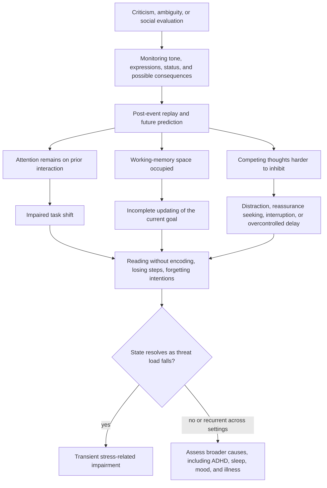

# Executive function under social stress

Executive function is the control system that keeps behavior aligned with a goal. Three operations are especially vulnerable when attention is captured by a socially threatening interaction: **shifting** moves between tasks or perspectives, **updating** replaces no-longer-relevant contents of working memory, and **inhibition** suppresses thoughts, cues, or responses that compete with the current goal. Working memory is therefore not passive storage; it is a small active workspace whose contents must be continually selected and refreshed. (@DrTraceyMarks (Dr. Tracey Marks) — "Why You Can't Focus: Is It ADHD or Just Stress?", 2026-08-26, [link](https://www.youtube.com/watch?v=SnAO3XCtQsE))

## How an interaction follows the person into the next task

The meeting may end while the cognitive task does not. Rehearsing what was said, inferring what it meant, composing a better reply, and predicting the next consequence occupy attention that the next report or conversation also needs. This can look like procrastination even when the person is cognitively busy. Because working memory has limited capacity, the new instruction, intended sentence, or reason for entering a room may fail to remain active long enough to guide behavior. Reduced inhibition can appear as impulsive explanation and reassurance seeking, but it can also appear as excessive caution and prolonged search for the perfect response; impulsivity alone does not identify the mechanism. This is a coherent expert model, but the source supplies no named experimental study or effect size for the complete chain. (@DrTraceyMarks (Dr. Tracey Marks) — "Why You Can't Focus: Is It ADHD or Just Stress?", 2026-08-26, [link](https://www.youtube.com/watch?v=SnAO3XCtQsE)) [[social-evaluative-threat-and-criticism]]

## Stress-related impairment versus ADHD

Social stress can temporarily impair executive performance in a person with or without attention-deficit/hyperactivity disorder (ADHD), and it may amplify an existing ADHD pattern; stress does not create the neurodevelopmental disorder. ADHD diagnosis instead requires a persistent impairing pattern, several symptoms before age twelve, expression in more than one setting, and consideration of alternative explanations. One difficult afternoon cannot establish or exclude it. (@DrTraceyMarks (Dr. Tracey Marks) — "Why You Can't Focus: Is It ADHD or Just Stress?", 2026-08-26, [link](https://www.youtube.com/watch?v=SnAO3XCtQsE))

A useful differential history asks four questions: **timeline** (did similar problems predate the stress period and reach back toward childhood?), **context** (do they occur across home, work, relationships, and routine tasks, including relatively calm periods?), **persistence** (do rest, sleep, or distance from the trigger restore function?), and **baseline** (how does attention work when the person feels safe, interested, and unobserved?). Better focus during urgent, novel, interesting, or highly structured work does not rule out ADHD. School records and collateral history can help when childhood recall is limited, but this framework organizes an assessment; it is not a self-test. (@DrTraceyMarks (Dr. Tracey Marks) — "Why You Can't Focus: Is It ADHD or Just Stress?", 2026-08-26, [link](https://www.youtube.com/watch?v=SnAO3XCtQsE)) [[adhd-and-reproductive-hormone-transitions]]

## Practical implications

- **After a socially stressful interaction: briefly change physical context, broaden visual attention away from the screen, and slow breathing if helpful—investigational practice.** Tracey Marks proposes this as a way to interrupt narrowed attention; she notes that about 90 seconds may sometimes help, but neither that duration nor the technique has outcome-trial support in the supplied source. It should not be used to suppress a necessary response to actual danger or mistreatment. (@DrTraceyMarks (Dr. Tracey Marks) — "Why You Can't Focus: Is It ADHD or Just Stress?", 2026-08-26, [link](https://www.youtube.com/watch?v=SnAO3XCtQsE))
- **At the return to work: externalize one next action in a visible sentence, then perform only its first step—investigational practice with a plausible cognitive-offloading rationale.** Reassess whether the next step can now be held in mind rather than interpreting success or failure as an ADHD test. (@DrTraceyMarks (Dr. Tracey Marks) — "Why You Can't Focus: Is It ADHD or Just Stress?", 2026-08-26, [link](https://www.youtube.com/watch?v=SnAO3XCtQsE))
- **When problems are persistent, impairing, cross-situational, or traceable to childhood: seek a formal evaluation—strong diagnostic principle.** Assessment should also consider sleep loss, anxiety, depression, trauma, medicines, substances, and medical causes; do not diagnose from response to a reset exercise. (@DrTraceyMarks (Dr. Tracey Marks) — "Why You Can't Focus: Is It ADHD or Just Stress?", 2026-08-26, [link](https://www.youtube.com/watch?v=SnAO3XCtQsE))

## Gaps & open questions

- How large and durable is the executive-function decrement after social-evaluative stress, and which operation is most affected?
- Do visual broadening, brief context change, or one-step externalization outperform ordinary rest or expectancy-matched controls?
- Which time course best distinguishes transient threat load from ADHD, anxiety, trauma-related vigilance, depression, or sleep debt?
- How do workplace power, discrimination, autism, trauma history, and genuine interpersonal danger change interpretation and safe intervention?

## Related

[[social-evaluative-threat-and-criticism]] · [[interpersonal-regulation-and-emotional-capacity]] · [[stress-threat-discrimination]] · [[protective-threat-responses]] · [[adhd-and-reproductive-hormone-transitions]] · [[tracey-marks]] · [[practice-playbook]]
