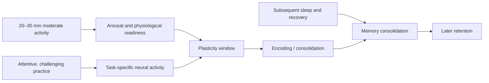

# Exercise-enhanced learning

Exercise-enhanced learning is the use of a short bout of physical activity near a learning session to create a temporary physiological state favorable to encoding or consolidation. Exercise does not insert information into the brain; it can raise arousal and alter perfusion and neuromodulatory or trophic signaling, while focused practice supplies the task-specific activity that determines what changes.

## Mechanism and protocol

A practical, studied pattern is roughly 20–30 minutes of moderate activity immediately before or after a learning bout; jogging is an example, not a necessary modality, and other moderate physical activity may serve the same role. The claimed outcome is improved retention, not guaranteed mastery, and the effect depends on genuine engagement with the material. (@matt.kaeberlein (Healthspan Medicine) — "Neuroscientist Reveals What's Actually Working for Brain Longevity (with Dr. Tommy Wood)", 2026-04-05, [link](https://www.youtube.com/watch?v=XXmZtn4R0Ow))

Arousal has an optimum rather than a simple more-is-better relationship. Too little engagement weakens encoding; excessive stress or exhaustion can narrow attention or impair performance. Tommy Wood’s distinctive framing is that arousal is one of the primary drivers of neuroplasticity and that agency—choosing a tractable challenge and acting on it—can counter the helplessness associated with cognitive anxiety or burnout. This is a useful teaching model, but the transcript does not quantify the arousal curve or establish that perceived agency prevents dementia. (@matt.kaeberlein (Healthspan Medicine) — "Neuroscientist Reveals What's Actually Working for Brain Longevity (with Dr. Tommy Wood)", 2026-04-05, [link](https://www.youtube.com/watch?v=XXmZtn4R0Ow))

## Practical implications

- **For selected learning sessions: place 20–30 minutes of moderate aerobic activity just before or after practice — moderate evidence for short-term retention.** Use a safe intensity that increases alertness without leaving the learner depleted.
- **Each session: make practice attentive, difficult, and feedback-rich — strong mechanistic rationale.** Activity without a learning bout improves health but cannot specify the skill to be encoded.
- **Nightly: protect sleep after learning — moderate-to-strong evidence for consolidation.** Do not trade sleep for additional late practice.
- **Long term: treat this as an adjunct to regular exercise and varied learning, not a dementia-prevention protocol — strong caution.** Clinical outcome evidence is not established by acute retention effects.

## Gaps & open questions

- What timing, intensity, and modality maximize retention for different ages, fitness levels, and tasks?
- Do repeated acute improvements transfer to broad cognition or lower dementia incidence?
- Which people are impaired rather than helped by high arousal near learning?
- How do exercise timing and sleep interact in consolidation?

## Related

[[cognitive-reserve-and-brain-health]] · [[youth-resistance-training]] · [[practice-playbook]] · [[aging-model]]
