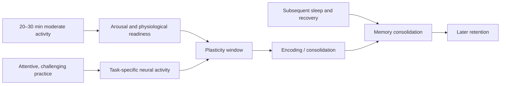
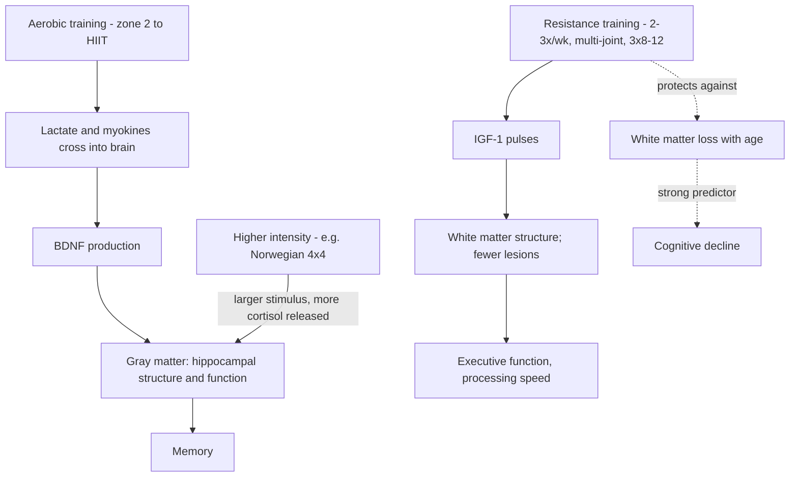

# Exercise-enhanced learning

Exercise-enhanced learning is the use of a short bout of physical activity near a learning session to create a temporary physiological state favorable to encoding or consolidation. Exercise does not insert information into the brain; it can raise arousal and alter perfusion and neuromodulatory or trophic signaling, while focused practice supplies the task-specific activity that determines what changes.

## Mechanism and protocol

```mermaid
flowchart LR
  EX[20–30 min moderate activity] --> A[Arousal and physiological readiness]
  PRACTICE[Attentive, challenging practice] --> ACTIVE[Task-specific neural activity]
  A --> PLAST[Plasticity window]
  ACTIVE --> PLAST
  PLAST --> ENC[Encoding / consolidation]
  SLEEP[Subsequent sleep and recovery] --> CONS[Memory consolidation]
  ENC --> CONS
  CONS --> RET[Later retention]
```

A practical, studied pattern is roughly 20–30 minutes of moderate activity immediately before or after a learning bout; jogging is an example, not a necessary modality, and other moderate physical activity may serve the same role. The claimed outcome is improved retention, not guaranteed mastery, and the effect depends on genuine engagement with the material. (@matt.kaeberlein (Healthspan Medicine) — "Neuroscientist Reveals What's Actually Working for Brain Longevity (with Dr. Tommy Wood)", 2026-04-05, [link](https://www.youtube.com/watch?v=XXmZtn4R0Ow))

Arousal has an optimum rather than a simple more-is-better relationship. Too little engagement weakens encoding; excessive stress or exhaustion can narrow attention or impair performance. Tommy Wood’s distinctive framing is that arousal is one of the primary drivers of neuroplasticity and that agency—choosing a tractable challenge and acting on it—can counter the helplessness associated with cognitive anxiety or burnout. This is a useful teaching model, but the transcript does not quantify the arousal curve or establish that perceived agency prevents dementia. (@matt.kaeberlein (Healthspan Medicine) — "Neuroscientist Reveals What's Actually Working for Brain Longevity (with Dr. Tommy Wood)", 2026-04-05, [link](https://www.youtube.com/watch?v=XXmZtn4R0Ow))

The plasticity window cuts both ways, because plasticity is content-neutral: it strengthens the encoding of whatever the mind holds during and around the aroused state, wholesome or toxic. Richard Davidson's corollary is that exercising while consuming distressing media aims exercise-enhanced encoding at threat content and can leave the exerciser worse off mentally despite the physical benefit, whereas deliberately chosen content — body awareness, or a rehearsed generosity framing he calls "contemplative aerobics" — uses the same window at no time cost. The neutrality principle is consistent with basic plasticity science; the net-harm claim for negative media and the benefit of the specific pairing are expert inference without outcome trials, and the optimal timing of mental relative to physical exercise is explicitly unstudied. [[meditation-and-contemplative-training]] (FoundMyFitness — "Meditation Does Far More Than Reduce Stress | Dr. Richard Davidson", 2026-08-26, [link](https://www.youtube.com/watch?v=3NiQF9_Vxi8))

The acute protocol has firmed up. Meta-analyses of exercise followed by immediate cognitive testing find the best-supported single protocol is roughly a 20–30 minute jog; a 20–30 minute resistance session of multi-joint movements at moderate loads shows similar acute bumps, and even a few maximal ~6-second sprints with long rests produce comparable effects — suggesting the operative variable is a modest area-under-the-curve rise in catecholamines and cortisol that moves the learner up the arousal curve, not a large neurochemical dump. The corollary boundary condition: truly exhaustive exercise (an all-out 2-km rowing test, high-volume training to failure) impairs cognition afterward, so when hard mental work follows training, volume should stay below the exerciser's envelope-pushing level. (@hubermanlab (Andrew Huberman) — "Accelerate Learning & Increase Cognitive Capacity | Dr. Tommy Wood", 2026-07-20, [link](https://www.youtube.com/watch?v=bPd9NnOzx78))

## Modality-specific long-term effects: gray matter versus white matter

Beyond the acute window, aerobic and resistance training appear to remodel different brain compartments, which is a reason to program both rather than treating them as interchangeable "exercise". (@hubermanlab (Andrew Huberman) — "Accelerate Learning & Increase Cognitive Capacity | Dr. Tommy Wood", 2026-07-20, [link](https://www.youtube.com/watch?v=bPd9NnOzx78))

```mermaid
flowchart TD
  AER[Aerobic training - zone 2 to HIIT] --> LAC[Lactate and myokines cross into brain]
  LAC --> BDNF[BDNF production]
  BDNF --> GM[Gray matter: hippocampal structure and function]
  GM --> MEM[Memory]
  HIIT[Higher intensity - e.g. Norwegian 4x4] -->|larger stimulus, more cortisol released| GM
  RES[Resistance training - 2-3x/wk, multi-joint, 3x8-12] --> IGF[IGF-1 pulses]
  IGF --> WM[White matter structure; fewer lesions]
  WM --> EXEC[Executive function, processing speed]
  WMAGE[White matter loss with age] -.strong predictor.-> DECLINE[Cognitive decline]
  RES -.protects against.-> WMAGE
```

On the aerobic side, the classic randomized finding is that brisk walking at roughly zone-2 intensity, 40 minutes three times weekly for a year, increased hippocampal volume, VO2 max, circulating BDNF, and memory in older adults. A more recent randomized trial compared low-intensity activity, zone-2 treadmill work, and the Norwegian 4x4 interval protocol (4 × 4 minutes at 85–95% of maximum heart rate, 3-minute recoveries, three times weekly for six months) in older adults: fitness gains were equivalent between the zone-2 and interval groups, but the interval group showed substantially better hippocampal function and structural maintenance on MRI, and the benefit persisted five years after the six-month intervention ended. Within-study analyses reportedly showed that harder work and greater cortisol release predicted greater benefit — direct trial evidence against the popular claim that high-intensity exercise harms the brain via cortisol. Lactate, which readily enters the brain and stimulates BDNF production, is the proposed mediator of the intensity effect. (@hubermanlab (Andrew Huberman) — "Accelerate Learning & Increase Cognitive Capacity | Dr. Tommy Wood", 2026-07-20, [link](https://www.youtube.com/watch?v=bPd9NnOzx78))

On the resistance side, the small trial base (three to four studies in older adults, typically two to three sessions weekly, five to six multi-joint machine exercises, three sets of 8–12 repetitions, sustained six to twelve months) shows improved white-matter structure — possibly including white-matter lesions, which cluster in poorly perfused regions — with accompanying executive-function gains. The proposed mediator is IGF-1, which resistance training elevates and which is critical to white-matter development and maintenance; age-related white-matter deterioration is among the strongest structural predictors of cognitive decline, independent of amyloid and tau pathology. The mediator attributions (lactate→BDNF→gray matter; IGF-1→white matter) are mechanistic interpretation layered on small randomized trials, not established causal chains. [[resistance-training]] [[cardiorespiratory-fitness]] (@hubermanlab (Andrew Huberman) — "Accelerate Learning & Increase Cognitive Capacity | Dr. Tommy Wood", 2026-07-20, [link](https://www.youtube.com/watch?v=bPd9NnOzx78))

## Stimulants: the feeling–performance dissociation

Exogenous arousal is not equivalent to the endogenous kind. In complex working-memory tasks (e.g., n-back), caffeine makes subjects feel they are performing better while error rates worsen; a similar dissociation is reported for methylphenidate and related stimulants in people without ADHD, and formalized creativity testing shows the same pattern for cannabis (higher self-rated, lower observer-rated creativity). Exercise-induced arousal does not show this dissociation, which is a specific argument for preferring endogenous arousal around learning and for distrusting felt improvement as evidence that a stimulant is helping. [[neuromodulators-and-state-control]] (@hubermanlab (Andrew Huberman) — "Accelerate Learning & Increase Cognitive Capacity | Dr. Tommy Wood", 2026-07-20, [link](https://www.youtube.com/watch?v=bPd9NnOzx78))

## Practical implications

- **For selected learning sessions: place 20–30 minutes of moderate aerobic activity just before or after practice — moderate evidence for short-term retention.** Use a safe intensity that increases alertness without leaving the learner depleted.
- **Each session: make practice attentive, difficult, and feedback-rich — strong mechanistic rationale.** Activity without a learning bout improves health but cannot specify the skill to be encoded.
- **Nightly: protect sleep after learning — moderate-to-strong evidence for consolidation.** Do not trade sleep for additional late practice.
- **Long term: treat this as an adjunct to regular exercise and varied learning, not a dementia-prevention protocol — strong caution.** Clinical outcome evidence is not established by acute retention effects.

## Gaps & open questions

- What timing, intensity, and modality maximize retention for different ages, fitness levels, and tasks?
- Do repeated acute improvements transfer to broad cognition or lower dementia incidence?
- Which people are impaired rather than helped by high arousal near learning?
- How do exercise timing and sleep interact in consolidation?
- Does concurrent mental content during exercise (distressing media versus deliberately cultivated states) measurably change what the plasticity window encodes, as the content-neutrality principle predicts?

## Related

[[cognitive-reserve-and-brain-health]] · [[youth-resistance-training]] · [[meditation-and-contemplative-training]] · [[practice-playbook]] · [[aging-model]]
