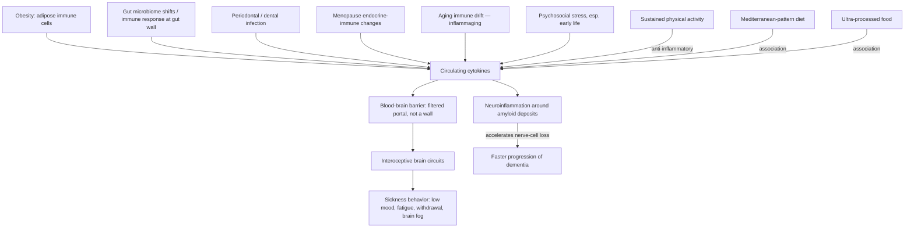

# Inflammation and depression

Neuroimmune psychiatry studies how the body's inflammatory state changes brain function and mood. Its central claim is that a subset of depression is not "all in the mind" but downstream of systemic inflammation: cytokines released anywhere in the body circulate, cross into the brain, and alter activity in the circuits that regulate mood. The framing challenges two inherited ideas at once — the Cartesian mind–body split embedded in how medicine is organized, and the textbook teaching that the brain is "immune privileged" behind an impermeable blood–brain barrier. Psychiatrist Ed Bullmore, author of *The Inflamed Mind*, estimates that about 30% of severe depression carries a significant inflammatory component — an expert estimate over heterogeneous evidence, not a validated diagnostic fraction. (@joinzoe (ZOE) — "Doctors are ignoring the root cause! What inflammation is really doing to your mind and body", 2026-06-11, [link](https://www.youtube.com/watch?v=EVqoCjYFhT0))

## Inflammation is systemic by design

Inflammation is the innate immune system's first-line response to infection or injury: present from birth, fast, and stereotyped. A local response is almost never only local — a hot spot in a tooth, joint, or gum raises circulating cytokine concentrations and changes white-cell populations body-wide. The response is double-edged: when the trigger can be eliminated (an infected cut), inflammation resolves; when the immune system misidentifies the body's own tissue (autoimmune disease such as rheumatoid arthritis), there is no decisive victory to be had and inflammation persists. Persistent low-grade inflammation is the exposure of interest for mood. (@joinzoe (ZOE) — "Doctors are ignoring the root cause! What inflammation is really doing to your mind and body", 2026-06-11, [link](https://www.youtube.com/watch?v=EVqoCjYFhT0)) [[inflammaging-and-il-6]]

## How body inflammation reaches the brain

The blood–brain barrier was long taught as sealing the brain off from circulating immune activity. Bullmore's corrective is that it is neither a wide-open door nor a wall but — in his phrase — "a filtered portal": cytokines and even white blood cells cross by several routes. Once across, they modulate interoceptive brain systems — circuits specialized for sensing the internal state of the body — and human imaging shows that changing the body's inflammatory state changes functional activity in networks known to matter for mood and mood disorders. The behavioral output has an evolutionary reading: an inflamed animal becomes less exploratory, less mobile, and less social — sickness behavior that promotes survival after infection or injury, selected as part of the immune repertoire. Depressive behavior, on this account, is partly an ancient protective program firing in response to chronic inflammatory signaling that never resolves. (@joinzoe (ZOE) — "Doctors are ignoring the root cause! What inflammation is really doing to your mind and body", 2026-06-11, [link](https://www.youtube.com/watch?v=EVqoCjYFhT0))

## Candidate inflammatory sources

Five recurring contributors, on differing evidence tiers, all observational or mechanistic rather than trial-proven as depression causes:

- **Obesity.** The obesity–depression association is robust in both directions. The traditional reading is psychological (distress about appearance); the neuroimmune reading is causal — immune cells resident in expanding adipose tissue release cytokines that change brain function. Both mechanisms can coexist. (@joinzoe (ZOE) — "Doctors are ignoring the root cause! What inflammation is really doing to your mind and body", 2026-06-11, [link](https://www.youtube.com/watch?v=EVqoCjYFhT0)) [[visceral-and-ectopic-fat]]
- **The gut microbiome.** Much of the immune system is concentrated at the gut wall, a deliberately permeable frontier; compositional shifts toward hostile organisms elicit immune responses that can feed the systemic pool. Bullmore explicitly declines the panacea framing — microbiome-directed treatment will help some people, not abolish depression. The transfer-experiment and cross-diagnostic microbiome evidence lives at [[nutritional-psychiatry]] and [[food-patterns-and-gut-ecology]]. (@joinzoe (ZOE) — "Doctors are ignoring the root cause! What inflammation is really doing to your mind and body", 2026-06-11, [link](https://www.youtube.com/watch?v=EVqoCjYFhT0))
- **Gum disease.** Periodontitis is a common, hard-to-eradicate low-grade infection whose inflammatory signal is detectable in blood. Bullmore links it to mood mechanistically and notes an epidemiological association with dementia risk, while explicitly flagging that he is not certain how solid that evidence is — an association needing further investigation, not an established causal pathway. The structural obstacle he highlights is real regardless: dental and medical records and practitioners are almost fully separated. (@joinzoe (ZOE) — "Doctors are ignoring the root cause! What inflammation is really doing to your mind and body", 2026-06-11, [link](https://www.youtube.com/watch?v=EVqoCjYFhT0))
- **Menopause.** Some evidence links the menopause transition to a shifted inflammatory state alongside its endocrine changes; the traditional loss-of-fertility psychological explanation for perimenopausal mood symptoms competes with (and may coexist with) an endocrine-immune account. (@joinzoe (ZOE) — "Doctors are ignoring the root cause! What inflammation is really doing to your mind and body", 2026-06-11, [link](https://www.youtube.com/watch?v=EVqoCjYFhT0)) [[menopause-related-cognitive-impairment]] [[perimenopause-assessment-and-testing]]
- **Aging.** Inflammatory tone tends to rise with age while brain processing capacity declines. In Alzheimer's disease specifically, amyloid deposits are recognized by brain immune cells as hostile and trigger a local inflammatory response; Bullmore's careful formulation is that inflammation does not so much cause Alzheimer's as accelerate its progression, and that damping the response protects nerve cells and slows cognitive decline. This aligns with the ARIA-and-microglia material at [[anti-amyloid-immunotherapy]] and the inflammaging framing at [[inflammaging-and-il-6]]. (@joinzoe (ZOE) — "Doctors are ignoring the root cause! What inflammation is really doing to your mind and body", 2026-06-11, [link](https://www.youtube.com/watch?v=EVqoCjYFhT0))

Psychosocial stress is a sixth input rather than a separate category: stressing an animal elicits an immune response, and early-life adversity (abuse, neglect, extreme poverty, parental loss) predicts adult mental illness decades later. Bullmore's proposed — explicitly investigational — mechanism is immune memory: the same property that makes vaccination work may encode childhood stress as a long-lived inflammatory disposition. (@joinzoe (ZOE) — "Doctors are ignoring the root cause! What inflammation is really doing to your mind and body", 2026-06-11, [link](https://www.youtube.com/watch?v=EVqoCjYFhT0))

## The diagnostic critique

Psychiatric diagnoses are symptom checklists — descriptive syndromes, not diseases with identified causes. Bullmore's fever analogy: nineteenth-century medicine treated "fever" as the condition until germ theory split it into distinct infections with distinct treatments. Depression, he argues, will similarly resolve into multiple causal pathways — genetic, environmental, inflammatory, mixed — of which the inflammatory subtype is one. Two structural consequences follow today: the DSM's major-depression criteria effectively exclude patients whose depression accompanies a physical inflammatory illness (relabeled "comorbid depression"), and primary-care practice typically prescribes an antidepressant or CBT within minutes without screening for inflammatory or other physical contributors. This converges with — but is distinct from — Tim Spector's stronger unification claim that mental and neurodegenerative brain disorders are essentially one disease presenting differently, recorded as attributed expert interpretation at [[nutritional-psychiatry]]. (@joinzoe (ZOE) — "Doctors are ignoring the root cause! What inflammation is really doing to your mind and body", 2026-06-11, [link](https://www.youtube.com/watch?v=EVqoCjYFhT0))

## What modifies the inflammatory input

- **Exercise** is the best-supported lever: sustained physical activity is anti-inflammatory, and randomized trials of physical training have produced mood improvements Bullmore characterizes as roughly equivalent on average to antidepressant drugs — population-average evidence, with wide individual variation. His stated personal practice is daily steps (about 10,000) rather than extreme training. (@joinzoe (ZOE) — "Doctors are ignoring the root cause! What inflammation is really doing to your mind and body", 2026-06-11, [link](https://www.youtube.com/watch?v=EVqoCjYFhT0)) [[exercise-intensity-and-health-outcomes]]
- **Diet**: Mediterranean-pattern eating associates with lower inflammation and lower depression; ultra-processed food associates with both in the adverse direction. Bullmore's synthesis is that a causal diet→microbiome→immune→brain chain is the most parsimonious explanation for the converging associations — a mechanistic inference, not trial proof. Interventional dietary evidence (SMILES) lives at [[nutritional-psychiatry]]. (@joinzoe (ZOE) — "Doctors are ignoring the root cause! What inflammation is really doing to your mind and body", 2026-06-11, [link](https://www.youtube.com/watch?v=EVqoCjYFhT0))
- **Mind-body practice and psychotherapy**: yoga and meditation are plausible-but-unproven through the same immune route (a position Bullmore says he would have dismissed 15 years ago); CBT is moderately effective on trial average. A randomized IL-6 reduction from brief contemplative practice is recorded, with its conflicts, at [[meditation-and-contemplative-training]]. (@joinzoe (ZOE) — "Doctors are ignoring the root cause! What inflammation is really doing to your mind and body", 2026-06-11, [link](https://www.youtube.com/watch?v=EVqoCjYFhT0))

The pharmacological caution from the cardiovascular literature transfers directly: lowering a cytokine is not the same as improving an outcome (direct IL-6 removal failed on cardiovascular events and raised infection risk in ZEUS — [[inflammaging-and-il-6]]), so anti-inflammatory drug treatment of depression remains a research question, not a practice.

## Practical implications

- **If persistently low, flat, anxious, or foggy: consult a primary-care clinician, and explicitly present mental and physical symptoms together — strong as care-seeking guidance; the integrated-assessment framing is expert opinion.** Ask whether inflammatory or other physical contributors (weight trajectory, autoimmune disease, dental infection, menopause transition, sleep) are worth assessing; GPs do not routinely screen for inflammation in depressive presentations. (@joinzoe (ZOE) — "Doctors are ignoring the root cause! What inflammation is really doing to your mind and body", 2026-06-11, [link](https://www.youtube.com/watch?v=EVqoCjYFhT0))
- **Daily-to-most-days: sustained moderate physical activity (regular walking counts) for mood — moderate-to-strong (randomized training trials plus large observational evidence, per the source), with antidepressant-comparable average effect sizes.** Do not stop prescribed antidepressant treatment to substitute exercise without clinical guidance. (@joinzoe (ZOE) — "Doctors are ignoring the root cause! What inflammation is really doing to your mind and body", 2026-06-11, [link](https://www.youtube.com/watch?v=EVqoCjYFhT0))
- **Ongoing: Mediterranean-pattern, minimally processed eating — moderate for the mood association, mechanistic for the inflammatory route; dental hygiene and periodontal treatment — established for oral health, investigational for mood and dementia benefit.** No anti-inflammatory drug, supplement, or biomarker-guided protocol for depression is supported for self-directed use. (@joinzoe (ZOE) — "Doctors are ignoring the root cause! What inflammation is really doing to your mind and body", 2026-06-11, [link](https://www.youtube.com/watch?v=EVqoCjYFhT0))

## Gaps & open questions

- Can the proposed ~30% inflammatory-depression subtype be identified prospectively with validated biomarkers, and does anti-inflammatory treatment help that subtype specifically?
- Does treating periodontal disease change mood, cognitive trajectory, or dementia incidence in randomized designs — and how solid is the underlying gum-disease–dementia association?
- Is childhood adversity actually encoded as durable innate-immune memory in humans, and is that encoding reversible?
- How much of the rise in reported mental-health problems reflects rising inflammatory burden versus reporting, diagnostic liberalization, and cultural change? The source raises all four without adjudicating.
- Which interoceptive-circuit changes seen on imaging under experimental inflammation predict clinical depression rather than transient sickness behavior?
- Does menopause-associated inflammation contribute to perimenopausal mood symptoms beyond the endocrine changes themselves?

## Related

[[nutritional-psychiatry]] · [[inflammaging-and-il-6]] · [[food-patterns-and-gut-ecology]] · [[mood-disorder-pharmacology]] · [[neuroendocrine-regulation-of-mood]] · [[cognitive-reserve-and-brain-health]] · [[alzheimers-spectrum-and-diagnosis]] · [[anti-amyloid-immunotherapy]] · [[visceral-and-ectopic-fat]] · [[menopause-related-cognitive-impairment]] · [[meditation-and-contemplative-training]] · [[exercise-intensity-and-health-outcomes]] · [[aging-model]] · [[practice-playbook]]
