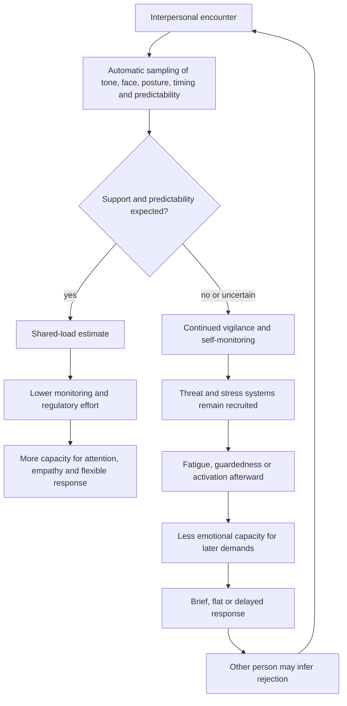

# Interpersonal regulation and emotional capacity

Emotional availability is a state-dependent capacity to attend to another person, represent their perspective, regulate one's own response, and express care in a form the other person can receive. It is related to, but not identical with, affection or commitment: cognitive load, sleep loss, stress, and unresolved emotion can reduce the resources available for patience and empathy without establishing that care has disappeared. Conversely, repeated low availability still has interpersonal consequences even when depletion, rather than detachment, is the cause. (@DrTraceyMarks (Dr. Tracey Marks) — "Emotional Bandwidth: Why You Sometimes Can’t Be There for People You Love", 2026-05-27, [link](https://www.youtube.com/watch?v=xSYUWPXig2g))

## Shared regulation and social load

Social baseline theory proposes that the brain normally budgets effort in the presence of dependable others rather than assuming every challenge must be managed alone. In the hand-holding experiment described in the source, married women anticipating a mild electric shock showed less threat-related brain activity while holding a stranger's hand than while alone, and a still larger attenuation while holding a husband's hand. The external threat did not change; the availability and familiarity of support did. This is experimental evidence for acute neural modulation in a narrow sample and task, not proof that all close relationships lower chronic stress or improve health. (@DrTraceyMarks (Dr. Tracey Marks) — "Why You Feel Drained After Talking To Them", 2026-06-03, [link](https://www.youtube.com/watch?v=tcG2Kt5AGl8))

The autonomic and attentional systems continuously sample facial expression, voice, posture, breathing, rhythm, timing, and silence. A predictable, comprehensible person can reduce uncertainty and the need to monitor; an inconsistent or hard-to-read interaction can require ongoing checking, self-editing, and preparation for criticism or interruption. That effort can be tiring even when no overtly bad event occurs. This mechanism does not divide people into good and toxic categories: the cost may reflect current stress, anxiety, incompatibility, the observer's learning history, or a mismatch between two otherwise well-intentioned people. (@DrTraceyMarks (Dr. Tracey Marks) — "Why You Feel Drained After Talking To Them", 2026-06-03, [link](https://www.youtube.com/watch?v=tcG2Kt5AGl8))

## Capacity, depletion, and interpretation

Cognitive load consumes working attention through decisions, deadlines, task switching, logistics, anticipated problems, and unfinished conversations. Stress further prioritizes short-horizon threat management, while poor sleep, hunger, suppressed emotion, and earlier conflict leave residual physiological and emotional load. Perspective-taking and tenderness can consequently become harder to access. The source invokes reduced temporoparietal-junction activity and increased cortisol as explanations, but supplies no direct evidence review for these anatomical and endocrine claims; they should be treated as plausible simplifications rather than a complete neural account. (@DrTraceyMarks (Dr. Tracey Marks) — "Emotional Bandwidth: Why You Sometimes Can’t Be There for People You Love", 2026-05-27, [link](https://www.youtube.com/watch?v=xSYUWPXig2g))

Depletion and detachment can look alike from the outside: short answers, irritability, distance, or little reciprocity. The distinction concerns mechanism and pattern, not whether the recipient's hurt is valid. Depletion predicts improvement after recovery and a willingness to reconnect; detachment implies diminished motivation to engage. Neither can be diagnosed from one episode, and invoking low capacity must not become a way to evade repair, sustain chronic neglect, or dismiss another person's needs. Marks's distinctive framing is to ask how much capacity is available before treating momentary unavailability as proof about character or the relationship. (@DrTraceyMarks (Dr. Tracey Marks) — "Emotional Bandwidth: Why You Sometimes Can’t Be There for People You Love", 2026-05-27, [link](https://www.youtube.com/watch?v=xSYUWPXig2g))

## Measurement and adjustment

A post-interaction body check separates immediate moral judgment from pattern collection. About 15–20 minutes after an encounter, the proposed protocol classifies the state as settled, activated, depleted, guarded, or restored, then looks for recurrence across interactions. The delay may reveal load masked during active pleasing or composure. This is an unvalidated self-observation tool: bodily state is informative but nonspecific, and may reflect sleep, illness, expectations, prior stress, or the conversation's legitimate difficulty rather than the other person alone. (@DrTraceyMarks (Dr. Tracey Marks) — "Why You Feel Drained After Talking To Them", 2026-06-03, [link](https://www.youtube.com/watch?v=tcG2Kt5AGl8))

When low capacity is identified, an honest response can scale contact to what is available: offer brief acknowledgment, state the limitation without blaming the other person, and agree on a specific time to return. Proactive management can also place a short transition after a taxing work period, reserve less-depleted time for important conversations, or change an interaction's duration, setting, or structure. These are pragmatic protocols with face validity; the supplied sources do not show that the exact checks, categories, or cadences improve relationship or health outcomes. (@DrTraceyMarks (Dr. Tracey Marks) — "Emotional Bandwidth: Why You Sometimes Can’t Be There for People You Love", 2026-05-27, [link](https://www.youtube.com/watch?v=xSYUWPXig2g); @DrTraceyMarks (Dr. Tracey Marks) — "Why You Feel Drained After Talking To Them", 2026-06-03, [link](https://www.youtube.com/watch?v=tcG2Kt5AGl8))

## Practical implications

- **Before an important interaction, briefly check mental load, bodily state, and unresolved emotional residue — emerging/clinically plausible.** Use it when a flat or irritable response feels out of character; if capacity is low, choose a smaller honest form of connection and schedule a concrete return rather than promising unlimited availability. (@DrTraceyMarks (Dr. Tracey Marks) — "Emotional Bandwidth: Why You Sometimes Can’t Be There for People You Love", 2026-05-27, [link](https://www.youtube.com/watch?v=xSYUWPXig2g))
- **After selected interactions, wait 15–20 minutes and record the bodily state — unvalidated self-monitoring protocol.** Track repeated patterns over several encounters rather than labeling a person from one difficult conversation. (@DrTraceyMarks (Dr. Tracey Marks) — "Why You Feel Drained After Talking To Them", 2026-06-03, [link](https://www.youtube.com/watch?v=tcG2Kt5AGl8))
- **Adjust dose and context when a repeatable cost appears — emerging/pragmatic.** Shorten encounters, add structure, meet during an activity, or lower the expectation that this relationship will provide calm; preserve direct boundaries when conduct is harmful. (@DrTraceyMarks (Dr. Tracey Marks) — "Why You Feel Drained After Talking To Them", 2026-06-03, [link](https://www.youtube.com/watch?v=tcG2Kt5AGl8))
- **Treat persistent withdrawal or exhaustion as a broader assessment problem — strong as a safety boundary.** A body check is educational pattern data, not a diagnosis or a substitute for clinical care, direct communication, or protection from harmful conduct. (@DrTraceyMarks (Dr. Tracey Marks) — "Why You Feel Drained After Talking To Them", 2026-06-03, [link](https://www.youtube.com/watch?v=tcG2Kt5AGl8))

## Gaps & open questions

- How well do acute hand-holding findings generalize across genders, cultures, relationship types, chronic stressors, and conflicted partnerships?
- Can emotional capacity be measured independently of affection, avoidance, depression, burnout, and relationship satisfaction?
- Do post-interaction body checks improve decisions, or can they amplify hypervigilance and confirmation bias?
- Which transition practices, interaction doses, and communication commitments reliably improve reciprocal availability?
- When does interpersonal co-regulation build autonomous regulation, and when can dependence on one person make the system less resilient?

## Related

[[protective-threat-responses]] · [[attachment-threat-and-relational-regulation]] · [[stress-threat-discrimination]] · [[trust-repair-and-safety-learning]] · [[social-evaluative-threat-and-criticism]] · [[sleep-quality-and-circadian-alignment]] · [[tracey-marks]] · [[practice-playbook]]
