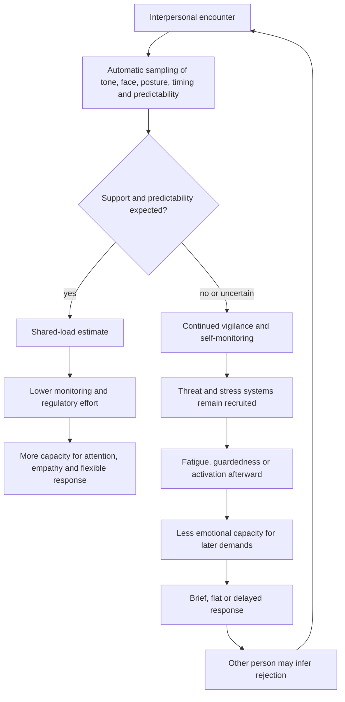
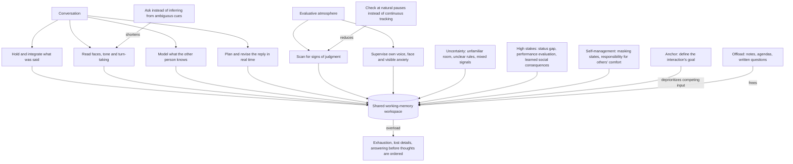

# Interpersonal regulation and emotional capacity

Emotional availability is a state-dependent capacity to attend to another person, represent their perspective, regulate one's own response, and express care in a form the other person can receive. It is related to, but not identical with, affection or commitment: cognitive load, sleep loss, stress, and unresolved emotion can reduce the resources available for patience and empathy without establishing that care has disappeared. Conversely, repeated low availability still has interpersonal consequences even when depletion, rather than detachment, is the cause. (@DrTraceyMarks (Dr. Tracey Marks) — "Emotional Bandwidth: Why You Sometimes Can’t Be There for People You Love", 2026-05-27, [link](https://www.youtube.com/watch?v=xSYUWPXig2g))

## Shared regulation and social load

Social baseline theory proposes that the brain normally budgets effort in the presence of dependable others rather than assuming every challenge must be managed alone. In the hand-holding experiment described in the source, married women anticipating a mild electric shock showed less threat-related brain activity while holding a stranger's hand than while alone, and a still larger attenuation while holding a husband's hand. The external threat did not change; the availability and familiarity of support did. This is experimental evidence for acute neural modulation in a narrow sample and task, not proof that all close relationships lower chronic stress or improve health. (@DrTraceyMarks (Dr. Tracey Marks) — "Why You Feel Drained After Talking To Them", 2026-06-03, [link](https://www.youtube.com/watch?v=tcG2Kt5AGl8))

```mermaid
flowchart TD
  I[Interpersonal encounter] --> S[Automatic sampling of tone, face, posture, timing and predictability]
  S --> P{Support and predictability expected?}
  P -->|yes| C[Shared-load estimate]
  C --> L[Lower monitoring and regulatory effort]
  L --> A[More capacity for attention, empathy and flexible response]
  P -->|no or uncertain| V[Continued vigilance and self-monitoring]
  V --> H[Threat and stress systems remain recruited]
  H --> D[Fatigue, guardedness or activation afterward]
  D --> B[Less emotional capacity for later demands]
  B --> M[Brief, flat or delayed response]
  M --> R[Other person may infer rejection]
  R --> I
```

The autonomic and attentional systems continuously sample facial expression, voice, posture, breathing, rhythm, timing, and silence. A predictable, comprehensible person can reduce uncertainty and the need to monitor; an inconsistent or hard-to-read interaction can require ongoing checking, self-editing, and preparation for criticism or interruption. That effort can be tiring even when no overtly bad event occurs. This mechanism does not divide people into good and toxic categories: the cost may reflect current stress, anxiety, incompatibility, the observer's learning history, or a mismatch between two otherwise well-intentioned people. (@DrTraceyMarks (Dr. Tracey Marks) — "Why You Feel Drained After Talking To Them", 2026-06-03, [link](https://www.youtube.com/watch?v=tcG2Kt5AGl8))

## Conversational cognitive load and dual monitoring

Post-social exhaustion has a mechanism more specific than the introvert label: an ordinary conversation is not one skill but a set of processes running concurrently on a shared working-memory workspace. The brain listens to the current words while retaining what was said earlier so the exchange stays coherent, reads facial expression and tone, tracks turn-taking, estimates what the other person does and does not know, and plans and revises a response against their real-time reactions — while two further monitoring tasks run on top: watching whether one is being accepted, judged, or misunderstood, and supervising one's own voice, face, and posture to manage the impression given. Not all of this is equally costly. Registering a facial expression or posture change is fast and nearly automatic; the expensive step begins when an ambiguous cue — an expression, a pause, a tone shift — could carry several meanings and must be disambiguated, the model of the other person revised, and one's reply adjusted, all without pausing the dialogue. Those operations compete for the same working memory needed to follow the conversation itself, and cognitive-load research indicates that when that workspace is crowded, taking the other person's perspective and reading unclear reactions get harder. (The video's description cites Eisenkoeck, de Fockert & Moore 2024 on cognitive load and the intentionality bias; the study itself was not reviewed here.) (@DrTraceyMarks (Dr. Tracey Marks) — "The Real Reason You're Exhausted After Talking to People", 2026-08-19, [link](https://www.youtube.com/watch?v=G8SMB-2m6tY))

```mermaid
flowchart TD
  CONV[Conversation] --> L[Hold and integrate what was said]
  CONV --> R[Read faces, tone and turn-taking]
  CONV --> M[Model what the other person knows]
  CONV --> P[Plan and revise the reply in real time]
  EVAL[Evaluative atmosphere] --> J[Scan for signs of judgment]
  EVAL --> SELF[Supervise own voice, face and visible anxiety]
  L & R & M & P & J & SELF --> WM[(Shared working-memory workspace)]
  U[Uncertainty: unfamiliar room, unclear rules, mixed signals] --> WM
  S[High stakes: status gap, performance evaluation, learned social consequences] --> WM
  MGMT[Self-management: masking states, responsibility for others' comfort] --> WM
  WM -->|overload| FAT[Exhaustion, lost details, answering before thoughts are ordered]
  ANCH[Anchor: define the interaction's goal] -->|deprioritizes competing input| WM
  CHK[Check at natural pauses instead of continuous tracking] -->|reduces| J
  ASK[Ask instead of inferring from ambiguous cues] -->|shortens| R
  OFF[Offload: notes, agendas, written questions] -->|frees| WM
```

When the atmosphere is evaluative, the two monitoring streams become a dual-monitoring problem — one part scanning the room for judgment, another policing one's own tone, appearance, and whether anxiety shows — which runs above the actual conversation and drains attention from it; treating the interaction as a continuous evaluation, a live simulation of how everyone is reacting, is a large share of the fatigue ([[social-evaluative-threat-and-criticism]]). The brain also does not weight all cues equally: in some visual working-memory research, angry or fearful faces were remembered better than neutral or happy ones — which is why a person can leave a warm gathering remembering only the one who seemed annoyed, twenty warm signals displaced by the single ambiguous one. Three situational conditions predictably raise the load: uncertainty (an unfamiliar room, unclear social rules, many people sending mixed signals); high stakes (a clear status difference, performance being evaluated, or learned experience that social mistakes carry consequences); and self-management burden (concealing anxiety, confusion, or distraction, and feeling responsible for others' comfort — tracking whether two relatives are upset with each other while keeping the conversation going). Social anxiety, ADHD, autistic traits, trauma history, or habitual masking can amplify all of this, but the working-memory mechanism requires no diagnosis: an ordinary conversation can exhaust anyone. Marks's countermeasure set — she calls the core skill anchoring — reallocates attention rather than suppressing care: define what the interaction is for, so competing information ranks itself behind the goal; check the room at natural pauses instead of continuously tracking every micro-expression; use words before inference, asking for clarification when a look or pause actually affects the conversation, and tolerating the ambiguity of the rest; and offload with notes, agendas, or written questions so working memory is not holding content and social analysis at once — the medical appointment being the worked example (decide the needed outcome beforehand, write the top three questions, take notes, and ask the doctor what they are thinking rather than building a frightening interpretation from a pause). The residue of overload can mimic attention deficits — forgotten details, answers launched before thoughts are assembled — without being one. These are educational protocols with mechanistic plausibility, not trial-validated interventions. (@DrTraceyMarks (Dr. Tracey Marks) — "The Real Reason You're Exhausted After Talking to People", 2026-08-19, [link](https://www.youtube.com/watch?v=G8SMB-2m6tY))

## Capacity, depletion, and interpretation

Cognitive load consumes working attention through decisions, deadlines, task switching, logistics, anticipated problems, and unfinished conversations. Stress further prioritizes short-horizon threat management, while poor sleep, hunger, suppressed emotion, and earlier conflict leave residual physiological and emotional load. Perspective-taking and tenderness can consequently become harder to access. The source invokes reduced temporoparietal-junction activity and increased cortisol as explanations, but supplies no direct evidence review for these anatomical and endocrine claims; they should be treated as plausible simplifications rather than a complete neural account. (@DrTraceyMarks (Dr. Tracey Marks) — "Emotional Bandwidth: Why You Sometimes Can’t Be There for People You Love", 2026-05-27, [link](https://www.youtube.com/watch?v=xSYUWPXig2g))

Depletion and detachment can look alike from the outside: short answers, irritability, distance, or little reciprocity. The distinction concerns mechanism and pattern, not whether the recipient's hurt is valid. Depletion predicts improvement after recovery and a willingness to reconnect; detachment implies diminished motivation to engage. Neither can be diagnosed from one episode, and invoking low capacity must not become a way to evade repair, sustain chronic neglect, or dismiss another person's needs. Marks's distinctive framing is to ask how much capacity is available before treating momentary unavailability as proof about character or the relationship. (@DrTraceyMarks (Dr. Tracey Marks) — "Emotional Bandwidth: Why You Sometimes Can’t Be There for People You Love", 2026-05-27, [link](https://www.youtube.com/watch?v=xSYUWPXig2g))

## Regulating others: the counterweight role

Emotion regulation is not only intrapersonal. Ralph Adolphs identifies the interpersonal dimension as one of the field's two current organizing topics (with flexibility): people continuously read, influence, and regulate one another's emotions in bidirectional interaction — obvious to any parent — so regulatory competence includes managing the emotional field between people. (@hubermanlab (Andrew Huberman) — "Neuroscience of Emotions & Tools for Improving Emotion Regulation | Dr. Ralph Adolphs", 2026-08-17, [link](https://www.youtube.com/watch?v=P-h5WSQG1Sw))

Jocko Willink supplies the applied doctrine from military leadership. Group morale behaves like a mob: emotional states feed on themselves in both directions (a winning team drifts toward arrogance and skipped debriefs; a team absorbing losses spirals toward broken spirit), and anyone caught inside the group state cannot correct it. The leader's job — and, he argues, the same job held by parents, spouses, and friends — is to be the **counterweight**: detach from the collective emotion, then push against its direction. After a success, temper the celebration toward the next week's work without shutting it down (people who never celebrate burn out); after a loss, acknowledge the weight, extract lessons, and re-center. The failure mode he flags is environmental: people who collapse are typically surrounded by amplifiers with no counterbalancing voice. His grief protocol is a specific instance — celebrate the life, mourn the loss, then return deliberately to action, because time spent passive with adversity dominant worsens the state ([[emotion-regulation]]). For interpersonal *problems*, he transfers the indirect approach from combat theory: direct confrontation produces a confrontation, whereas engaging on adjacent ground builds the relationship until the issue can be moved toward a solution — converging with the vent-versus-solve discrimination taught here (a step back to ask *why* a partner is frustrated often reveals they want acknowledgment, not solutions). These are practitioner frameworks from high-stakes team experience, coherent with the shared-load physiology above but carrying no controlled evidence; the counterweight stance also has an obvious failure mode the source does not dwell on — chronic emotional counter-positioning can read as invalidation if the acknowledgment step is skipped. (@hubermanlab (Andrew Huberman) — "Essentials: How to Become Resilient, Forge Your Identity & Lead Others | Jocko Willink", 2026-07-30, [link](https://www.youtube.com/watch?v=lxDf8uEypJU))

## Measurement and adjustment

A post-interaction body check separates immediate moral judgment from pattern collection. About 15–20 minutes after an encounter, the proposed protocol classifies the state as settled, activated, depleted, guarded, or restored, then looks for recurrence across interactions. The delay may reveal load masked during active pleasing or composure. This is an unvalidated self-observation tool: bodily state is informative but nonspecific, and may reflect sleep, illness, expectations, prior stress, or the conversation's legitimate difficulty rather than the other person alone. (@DrTraceyMarks (Dr. Tracey Marks) — "Why You Feel Drained After Talking To Them", 2026-06-03, [link](https://www.youtube.com/watch?v=tcG2Kt5AGl8))

When low capacity is identified, an honest response can scale contact to what is available: offer brief acknowledgment, state the limitation without blaming the other person, and agree on a specific time to return. Proactive management can also place a short transition after a taxing work period, reserve less-depleted time for important conversations, or change an interaction's duration, setting, or structure. These are pragmatic protocols with face validity; the supplied sources do not show that the exact checks, categories, or cadences improve relationship or health outcomes. (@DrTraceyMarks (Dr. Tracey Marks) — "Emotional Bandwidth: Why You Sometimes Can’t Be There for People You Love", 2026-05-27, [link](https://www.youtube.com/watch?v=xSYUWPXig2g); @DrTraceyMarks (Dr. Tracey Marks) — "Why You Feel Drained After Talking To Them", 2026-06-03, [link](https://www.youtube.com/watch?v=tcG2Kt5AGl8))

## Practical implications

- **Before a demanding social interaction, define what you need from it (listen, connect with two people, get three questions answered) and let that goal rank competing attention — emerging/mechanistically plausible, unvalidated as a protocol.** During it, check the room at natural pauses rather than tracking continuously, ask about cues that matter rather than inferring, and offload content to notes or written questions when the stakes are informational (medical appointments, evaluations). (@DrTraceyMarks (Dr. Tracey Marks) — "The Real Reason You're Exhausted After Talking to People", 2026-08-19, [link](https://www.youtube.com/watch?v=G8SMB-2m6tY))
- **Before an important interaction, briefly check mental load, bodily state, and unresolved emotional residue — emerging/clinically plausible.** Use it when a flat or irritable response feels out of character; if capacity is low, choose a smaller honest form of connection and schedule a concrete return rather than promising unlimited availability. (@DrTraceyMarks (Dr. Tracey Marks) — "Emotional Bandwidth: Why You Sometimes Can’t Be There for People You Love", 2026-05-27, [link](https://www.youtube.com/watch?v=xSYUWPXig2g))
- **After selected interactions, wait 15–20 minutes and record the bodily state — unvalidated self-monitoring protocol.** Track repeated patterns over several encounters rather than labeling a person from one difficult conversation. (@DrTraceyMarks (Dr. Tracey Marks) — "Why You Feel Drained After Talking To Them", 2026-06-03, [link](https://www.youtube.com/watch?v=tcG2Kt5AGl8))
- **Adjust dose and context when a repeatable cost appears — emerging/pragmatic.** Shorten encounters, add structure, meet during an activity, or lower the expectation that this relationship will provide calm; preserve direct boundaries when conduct is harmful. (@DrTraceyMarks (Dr. Tracey Marks) — "Why You Feel Drained After Talking To Them", 2026-06-03, [link](https://www.youtube.com/watch?v=tcG2Kt5AGl8))
- **In a group or family absorbing a win or a loss, take the counterweight position: detach from the collective mood, acknowledge it explicitly, then lean gently against its direction — Investigational practice (leadership doctrine with face validity, no controlled evidence).** Skipping the acknowledgment step converts counterweighting into invalidation. (@hubermanlab (Andrew Huberman) — "Essentials: How to Become Resilient, Forge Your Identity & Lead Others | Jocko Willink", 2026-07-30, [link](https://www.youtube.com/watch?v=lxDf8uEypJU))
- **Treat persistent withdrawal or exhaustion as a broader assessment problem — strong as a safety boundary.** A body check is educational pattern data, not a diagnosis or a substitute for clinical care, direct communication, or protection from harmful conduct. (@DrTraceyMarks (Dr. Tracey Marks) — "Why You Feel Drained After Talking To Them", 2026-06-03, [link](https://www.youtube.com/watch?v=tcG2Kt5AGl8))

## Gaps & open questions

- How well do acute hand-holding findings generalize across genders, cultures, relationship types, chronic stressors, and conflicted partnerships?
- Can emotional capacity be measured independently of affection, avoidance, depression, burnout, and relationship satisfaction?
- Do post-interaction body checks improve decisions, or can they amplify hypervigilance and confirmation bias?
- Which transition practices, interaction doses, and communication commitments reliably improve reciprocal availability?
- When does interpersonal co-regulation build autonomous regulation, and when can dependence on one person make the system less resilient?
- Does deliberate counterweight behavior by a leader or parent measurably change group emotional trajectories, and when does it suppress needed emotional processing instead?
- Does goal-anchoring measurably reduce conversational working-memory load or post-social fatigue, and does checking-not-tracking preserve social accuracy?
- How much of post-social exhaustion is mediated by working-memory load versus evaluative threat, sensory load, or masking effort — and does the mix differ in social anxiety, ADHD, and autism?

## Related

[[protective-threat-responses]] · [[attachment-threat-and-relational-regulation]] · [[stress-threat-discrimination]] · [[trust-repair-and-safety-learning]] · [[social-evaluative-threat-and-criticism]] · [[sleep-quality-and-circadian-alignment]] · [[emotion-regulation]] · [[emotions-as-functional-states]] · [[tracey-marks]] · [[practice-playbook]]
