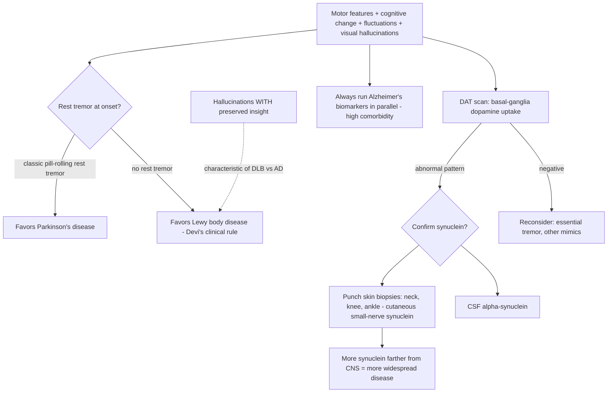

# Lewy body disease and the synucleinopathies

Lewy body disease and Parkinson's disease share the same underlying pathology—abnormal alpha-synuclein protein—and are increasingly framed as one alpha-synuclein spectrum rather than separate diseases. The conventional dividing line is timing: if cognitive symptoms arrive within about a year of motor symptoms it is called Lewy body disease; if dementia follows established Parkinson's by more than a year (some say two), it is called Parkinson's disease dementia. Devi calls this an arbitrary distinction. Anatomically, Parkinson's synuclein pathology is concentrated in the basal ganglia while Lewy body pathology is more widespread. Clinically, dementia with Lewy bodies is diagnosed by Parkinsonian motor features, fluctuating consciousness, cognitive impairment, and often visual hallucinations. (Peter Attia MD — "399 - The evolution of Alzheimer's disease and dementia care | Gayatri Devi, M.D.", 2026-07-13, [link](https://www.youtube.com/watch?v=x7NhqMOwdOM))

Comorbidity with Alzheimer's is the rule, not the exception: about 40% of Alzheimer's patients eventually develop some Lewy pathology, and 30–40% (some argue more) of Lewy body patients have Alzheimer's pathology, so a Lewy workup should routinely include Alzheimer's biomarkers. Vascular risk factors, Alzheimer's disease, Parkinson's disease, and essential tremor all raise Lewy body risk—though whether these are causes or shared-upstream markers is unresolved, and Devi concedes the field lacks the data for Lewy body that support metabolic causation in Alzheimer's. APOE4 raises risk here too (everything is impacted by APOE4, plausibly via impaired pathogen and protein clearance), though less dramatically than for Alzheimer's. Lewy body disease skews slightly male, possibly confounded by male-predominant Parkinson's capture. (Peter Attia MD — "399 - The evolution of Alzheimer's disease and dementia care | Gayatri Devi, M.D.", 2026-07-13, [link](https://www.youtube.com/watch?v=x7NhqMOwdOM))

## Diagnosis

Widespread early-detection tools lag those for amyloid, but skin punch biopsy has changed practice: because skin is dense with small cutaneous nerves, biopsies at the neck, knee, and lower leg act as a graded nerve biopsy—the farther from the nervous system synuclein appears, the more widespread the disease—and distinguish synuclein-driven motor disorders from mimics (the information is limited to sensory nerves). CSF alpha-synuclein and DAT scans complement it, though DAT patterns are not as distinctive as one would like. Two clinical signatures Devi emphasizes: she has never seen a Lewy body patient present with a classic pill-rolling rest tremor (a personal observation she flags as an unexplained mystery, not established mechanism), and Lewy hallucinations come with insight—patients know the vivid people or places are not real even while experiencing them, unlike the delusions of Alzheimer's; auditory hallucinations are rare to absent. (Peter Attia MD — "399 - The evolution of Alzheimer's disease and dementia care | Gayatri Devi, M.D.", 2026-07-13, [link](https://www.youtube.com/watch?v=x7NhqMOwdOM))

## The misdiagnosis problem and treatment

The most consequential error in her practice is Lewy body disease misdiagnosed as Parkinson's and treated with dopaminergic drugs (levodopa-carbidopa, dopamine agonists such as pramipexole), which worsens Lewy body disease—more confusion, worse psychosis—without helping. Deprescribing is hard because patients love the dopamine lift and feel an internal low before each next dose; she describes a woman on nine levodopa-carbidopa tablets daily for a presumed Parkinson's despite a negative DAT scan and only an essential tremor. Correct classification is therefore directly therapeutic: dopamine helps Parkinson's and harms Lewy body psychosis. Against the prevalent belief that Lewy body dementia is rapidly fatal in five to six years, Devi states flatly that this is not true in her practice: patients respond fairly well to treatment—sometimes better than Alzheimer's patients, some dramatically—and life expectancy is not very different from Alzheimer's. (Peter Attia MD — "399 - The evolution of Alzheimer's disease and dementia care | Gayatri Devi, M.D.", 2026-07-13, [link](https://www.youtube.com/watch?v=x7NhqMOwdOM))

## Practical implications

- **When Parkinsonian features coexist with early cognitive change, fluctuations, or vivid hallucinations with insight: demand a Lewy-directed workup (DAT scan, skin biopsy or CSF synuclein) plus parallel Alzheimer's biomarkers before dopaminergic treatment — strong practice guidance.**
- **A negative DAT scan should block a presumptive Parkinson's prescription; audit existing dopaminergic regimens in confused Lewy-suspected patients and taper where wrong — strong within this source.**
- **Treat vascular and metabolic risk regardless of dementia subtype; anything good for the heart is good for the brain — moderate for Lewy specifically, strong generally.**
- **Do not accept a five-to-six-year terminal prognosis at diagnosis; treated Lewy body disease can respond well — moderate (practice experience, not trial data).**

## Gaps & open questions

- Why do Lewy body patients apparently never present with rest tremor despite motor involvement? Unexplained.
- Are vascular and metabolic risk factors causal for Lewy body disease as they appear to be for Alzheimer's? Data insufficient.
- Can skin-biopsy synuclein gradients stage or track progression quantitatively, and can they support preclinical detection the way amyloid assays do?
- Is alpha-synuclein a viable drug target analogous to amyloid, and would clearance carry an ARIA-like vascular cost?
- How much of the male predominance is real biology versus Parkinson's-pathway ascertainment?

## Related

[[alzheimers-spectrum-and-diagnosis]] · [[anti-amyloid-immunotherapy]] · [[gayatri-devi]] · [[neuromodulators-and-state-control]] · [[cognitive-reserve-and-brain-health]] · [[proactive-health-monitoring]] · [[aging-model]] · [[practice-playbook]]
