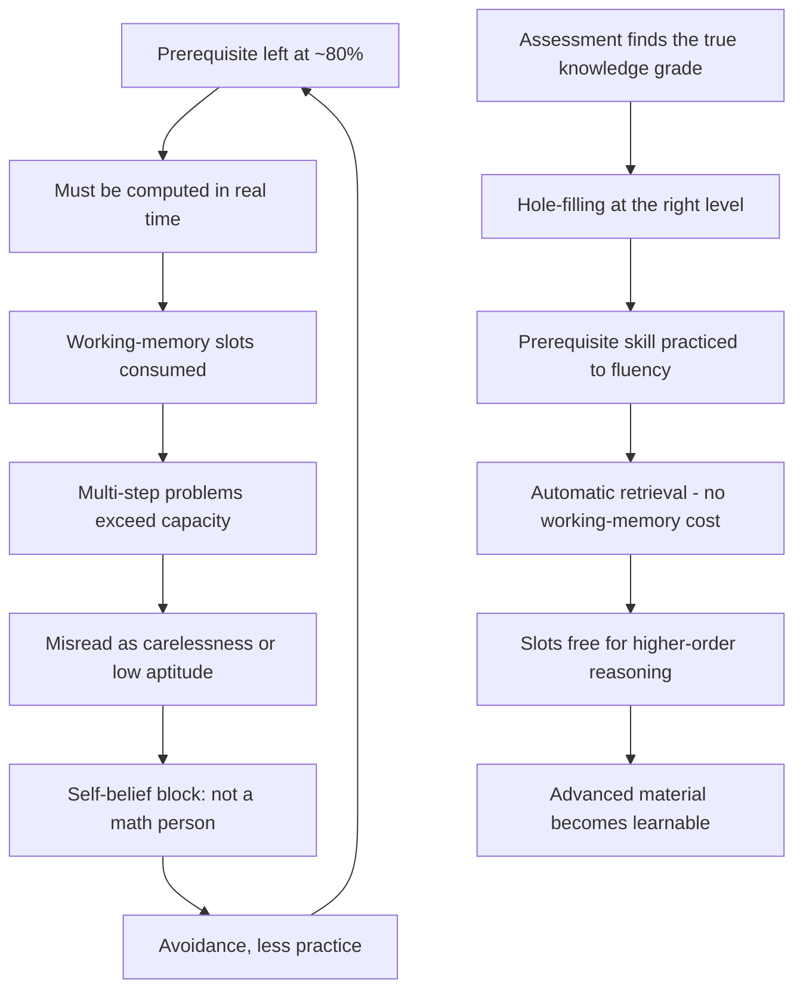

# Mastery learning and individualized tutoring

Mastery learning is the principle that a learner should not advance past a skill until performance on it is near-ceiling (roughly 95%+), because academic knowledge is layered: fractions rest on multiplication facts, algebra on fractions, chemistry on algebra, and reading comprehension on vocabulary. Conventional schooling is instead time-based — a fixed number of weeks per unit, advancement at 80% ("a B"), one median-level lesson delivered to a whole classroom — so unmastered prerequisites accumulate and compound until progress stalls in later grades. The classical anchor is Bloom's two-sigma finding from the 1980s: one-to-one tutoring taken to mastery moved students about two standard deviations above classroom instruction, with roughly one sigma attributed to the individual tutor and one to the mastery criterion. One-to-one tutoring was historically unaffordable at population scale, which is why the classroom model won; AI-generated individualized lessons are the first cost-plausible route back to it. (@hubermanlab (Andrew Huberman) — "How to Accelerate Learning & Improve Education | Joe Liemandt", 2026-08-31, [link](https://www.youtube.com/watch?v=Uzoe1RYVjiA))

## Why gaps compound: fluency and working memory

The cognitive-science core is the interaction between limited working memory and fluency. Working-memory capacity constrains how many distinct chunks can be manipulated at once; a fact memorized to fluency (7×8=56) costs no slot, while one that must be computed does. A multi-step algebra problem that overloads working memory therefore fails not because of the algebra but because of unautomatized third-grade arithmetic — and the failure is routinely mislabeled as carelessness or lack of focus. The source's illustrative anecdote: a student stuck at a 710 math SAT with recurring "careless" errors rose to 790 after going back and memorizing multiplication tables. Since working-memory capacity tracks measured intelligence, fluency training is framed as the main lever for raising effective capacity independent of native endowment; gifted students who never externalize work (writing down steps) similarly hit a wall when problems exceed even a large capacity. These mechanisms are consistent with established cognitive-load research, but the specific performance claims here are practitioner-reported, not published trial results. (@hubermanlab (Andrew Huberman) — "How to Accelerate Learning & Improve Education | Joe Liemandt", 2026-08-31, [link](https://www.youtube.com/watch?v=Uzoe1RYVjiA))

A related attention constraint: the episode cites research that a visible or nearby phone degrades performance even when face-down or in a bag, with performance recovered only when the phone is out of the room — interpreted as unconscious background computation consuming capacity rather than a willpower failure. (@hubermanlab (Andrew Huberman) — "How to Accelerate Learning & Improve Education | Joe Liemandt", 2026-08-31, [link](https://www.youtube.com/watch?v=Uzoe1RYVjiA))

## Instructional techniques with the strongest support

Three techniques recur as the load-bearing methods: worked examples with progressively faded scaffolding (show the full solution, then remove supports step by step) rather than leaving learners to productively struggle unguided; spaced repetition timed just before the forgetting curve predicts loss, to consolidate long-term retention; and initial mastery (drilling to criterion on first exposure, colloquially "drill and kill"). Direct instruction versus inquiry learning is described as a live ideological war in education schools — the source sides firmly with direct instruction, citing the largely ignored 1970s Project Follow Through comparison, and notes that most working teachers were never taught cognitive-load theory at all. An internal finding from the school's own data: worked examples plus spaced repetition sufficed in grades 8–12 (where multi-line problems make worked examples powerful), but grades 4–7 lost ground without explicit initial mastery, which was added back. This grade-dependent interaction is a proprietary, unpublished dataset — informative as practitioner evidence, unverifiable externally. (@hubermanlab (Andrew Huberman) — "How to Accelerate Learning & Improve Education | Joe Liemandt", 2026-08-31, [link](https://www.youtube.com/watch?v=Uzoe1RYVjiA))

A boundary the source itself draws: AI chatbots are not tutoring. Dropped into a standard school, general chatbots are used overwhelmingly to cheat and can lower learning; the claimed benefit comes from a closed instructional loop — assess actual knowledge level, generate a lesson at that level, hold to mastery, schedule spaced review, measure engagement and later recall. The same closed loop is presented as an instrument claim: per-learner data streams give learning science the fine-grained measurement that classrooms (where effect sizes are dominated by classroom noise, prerequisite mismatch, and motivation) never could — the field's "microscope." ([[human-centered-ai-and-learning]] develops the complementary warning about passive answer collection.) (@hubermanlab (Andrew Huberman) — "How to Accelerate Learning & Improve Education | Joe Liemandt", 2026-08-31, [link](https://www.youtube.com/watch?v=Uzoe1RYVjiA))

## Motivation, incentives, and self-belief

The source calls motivation "90%" of the practical problem and treats it as designable: make the gap tractable (a student told they are 22 hours behind engages; told they are three grade levels behind, they quit — the same deficit, reframed as about 20–30 hours of individualized work per K–8 grade level); gate loved activities on completed learning (sports practice unlocks after the day's mastery target); and, controversially, pay students directly for verified achievement (cash for perfect scores on progressively higher back-grade tests, used to make below-grade "hole filling" acceptable to adolescents and parents who both resist it). The claimed sequence is extrinsic incentive → breakthrough experience → revised self-belief (the student comes to see themselves as capable of the thing) → intrinsic motivation. The source acknowledges the self-determination-theory objection that extrinsic rewards can undermine intrinsic motivation and asserts, from its own experience, that the undermining effect does not appear in this design; that assertion conflicts with a substantial experimental literature on reward undermining and should be treated as a contested practitioner claim, not settled science. Peer observation is named as the single strongest de-blocking force — watching a classmate succeed convinces a student the task is possible. Development is framed per David Yeager's mentor-mindset model: high standards with high support, cycling struggle-and-failure inside a relationship with a caring adult. (@hubermanlab (Andrew Huberman) — "How to Accelerate Learning & Improve Education | Joe Liemandt", 2026-08-31, [link](https://www.youtube.com/watch?v=Uzoe1RYVjiA))

## What predicts learning, and the equity claim

The source's ordering of predictors in the current US system: family income first, then IQ, then Big Five conscientiousness. The proposed mechanism is diagnostic: IQ matters partly because fixed-pace classrooms force material that overloads smaller working-memory capacity (solved by leveling lessons), and conscientiousness matters because time-based systems reward students who impose a mastery criterion on themselves (solved by making mastery structural). On this account an individualized mastery system should weaken all three gradients, including reported disappearance of the gender performance gap and of most ADHD-labeled engagement failure once sessions are short (25-minute blocks), leveled, and gated on motivating afternoons. These are the system's own claims about its own students. (@hubermanlab (Andrew Huberman) — "How to Accelerate Learning & Improve Education | Joe Liemandt", 2026-08-31, [link](https://www.youtube.com/watch?v=Uzoe1RYVjiA))

## Evidence status

The headline results — top-1% test performance across grades on ~2 hours daily of app-based academics, roughly 5–10× learning rate, near-1530 average SAT, catch-up of transfer students averaging 2.2 grade levels behind — are self-reported by a fee-charging private school's principal in a promotional context, with obvious selection effects (self-selected, initially wealthy families) that the source disputes by benchmarking growth rate within percentile bands rather than achievement. The growth-rate-versus-achievement argument is methodologically sound as far as it goes, but none of it substitutes for independent evaluation; the source states that MIT's Blueprint Labs has been engaged to run randomized controlled trials, and voucher-funded expansion to lower-income students (families under $65,000) will test transportability. Until independent results exist, the correct posture is: the component techniques (mastery criteria, worked examples, spaced repetition, tutoring) have longstanding support in learning science; the specific magnitude and generalizability claims are unverified. (@hubermanlab (Andrew Huberman) — "How to Accelerate Learning & Improve Education | Joe Liemandt", 2026-08-31, [link](https://www.youtube.com/watch?v=Uzoe1RYVjiA))

## Practical implications

- **When learning stalls in a layered subject (math, language, a science), diagnose backward before pushing forward — strong principle from cognitive-load theory; the payoff size is context-dependent.** Test the prerequisites honestly, then close specific holes to a ~95% criterion rather than re-drilling the frontier material. (@hubermanlab (Andrew Huberman) — "How to Accelerate Learning & Improve Education | Joe Liemandt", 2026-08-31, [link](https://www.youtube.com/watch?v=Uzoe1RYVjiA))
- **Drill foundational facts and vocabulary to fluency, not familiarity — moderate-to-strong; automaticity frees working memory for reasoning.** For vocabulary specifically, wide reading with lookup of unknown words builds range and boundary knowledge that flashcards alone miss. (@hubermanlab (Andrew Huberman) — "How to Accelerate Learning & Improve Education | Joe Liemandt", 2026-08-31, [link](https://www.youtube.com/watch?v=Uzoe1RYVjiA))
- **Structure study as worked examples with fading scaffolds plus spaced review timed near forgetting — moderate-to-strong from the learning-science literature the source draws on.** Avoid both pure unguided struggle and cramming. (@hubermanlab (Andrew Huberman) — "How to Accelerate Learning & Improve Education | Joe Liemandt", 2026-08-31, [link](https://www.youtube.com/watch?v=Uzoe1RYVjiA))
- **Remove the phone from the room during focused learning — moderate; nearby silent phones still tax capacity in the cited research.** (@hubermanlab (Andrew Huberman) — "How to Accelerate Learning & Improve Education | Joe Liemandt", 2026-08-31, [link](https://www.youtube.com/watch?v=Uzoe1RYVjiA))
- **Reframe deficits in hours of leveled work, not years behind — limited but low-risk motivational practice.** Investigational practice: cash or privilege incentives for verified mastery milestones; effective in the source's telling, but contested against reward-undermining research and unevaluated outside one school system. (@hubermanlab (Andrew Huberman) — "How to Accelerate Learning & Improve Education | Joe Liemandt", 2026-08-31, [link](https://www.youtube.com/watch?v=Uzoe1RYVjiA))
- **Do not hand a learner a general-purpose chatbot and call it tutoring — moderate; unstructured chatbot access in schools is described as predominantly cheating.** Value comes from assessment-driven leveling, mastery gating, and spaced review, whether implemented by software or a human coach. ([[human-centered-ai-and-learning]]) (@hubermanlab (Andrew Huberman) — "How to Accelerate Learning & Improve Education | Joe Liemandt", 2026-08-31, [link](https://www.youtube.com/watch?v=Uzoe1RYVjiA))

## Gaps & open questions

- Do independent randomized evaluations (the announced MIT Blueprint Labs work) reproduce the 2×-in-2-hours growth-rate claim, and in which populations?
- Does the mastery-plus-AI model transport to low-income, low-baseline, and non-self-selected students at public-school budgets, or do guide quality and family buy-in carry hidden weight?
- Does paying students for mastery milestones durably raise intrinsic motivation via self-belief revision, or does the undermining effect reassert itself after incentives stop?
- Where is the boundary of the grade-dependent finding that initial mastery matters more in grades 4–7 than 8–12, and does it replicate outside one curriculum?
- What are the long-run outcomes (retention, transfer, creativity, well-being) of compressing academics to two hours daily, beyond standardized-test endpoints?
- How much of classroom-education research is invalidated by prerequisite mismatch and motivation noise, as the closed-loop measurement argument implies?

## Related

[[human-centered-ai-and-learning]] · [[exercise-enhanced-learning]] · [[memory-encoding-retrieval-and-reconstruction]] · [[cognitive-reserve-and-brain-health]] · [[self-schema-updating-after-achievement]] · [[executive-function-under-social-stress]] · [[meaning-boredom-and-technology]] · [[mental-strength-and-behavioral-skills]] · [[ai-assisted-science-communication]]
