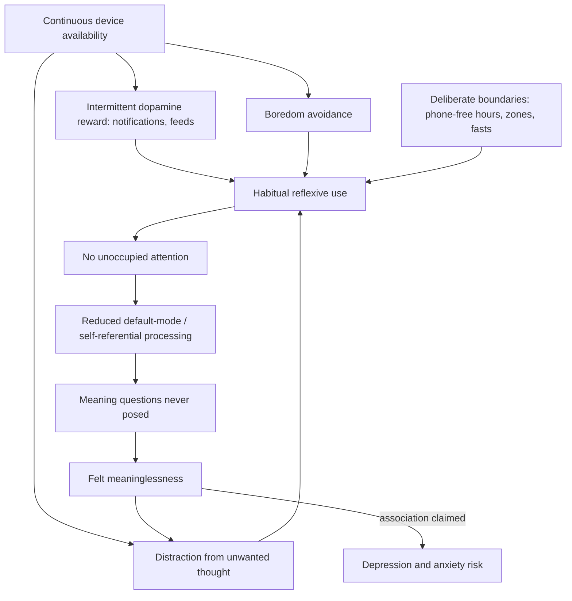

# Meaning, boredom, and technology

Meaning in the social-psychology literature is commonly decomposed into three experienced components: coherence (a workable answer to why things happen), purpose (goals and direction — why I am doing what I am doing), and significance (why my life matters, and to whom). The Harvard social scientist Arthur Brooks teaches this tripartite model and treats a felt absence of meaning as the central well-being problem of younger adults; he attributes to current data the claim that reporting "my life feels meaningless" is the single strongest predictor of clinical depression and generalized anxiety in adults under 30. The tripartite structure of meaning is an established research framework; the number-one-predictor claim is an expert assertion without a cited study in the source and should be held as unverified, though meaning-in-life measures do correlate robustly with depression and anxiety in the published literature. (FoundMyFitness — "How To Build Lasting Happiness | Dr. Arthur Brooks", 2026-03-24, [link](https://www.youtube.com/watch?v=IVVVvbfRiDo))

A diagnostic corollary in this framework: attraction to conspiracy narratives is read as a coherence deficit — a search for an explanation of why things happen — so the productive response to a conspiracy-absorbed relative is supplying better sources of coherence rather than argument. This is expert interpretation, consistent with published associations between meaning-threat and pattern-seeking, not a treatment protocol. (FoundMyFitness — "How To Build Lasting Happiness | Dr. Arthur Brooks", 2026-03-24, [link](https://www.youtube.com/watch?v=IVVVvbfRiDo))

## Boredom as an input to meaning

Unoccupied attention is aversive but functional: when external tasks stop, the brain's default mode network activates, supporting mind-wandering, autobiographical processing, and the self-referential thought in which meaning questions get asked at all. People will pay to avoid this state — in the widely cited shock experiments from Timothy Wilson and Daniel Gilbert's group, a substantial fraction of participants chose to self-administer painful electric shocks rather than sit alone with their thoughts for fifteen minutes, with men doing so far more often than women. Brooks's inference is that continuous stimulation removes the mental idle time in which coherence, purpose, and significance are processed. The shock studies are real published findings; the downstream claim that eliminating boredom causes meaning deficits is a plausible mechanism-level hypothesis, not demonstrated. (FoundMyFitness — "How To Build Lasting Happiness | Dr. Arthur Brooks", 2026-03-24, [link](https://www.youtube.com/watch?v=IVVVvbfRiDo))

The framework distinguishes moment-to-moment boredom from what Brooks calls meta-boredom: pre-digital life was often boring in the moment but experienced as meaningful overall, whereas a continuously stimulated life can be never boring moment-to-moment yet feel, in his phrase, like a simulation — and grindingly boring at the level of the life. This inversion is a rhetorical framing of the meaning deficit, not a measured construct. (FoundMyFitness — "How To Build Lasting Happiness | Dr. Arthur Brooks", 2026-03-24, [link](https://www.youtube.com/watch?v=IVVVvbfRiDo))

## The lateralization framing, and its status

Brooks builds his mechanism on Iain McGilchrist's hemispheric-lateralization thesis: the hemispheres differ less by content (logic versus art) than by mode of attention, with the right hemisphere framed as asking the broad "why" questions and the left executing procedural "how" tasks; a technologized, screen-mediated culture is then described as keeping people "sitting on the left side of your brain," never posing meaning questions. His heuristic test — a question an AI chatbot can answer is not a meaning question — and claims that women have generally more developed right hemispheres and men left (invoked to explain sex differences in friendship and love) extend the same framing. This material must be flagged: hemispheric-attention differences are real but subtle, McGilchrist's strong thesis is contested within neuroscience, and pop-lateralization claims about individuals or sexes (as well as the transcript's use of MacLean's obsolete triune-brain model as a teaching device) go well beyond established findings. The behavioral observations (screens displace reflective attention) do not depend on the anatomical story, and should be evaluated separately from it. (FoundMyFitness — "How To Build Lasting Happiness | Dr. Arthur Brooks", 2026-03-24, [link](https://www.youtube.com/watch?v=IVVVvbfRiDo))

## Beauty, service, and vocation as meaning inputs

Three further meaning inputs are proposed. First, self-administered beauty of three kinds — artistic, natural, and moral — with the claims that children now average minutes per day in nature against hours on screens, that popular music has become measurably less melodic, and that witnessing acts of moral goodness produces "moral elevation," an affective state with prosocial downstream effects described in the elevation literature. The elevation construct is published; the nature-minutes and melodicity figures are uncited in the source. Second, service: volunteering and orienting paid work toward others' benefit, converging with the vocation concept of ikigai — the overlap of what you love, what you are good at, what the world needs, and what you are paid to do. Third, voluntary confrontation with suffering rather than its elimination; that mechanism is treated in [[stress-threat-discrimination]]. (FoundMyFitness — "How To Build Lasting Happiness | Dr. Arthur Brooks", 2026-03-24, [link](https://www.youtube.com/watch?v=IVVVvbfRiDo))

## Practical implications

All device protocols here are Investigational practice: they are expert-designed, mechanistically motivated, and low risk, but the source supplies no trials of these specific rules, and the broader screen-reduction literature is mixed and confounded by self-selection.

- **Daily: no phone in the first hour and last hour of the day, during meals, or in the bedroom — Investigational practice.** Converges with the sleep-hygiene rationale in [[pre-sleep-routines-and-stimulus-control]] and the boundary experiments in [[mental-strength-and-behavioral-skills]]. (FoundMyFitness — "How To Build Lasting Happiness | Dr. Arthur Brooks", 2026-03-24, [link](https://www.youtube.com/watch?v=IVVVvbfRiDo))
- **Ongoing: cap recreational social media (Brooks suggests about half an hour daily, taken deliberately in one or two sittings, curated toward learning, laughter, and real coordination rather than celebrity comparison) — Investigational practice.** The comparison rationale aligns with [[social-evaluative-threat-and-criticism]]. (FoundMyFitness — "How To Build Lasting Happiness | Dr. Arthur Brooks", 2026-03-24, [link](https://www.youtube.com/watch?v=IVVVvbfRiDo))
- **Yearly: a tech fast of roughly three to five days; optionally set the phone to grayscale — Investigational practice.** (FoundMyFitness — "How To Build Lasting Happiness | Dr. Arthur Brooks", 2026-03-24, [link](https://www.youtube.com/watch?v=IVVVvbfRiDo))
- **Periodically: deliberately schedule unstimulated time, nature exposure, art or music attended to closely, and one service commitment — Investigational practice as a meaning intervention; nature exposure and volunteering have independent supportive literatures on mood and mortality association.** (FoundMyFitness — "How To Build Lasting Happiness | Dr. Arthur Brooks", 2026-03-24, [link](https://www.youtube.com/watch?v=IVVVvbfRiDo))
- **When persistent emptiness, anhedonia, or hopelessness is present, treat it as a clinical question, not a philosophy deficit — strong safety principle.** Meaning practices complement, and do not replace, assessment and evidence-based care.

## Gaps & open questions

- Does experimentally restoring unoccupied attention (enforced boredom, device restriction) increase measured meaning, or only reduce use?
- Is felt meaninglessness a cause of depression, a prodrome, or a symptom — and does treating either move the other?
- Which components (coherence, purpose, significance) respond to which interventions, and do they dissociate?
- How much of the youth meaning deficit is attributable to devices versus economic precarity, delayed family formation, declining religious participation, and pandemic-era disruption?
- Can the attention-mode claims of the lateralization thesis be tested independently of its contested anatomical commitments?

## Related

[[durable-well-being-and-hedonic-adaptation]] · [[mental-strength-and-behavioral-skills]] · [[relationship-maintenance-and-friendship]] · [[stress-threat-discrimination]] · [[social-evaluative-threat-and-criticism]] · [[pre-sleep-routines-and-stimulus-control]] · [[human-centered-ai-and-learning]] · [[arthur-brooks]] · [[cognitive-reserve-and-brain-health]] · [[practice-playbook]]
