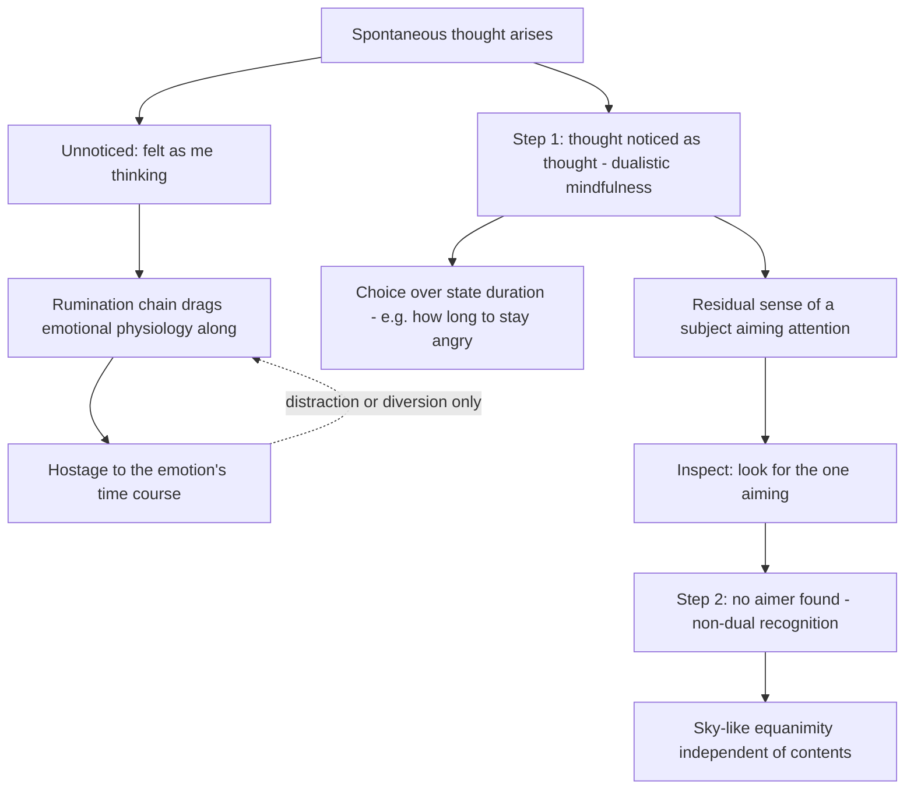
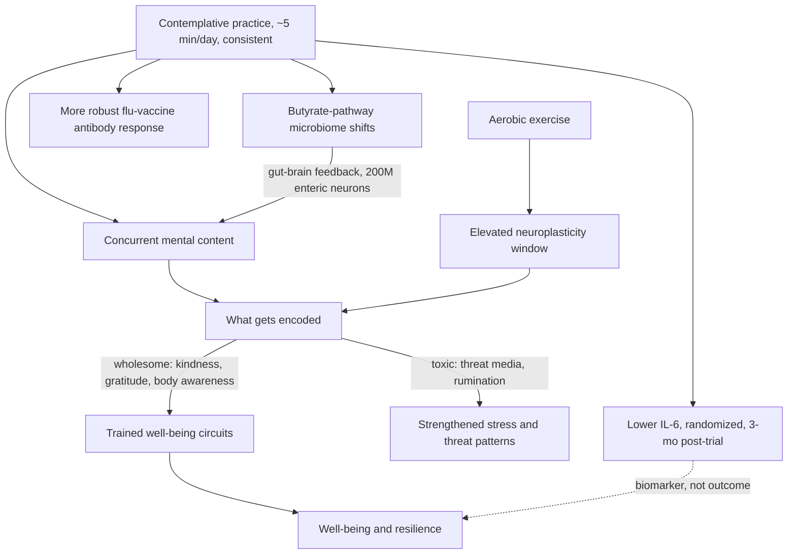

# Meditation and contemplative training

Meditation, in the research framing this page follows, is the intentional use of attention to train mental qualities — not a posture, a location, or a mystical state. The trainable targets are specific: where attention rests, how quickly one notices what the mind is doing (meta-awareness), how one relates to the self-narrative, and which motivational states (kindness, gratitude, purpose) are deliberately rehearsed. The neuroscientist Richard Davidson's program organizes these into four pillars — awareness, connection, insight, and purpose — each claimed to be instantiated in plastic neural circuitry and therefore improvable with practice. (FoundMyFitness — "Meditation Does Far More Than Reduce Stress | Dr. Richard Davidson", 2026-08-26, [link](https://www.youtube.com/watch?v=3NiQF9_Vxi8))

The four pillars: **awareness** is present-moment attention plus meta-awareness (noticing, for example, that you have read a page without absorbing it — the noticing itself is the trainable event); **connection** covers appreciation, gratitude, kindness, and compassion, with quality of contact mattering more than quantity; **insight** is a changed relationship to the self-narrative — seeing beliefs about "me" as a constellation of thoughts rather than facts, which matters because rigidly negative self-narrative is a depression substrate; **purpose** is finding one's values expressed in ordinary activity, down to household chores, rather than requiring a grand mission. (FoundMyFitness — "Meditation Does Far More Than Reduce Stress | Dr. Richard Davidson", 2026-08-26, [link](https://www.youtube.com/watch?v=3NiQF9_Vxi8))

## Emotional styles: the trait layer

Davidson's earlier framework describes six dimensions along which people differ emotionally, each with a neural basis and each trainable: resilience (speed of recovery from adversity), outlook (persistence and savoring of positive emotion), self-awareness (interoceptive accuracy — how well bodily signals are read), social intuition (sensitivity to nonverbal cues), sensitivity to context (matching emotional expression to situation — the dimension whose failure mode is PTSD, where trauma-appropriate responses fire in safe contexts), and attention (capacity for focus against distraction). Well-being tracks the balance among styles, not maximization: hyperfocus on nonverbal micro-cues can impair social function, and extreme context-insensitivity in either direction is costly. This is an expert taxonomy distilled from decades of affective neuroscience, useful for teaching, and not a validated psychometric partition. (FoundMyFitness — "Meditation Does Far More Than Reduce Stress | Dr. Richard Davidson", 2026-08-26, [link](https://www.youtube.com/watch?v=3NiQF9_Vxi8))

## The self-model, mental chatter, and non-dual mindfulness

Ordinary waking experience carries a structural feature that contemplative training targets directly: most people feel like a subject located interior to the body — behind the face, a locus of awareness aiming attention outward — appropriating experience from its edge rather than being identical to it. Standard meditation instruction ("attend to the breath") initially reproduces this subject–object architecture, since it casts the practitioner as an aimer of attention directed at an object. The neuroscientist and meditation teacher Sam Harris's central claim is that this interior subject is a genuine illusion: inspected closely enough, no aimer is found, and recognizing that "there is no place from which to aim attention" is on his account the deeper purpose of meditation — distinct from the familiar benefit list (stress reduction, focus, claims about staving off cortical thinning), whose supporting science he himself characterizes as "quite provisional". This is contemplative phenomenology plus expert interpretation, not experimental evidence; no brain region fully accounting for self-awareness has been localized. (@hubermanlab (Andrew Huberman) — "Essentials: Using Meditation to Focus, View Consciousness & Expand Your Mind | Dr. Sam Harris", 2026-07-23, [link](https://www.youtube.com/watch?v=LQI8tl8S2PE))

The proximate mechanism is mental chatter. Covert self-directed speech and imagery run nearly continuously in untrained minds, and unnoticed thought is experienced not as an object in consciousness but simply as "me" — Harris compresses this into the claim that "the self is what it feels like to be thinking without knowing that you're thinking". Two phenomenological regularities follow. First, untrained attention cannot hold any object for even half a minute without capture by thought, and — a subtler point — the most distracted people believe they can, because they lack the meta-awareness to register the capture. Second, intensive practice initially reveals *more* distraction, not less: days into a silent retreat, practitioners report attention holding for seconds rather than minutes, because noticing-resolution has improved faster than stability — a normative early worsening that converges with the first-week anxiety bump documented in the trial data above. Within this framework, concentration (excluding everything but one object) is a learnable but ultimately "brittle skill" — capable of producing absorbed, drug-like states, useful as a tool for insight, but not the goal — while mindfulness proper is careful attention to the contents of consciousness in which thoughts are noticed *as thoughts* rather than blocked; the Tibetan analogy Harris cites is that "thoughts are like thieves entering an empty house" — once nothing is identified with, there is nothing for them to steal. (@hubermanlab (Andrew Huberman) — "Essentials: Using Meditation to Focus, View Consciousness & Expand Your Mind | Dr. Sam Harris", 2026-07-23, [link](https://www.youtube.com/watch?v=LQI8tl8S2PE))

Progress is described as two discrete recognitions rather than a linear curve. The first step function is clearly experiencing the difference between being lost in thought and being aware of thought as thought. This converts emotion duration from something suffered into something partly chosen: sustained anger is driven by continued rehearsal of the provocation, and once the thought→physiology link is itself observed, the practitioner gains the option of deciding how long to stay angry rather than remaining, in Harris's framing, hostage to the rumination's time course. That mechanism slots directly into the strategy-timing account in [[emotion-regulation]], and matches the salience-cue reading of negative affect in [[emotions-as-functional-states]]: anger and fear are appropriate as orienting signals, but calm is almost always the better state for actually handling the emergency they flag. The second step function is noticing that there is no one doing the mindfulness — the non-dual recognition — after which practice ceases to be effortful aiming and equanimity is described as a "sky-like mind" that allows all contents to appear without grasping at the pleasant or pushing away the unpleasant. Flow states are read as accidental glimpses of the same structure: peak experiences feel peak partly because the felt distance between subject and experience momentarily closes, and meditation is framed as deliberate, circumstance-independent access to what sport, danger, or beauty otherwise supply for a fraction of a percent of life. (@hubermanlab (Andrew Huberman) — "Essentials: Using Meditation to Focus, View Consciousness & Expand Your Mind | Dr. Sam Harris", 2026-07-23, [link](https://www.youtube.com/watch?v=LQI8tl8S2PE))

The sense of self is further analyzed as a process rather than an entity — we are "selfing more than we are selves" — and as context-dependent: crossing the threshold of a store, classroom, or family home ushers in distinct self-states (customer, student, parent) with distinct psychological modes available. This converges with Davidson's insight pillar (a changed relationship to self-narrative, above) but makes a stronger claim: not merely loosening identification with beliefs about "me", but conclusively failing to find the interior subject at all. Whether the two describe one trainable capacity at different depths, or different practices with different outcomes, is unmeasured. (@hubermanlab (Andrew Huberman) — "Essentials: Using Meditation to Focus, View Consciousness & Expand Your Mind | Dr. Sam Harris", 2026-07-23, [link](https://www.youtube.com/watch?v=LQI8tl8S2PE))

## Valence-neutral neuroplasticity: why content matters during arousal

The framework's most consequential mechanistic claim: neuroplasticity is content-neutral. Aerobic exercise is among the best-validated amplifiers of plasticity (including adult neurogenesis), but amplified plasticity encodes whatever the mind holds — wholesome or toxic. Davidson's sharp corollary is that exercising while consuming distressing media is actively counterproductive, because the exercise-enhanced encoding works on the negative content; conversely, pairing exercise with deliberately cultivated states (he calls the combination "contemplative aerobics") aims the plasticity window at chosen content, at zero time cost. The neutrality principle is consistent with basic plasticity science; the specific claim that negative media during exercise produces net harm is expert inference without a cited trial, and the optimal timing of contemplative practice relative to exercise is explicitly unstudied. [[exercise-enhanced-learning]] (FoundMyFitness — "Meditation Does Far More Than Reduce Stress | Dr. Richard Davidson", 2026-08-26, [link](https://www.youtube.com/watch?v=3NiQF9_Vxi8))

## Dose and biological effects: the five-minute findings

The headline empirical claims come from randomized trials of Davidson's group using the free Healthy Minds app (produced by a nonprofit he founded — a disclosed but real source-independence limit):

- **Inflammation:** an average of 5 minutes/day of practice for 28 days produced a significant IL-6 decrease measured 3 months after the trial ended, versus an untreated control group, in a randomized trial of roughly 1,200 moderately depressed adults recruited from all 50 US states. (FoundMyFitness — "Meditation Does Far More Than Reduce Stress | Dr. Richard Davidson", 2026-08-26, [link](https://www.youtube.com/watch?v=3NiQF9_Vxi8))
- **Immune function:** meditators showed a more robust antibody-titer response to influenza vaccination. (FoundMyFitness — "Meditation Does Far More Than Reduce Stress | Dr. Richard Davidson", 2026-08-26, [link](https://www.youtube.com/watch?v=3NiQF9_Vxi8))
- **Microbiome:** pre/post stool samples in the same ~1,200-person trial showed widespread changes in the butyrate pathway — species involved in sealing the gut lining — over three months (work with the University of Wisconsin microbiologist Jo Handelsman). (FoundMyFitness — "Meditation Does Far More Than Reduce Stress | Dr. Richard Davidson", 2026-08-26, [link](https://www.youtube.com/watch?v=3NiQF9_Vxi8))
- **Durability and mindset-only effects:** benefits persisted at six-month follow-up (with continued voluntary practice), and a rigorous control arm receiving mindset instruction only — zero meditation practice — was significantly better than untreated control, though inferior to the full program. This trial is described as written up and being submitted, i.e., not yet peer-reviewed. (FoundMyFitness — "Meditation Does Far More Than Reduce Stress | Dr. Richard Davidson", 2026-08-26, [link](https://www.youtube.com/watch?v=3NiQF9_Vxi8))

Claim-state discipline is essential here. These are investigator-reported randomized results, some unpublished, from a moderately depressed population, against untreated (not active-placebo) controls, with the app's producer affiliated with the investigator. And the wiki's standing lesson from the ZEUS trial applies with full force: lowering IL-6 is not itself a health outcome — pharmacological IL-6 removal lowered the marker without reducing cardiovascular events ([[inflammaging-and-il-6]]). What distinguishes the behavioral route is favorable cost and harm profile, not demonstrated outcome benefit. Davidson's extrapolation that such changes, accumulated, would be the kind expected to increase longevity is explicitly a projection, not a finding. (FoundMyFitness — "Meditation Does Far More Than Reduce Stress | Dr. Richard Davidson", 2026-08-26, [link](https://www.youtube.com/watch?v=3NiQF9_Vxi8))

Two format findings lower the barrier further: practices done during daily activities (commuting, laundry, exercise) produced benefits statistically indistinguishable from formal seated meditation in the group's data, and a transient anxiety increase in the first week of practice is normative — noticing the mind's chaos is evidence of engagement — resolving and then dropping below baseline afterward. (FoundMyFitness — "Meditation Does Far More Than Reduce Stress | Dr. Richard Davidson", 2026-08-26, [link](https://www.youtube.com/watch?v=3NiQF9_Vxi8))

## Stillness as regulation training, and the task-switching frame

An emotion-science reading of contemplative practice adds two mechanisms to the pillar framework. First, deliberate stillness — meditation, but equally solo running or phone-free deep work — trains behavioral inhibition and comfort with one's own mind: being at peace with internal states rather than driven by sensory input is itself the trained skill, and Ralph Adolphs's account is that this internal training is what later equips a person to regulate emotion when the world supplies real challenges. Simply inhibiting behavior for one to five minutes is genuinely hard for novices (and initially stressful — his new students find imposed silence unnerving, converging with the first-week anxiety bump documented above), and completely trainable. Second, transitions between tasks carry measurable switching costs — residual activity and reconfiguration slow the first trials of the next task — so a brief contemplative buffer placed *at a context switch* may function as switching infrastructure, not only stress relief. Adolphs's working example: since 2020 his lab has opened every Monday lab meeting with three to five minutes of silence (begun as a George Floyd remembrance, retained as recalibration), on the theory that clearing residual mental activity improves receptivity to what follows. Whether inserted silence measurably reduces switching costs is an explicitly proposed, unrun experiment; the practice is low-cost institutional habit, not trial evidence. (@hubermanlab (Andrew Huberman) — "Neuroscience of Emotions & Tools for Improving Emotion Regulation | Dr. Ralph Adolphs", 2026-08-17, [link](https://www.youtube.com/watch?v=P-h5WSQG1Sw)) The regulation-strategy context lives on [[emotion-regulation]].

## Brain–body routes: insula, asthma, and stress-driven inflammation

The proposed anatomy for mind-to-inflammation effects runs through bidirectional brain–body channels: the vagus nerve, the gut's roughly 200 million enteric neurons feeding the brain continuously, and — Davidson's emphasis — the insula, the one brain region known to hold a viscerotopic map (distinct autonomic organs represented at distinct locations), giving cortical activity organ-specific autonomic reach. His group's asthma program is the worked example: psychosocial stress measurably worsens lung inflammation, insula activity tracks and modulates that inflammatory response, and mapping now extends to mindfulness training as a candidate way to shift it. A follow-on finding with broader stakes: asthmatics show elevated rates of premature dementia and neurodegeneration, interpreted as lung inflammation echoed as neuroinflammation — an association consistent with the inflammation-as-amplifier reading in [[aging-model]] postulate 4, not yet a demonstrated causal chain. (FoundMyFitness — "Meditation Does Far More Than Reduce Stress | Dr. Richard Davidson", 2026-08-26, [link](https://www.youtube.com/watch?v=3NiQF9_Vxi8))

## Resilience, adversity dose, and children

Moderate adversity exposure — enough challenge to practice recovery — appears necessary for resilience; complete buffering is disadvantageous (classic squirrel-monkey experiments at Stanford are the cited controlled evidence, with early-life moderate stress producing the most resilient adults). Strength training gets a distinctive reading here: heavy lifting forcibly anchors attention in bodily sensation (load, breath, effort), making it simultaneously a hard-thing exposure and an awareness practice, with attention benefits that transfer to unrelated tasks. Children's characteristic resilience is attributed less to greater plasticity than to an immature prefrontal cortex: less mental time travel, therefore less worry and rumination, therefore faster recovery. For instilling these capacities in children, Davidson's strong claim is that the parent's own regulated, present state — absorbed by children at the level of encoded experience — outweighs any explicit teaching; his group's kindness curriculum for four-year-olds has a published randomized trial and free availability. These are attributed expert syntheses with mixed evidence depth. [[combat-sports-as-controlled-stress-training]] [[youth-resistance-training]] (FoundMyFitness — "Meditation Does Far More Than Reduce Stress | Dr. Richard Davidson", 2026-08-26, [link](https://www.youtube.com/watch?v=3NiQF9_Vxi8))

## Connection, purpose, and longevity claims

The social-connection material repeats and sharpens claims held elsewhere in the wiki: the 2023 US Surgeon General advisory treated loneliness as a greater premature-mortality risk factor than smoking 15 cigarettes daily and more than twice the risk factor of obesity, and connection practices are claimed to be anti-inflammatory. Davidson concedes the reverse-causation objection (sick people socialize less) and argues bidirectionality, citing randomized connection-practice trials that move health-relevant biology. A mechanism he emphasizes: excessive self-focus is a potent source of psychological suffering, and connection works partly by redirecting attention outward — the same mechanism invoked for prosocial-spending experiments (participants required to spend a cash windfall on others ended the day happier than those required to spend on themselves) and for purpose, which he reports as probably the single strongest psychological predictor of longevity among people 70 and older. The comparative risk-factor framings are advocacy-adjacent readings of observational meta-analysis and should not be treated as measured equivalences; the longevity-predictor claim is cohort-level. [[relationship-maintenance-and-friendship]] [[durable-well-being-and-hedonic-adaptation]] [[meaning-boredom-and-technology]] (FoundMyFitness — "Meditation Does Far More Than Reduce Stress | Dr. Richard Davidson", 2026-08-26, [link](https://www.youtube.com/watch?v=3NiQF9_Vxi8))

On the standing wiki debate over whether well-being is substantially trainable (Arthur Brooks) or evolution-limited pending pharmacology (Mike Israetel) — recorded in [[durable-well-being-and-hedonic-adaptation]] — Davidson lands firmly on the trainable side with a stronger claim than Brooks: flourishing qualities are innate, cultivation is easier than assumed (minutes daily), and flourishing is contagious through social networks. His randomized app trials are the most direct evidence yet entered on that side, with the publication and independence caveats above. (FoundMyFitness — "Meditation Does Far More Than Reduce Stress | Dr. Richard Davidson", 2026-08-26, [link](https://www.youtube.com/watch?v=3NiQF9_Vxi8))

## Practical implications

- **Daily: about five minutes of structured contemplative practice, sustained at least a month, folded into existing activity if formal sitting doesn't fit — moderate for well-being and biomarker endpoints (randomized but partly unpublished, investigator-affiliated, depressed-population trials); no established disease or longevity outcome.** Consistency over duration is the load-bearing variable; the free Healthy Minds app is the studied vehicle, and active practice during commuting, chores, or exercise performed equivalently to sitting in the group's data. (FoundMyFitness — "Meditation Does Far More Than Reduce Stress | Dr. Richard Davidson", 2026-08-26, [link](https://www.youtube.com/watch?v=3NiQF9_Vxi8))
- **During exercise: anchor attention in bodily sensation, and use the ramp-up minutes to rehearse a generosity or benefit-to-others framing — Investigational practice (mechanistic rationale from valence-neutral plasticity; no outcome trial of the pairing).** At minimum, avoid pairing training with distressing media. (FoundMyFitness — "Meditation Does Far More Than Reduce Stress | Dr. Richard Davidson", 2026-08-26, [link](https://www.youtube.com/watch?v=3NiQF9_Vxi8))
- **Daily, at meals: a brief gratitude or interdependence reflection — Investigational practice, low cost.** (FoundMyFitness — "Meditation Does Far More Than Reduce Stress | Dr. Richard Davidson", 2026-08-26, [link](https://www.youtube.com/watch?v=3NiQF9_Vxi8))
- **Expect and tolerate a first-week anxiety bump when starting — moderate as an adherence-protecting expectation from the group's trial data.** Escalating, disabling, or persistent distress is a reason to seek clinical guidance, not push through. (FoundMyFitness — "Meditation Does Far More Than Reduce Stress | Dr. Richard Davidson", 2026-08-26, [link](https://www.youtube.com/watch?v=3NiQF9_Vxi8))
- **For parents: prioritize your own regulation and undistracted presence over teaching children techniques — Investigational practice with a supporting randomized kindness-curriculum trial for preschool programs.** (FoundMyFitness — "Meditation Does Far More Than Reduce Stress | Dr. Richard Davidson", 2026-08-26, [link](https://www.youtube.com/watch?v=3NiQF9_Vxi8))
- **Do not treat meditation-induced IL-6 lowering as disease prevention — strong evidence boundary.** The ZEUS lesson applies: moving this biomarker pharmacologically did not reduce events; the behavioral route earns its place by cost and safety, not proven outcomes. [[inflammaging-and-il-6]]
- **When a negative emotion persists past its usefulness: notice the sustaining thoughts as thoughts, observe the thought→physiology link, and explicitly choose whether to continue the state — Investigational practice (contemplative phenomenology with mechanistic plausibility; no controlled trial of this specific move).** Keep emotions as salience cues; they flag the emergency but are rarely the best state for handling it. (@hubermanlab (Andrew Huberman) — "Essentials: Using Meditation to Focus, View Consciousness & Expand Your Mind | Dr. Sam Harris", 2026-07-23, [link](https://www.youtube.com/watch?v=LQI8tl8S2PE))
- **Expect perceived distractibility to increase as mindfulness training progresses — adherence-protecting expectation (expert practice report, converging with the trial-documented first-week anxiety bump).** Noticing more capture by thought is improved meta-awareness, not regression. (@hubermanlab (Andrew Huberman) — "Essentials: Using Meditation to Focus, View Consciousness & Expand Your Mind | Dr. Sam Harris", 2026-07-23, [link](https://www.youtube.com/watch?v=LQI8tl8S2PE))

## Gaps & open questions

- What is the optimal timing of contemplative practice relative to exercise (before, during, after), and does it differ by person? Explicitly unstudied; a University of Wisconsin kinesiology collaboration is beginning programmatic work.
- Do the IL-6, vaccine-response, and microbiome changes replicate in non-depressed populations, against active controls, and in independent (non-developer) trials?
- Does any contemplative intervention change disease incidence, function, or mortality rather than biomarkers?
- Which of the four pillars carries the biological effects — and can single-pillar training reproduce the full program's changes?
- Is the equivalence of active-life practice and formal sitting robust, or an artifact of self-selection into preferred formats?
- Does the asthma→neuroinflammation→premature-dementia chain hold causally, and does stress-reduction training interrupt it?
- Do insight-oriented (non-dual) and focused-attention practices differ in psychological or biological outcomes, or is app-scale awareness training sufficient for the measurable effects?
- Is the reported non-dual recognition (no locatable subject of attention) intersubjectively verifiable or neurally measurable, and does it produce durable equanimity outside retreat conditions?

## Related

[[exercise-enhanced-learning]] · [[inflammaging-and-il-6]] · [[durable-well-being-and-hedonic-adaptation]] · [[relationship-maintenance-and-friendship]] · [[meaning-boredom-and-technology]] · [[stress-threat-discrimination]] · [[breathing-mechanics-and-state-regulation]] · [[emotion-regulation]] · [[emotions-as-functional-states]] · [[food-patterns-and-gut-ecology]] · [[combat-sports-as-controlled-stress-training]] · [[ketamine-and-psychedelic-therapy]] · [[sam-harris]] · [[rhonda-patrick]] · [[aging-model]] · [[practice-playbook]]
