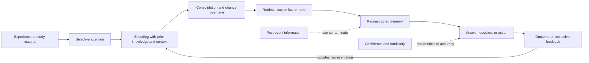

# Memory encoding, retrieval, and reconstruction

Memory is not a literal recording of experience. It is a set of processes that select information for encoding, stabilize some of it over time, and reconstruct a usable representation when retrieval is required. Attention therefore gates what can be encoded, prior knowledge supplies structure, and later cues help rebuild rather than replay the past. This explains how two people can remember the same event differently without either intending to deceive, and why vividness or confidence cannot by itself establish accuracy. (@hubermanlab (Andrew Huberman) — "How to Improve Your Memory & Cognitive Function at Any Age | Dr. Alan Castel", 2026-07-13, [link](https://www.youtube.com/watch?v=EIhilBpn8Ow))[^nas-eyewitness]

## Encoding is selective, not exposure-counting

Repeated exposure can create familiarity without a retrievable representation. The familiar-but-poorly-recalled details of a coin or logo illustrate this gap: seeing is not the same as noticing, and noticing is not the same as being able to produce the information when the cue is absent. Deeper encoding connects a fact to meaning, mechanism, use, or existing knowledge; a mnemonic can retrieve an arbitrary label, but it does not substitute for understanding how the labeled thing behaves. (@hubermanlab (Andrew Huberman) — "How to Improve Your Memory & Cognitive Function at Any Age | Dr. Alan Castel", 2026-07-13, [link](https://www.youtube.com/watch?v=EIhilBpn8Ow))

Emotion and curiosity influence selection rather than guaranteeing accuracy. A personally meaningful question can concentrate attention and make the answer easier to retain, while emotional arousal can preserve the gist or subjective importance of an event even when peripheral details drift. Castel's distinctive aging interpretation is selective rather than deficit-only: older adults may remember less indiscriminately yet preserve high-value, schema-consistent, or curiosity-relevant information. That is a plausible account of adaptive prioritization, not proof that ordinary age-related losses are harmless. (@hubermanlab (Andrew Huberman) — "How to Improve Your Memory & Cognitive Function at Any Age | Dr. Alan Castel", 2026-07-13, [link](https://www.youtube.com/watch?v=EIhilBpn8Ow))

## Retrieval changes learning

Trying to retrieve information before looking at the answer exposes the difference between recognition and recall. When the attempt is followed by correction, the learner discovers exactly which representation is missing or wrong and re-encodes the material in a state of heightened relevance. Classroom research across ages and subjects generally finds that retrieval practice improves later learning more than additional passive study; a systematic review of 49 classroom effect sizes found medium or large benefits in 57%, although evidence outside Western, educated, industrialized, rich, and democratic populations was sparse. (@hubermanlab (Andrew Huberman) — "How to Improve Your Memory & Cognitive Function at Any Age | Dr. Alan Castel", 2026-07-13, [link](https://www.youtube.com/watch?v=EIhilBpn8Ow))[^agarwal-2021]

Spacing adds a second mechanism. A retrieval attempt made after some forgetting requires more reconstruction and encounters a different context than an immediate repetition, which can broaden later access. Difficulty is useful only when it engages the target process and is followed by enough success or feedback to correct errors; distraction, opaque instructions, or repeated uncorrected failure are not desirable difficulties. Reviews support retrieval and spacing across the lifespan but do not yield one universal interval, because the optimal gap depends on the material, prior knowledge, and how long retention is needed. (@hubermanlab (Andrew Huberman) — "How to Improve Your Memory & Cognitive Function at Any Age | Dr. Alan Castel", 2026-07-13, [link](https://www.youtube.com/watch?v=EIhilBpn8Ow))[^carpenter-2022]

## Reconstruction, confidence, and contamination

Retrieval can update a memory. New information, a suggestive question, or a chosen face in a lineup can become incorporated into later recollection, so repeated recall may strengthen the reconstructed version as well as the original trace. The National Academies therefore treats eyewitness memory as evidence with principled perceptual and memory limits, and recommends procedures that reduce contamination and preserve the witness's initial confidence statement. The transcript uses the wrongful conviction of Ronald Cotton to teach this boundary; the case is illustrative, while the general conclusion rests on a larger experimental literature. (@hubermanlab (Andrew Huberman) — "How to Improve Your Memory & Cognitive Function at Any Age | Dr. Alan Castel", 2026-07-13, [link](https://www.youtube.com/watch?v=EIhilBpn8Ow))[^nas-eyewitness]

Remembering the past and imagining the future both recombine stored elements into a scene. This makes episodic memory useful for planning but also explains why an imagined outcome can feel familiar without ever having occurred. Photographs and notes similarly have two opposed effects: they can mark an event as important and provide later cues, or they can encourage cognitive offloading because the person expects the device to remember. Which effect dominates depends on whether the person also attends, organizes, and later retrieves the material. (@hubermanlab (Andrew Huberman) — "How to Improve Your Memory & Cognitive Function at Any Age | Dr. Alan Castel", 2026-07-13, [link](https://www.youtube.com/watch?v=EIhilBpn8Ow))

## Prospective and safety-critical memory

Prospective memory is remembering to execute a future action, such as taking a medicine or checking a child in the back seat. Habit is efficient because a familiar cue can launch a routine with little deliberation, but this becomes dangerous when the context changes while the old cue–response sequence still runs. Under stress or divided attention, practiced action can displace the newly intended action. External reminders, environment design, and rehearsal are therefore not signs of weak memory; they are redundancy for a system whose normal operation includes omission and context-driven capture. (@hubermanlab (Andrew Huberman) — "How to Improve Your Memory & Cognitive Function at Any Age | Dr. Alan Castel", 2026-07-13, [link](https://www.youtube.com/watch?v=EIhilBpn8Ow))

## Memory across aging

Age does not change every memory system in the same way. Processing speed and source memory often become less reliable, while accumulated semantic knowledge, emotional regulation, and the ability to select what matters can remain stable or improve. Superagers demonstrate that steep decline is not inevitable, but they do not supply a single reproducible protocol: genetics, health, reserve, opportunity, and survivorship selection all contribute. Continued learning belongs in the reserve-building arm of [[cognitive-reserve-and-brain-health]], while vascular care, sleep, sensory correction, injury prevention, and physical activity primarily reduce new injury or maintain the biological substrate. (@hubermanlab (Andrew Huberman) — "How to Improve Your Memory & Cognitive Function at Any Age | Dr. Alan Castel", 2026-07-13, [link](https://www.youtube.com/watch?v=EIhilBpn8Ow))

In a randomized trial of 120 sedentary adults aged 55–80, one year of aerobic walking increased anterior hippocampal volume by about 2%, while stretching was associated with decline; spatial-memory improvement correlated with hippocampal change. This is evidence for a structural intermediate and a specific memory outcome in that population, not proof that walking prevents dementia or that hippocampal volume is a validated surrogate for lifelong cognition. (@hubermanlab (Andrew Huberman) — "How to Improve Your Memory & Cognitive Function at Any Age | Dr. Alan Castel", 2026-07-13, [link](https://www.youtube.com/watch?v=EIhilBpn8Ow))[^erickson-2011]

## Practical implications

- **During each meaningful study session, close the source and retrieve before rereading; then check the answer — strong for learning and retention.** Use a blank page, free recall, practice questions, or explanation from memory. Correction is essential when recall is incomplete or wrong. (@hubermanlab (Andrew Huberman) — "How to Improve Your Memory & Cognitive Function at Any Age | Dr. Alan Castel", 2026-07-13, [link](https://www.youtube.com/watch?v=EIhilBpn8Ow))[^agarwal-2021]
- **Return to important material on separated occasions rather than massing all repetitions — strong for retention, no universal cadence.** Choose gaps that make retrieval effortful but still correctable, and lengthen them when the intended retention horizon is longer. (@hubermanlab (Andrew Huberman) — "How to Improve Your Memory & Cognitive Function at Any Age | Dr. Alan Castel", 2026-07-13, [link](https://www.youtube.com/watch?v=EIhilBpn8Ow))[^carpenter-2022]
- **For names or other arbitrary labels, create a meaningful association and use the item soon after learning it — moderate.** Accept that a mnemonic can itself produce a predictable substitution error, so verify high-stakes labels. (@hubermanlab (Andrew Huberman) — "How to Improve Your Memory & Cognitive Function at Any Age | Dr. Alan Castel", 2026-07-13, [link](https://www.youtube.com/watch?v=EIhilBpn8Ow))
- **For safety-critical future actions, use redundant external cues and physically rehearse the route or action — strong as human-factors practice, not a memory-enhancement treatment.** A calendar, medication organizer, back-seat cue, checklist, or walk-through reduces dependence on unaided prospective memory. (@hubermanlab (Andrew Huberman) — "How to Improve Your Memory & Cognitive Function at Any Age | Dr. Alan Castel", 2026-07-13, [link](https://www.youtube.com/watch?v=EIhilBpn8Ow))
- **Across adulthood, combine cognitively demanding learning with physical activity, stable sleep, social contact, and vascular-risk management — moderate-to-strong for function and risk reduction, unproven as a guarantee against dementia.** Follow the broader portfolio in [[cognitive-reserve-and-brain-health]] rather than searching for a superager trick. (@hubermanlab (Andrew Huberman) — "How to Improve Your Memory & Cognitive Function at Any Age | Dr. Alan Castel", 2026-07-13, [link](https://www.youtube.com/watch?v=EIhilBpn8Ow))

## Gaps & open questions

- Which retrieval formats transfer from remembering the practiced answer to solving novel problems?
- How should spacing adapt to an individual's prior knowledge, age, sleep, and desired retention horizon?
- When does errorful learning become counterproductive because feedback is late, ambiguous, or absent?
- Which age-related changes reflect lost capacity versus adaptive selectivity, and how should function be measured without assuming that remembering more is always better?
- Do curiosity and positive beliefs about aging causally preserve cognition, or mainly identify healthier, more engaged people?
- Which external-memory aids reduce safety errors without producing harmful overreliance or loss of situational awareness?

## Related

[[cognitive-reserve-and-brain-health]] · [[exercise-enhanced-learning]] · [[mastery-learning-and-individualized-tutoring]] · [[sleep-quality-and-circadian-alignment]] · [[emotional-memory-reactivation-and-rumination]] · [[ai-assisted-science-communication]] · [[human-centered-ai-and-learning]] · [[alan-castel]] · [[practice-playbook]]

## References

[^agarwal-2021]: Agarwal PK, Nunes LD, Blunt JR. “Retrieval Practice Consistently Benefits Student Learning: a Systematic Review of Applied Research in Schools and Classrooms.” *Educational Psychology Review*, 2021. [systematic review]. [doi:10.1007/s10648-021-09595-9](https://doi.org/10.1007/s10648-021-09595-9)
[^carpenter-2022]: Carpenter SK, Pan SC, Butler AC. “The Science of Effective Learning with Spacing and Retrieval Practice.” *Nature Reviews Psychology*, 2022. [narrative review]. [doi:10.1038/s44159-022-00089-1](https://doi.org/10.1038/s44159-022-00089-1)
[^erickson-2011]: Erickson KI, et al. “Exercise Training Increases Size of Hippocampus and Improves Memory.” *Proceedings of the National Academy of Sciences*, 2011. [randomized trial]. [doi:10.1073/pnas.1015950108](https://doi.org/10.1073/pnas.1015950108)
[^nas-eyewitness]: National Research Council. *Identifying the Culprit: Assessing Eyewitness Identification*. National Academies Press, 2014. [consensus report]. [doi:10.17226/18891](https://doi.org/10.17226/18891)
