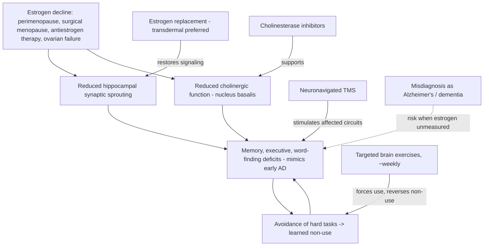

# Menopause-related cognitive impairment

Menopause-related cognitive impairment (a term coined by neurologist Gayatri Devi) is objective cognitive dysfunction driven by loss of ovarian estrogen rather than by neurodegenerative disease. The mechanism is concrete: estrogen receptors co-localize in memory-relevant brain regions, particularly the hippocampus, where estrogen drives synaptic sprouting (early work by Dominique Toran-Allerand at Columbia). Barbara Sherwin's studies of surgical menopause—abrupt estrogen loss—documented deficits in short-term memory, executive function, recall, and word finding that look identical to early Alzheimer's disease. Because perimenopause is gradual and can begin in the 40s before a woman realizes it, these findings are objectively measurable, misattributable, and treatable: Devi has patients who were misdiagnosed with Alzheimer's or other dementias who turned out to have only menopause-related cognitive impairment. The final common pathway she cites is loss of cholinergic signaling from the nucleus basalis, which is why cholinesterase inhibitors can work here as well as in Alzheimer's. (Peter Attia MD — "399 - The evolution of Alzheimer's disease and dementia care | Gayatri Devi, M.D.", 2026-07-13, [link](https://www.youtube.com/watch?v=x7NhqMOwdOM))

## Treatment options

Where no contraindication exists, estrogen (with progesterone to oppose it when needed) is a mainstay for prevention and treatment; Devi prefers transdermal delivery (gel or patch) over oral because of lower stroke and venous-clot risk. Non-hormonal routes matter for women who cannot or will not take estrogen. Targeted brain exercises exploit the brain's suggestibility to learned non-use—the phenomenon behind constraint-induced movement therapy in stroke, where restraining the healthy hand forces a long-paralyzed hand back into function. Menopausal women who stop multitasking or struggling for words develop disuse dysfunction on top of the hormonal deficit; forcing use of those areas even as little as once a week produces quite dramatic functional recovery in her account. Cholinesterase inhibitors are supported by a small signal: her group ran a double-blind placebo-controlled trial of donepezil versus placebo in menopausal women with cognitive impairment (21 per arm) and found a trend toward improvement on drug—a trend in 42 women, not a definitive result. Transcranial magnetic stimulation also appears to help this group. (Peter Attia MD — "399 - The evolution of Alzheimer's disease and dementia care | Gayatri Devi, M.D.", 2026-07-13, [link](https://www.youtube.com/watch?v=x7NhqMOwdOM))

## The estrogen-suppression tradeoff

The starkest cases involve iatrogenic estrogen suppression. Patients on aromatase inhibitors or tamoxifen for breast or ovarian cancer can develop cognitive impairment severe enough that they choose—with their oncologists and neurologists—to stop the antiestrogen and accept recurrence risk rather than continue unable to function; both Devi (with Sloan Kettering-managed patients) and Attia (a 50s woman devastated after risk-reducing surgery and hormone withdrawal whose recovery on restored HRT was rapid and unsubtle) describe such decisions. Attia adds a sharper edge case: aggressive aromatase-inhibitor use for DCIS, where he argues patients rarely understand how small the mitigated risk is against five years of cognitive and quality-of-life cost. Actively treated estrogen-sensitive cancer remains a clear contraindication to estrogen. The lost generation framing (Attia's) holds that women denied HRT after the 2002 WHI are now reaching their 70s having never had replacement—plausibly enriching today's Alzheimer's presentations among never-treated women with earlier menopause. Estrogen deficiency can also impair the young: a 21-year-old with six months of disabling brain fog had estradiol of 22 pg/mL (menopausal range is under 30–35) with normal FSH/LH—an unexplained primary-ovarian-failure-like picture—prompting a low-dose oral contraceptive so she could finish school. (Peter Attia MD — "399 - The evolution of Alzheimer's disease and dementia care | Gayatri Devi, M.D.", 2026-07-13, [link](https://www.youtube.com/watch?v=x7NhqMOwdOM))

This page intersects [[perimenopause-assessment-and-testing]]: the debate there concerns when hormone testing helps, while the finding here is that unrecognized estrogen deficiency can produce objective, Alzheimer's-like, reversible impairment—raising the stakes of missing it in a woman worked up for dementia in her 40s or 50s.

## Practical implications

- **Any woman in her 40s–50s being evaluated for possible dementia should have reproductive stage and estrogen status considered before a neurodegenerative label — strong practice principle from documented misdiagnoses.**
- **When menopause-related impairment is identified and no contraindication exists: hormone replacement, preferring transdermal estrogen — moderate-to-strong within this source; oncologic contexts require shared decision-making.**
- **Weekly (or more) deliberate practice of the specific faltering functions—word retrieval, multitasking—rather than generic brain games — moderate; mechanism is learned non-use reversal, evidence is practice experience.**
- **Consider cholinesterase inhibitors or TMS when hormones are contraindicated — emerging (one 42-woman trial showing a trend; off-label TMS experience).**
- **On antiestrogen therapy with severe cognitive decline: quantify the actual recurrence-risk reduction being purchased and revisit the choice explicitly — strong as a shared-decision principle.**

## Gaps & open questions

- No large randomized trial tests HRT specifically for menopause-related cognitive impairment or for dementia prevention in the modern transdermal era.
- What distinguishes women whose cognition is estrogen-sensitive from those who transition without impairment?
- Does the donepezil trend replicate at scale, and does TMS benefit exceed placebo in this population?
- What causes normal-gonadotropin ovarian failure in young women, and how common is subclinical estrogen-deficiency brain fog?
- How large is the misdiagnosis pool—women carrying dementia labels whose impairment would reverse with hormones?

## Related

[[perimenopause-assessment-and-testing]] · [[adhd-and-reproductive-hormone-transitions]] · [[alzheimers-spectrum-and-diagnosis]] · [[cognitive-reserve-and-brain-health]] · [[gayatri-devi]] · [[proactive-health-monitoring]] · [[aging-model]] · [[practice-playbook]]
